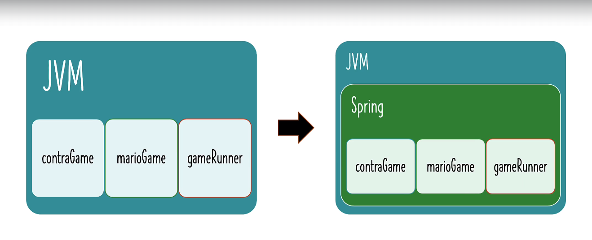
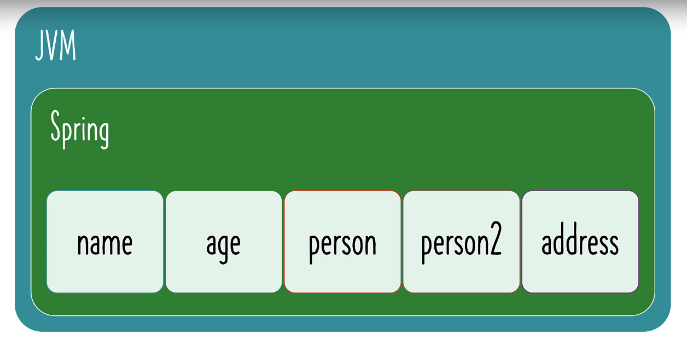
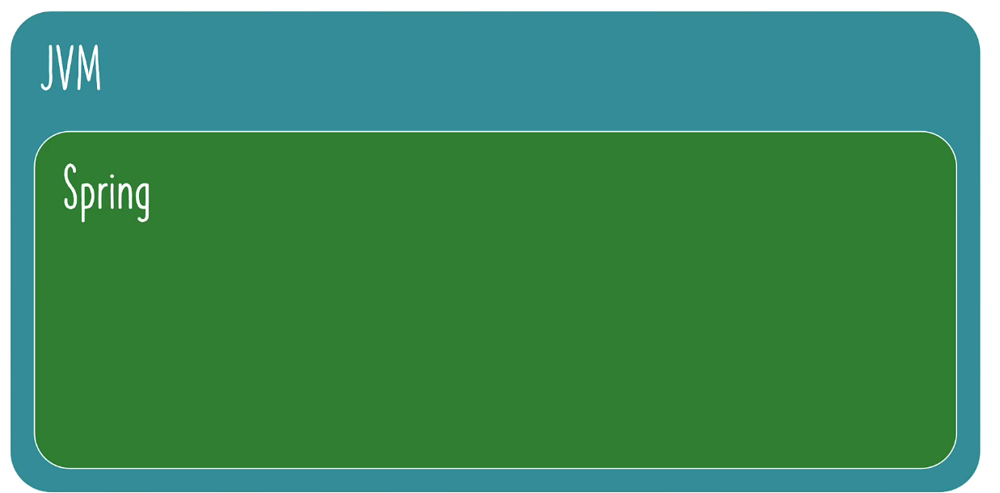

# 📒학습 노트

## 1단계 - Java Spring Framework가 필요한 이유 이해하기

#### 애플케이션 아키텍처의 발전 
Wep App -> REST API -> Full Stack -> Microservices

#### 애플리케이션 구축을 위한 프레임워크
1. Spring MVC
2. Hibernate
3. Spring Security
4. Spring Data
5. Spring Cloud

#### Spring 프레임 워크
의존성 주입, 자동 연결 지원 <br>
훨씬 적은 코드로 더 많은 일을 할 수 있도록 한다.

#### Spring 프레임 워크와 밀접하게 연관된 용어
1. 강한 결합 (Tight Coupling)
2. 느슨한 결합 (Loose Coupling)
3. 의존성 주입 (Dependency Injection)
4. IOC 컨테이너 (IOC Container)
5. 애플리케이션 컨텍스트 (Application Context)
6. Spring Bean
7. 자동 연결 (Auto Wiring)
8. 컴포넌트 스캔 (Component Scan)

## 2단계 - Java Spring Framework 시작하기

#### Java Spring Framework 를 사용하여 구축 가능한 애플리케이션
1. Web
2. REST API
3. Full Stack
4. Microservices

Java Spring Framework 를 사용하면 Spring Boot 를 빠르게 이해할 수 있으며, 빠른 디버깅이 가능하다.

#### 섹션의 목표
1. Spring 프레임워크의 핵심 기능 이해
2. 실습 접근 방식 사용
3. 최신 Spring 접근 방식을 사용하여 '느슨하게 결합'된 Hello world 게임 앱 구축
4. Spring 프레임 워크에 연관된 다양한 용어 학습
   - 강한 결합과 느슨한 결합 (Tight Coupling and Loose Coupling)
   - IOC 컨테이너 (IOC Container)
   - 애플리케이션 컨텍스트 (Application Context)
   - 컴포넌트 스캔 (Component Scan)
   - 의존성 주입 (Dependency Injection)
   - Spring Bean
   - 자동 연결 (Auto Wiring)
5. '반복 접근 방식' 을 통해 마리오, 팩맨 등의 게임을 실행하는 `GameRunner` 클래스 디자인
   - 반복 1 : 강한 결합의 JAVA 코드 작성 (Tightly Coupled Java Code)
     - `GameRunner` 클래스
     - `Game` 클래스들 : Mario, Pacman 등
   - 반복 2 : 자바 인터페이스(Interfaces)를 사용한 느슨한 결합 (Loose Coupling) 
     - `GameRunner` 클래스
     - `GamingConsole` 인터페이스
       - `Game` 클래스들 : Mario, Pacman 등
   - 반복 3 : Spring 프레임워크 도입하여 느슨한 결합 1단계 구현
     - Spring Beans 생성
     - 스프링 프레임워크가 생성된 객체와 연결 관계를 관리하도록 구현
   - 반복 4 : Spring 프레임워크로 느슨한 결합 2단계 구현
     - 어노테이션 (Annotations) 사용
     - 스프링이 객체를 직접 생성, 관리, 자동 연결하도록 구현

## 3단계 - Maven과 Java로 새 Spring Framework 프로젝트 생성하기
#### [Spring Initializr](https://start.spring.io/) 사용하기.
사용 버전은 릴리즈 기준 최신 버전으로 사용하고, 스냅샷은 피해야 함.
 
- Project : 프로젝트 유형 Maven 또는 Gradle을 선택 가능 (Maven&Gradle은 Java 프로젝트에서 가장 널리 사용되는 빌드 도구이다.)
- Language : 프로젝트에서 사용할 프로그래밍 언어 Java, Kotlin, Groovy 중 선택
- Spring Boot : Spring Boot 버전 (릴리즈 된 가장 최신 버전 사용)
- Project Metadata
  - Group : 프로젝트의 그룹 ID를 지정합니다. 일반적으로 역순의 도메인 이름을 사용 (기본 패키지 구조, 빌드 의존성 관리에 영향)
  - Artifact : 아티팩트 ID (프로젝트의 고유한 이름)
  - Name : 프로젝트 이름
  - Description : 프로젝트 설명
  - Package name : 일반적으로 그룹 ID와 동일한 형태 (프로젝트 기본 JAVA 파일 생성 위치를 결정)
  - Packaging : 프로젝트의 패키징 유형을 선택
- Java : 프로젝트에서 사용할 Java 버전

#### 인텔리제이 사용 시

인텔리제이에서 제공하는 Spring Initializr 프로젝트 생성 기능을 사용할 수 있음.

#### 프로젝트 연결
IDE 에서 프로젝트를 연결해야 하나 강의에서는 이클립스를 사용하고, 나는 인텔리제이를 사용하기 때문에 해당 내용은 무시했음 <br>
GitHub에 연결된 프로젝트를 유지하기 위해서 Spring Initializr로 생성한 프로젝트를 모듈로 추가.

1. 프로젝트 구조 설정 (Ctrl + Alt + Shift + S)


2. '모듈' 탭에서 '추가' (Alt + Insert)


3. '모듈 가져오기' 후 모듈 경로 선택 ([learn-spring-framework](..%2F00_module%2Flearn-spring-framework) 경로 선택)


4. 모듈을 가져올 때 사용할 빌드 도구를 선택 해당 프로젝트는 메이븐으로 생성했기 때문에 메이븐으로 가져왔음.


만약 모듈로 불러오는 프로젝트 연결이 어렵다면, 실습 프로젝트를 직접 인텔리제이로 실행할 수도 있음.

## 4단계 - Java 게이밍 애플리케이션 시작하기
[마리오 게임](https://github.com/PhiloMonx1/learning-spring-and-spring-boot-3.x/commit/17cb81aed8344bbf54f5d6b053f9f088c7e042f7) 구현

## 5단계 - 느슨한 결합과 강한 결합 알아보기
4단계에서 구현한 [마리오 게임](https://github.com/PhiloMonx1/learning-spring-and-spring-boot-3.x/commit/17cb81aed8344bbf54f5d6b053f9f088c7e042f7)은 강한 결합이라고 부른다. 

#### 강한 결합이란?
```java
public class AppGamingBasicJava {

	public static void main(String[] args) {

//		var marioGame = new MarioGame();
        var superContraGame = new SuperContraGame();
		var gameRunner = new GameRunner(superContraGame);
		gameRunner.run();
	}
}
```
`AppGamingBasicJava` 에서 `MarioGame` 게임이 아닌 다른 게임 예를 들어 `SuperContraGame`을 실행하고 싶을 때 이와 같이 작성할 수 있다. <br>
그러나 실제로는 `SuperContraGame`를 구현한다고 해도 해당 코드에서 컴파일 에러가 발생한다. <br>
`GameRunner` 클래스에서 `SuperContraGame`를 받는 생성자가 없기 때문이다.

```java
public class GameRunner {

	MarioGame game;

	public GameRunner(MarioGame game) {
		this.game = game;
	}

	public void run() {
		System.out.println("게임 시작 : " + game);
		game.up();
		game.down();
		game.left();
		game.right();
	}
}
```
`GameRunner` 클래스는 `MarioGame` 하고 강하게 결합되어 있다. <br>
단순히 생성자를 추가하는 것으로 해결되는 문제가 아니다. `GameRunner` 클래스의 필드인 `game` 역시 결합되어 있기 때문이다.

이를 '강한 결합' 이라고 한다.


#### - 결합
무언가를 변경하기 위해 얼마나 많은 작업이 영향을 받는지에 대한 측정.

ex) 마리오 게임 대신 슈퍼콘트라 게임을 실행하기 위해 얼마나 많은 것이 변경되어야 하는지. <br>
ex) 자동차와 엔진의 관계는 강한 결합이다. <br>
ex) 자동차와 바퀴의 관계는 느슨한 결합이다. <br>

## 6단계 - Java 인터페이스를 도입하여 느슨하게 결합된 앱 만들기


#### 인터페이스 : 특정 클래스 세트에서 수행할 수 있는 공통 작업 

## 7단계 - Spring Framework를 도입하여 Java 앱 느슨하게 결합하기
```java
public class AppGamingBasicJava {

	public static void main(String[] args) {

//		var game = new MarioGame();
//		var game = new SuperContraGame(); 
        
		var game = new PacmanGame(); //*1
		
		var gameRunner = new GameRunner(game); //*2
		gameRunner.run();
	}
}
```
- *1 : 객체의 생성 
- *2 : 객체 생성 + 종속성 연결

#### 종속성 연결?
`GameRunner`의 생성자는 `GamingConsole`가 필요하다. 즉 게임이 의존적이라고 할 수 있다. <br>
`GamingConsole`은 `GameRunner` 클래스의 의존성이다. <br>
'*2' 라인은 의존성 주입을 하고 있는 것이다. (`GameRunner` 클래스 내부가 아닌 외부에서 주입을 하고 있음.)

#### 스프링 프레임워크
기본적으로 프로그래머는 객체를 생성하고, 생성된 객체는 JVM에 등록된다.

직접 객체를 생성하는 대신 Spring이 객체를 대신 생성하도록 할 수 있다.

## 8단계 - 첫 번째 Java Spring Bean 및 Java Spring 설정 시작

#### 실습 목표

예시 실습으로 해당 이미지의 구조를 먼저 구현할 것이다.

#### Spring Context 생성
1. `App02HelloWorldSpring` 선언.
2. `HelloWorldConfiguration` 선언 후 `@Configuration` 어노테이션 기입
3. `AnnotationConfigApplicationContext` 인스턴스 생성.
```java
public class App02HelloWorldSpring {

	public static void main(String[] args) {
		//1: 스프링 컨텍스트 실행 -

		var context = new AnnotationConfigApplicationContext(HelloWorldConfiguration.class);

		//2: 스프링 프레이워크가 관리하도록 설정 -@Configuration
	}
}
```

3번까지 진행한 상태이다. (스프링 컨텍스트가 생성됨.)

4. `name` Bean 등록
```java
@Configuration
public class HelloWorldConfiguration {

	@Bean
	public String name() {
		return "EH13";
	}
}
```
## 9단계 - Spring Java 설정 파일에서 더 많은 Java Spring Bean 만들기

#### 레코드 (record)

```java
package com.in28minutes.learn_spring_framework;

import org.springframework.context.annotation.Bean;
import org.springframework.context.annotation.Configuration;

record Person(String name, int age) { };

@Configuration
public class HelloWorldConfiguration {

	@Bean
	public String name() {
		return "EH13";
	}

	@Bean
	public int age() {
		return 30;
	}
}
```
JDK 16에서 새로 추가된 기능
- 간단한 선언 : 필드, 생성자, Getter 메서드 자동 생성
- 불변성 : 필드 값을 변경할 수 없음 (Setter 사용 불가)
- 필수 메서드 자동 구현 : equals(), hashCode(), toString() 메서드 자동 구현
- 직렬화 지원 : Serializable 인터페이스로 구현함.

## 10단계 - Spring Framework Java 구성 파일에서 자동 연결 구현
#### 스프링 빈 이름 커스텀
```java
@Configuration
public class HelloWorldConfiguration {
//...(생략)
	@Bean(name = "yourCustomBeanName")
	public Address address() {
		return new Address("강남구", "서울특별시");
	}
}
```
```java
public class App02HelloWorldSpring {

	public static void main(String[] args) {
//...(생략)
		System.out.println(context.getBean("yourCustomBeanName"));
		System.out.println(context.getBean(Address.class)); // 클래스를 사용해서 불러오는 것도 가능
	}
}
```

#### 빈 재활용
1. 메서드 직접 호출 방식
```java
record Person(String name, int age, Address address) { };
record Address(String firstLine, String cit) { };
//...(생략)

@Configuration
public class HelloWorldConfiguration {
//...(생략)
	@Bean
	public Person person2MethodCall() {
		return new Person(name(), age(), address());
	}
//...(생략)
}
```

2. 파라미터 사용 방식
```java
@Configuration
public class HelloWorldConfiguration {
	//...(생략)
	@Bean
	public Person person3Parameters(String name, int age, Address address2) {
		return new Person(name, age, address2);
	}
//...(생략)
}
```

#### 여러 개의 빈 불러오기
```java
@Configuration
public class HelloWorldConfiguration {
//...(생략)
	@Bean(name = "address2")
	public Address address() {
		return new Address("강남구", "서울특별시");
	}

	@Bean(name = "address3")
	public Address address3() {
		return new Address("동작구", "서울특별시");
	}
}
```
```java
public class App02HelloWorldSpring {

	public static void main(String[] args) {
//...(생략)
		//System.out.println(context.getBean(Address.class)); Address 클래스를 사용하는 빈이 2개 이상이기 때문에 예외가 발생함.
		System.out.println(context.getBeansOfType(Address.class));
	}
}
```