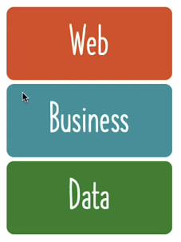
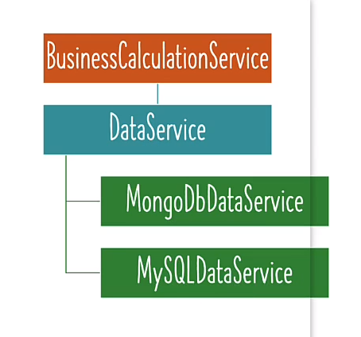
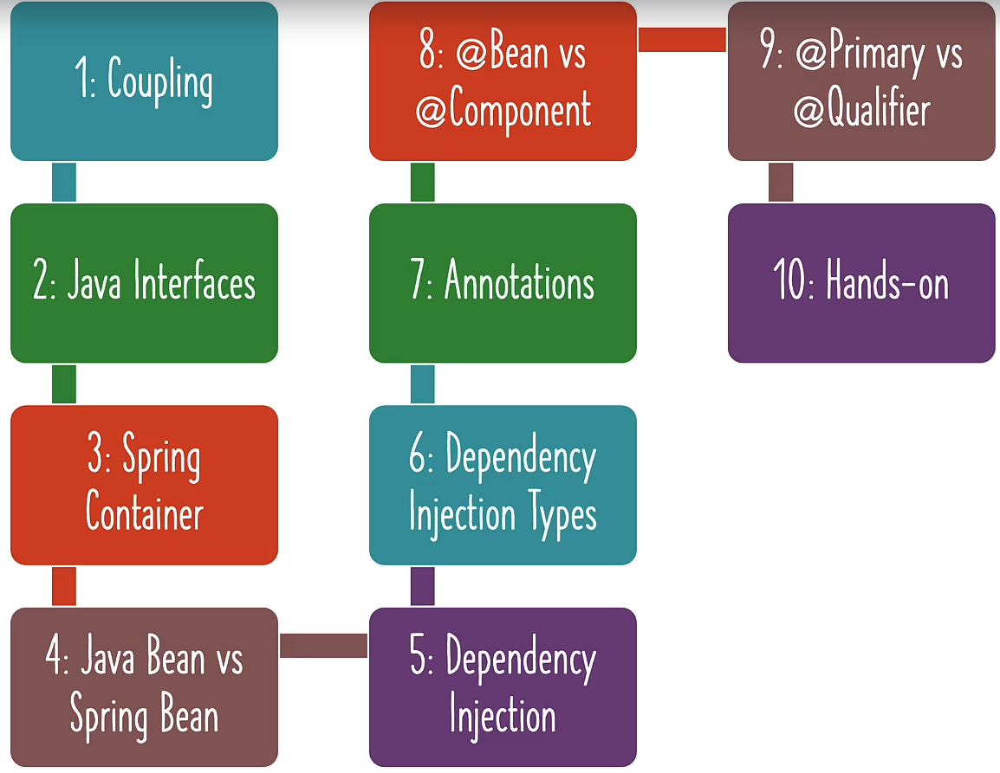

# 📒 [학습 노트] 챕터 2 : Spring Framework를 사용하여 Java 객체를 생성하고 관리하기

## 목차
1. [Java 객체의 생성 및 관리를 위한 Spring Framework 이해하기](#1단계---java-객체의-생성-및-관리를-위한-spring-framework-이해하기)
2. [Spring 컴포넌트에 대한 Primary 및 Qualifier 어노테이션 알아보기](#2단계---spring-컴포넌트에-대한-primary-및-qualifier-어노테이션-알아보기)
3. [Primary와 Qualifier - 어떤 Spring 어노테이션을 사용할까요?](#3단계---primary와-qualifier---어떤-spring-어노테이션을-사용할까요)
4. [Spring Framework 알아보기 - 의존성 주입의 다양한 유형](#4단계---spring-framework-알아보기---의존성-주입의-다양한-유형)
5. [Java Spring Framework - 중요한 용어 이해하기](#5단계---java-spring-framework---중요한-용어-이해하기)
6. [Java Spring Framework - @Component와 @Bean 비교하기](#6단계---java-spring-framework---component와-bean-비교하기)
7. [Java Spring 애플리케이션에 의존성이 있는 이유가 무엇일까요?](#7단계---java-spring-애플리케이션에-의존성이-있는-이유가-무엇일까요)
8. [예제: Real World Java Spring Framework Example의 솔루션](#8단계---예제-real-world-java-spring-framework-example의-솔루션)
9. [Java와 함께 Spring Framework 알아보기 - 섹션 2 - 복습](#9단계---java와-함께-spring-framework-알아보기---섹션-2---복습)


## 1단계 - Java 객체의 생성 및 관리를 위한 Spring Framework 이해하기
[커밋 내역](https://github.com/PhiloMonx1/learning-spring-and-spring-boot-3.x/commit/46f87c1fcb5e183dc52c449fe3dcc8a7c20bfdaa)

#### 스프링이 객체를 자동 생성하도록 하는 방법
1. configuration 클래스와 app 클래스 하나의 파일로 통합
```java
@Configuration
class GamingConfiguration {

	@Bean
	public GamingConsole game() {
		var game = new PacmanGame();
		return game;
	}

	@Bean
	public GameRunner gameRunner(GamingConsole game) {
		var gameRunner = new GameRunner(game);
		return gameRunner;
	}
}
public class App03GamingSpringBeansJava {
	public static void main(String[] args) {
		try (var context = new AnnotationConfigApplicationContext(GamingConfiguration.class)) {
			context.getBean(GamingConsole.class).up();
			context.getBean(GameRunner.class).run();
		}
	}
}
```
이와 같은 방법으로 Configuration 파일을 app 파일과 하나의 파일로 관리할 수 있다.

2. app 클래스를 configuration 클래스로 만들기
```java
@Configuration
public class App03GamingSpringBeansJava {
	@Bean
	public GamingConsole game() {
		var game = new PacmanGame();
		return game;
	}

	@Bean
	public GameRunner gameRunner(GamingConsole game) {
		var gameRunner = new GameRunner(game);
		return gameRunner;
	}
	public static void main(String[] args) {
		try (var context = new AnnotationConfigApplicationContext(App03GamingSpringBeansJava.class)) {
			context.getBean(GamingConsole.class).up();
			context.getBean(GameRunner.class).run();
		}
	}
}
```
해당 방법으로 app 클래스를 Configuration로 만들 수 있다. `AnnotationConfigApplicationContext`는 `App03GamingSpringBeansJava`를 받아야 한다.

3. `@Bean` 어노테이션 사용하지 않고 Spring에 Bean 생성 요청
```java
@Component //해당 어노테이션으로 Spring이 PacmaGame 클래스를 관리하도록 설정
public class PacmanGame implements GamingConsole {

	@Override
	public void up() {
		System.out.println("위로 이동");
	}

	@Override
	public void down() {
		System.out.println("아래로 이동");
	}

	@Override
	public void left() {
		System.out.println("왼쪽으로 이동");
	}

	@Override
	public void right() {
		System.out.println("오른쪽으로 이동");
	}
}
```
Bean에 등록해야 하는 `PacmanGame`에 `@Component` 어노테이션을 부여한다.

```java
@Configuration
@ComponentScan("com.in28minutes.learn_spring_framework.game")
public class App03GamingSpringBeansJava {
	@Bean
	public GameRunner gameRunner(GamingConsole game) {
		var gameRunner = new GameRunner(game);
		return gameRunner;
	}
	public static void main(String[] args) {
		try (var context = new AnnotationConfigApplicationContext(App03GamingSpringBeansJava.class)) {
			context.getBean(GamingConsole.class).up();
			context.getBean(GameRunner.class).run();
		}
	}
}
```
`PacmanGame` Bean을 사용하는 클래스에 `@ComponentScan` 어노테이션을 부여한다.

- @Component : 해당 어노테이션이 적용된 클래스는 스프링 IOC 컨테이너에 의해 Bean으로 자동 등록(예약으로 생각해야 함)된다.
- @ComponentScan : @Component 어노테이션이 적용된 클래스를 자동으로 스캔하여 스프링 Bean으로 등록(실제 등록, 사용으로 생각해야 함)한다.
  - 파라미터로 경로를 설정할 경우 해당 경로에서 찾는다.
  - @ComponentScan({"com.in28minutes.learn_spring_framework.game", "com.example.myapp"}) 와 같이 여러 패키지 경로를 설정할 수도 있다.
    - @ComponentScan을 여러개 사용하는 것도 가능하다.

## 2단계 - Spring 컴포넌트에 대한 Primary 및 Qualifier 어노테이션 알아보기
[커밋 내역](https://github.com/PhiloMonx1/learning-spring-and-spring-boot-3.x/commit/c01a688934e468e6dd32905b50ceabd456be2af4)

#### @Component 가 여러 클래스에 있을 경우

```java
@Component
public class GameRunner {
	private GamingConsole game;
	public GameRunner(GamingConsole game) {
		this.game = game;
	}
	public void run() {
		System.out.println("게임 시작 : " + game);
		game.up();
		game.down();
		game.left();
		game.right();
	}
}
```
`GameRunner` 의 경우 `GamingConsole` 타입을 생성자의 파라미터로 받는다. <br>
만약 `GamingConsole`를 상속하고 있는 `PacmanGame`과 `MarioGame` 두 곳에 `@Component` 어노테이션을 부여하면 어떻게 될까?

```agsl
[main] WARN org.springframework.context.annotation.AnnotationConfigApplicationContext -- Exception encountered during context initialization - cancelling refresh attempt: org.springframework.beans.factory.UnsatisfiedDependencyException: Error creating bean with name 'gameRunner' defined in file [C:\Users\benecl\IdeaProjects\learning-spring-and-spring-boot-3.x\00_module\learn-spring-framework-02\target\classes\com\in28minutes\learn_spring_framework\game\GameRunner.class]: Unsatisfied dependency expressed through constructor parameter 0: No qualifying bean of type 'com.in28minutes.learn_spring_framework.game.GamingConsole' available: expected single matching bean but found 2: marioGame,pacmanGame
Exception in thread "main" org.springframework.beans.factory.UnsatisfiedDependencyException: Error creating bean with name 'gameRunner' defined in file [C:\Users\benecl\IdeaProjects\learning-spring-and-spring-boot-3.x\00_module\learn-spring-framework-02\target\classes\com\in28minutes\learn_spring_framework\game\GameRunner.class]: Unsatisfied dependency expressed through constructor parameter 0: No qualifying bean of type 'com.in28minutes.learn_spring_framework.game.GamingConsole' available: expected single matching bean but found 2: marioGame,pacmanGame
```
고유한 Bean 을 찾을 수 없다는 예외가 발생한다.

#### @Primary

```java
@Component
@Primary
public class MarioGame implements GamingConsole {
	@Override
	public void up() {
		System.out.println("점프");
	}
	@Override
	public void down() {
		System.out.println("파이프로 이동");
	}
	@Override
	public void left() {
		System.out.println("뒤로 이동");
	}
	@Override
	public void right() {
		System.out.println("가속");
	}
}
```
컴포넌트에도 `@Primary` 어노테이션을 사용해 우선 순위를 부여하는 것이 가능하다.

#### @Qualifier
`MarioGame`의 `@Primary`를 유지한 상태로 `SuperContraGame` 게임에 `@Component`를 부여하면, 앱을 실행했을 때 여전히 `MarioGame`이 실행된다. <br>
`SuperContraGame` 게임이 실행되도록 할 수 없을까?
```java
@Component
@Qualifier("SuperContraGameQualifier")
public class SuperContraGame implements GamingConsole {
	@Override
	public void up() {
		System.out.println("위로 이동");
	}
	@Override
	public void down() {
		System.out.println("앉기");
	}
	@Override
	public void left() {
		System.out.println("뒤로 이동");
	}
	@Override
	public void right() {
		System.out.println("총알 발사");
	}
}
```

```java
@Component
public class GameRunner {
	private GamingConsole game;
	public GameRunner(@Qualifier("SuperContraGameQualifier") GamingConsole game) {
		this.game = game;
	}
	public void run() {
		System.out.println("게임 시작 : " + game);
		game.up();
		game.down();
		game.left();
		game.right();
	}
}
```
이와 같이 `@Qualifier` 어노테이션을 사용할 수 있다.

## 3단계 - Primary와 Qualifier - 어떤 Spring 어노테이션을 사용할까요?
[커밋 내역](https://github.com/PhiloMonx1/learning-spring-and-spring-boot-3.x/commit/a18899b993566631bac34d964f1949a0ab95c246)

#### @Primary 와 @Qualifier 중 어떤 것을 사용해야 할까?

```java
@Component @Primary
class QuickSort implements SortingAlgorithm {}

@Component
class BubbleSort implements SortingAlgorithm {}

@Component @Qualifier("RadixSortQualifier")
class RadixSort implements SortingAlgorithm {}

@Component
class ComplexAlgorithm {
    @Autowired
    private SortingAlgorithm algorithm;
}

@Component
class AnotherComplexAlgorithm {
    @Autowired @Qualifier("RadixSortQualifier")
    private SortingAlgorithm iWantToUseRadixSortOnly;
}

```
해당 예시를 참고할 수 있다.

- @Primary : 자격 있는 후보가 여러개 인 경우 Bean에게 우선권을 준다. (`ComplexAlgorithm` 에서 사용)
- @Qualifier : 특정 Bean을 지정해서 자동 연결되도록 연결점을 만들어 준다. (`AnotherComplexAlgorithm` 에서 사용)
  - @Qualifier 는 @Primary 보다 더 높은 우선 순위를 가지고 있다.

## 4단계 - Spring Framework 알아보기 - 의존성 주입의 다양한 유형
[커밋 내역](https://github.com/PhiloMonx1/learning-spring-and-spring-boot-3.x/commit/bebd795bce03ed33e8a4ebd254fcbef844e112c1)

1. 생성자 기반 : 생성자의 파라미터를 통한 주입
2. 수정자(Setter) 기반 : Setter 메서드를 통한 주입
3. 필드 기반 : 생성자나 Setter가 없을 경우 리플렉션을 이용해서 주입

```java
@Component
class YourBusinessClass {

}
@Component
class Dependency1 {

}
@Component
class Dependency2 {

}
@Configuration
@ComponentScan
public class DepInjectionAppLauncherApplication {
	public static void main(String[] args) {
		try (var context = new AnnotationConfigApplicationContext(
				DepInjectionAppLauncherApplication.class)) {

			Arrays.stream(context.getBeanDefinitionNames())
					.forEach(System.out::println);
		}
	}
}
```
파라미터 없이 `@ComponentScan` 어노테이션을 사용하면, 같은 패키지를 대상으로 스캔한다.

#### @Autowired
`@Autowired` 어노테이션을 부여하여 `YourBusinessClass` 에 `Dependency1`, `Dependency2` 의존성을 주입할 수 있다.

#### 필드 주입
```java
@Component
class YourBusinessClass {
	@Autowired
	Dependency1 dependency1;
	@Autowired
	Dependency2 dependency2;

	public String toString() {
		return "Using " + dependency1 + " and " + dependency2;
	}
}
```
- `YourBusinessClass` 의 필드인 `Dependency1`, `Dependency2` 에 직접 `@Autowired`를 사용해서 필드 주입 방식으로 의존성 주입을 할 수 있다.
- `YourBusinessClass` 클래스는 생성자나 Setter 메서드가 존재하지 않는다.
- Java '리플렉션'을 사용해서 의존성을 주입한다.

#### Setter 주입
```java
@Component
class YourBusinessClass {
	Dependency1 dependency1;
	Dependency2 dependency2;

	@Autowired
	public void setDependency1(Dependency1 dependency1) {
		this.dependency1 = dependency1;
	}
	@Autowired
	public void setDependency2(Dependency2 dependency2) {
		this.dependency2 = dependency2;
	}

	public String toString() {
		return "Using " + dependency1 + " and " + dependency2;
	}
}
```

#### 생성자 주입
```java
@Component
class YourBusinessClass {
	Dependency1 dependency1;
	Dependency2 dependency2;

	@Autowired
	public YourBusinessClass(Dependency1 dependency1, Dependency2 dependency2) {
		this.dependency1 = dependency1;
		this.dependency2 = dependency2;
	}

	public String toString() {
		return "Using " + dependency1 + " and " + dependency2;
	}
}
```
- 생성자 주입의 경우 `@Autowired` 어노테이션이 없어도 된다.
- Spring 에서 권장하는 방법이다. (하나의 메서드에서 모든 초기화가 발생하기 때문)

## 5단계 - Java Spring Framework - 중요한 용어 이해하기
[커밋 내역](https://github.com/PhiloMonx1/learning-spring-and-spring-boot-3.x/commit/71ce445c9c7def4e90cbde99c31dbd0578213491)

#### Spring Bean
- Spring 프레임워크가 관리하는 모든 객체 (인스턴스)

#### @Component
- 특정 클래스에 붙여서 사용하는 어노테이션
- 특정 클래스가 컴포넌트 스캔 대상이라면 해당 클래스의 인스턴스(Spring Bean)가 생성되고, Spring 프레임워크에 의해 관리됨
  - 컴포넌트는 Bean으로 등록되기 위해 예약된 객체로 볼 수 있다.
  - '컴포넌트'는 '객체', 'Bean'은 '인스턴스'로 비유할 수 있다.

#### 의존성 (Dependency)
- 특정 객체를 사용(생성)하기 위해 다른 객체를 함께 사용(생성)해야 하는 관계성
- ex) `MarioGame` 은 `GameRunner`의 의존성이다.

#### 컴포넌트 스갠 (Component Scan)
- 스프링은 `@Component` 어노테이션이 부여된 클래스를 Bean으로 등록하기 위해서 검색을 해야 한다.
- `@Component Scan` 어노테이션을 통해 검색 위치(패키지 경로)를 알려줄 수 있다.
- `@Component Scan` 어노테이션이 부여되는 클래스는 Bean으로 등록된 클래스를 사용하는 주체이다.
- 경로를 지정하지 않을 시 현재 클래스가 위치한 경로를 검색한다.

#### 의존성 주입 (Dependency Injection)
```java
@Component
class YourBusinessClass {
	Dependency1 dependency1;
	Dependency2 dependency2;

	public YourBusinessClass(Dependency1 dependency1, Dependency2 dependency2) {
		this.dependency1 = dependency1;
		this.dependency2 = dependency2;
	}

	public String toString() {
		return "Using " + dependency1 + " and " + dependency2;
	}
}
@Component
class Dependency1 {

}
@Component
class Dependency2 {

}
@Configuration
@ComponentScan
public class DepInjectionAppLauncherApplication {
	public static void main(String[] args) {
		try (var context = new AnnotationConfigApplicationContext(
				DepInjectionAppLauncherApplication.class)) {

			Arrays.stream(context.getBeanDefinitionNames())
					.forEach(System.out::println);

			System.out.println(context.getBean(YourBusinessClass.class));
		}
	}
}
```
해당 코드를 실행하면 어떤 일이 일어날까?
1. 가장 먼저 Component Scan을 통해 모든 컴포넌트 즉 코드를 구동하기 위한 모든 요소를 찾아낸다.
2. 특정 컴포넌트의 의존성을 식별하고 연결을 진행한다. (코드의 `YourBusinessClass` 해당)

이 전체 프로세스를 '의존성 주입'이라고 부른다.

#### IOC-제어의 역전 (Inversion of Control)
```java
public class App01GamingBasicJava {
	public static void main(String[] args) {
//		var game = new MarioGame();
//		var game = new SuperContraGame();
		var game = new PacmanGame();
		var gameRunner = new GameRunner(game);
		gameRunner.run();
	}
}
```
`App01GamingBasicJava` 클래스에서는 명시적으로 객체 생성 및 의존성을 주입하는 코드를 작성하고 있다.

```java
@Configuration
@ComponentScan("com.in28minutes.learn_spring_framework.game")
public class GamingAppLauncherApplication {
	public static void main(String[] args) {
		try (var context = new AnnotationConfigApplicationContext(GamingAppLauncherApplication.class)) {
			context.getBean(GamingConsole.class).up();
			context.getBean(GameRunner.class).run();
		}
	}
}
```
`GamingAppLauncherApplication` 클래스에서는 객체 생성 및 의존성 주입을 Spring 프레임워크가 처리하고 있다. <br>
프로그래머가 하는 일은 컴포넌트 스캔을 정의하고, `@Component` 어노테이션을 클래스에 부여한 것 뿐이다.

<b>이를 '제어의 역전' 이라고 부른다.</b>

객체 관리의 제어권이 프로그래머에서 Spring 프레임워크로 넘어간 것이다.

#### IOC 컨테이너
- Bean의 생명 주기와 의존성을 관리하는 Spring 프레임워크의 컴포넌트.
  - BeanFactory : 비교적 간단한 기능 (잘 쓰이지 않음)
  - ApplicationContext : 많은 기능을 지원

#### 자동 연결 (Autowiring)
- Spring Bean에 대한 의존성의 자동 연결 프로세스
- Spring이 특정한 Bean을 만났을 때 필요한 의존성을 식별
```java
@Component
public class GameRunner {

	private GamingConsole game;

	public GameRunner(@Qualifier("SuperContraGameQualifier") GamingConsole game) {
		this.game = game;
	}

	public void run() {
		System.out.println("게임 시작 : " + game);
		game.up();
		game.down();
		game.left();
		game.right();
	}
}

```
- Spring이 `GameRunner`을 Bean으로 만났을 때, 생성자에 필요한 `GamingConsole` 객체를 의존성으로 식별함.
  - 이를 파악해서 자동으로 적절한 `GamingConsole` Bean을 찾아서 연결하는 프로세스

## 6단계 - Java Spring Framework - @Component와 @Bean 비교하기
[커밋 내역](https://github.com/PhiloMonx1/learning-spring-and-spring-boot-3.x/commit/3fb2f435c871c9c5b58e87ec536504f72c870052)

@Component와 @Bean 중 어떤 것을 사용해야 할까?

#### @Component
- 모든 자바 클래스에 사용 가능
- 쉬운 사용성 : 클래스를 정의한 후 어노테이션을 붙이는 것으로 사용 가능
- Autowiring 방법 : 생성자 주입, Setter 주입, 필드 주입
- Bean 생성 주체 : Spring 프레임워크 (컴포넌트 스캔을 통해서)
- '자체 애플리케이션 코드'용으로 Bean을 인스턴스화할 때 권장

#### @Bean
- 특정 메서드에 사용 가능 (일반적으로 Spring Configuration 클래스 내부 메소드에서 사용)
- 비교적 복잡함
- Autowiring 방법 : 메서드 호출 방식, 파라미터 방식
- Bean 생성 주체 : 코드 작성으로 직접 선언
- '서드 파티 라이브러리용으로 Bean을 인스턴스화할 때 권장'
  - 서드 파티 라이브러리 : 개발자 또는 기업이 직접 개발하지 않고 외부에서 제공하는 소프트웨어 라이브러리 (외부 라이브러리)

<b>일반적으로 대부분 @Component가 권장됨.</b>

#### @Bean 을 사용하는 것이 더 나은 경우
```java
@Configuration
public class HelloWorldConfiguration {
	@Bean
	public Person person() {
		return new Person("Van", 33, new Address("서초구", "서울특별시"));
	}
    @Bean
    public Person person2MethodCall() {
      return new Person(name(), age(), address());
    }
  
    @Bean
    public Person person3Parameters(String name, int age, Address address3) {
      return new Person(name, age, address3);
    }
}
```
`Person`의 Bean을 생성하기 위해서는 여러 사항을 점검해야 한다. (생성 방식이 다른 다양한 `Person` 인스턴스가 있을 수 있다.)

예시와 같이 특정 객체의 Bean을 생성하기 위해 여러가지를 점검해야 하고, 생성에 있어서 특수한 비즈니스 로직이 필요한 경우에는 @Bean 을 사용하는 것이 더 나을 수 있다.
- 그 외에도 아래와 같은 경우 @Bean의 사용이 더 적절할 수 있다.
  - 외부 라이브러리 클래스를 Bean으로 등록하는 경우
    - ex) Spring 시큐리티
  - 복잡한 Bean 생성 로직이 필요한 경우
  - 환경에 따른 Bean 구성이 필요한 경우

## 7단계 - Java Spring 애플리케이션에 의존성이 있는 이유가 무엇일까요?
[커밋 내역](https://github.com/PhiloMonx1/learning-spring-and-spring-boot-3.x/commit/3bcb7b4406a6f3c61c2026db3c8fbc806453383a)

#### Hello World App 에는 클래스가 별로 없지만 Real World 애플리케이션은 훨씬 복잡하다.

- 실제 애플리케이션에는 많은 레이어가 있다.
  - 웹 레이어
  - 비즈니스 레이어
  - 데이터 레이어
- 각 레이어는 아래에 있는 레이어에 의존한다.
  - 웹 레이어의 클래스는 비즈니스 레이어의 클래스에게 말을 걸 수 있다(요청할 수 있다).
  - 따라서 웹 레이어 클래스는 비즈니스 레이어 클래스의 의존성이다.
- Spring 프레임워크
  - 프로그래머는 객체가 아닌 '의존성'과 '연결(wiring)'에 집중 할 수 있다.
  - 프레임워크가 객체의 생명주기를 대신 관리해준다. 
    - Spring의 규칙에 따라 어노테이션을 설정하기만 하면 된다.

```java
import java.util.Arrays;

public interface DataService {

  int[] retrieveData();
}

public class MongoDbDataService implements DataService {

  public int[] retrieveData() {
    return new int[]{11, 22, 33, 44, 55};
  }
}

public class MySQLDataService implements DataService {

  public int[] retrieveData() {
    return new int[]{1, 2, 3, 4, 5};
  }
}

public class BusinessCalculationService {

  public int findMax() {
    return Arrays.stream(dataService.retrieveData())
            .max().orElse(0);
  }
}
```

예시 코드는 다음과 같은 의존성을 가진다.
- `MongoDbDataService` 와 `MySQLDataService` 를 쉽게 바꾸기 위해서 `DataService` 인터페이스가 필요하다.
- `BusinessCalculationService` 는 `DataService`에게 요청을 해야 한다.

해당 코드를 Spring 프레임워크가 관리하도록 완성 시켜야 한다.

```java
@Component
 interface DataService {

	int[] retrieveData();
}

@Component
@Primary
 class MongoDbDataService implements DataService {

	public int[] retrieveData() {
		return new int[]{11, 22, 33, 44, 55};
	}
}

@Component
 class MySQLDataService implements DataService {

	public int[] retrieveData() {
		return new int[]{1, 2, 3, 4, 5};
	}
}

@Component
 class BusinessCalculationService {
	private DataService dataService;

	public BusinessCalculationService(DataService dataService) {
		this.dataService = dataService;
	}

	public int findMax() {
		return Arrays.stream(dataService.retrieveData())
				.max().orElse(0);
	}
}
```
이와 같은 방식으로 예제 코드의 객체들을 Spring 프레임워크가 관리하도록 할 수 있다.
1. 모든 클래스에 `@Component` 를 부여해서 Bean으로 예약한다.
2. `BusinessCalculationService` 클래스에 `DataService` 필드를 선언하고 생성자를 선언한다.
3. `MongoDbDataService` 클래스에 `@Primary` 를 부여해서 참조하는 Bean이 겹치는 경우를 방지한다.

## 8단계 - 예제: Real World Java Spring Framework Example의 솔루션
[커밋 내역](https://github.com/PhiloMonx1/learning-spring-and-spring-boot-3.x/commit/98c32b527404e6ddf100253c72e2ee5882470120)

- `DataService` 인터페이스에는 `@Component` 어노테이션을 부여하지 않아도 된다.
  - `BusinessCalculationService` 에서 `DataService`이 필요할 경우 스프링은 타입 매칭을 통해 MongoDbDataService 또는 MySQLDataService 중 하나를 자동으로 주입하기 때문이다.

## 9단계 - Java와 함께 Spring Framework 알아보기 - 섹션 2 - 복습
[커밋 내역](https://github.com/PhiloMonx1/learning-spring-and-spring-boot-3.x/commit/1c30776e5a1bba8f6006dff69b79d68a427dbd24)

#### 이번 챕터에서 배운 내용

1. 결합도
2. 자바 인터페이스
3. 스프링 컨테이너
4. Java Bean vs Spring Bean 차이점
5. 의존성 주입
6. 의존성 주입의 여러 유형
7. 어노테이션
8. @Bean vs @Component 차이점과 언제 사용해야 하는지
9. @Primary vs Qualifier 차이점과 언제 사용해야 하는지
10. 예시 실습

#### 다음 챕터에서 배울 내용 : 심화 내용

1. 지연 초기화
   - 지금까지 생성한 모든 Bean은 Spring 컨테이너의 시작에서 초기화 되었음
   - 원하는 시점에 초기화를 진행하는 지연 초기화를 적용하는 방법은?
2. 스프링 프레임워크에 있는 다양한 Bean의 범위
   - 프로토타입
   - 싱글톤
3. PostConstruct & PreDestroy
   - Bean의 의존성이 준비된 후 특정 작업 수행 방법 
   - Spring 컨텍스트에서 Bean이 제거되기 전 작업 수행 방법 
4. Jakarta EE의 역사
   - J2EE
   - 자바 EE
   - 자카르타 EE
5. CDI 컨텍스트 & 의존성 주입
   - 자카르타 EE의 의존성 주입과 관련된 중요한 사항 중 하나
6. XML 설정
   - 지금까지는 자바 설정을 사용했음 (모든 설정이 자바 소스 파일에 저장됨)
   - 과거(20년 전)에는 대다수가 XML 설정을 사용했음.
   - 자바 설정과의 차이점 및 어떤 것을 언제 사용해야 하는지
7. `@Component`의 여러 가지 대안
   - Spring 스테레오 타입 어노테이션
     - @Component
     - @Service
     - @Repository
8. Spring 프레임워크에 대한 전반적인 모습을 그려보기
9. Spring 모듈 & Spring 프로젝트 다뤄보기
10. Spring이 왜 최고인지에 대한 견해