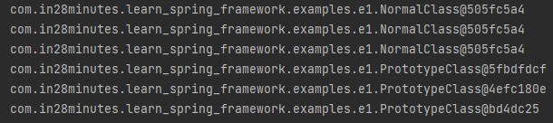

# 📒 [학습 노트] 챕터 2 : Spring Framework를 사용하여 Java 객체를 생성하고 관리하기

## 1단계 - Spring Framework Beans의 지연 초기화와 즉시 초기화 알아보기

#### 즉시 초기화 (Eager Initialization)
- Spring Bean의 기본 초기화 방식
```java
@Component
class ClassA { }
@Component
class ClassB {
	private ClassA classA;
	public ClassB(ClassA classA) {
		System.out.println("초기화를 진행합니다.");
		this.classA = classA;
	}
}
@Configuration
@ComponentScan
public class LazyInitializationContextLauncherApplication {
	public static void main(String[] args) {
		try (var context = new AnnotationConfigApplicationContext(
				LazyInitializationContextLauncherApplication.class)) {
		}
	}
}
```

- `LazyInitializationContextLauncherApplication` 에서는 `context`를 선언할 뿐 `ClassB`에 대한 호출이 없다.
- Spring 컨텍스트를 실행하면 기본적으로 초기화가 적용된다. (객체의 Bean이 생성될 때 자동 초기화)

#### 지연 초기화 (Lazy Initialization)
```java
@Component
@Lazy
class ClassB {
	private ClassA classA;
	public ClassB(ClassA classA) {
		System.out.println("초기화를 진행합니다.");
		this.classA = classA;
	}
}
```
- `@Lazy` 어노테이션을 부여해서 초기화를 지연시킬 수 있다.
- `getBean()` 메서드를 통해 `ClassB` 클래스의 Bean을 호출할 때 초기화가 진행된다.
- `@Component`를 부여한 클래스나 `@Bean`을 부여한 메서드에 사용할 수 있다.
  - `@Configuration` 클래스에도 사용 가능

#### 지연 초기화 특징
- 기본적으로 제공되는 즉시 초기화를 사용하는 것이 권장된다.
  - Spring 구성에 오류가 있을 경우 애플리케이션 실행 단계에서 오류를 조기 발견할 수 있기 때문.
- 실제 의존성 대신 '해결 프록시(Lazy-resolution proxy)'가 주입된다.
  - 실제 의존성 객체와 동일한 인터페이스를 구현하고 있다.

## 2단계 - 지연 초기화와 즉시 초기화 비교하기

#### 지연 초기화 (Lazy Initialization)
- 초기화 시점 : Bean이 애플리케이션에서 처음 호출될 때
- 기본 값 아님
- 명시적 사용 방법 : @Lazy | @Lazy(value=true)
- 예외 처리 방식 : 런타임 단계
- 사용빈도 : 드물게 사용됨
- 메모리 : Bean이 실제로 호출 될 때 등록 (절약)
- 시나리오 : 애플리케이션에 사용 빈도가 적은 Bean의 경우

#### 즉시 초기화 (Eager Initialization)
- 초기화 시점 : 애플리케이션의 시작 (Spring 컨텍스트 시작)
- 기본 값
- 명시적 사용 방법 : @Lazy(value=false)
- 예외 처리 방식 : 컴파일 단계
- 사용빈도 : 기본 사용됨
- 메모리 : 애플리케이션 실행 단계에서 모든 Bean을 미리 등록
- 시나리오 : 일반적인 Bean의 경우

## 3단계 - Java Spring Framework Bean 스코프 - 프로토타입 및 싱글톤

#### 프로토타입 스코프 (Prototype)
```java
@Scope(value = ConfigurableBeanFactory.SCOPE_PROTOTYPE)
@Component
class PrototypeClass { }
```

- `ConfigurableBeanFactory.SCOPE_PROTOTYPE`는 "prototype" 문자열을 리턴한다.
- 프로토타입 Bean은 호출 할 때마다 다른 해시 값을 가진다. (새로운 인스턴스를 생성)

#### 싱글톤 스코프 (Singleton)

```java
@Component
class NormalClass { }
```

- Spring의 기본 값이다.
- 호출할 때마다 새로운 인스턴스를 생성하는 것이 아닌 고유한 인스턴스를 참조한다.
- Spring IoC 컨테이너 당 Bean 객체의 인스턴스가 단 하나.

#### 웹 애플리케이션에서 사용되는 특수한 스코프
- 리퀘스트 (Request) : 'HTTP 요청' 당 하나의 인스턴스가 사용됨
- 세션 (Session) : '사용자 HTTP 세션' 당 하나의 인스턴스가 사용됨
- 애플리케이션 (Application) : '웹 애플리케이션 전체'에 하나의 인스턴스가 사용됨.
- 웹소켓 (Websocket) : '웹소켓 인스턴스' 당 하나의 인스턴스가 사용됨.

#### Java Singleton (GOF) vs Spring Singleton
- 자바 싱글톤은 '디자인 패턴' 이다.
- Java 싱글톤과 Spring 싱글톤의 차이
  - 자바 싱글톤 : JVM 당 객체 인스턴스가 하나.
  - 스프링 싱글톤 : Spring IoC 컨테이너 하나에 객체 인스턴스가 하나.
    - JVM에 Spring IoC 컨테이너를 하나만 실한다면 Java 싱글톤과 같은 의미가 될 수 있다. 
    - 일반적으로 JVM에 여러 개의 Spring IoC 컨테이너를 사용하지는 않기 때문에 99.99%의 경우 Java 싱글톤과 같다.

## 4단계 - 프로토타입과 싱글톤 비교하기 - Spring Framework Bean 스코프

#### 프로토타입 (Prototype)
- 인스턴스 갯수 : Spring IoC 컨테이너 당 여러 개
- Bean : 호출 할 때마다 새로운 인스턴스
- 기본 값 아님
- 사용 방법 : @Scope(value = ConfigurableBeanFactory.SCOPE_PROTOTYPE)
- 사용 시나리오 : Stateful beans (상태 정보를 가지고 있는 Bean)
  - ex) 사용자 정보의 경우 사용자마다 별도의 Bean을 생성해야 함
  - 주의점
    - 요청 간 상태 정보를 유지해야 하므로, 스레드 안전성(Thread-safe)을 고려
    - 상태 정보를 관리하는 메커니즘이 필요 (HTTP 세션, 데이터베이스 등)

#### 싱글톤 (Singleton)
- 인스턴스 갯수 : Spring IoC 컨테이너 당 하나
- Bean : 하나의 인스턴스를 다시 사용
- Spring 기본 값
- 사용 방법 : @Scope(value = ConfigurableBeanFactory.SCOPE_SINGLETON) | 디폴트
- 사용 시나리오 : Stateless beans (상태 정보를 가지고 있지 않은 Bean)

## 5단계 - Spring Bean 알아보기 - PostConstruct 및 PreDestroy

#### PostConstruct : 빈 생성 후 작업
```java
import jakarta.annotation.PostConstruct;

@Component
class SomeClass {
	private SomeDependency someDependency;
	public SomeClass(SomeDependency someDependency) {
		this.someDependency = someDependency;
		System.out.println("모든 의존성이 준비되었습니다.");
	}

	@PostConstruct
	public void initialize() {
		someDependency.getReady();
	}
}

@Component
class SomeDependency {
	public void getReady() {
		System.out.println("SomeDependency : 로직 실행");
	}
}
```

- 특정 메서드에 `@PostConstruct` 어노테이션을 부여하면 의존성이 준비된 후 자동으로 메서드가 실행된다.
- 초기화가 필요한 경우, 예를들어 데이터베이스 등에서 데이터를 가져와서 Bean을 초기화 하는 경``우
  - `User`라는 Bean이 있을 경우 데이터베이스에서 User의 정보를 가져와 필드를 초기화


#### PreDestroy : 빈 소멸 전 작업
```java
@Component
class SomeClass {
	@PreDestroy
	public void cleanup() {
		System.out.println("정리");
	}
}
```

- Bean이 삭제될 때 해당 어노테이션이 부여된 메서드가 실행된다.
- 가령, 데이터베이스의 연결을 끊는 경우나 데이터 저장 등

## 6단계 - Jakarta EE의 발전 - J2EE 및 Java EE와 비교

#### EE(Enterprise Edition)의 역사


- 초기 Java 버전에서 엔터프라이즈 기능 대부분은 JDK에 자바 언어로 직접 구축되어 있었다.
- 시간이 지나면서 기능들이 분리되게 된다.
  - J2EE : Java 2 플랫폼 엔터프라이즈 에디션
    - Sun Microsystems(현 Oracle)에 의해 개발
    - 주요 API와 스펙이 Java 2 Platform, Standard Edition (J2SE) 2.x 버전을 기반
  - Java EE : Java 플랫폼 엔터프라이즈 에디션
    - J2EE의 후속 버전
    - 기존 J2EE의 API와 스펙을 개선, 확장
    - Java SE 5.0 이상 버전을 기반
  - Jakarta EE : 2018년부터 변경된 Java EE의 신규 브랜드 명칭
    - Java EE 8의 기술 스펙과 API를 계승하면서, Eclipse 재단에서 관리
    - Java SE 8 이상 버전을 기반
    - Spring 6 & Spring Boot 3 부터 Jakarta EE 스펙을 지원

#### Jakarta EE에 속한 기술
- JSP ( Jakarta Server Pages | Java Server Pages )
  - 동적 웹 페이지 생성
- JSTL ( Jakarta Standard Tag Library | JavaServer Pages Standard Tag Library )
  - JSP 페이지에서 사용할 수 있는 표준 태그 라이브러리
- EJB ( Jakarta Enterprise Bean | Enterprise JavaBeans )
  - 기업용 Java 애플리케이션 개발을 위한 컴포넌트 모델을 제공
- JAX-RS ( Jakarta RESTful Web Services | Java API for RESTful Web Services )
  - RESTful 웹 서비스 개발을 위한 Java API 표준
- Jakarta Bean Validation
  - 애플리케이션에서 데이터 유효성 검사를 위한 표준 API
- CID ( Jakarta Contexts and Dependency Injection )
  - 애플리케이션 구성 요소 간의 의존성 관리를 지원
- JPA ( Jakarta Persistence | Java Persistence API )
  - 관계형 데이터베이스와 상호 작용 ORM

## 7단계 - Spring Framework 및 Java를 통해 Jakarta CDI 알아보기

CID ( Jakarta Contexts and Dependency Injection )

#### Spring 프레임워크에서 지원
- Spring 프레임워크 V1 은 2004년에 공개됨
- CDI 규격은 2009년 12월에 Java EE 6 플랫폼에 도입됨

#### 규격이자 인터페이스 (구현이 없다)
- Spring 프레임워크에서 구현

#### API 어노테이션 (중요한 것 일부만 나열)
- Inject ( Spring의 Autowired와 비슷함 )
- Named ( Spring의 Component와 비슷함 )
- Qualifier ( Spring의 동일 이름 어노테이션과 비슷함 )
- Scope ( Spring의 동일 이름 어노테이션과 비슷함 )
- Singleton ( Spring의 동일 이름 어노테이션과 비슷함 )

#### CDI 실습
1. 라이브러리 추가
```xml
<dependency>
    <groupId>jakarta.inject</groupId>
    <artifactId>jakarta.inject-api</artifactId>
    <version>2.0.1</version>
</dependency>
```
2. Spring 프레임워크가 제공하는 어노테이션 대신 Jakarta 어노테이션 사용해보기
```java
//@Component
@Named
class BusinessService {
	private DataService dataService;
	public DataService getDataService() {
		return dataService;
	}
	//@Autowired
    @Inject
	public void setDataService(DataService dataService) {
		System.out.println("Setter 주입");
		this.dataService = dataService;
	}
}
```
- `@Component` 대신 `@Named` 를 사용할 수 있다.
- `@Autowired` 대신 `@Inject` 을 사용할 수 있다.

## 8단계 - Java Spring XML 설정 알아보기
[HelloWorldConfiguration.java](..%2F00_module%2Flearn-spring-framework-01%2Fsrc%2Fmain%2Fjava%2Fcom%2Fin28minutes%2Flearn_spring_framework%2Fhelloworld%2FHelloWorldConfiguration.java)
`HelloWorldConfiguration`에선 Java 문법으로 설정을 하고, Bean을 정의한다. 

과거에는 Java 설정이 없었기에 XML으로 설정을 해야 했었다.

#### XML 설정 파일 초안 작성
```xml
<?xml version="1.0" encoding="UTF-8"?>
<beans xmlns="http://www.springframework.org/schema/beans"
  xmlns:xsi="http://www.w3.org/2001/XMLSchema-instance"
  xmlns:context="http://www.springframework.org/schema/context" xsi:schemaLocation="
        http://www.springframework.org/schema/beans http://www.springframework.org/schema/beans/spring-beans.xsd
        http://www.springframework.org/schema/context http://www.springframework.org/schema/context/spring-context.xsd"> <!-- bean definitions here -->
</beans>
```
- 프로젝트 경로 '/src/main/resources'에 작성한다.
- Spring 팀에서 [예시](https://docs.spring.io/spring-framework/docs/4.2.x/spring-framework-reference/html/xsd-configuration.html)를 제공한다.
  - '40.2.8 the context schema' 대목을 참고.

#### XML 설정 파일 실행
```java
public class XmlConfigurationContextLauncherApplication {
	public static void main(String[] args) {
		try (var context = new ClassPathXmlApplicationContext("contextConfiguration.xml")) {
			Arrays.stream(context.getBeanDefinitionNames())
					.forEach(System.out::println);
		}
	}
}
```
- `ClassPathXmlApplicationContext` 클래스에 Xml 파일 이름을 줄 수 있다. ('/src/main/resources' 경로에 있어야 함)

#### XML에서 Bean 정의하기 
```xml
<bean id="name" class="java.lang.String">
  <constructor-arg value="EH13" />
</bean>
```
- 기존 Xml 파일 `beans` 태그 내부에 Bean을 정의할 수 있다.

```xml
  <context:component-scan base-package="com.in28minutes.learn_spring_framework.game" />
```
- 이와 같은 방식으로 컴포넌트 스캔을 정의하는 것도 가능하다.

```xml
  <bean id="game" class="com.in28minutes.learn_spring_framework.game.PacmanGame" />
  <bean id="gameRunner" class="com.in28minutes.learn_spring_framework.game.GameRunner">
    <constructor-arg ref="game" />
  </bean>
```
- 커스텀 클래스에 Bean 등록 및 의존성 주입도 가능하다.