# 📒 [학습 노트] 챕터 4 : Spring Boot 시작하기

## 목차
1. [Spring Boot 시작하기 - 목표](#1단계---spring-boot-시작하기---목표)
2. [Spring Boot 이전 세계 이해 - 대략적으로 알아보기](#2단계---spring-boot-이전-세계-이해---대략적으로-알아보기)
3. [Spring Initializer로 새 Spring Boot Project 설정하기](#3단계---spring-initializer로-새-spring-boot-project-설정하기)
4. [Spring Boot를 사용하여 Hello World API 빌드하기](#4단계---spring-boot를-사용하여-hello-world-api-빌드하기)
5. [Spring Boot의 목표 이해하기](#5단계---spring-boot의-목표-이해하기)
6. [Spring Boot의 강력함 이해하기 - Spring Boot Starter Project](#6단계---spring-boot의-강력함-이해하기---spring-boot-starter-project)
7. [Spring Boot의 강력함 이해하기 - Auto Configuration](#7단계---spring-boot의-강력함-이해하기---auto-configuration)
8. [Spring Boot DevTools로 빠르게 빌드하기](#8단계---spring-boot-devtools로-빠르게-빌드하기)
9. [Spring Boot로 프로덕션 환경 배포 준비하기 -1- Profile](#9단계---spring-boot로-프로덕션-환경-배포-준비하기--1--profile)
10. [Spring Boot로 프로덕션 환경 배포 준비하기 -2- ConfigurationProperties](#10단계---spring-boot로-프로덕션-환경-배포-준비하기--2--configurationproperties)
11. [Spring Boot로 프로덕션 환경 배포 준비하기 -3- Embedded Server](#11단계---spring-boot로-프로덕션-환경-배포-준비하기--3--embedded-server)
12. [Spring Boot로 프로덕션 환경 배포 준비하기 -4- Actuator](#12단계---spring-boot로-프로덕션-환경-배포-준비하기--4--actuator)
13. [Spring Boot, Spring, Spring MVC 이해하기](#13단계---spring-boot-spring-spring-mvc-이해하기)
14. [Spring Boot 시작하기 - 복습](#14단계---spring-boot-시작하기---복습)


## 1단계 - Spring Boot 시작하기 - 목표
[커밋 내역](https://github.com/PhiloMonx1/learning-spring-and-spring-boot-3.x/commit/67117a0fb39124ac7ec6e0e7681cd6cb1c3f33ca)

#### 질문
- Spring Boot 가 없어도 웹 애플리케이션과 REST API를 빌드할 수 있다. 그렇다면 왜 Spring Boot를 사용할까?
- Spring Boot의 목표는 무엇일까?
- Spring Boot는 어떻게 동작할까?
- Spring Boot vs Spring MVC vs Spring

#### 챕터 학습 과정
1. Spring Boot 없이 빌드된 애플리케이션은 어땠을지
2. Spring Boot를 활용해서 프로젝트를 만들어보기 
3. Spring Boot를 활용해서 간단한 REST API를 구현해보기
4. Spring Boot의 마법 같은 개념을 이해하기
   - 스프링 이널라이져 (Spring Initializr)
   - 스타터 프로젝트 (Starter Projects) 
   - 자동 설정 (Auto Configuration)
   - 개발 도구 (Developer Tools)
   - 액추에이터 (Actuator)
   - ...

## 2단계 - Spring Boot 이전 세계 이해 - 대략적으로 알아보기
[커밋 내역](https://github.com/PhiloMonx1/learning-spring-and-spring-boot-3.x/commit/82822af5451c07c2959867d79a7f9fd27d3d5c39)

Spring Boot 전에 Spring 프로젝트를 설정하는 작업은 쉽지 않았다.
#### 첫 번째 어려움 : 의존성
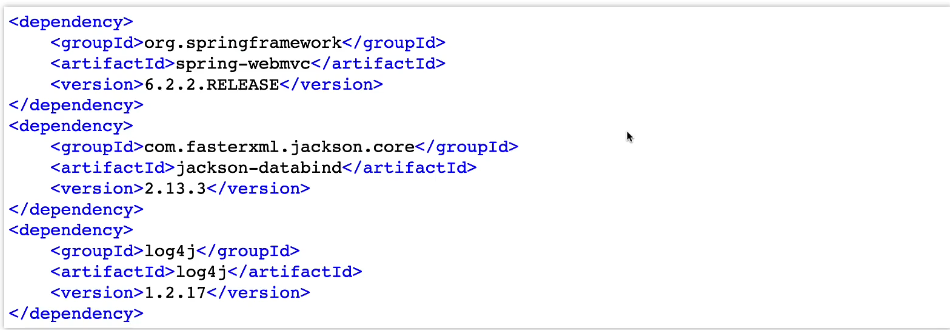
pom.xml에서 프레임워크와 버전을 관리해야 함

- REST API : Spring 프레임워크와 Spring MVC 프레임워크, JSON 바인딩 프레임워크, 로깅 등이 필요
- 단위 테스트 : Spring Test 프레임워크, Mockito, JUnit 등이 필요

#### 두 번째 어려움 : web.xml
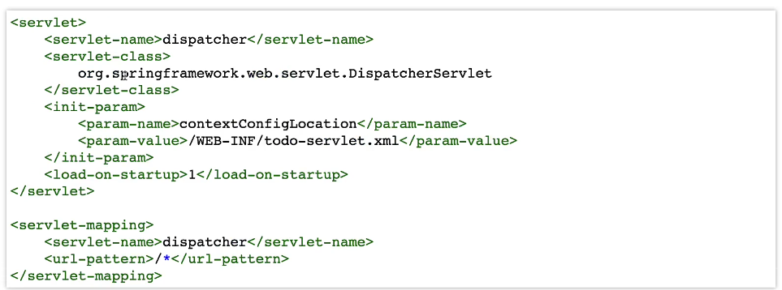
웹 애플리케이션의 많은 것을 설정하기 위해 필요함
- Spring MVC를 활용하려는 경우
- DispatcherServlet을 설정하는 경우

#### 세 번째 어려움 : Spring 설정
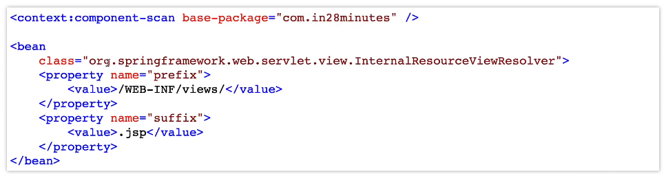
여러 설정을 적절하게 지정해야 애플리케이션 사용 가능
- 컴포넌트 스캔 정의
- 뷰 리졸버 정의 (웹 애플리케이션의 경우)
- 데이터 소스 정의 (데이터베이스 관련 경우)
- ...

#### 네 번째 어려움 : 비기능 요구사항 고려 (NFRs)
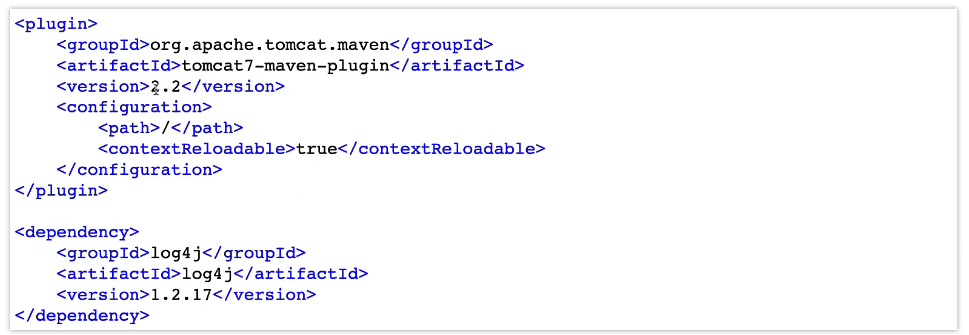
아래의 기능을 수동 구현해야 함
- 로깅
- 에러 처리
- 모니터링

#### 그리고...
- 이 모든 작업은 새로운 프로젝트를 만들 때마다 반복해야 했었다.
- 이러한 작업을 설정하는 데에는 며칠씩 걸리는게 일반적었다.
- 유지보수에 어려움을 겪었다.

## 3단계 - Spring Initializer로 새 Spring Boot Project 설정하기
[커밋 내역](https://github.com/PhiloMonx1/learning-spring-and-spring-boot-3.x/commit/47028b81c0f71e21c5d08e6ecba27684decbfbd5)

#### Spring Boot 프로젝트 만들기
[spring initializer](https://start.spring.io/)
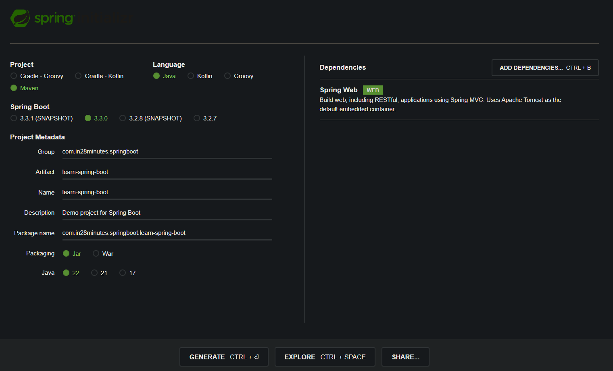
- 가장 최신 버전의 Release를 사용하는 것을 권장.
- Java 17 이상부터 Spring Boot 3을 사용할 수 있다.
- Spring Web 라이브러리를 추가한다.
  - Spring MVC로 웹 애플리케이션과 REST API를 빌드할 때 사용하는 라이브러리
  - Apache Tomcat을 임베디드 컨테이너로 사용

#### 인텔리제이에서 모듈 추가
[챕터1 ReadME 3단계 참고](..%2F01_Getting_Started_with_Java_Spring_Framework%2FREADME.md)

#### 애플리케이션 실행
-`LearnSpringBootApplication` 애플리케이션을 실행한다.

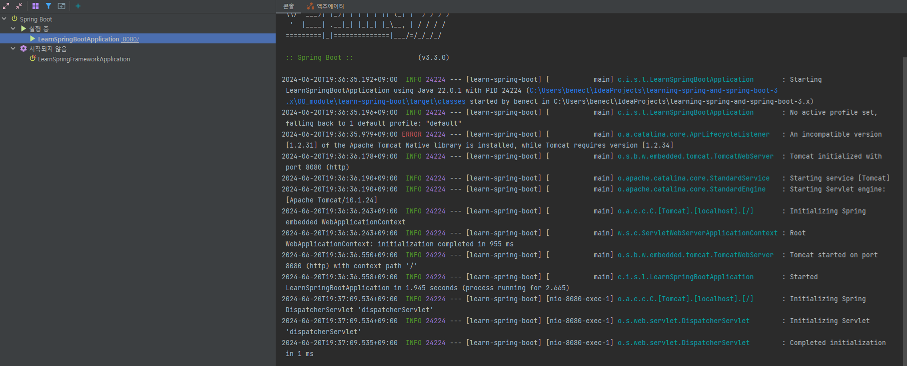
- 8080 포트의 Tomcat 서버 실행을 성공했다고 나타난다.

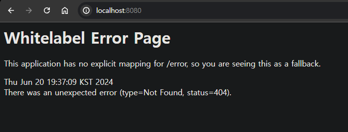
- http://localhost:8080/ 주소로 접근시 'Whitelabel Error Page'가 나타나면 성공이다.
  - 포트 번호가 다르다면 해당 포트 번호 주소로 접근해야 한다.

## 4단계 - Spring Boot를 사용하여 Hello World API 빌드하기
[커밋 내역](https://github.com/PhiloMonx1/learning-spring-and-spring-boot-3.x/commit/446af4cd28c32b3b72b8347bebfb55ac9821d4ad)

#### 만들고자 하는 API
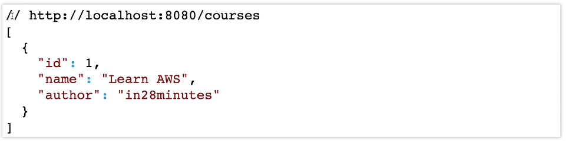

1. `Course` 클래스 생성
[Course.java](..%2F00_module%2Flearn-spring-boot%2Fsrc%2Fmain%2Fjava%2Fcom%2Fin28minutes%2Fspringboot%2Flearn_spring_boot%2FCourse.java)
2. 컨트롤러 작성
```java
@RestController
public class CourseController { }
```
컨트롤러 클래스에 `@RestController` 어노테이션을 부여한다.
3. 메서드에 리퀘스트 매핑
```java
@RestController
public class CourseController {

	@RequestMapping("/courses")
	public List<Course> retrieveAllCourses() {
		return Arrays.asList(
				new Course(1, "Learn AWS", "in28minutes"),
				new Course(2, "Learn DevOps", "in28minutes")
		);
	}
}
```
실행할 메서드에 `@RequestMapping` 어노테이션을 부여해서 매핑한다.
4. API 확인
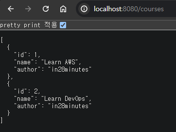
`RequestMapping`에 매핑된 '/courses' 경로에서 API를 확인할 수 있다.

5. 이해하기 (추가 메모)
- `LearnSpringBootApplication` 파일
  ```java
  @SpringBootApplication
  public class LearnSpringBootApplication {
      public static void main(String[] args) {
          SpringApplication.run(LearnSpringBootApplication.class, args);
      }
  }
  ```
  [spring initializer](https://start.spring.io/)으로 프로젝트를 생성할 때 부터 `LearnSpringBootApplication` 클래스 파일이 존재했었다. 
  해당 파일 덕분에 'ComponentScan'이나 'context'의 선언 없이 애플리케이션 실행이 가능하다.
- @SpringBootApplication
  - @SpringBootConfiguration + @EnableAutoConfiguration + @ComponentScan 세 가지 어노테이션의 결합이다.
  - 'Configuration'과 'ComponentScan'의 설정이 미리 되어 있는 것
- SpringApplication.run
  - 기존의 컨텍스트(context)를 선언하던 코드 처럼 컨텍스트를 초기화 하고 실행한다.
  - Spring Boot의 자동 설정 기능을 사용하여 많은 설정을 자동으로 처리한다.


## 5단계 - Spring Boot의 목표 이해하기
[커밋 내역](https://github.com/PhiloMonx1/learning-spring-and-spring-boot-3.x/commit/f9b2dff05b297cfad523539c3e8b8760b7a03f6a)

#### Spring Boot의 목표 
프로덕션 환경에서 사용가능한 애플리케이션을 빠르게 빌드할 수 있도록 돕는 것

- 빠르게
  - Spring Initializer
    - Spring Boot 프로젝트를 간단하게 생성 가능함
  - Spring Boot Starter Projects
    - 프로젝트의 의존성을 빠르게 정의할 수 있음
  - Spring Boot Auto Configuration 
    - 클래스 경로에 있는 의존성에 따라 자동 설정이 제공됨
  - Spring Boot DevTools
    - 수동으로 서버를 재시작 하지 않고 애플리케이션 변경 가능
- 프로덕션 환경에서 사용 가능한
  - 로깅(Logging)
    - Spring Boot는 기본 로깅을 제공함
  - 환경(dev, qa, stage, prod 등)에 맞는 다양한 설정 제공 
    - Profiles
    - ConfigurationProperties
  - 모니터링 (Spring Boot Actuator)
    - 메모리가 충분한지 살펴보기
    - 애플리케이션의 측정항목 살펴보기

## 6단계 - Spring Boot의 강력함 이해하기 - Spring Boot Starter Project
[커밋 내역](https://github.com/PhiloMonx1/learning-spring-and-spring-boot-3.x/commit/686ad9e737b2d89f64b58b55091214bf1d9fcd2b)

일반적으로 애플리케이션을 빌드할 때는 프레임워크가 많이 필요하다.

#### 일반적으로 애플리케이션을 빌드할 때는 프레임워크가 많이 필요하다.
- REST API
  - Spring 프레임워크 
  - Spring MVC 프레임워크
  - Tomcat
  - JSON 변환
    - `CourseController::retrieveAllCourses()` 에서는 `Course` 객체의 List를 반환하지만 실제 응답은 JSON이다.
    - Course` 객체의 List 에서 JSON 데이터로 변환하는 과정을 'JSON 변환'이라고 말한다.
- 단위테스트 작성
  - JUnit 프레임워크
  - Mockito 프레임워크

#### Spring Boot Starter (Starter Project) : 편리한 의존성 디스크립터(구조체)
애플리케이션 빌드에 필요한 프레임워크를 그룹화
```xml
<dependencies>
    <dependency>
        <groupId>org.springframework.boot</groupId>
        <artifactId>spring-boot-starter-web</artifactId>
    </dependency>

    <dependency>
        <groupId>org.springframework.boot</groupId>
        <artifactId>spring-boot-starter-test</artifactId>
        <scope>test</scope>
    </dependency>
</dependencies>
```
- spring-boot-starter-web
  - REST API 와 웹 애플리케이션 빌드
  - 내부에 정의된 의존성 (spring-boot-starter-web 안에 의존성이 정의되어 있다.)
    - spring-boot-starter : Spring 컨텍스트를 실행
    - spring-boot-starter-json : Bean을 JSON으로 변환
    - spring-boot-starter-tomcat : Tomcat 서버에서 애플리케이션 실행
    - spring-web, spring-webmvc : Spring MVC 프레임워크를 사용하여 REST API를 빌드
- spring-boot-starter-test
  - 단위테스트 작성

spring-boot-starter-web 하나만 있어도 웹 애플리케이션 개발에 필요한 라이브러리를 모두 관리할 수 있다.

#### Spring Boot가 제공하는 다양한 Starter Project
- Spring Boot Starter Web : 웹 애플리케이션, REST API 빌드
- Spring Boot Starter Test : 단위테스트 작성
- Spring Boot Starter Data JPA : ORM을 사용해서 데이터베이스 통신 
- Spring Boot Starter JDBC : JDBC를 사용해서 데이터베이스 통신
- Spring Boot Starter Security : 웹 애플리케이션, REST API 보호

## 7단계 - Spring Boot의 강력함 이해하기 - Auto Configuration
[커밋 내역](https://github.com/PhiloMonx1/learning-spring-and-spring-boot-3.x/commit/82a21f9c2c72d1e4028dc4c7016d5e2a0f54d080)

#### 애플리케이션을 빌드할 때는 많은 설정이 필요하다.
- 컴포넌트 스캔 (Component Scan)
- DispatcherServlet
- 데이터 소스 (Data Sources)
- JSON 변환 (JSON Conversion)
- ...

#### Auto Configuration : Spring Boot 에서 제공하는 설정 자동화
- 클래스패스 분석 : 클래스 경로에 있는 프레임워크를 따라 생성
- 기본 설정 제공 : Spring Boot가 제공하는 디폴트 자동 설정 (커스터마이징)
  - 자체 설정을 통해 오버라이드 가능 
- 조건부 설정 : 특정 조건이 충족되는 경우에만 설정 적용
  - ex) 특정 라이브러리가 존재하는 경우에만 관련 구성 요소 설정

#### 인텔리제이에서 Auto Configuration 라이브러리 확인하기
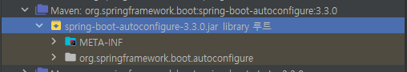

- 프로젝트 -> 외부 라이브러리에서 `spring-boot-autoconfigure`를 찾을 수 있다.
- spring-boot-starter-web -> spring-boot-starter -> spring-boot-autoconfigure
  - xml.pom에서 경로를 따라가도 확인이 가능하다.

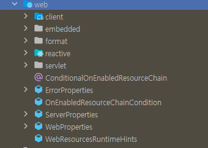

- `spring-boot-autoconfigure` 내부에서 web 패키지를 확인 할 수 있다.
- [Spring 공식 문서](https://docs.spring.io/spring-boot/api/java/org/springframework/boot/autoconfigure/web/package-summary.html)

#### application.properties 에서 로깅
- 설정을 더 자세히 보고 싶다면 debug 로깅 모드로 설정을 확인 할 수 있다.
```
logging.level.org.springframework = debug
```
- `application.properties` 파일에서 설정 가능하다.
  - `application.properties` 에는 예민한 보안 정보가 있는 경우가 많아 Git 추적을 하지 않는다.
  - 대신 `[application.properties.example](..%2F00_module%2Flearn-spring-boot%2Fsrc%2Fmain%2Fresources%2Fapplication.properties.example)` 파일을 통해 설정의 'Key'를 노출하고 'value'를 예시 값으로 바꾸어 애플리케이션의 설정을 표기할 수 있다.
```
============================
CONDITIONS EVALUATION REPORT
============================


Positive matches:
-----------------
...(생략)
 DispatcherServletAutoConfiguration matched:
    - @ConditionalOnClass found required class 'org.springframework.web.servlet.DispatcherServlet' (OnClassCondition)
    - found 'session' scope (OnWebApplicationCondition)
...(생략)

Negative matches:
-----------------
...(생략)
```
- 서버를 실행했을 때 이와 같은 로그를 확인 할 수 있다.
  - Positive matches: 자동 설정된 항목
  - Negative matches: 자동 설정되지 않은 항목
- Positive matches 목록을 보면 DispatcherServlet 이나 Tomcat 등이 자동 설정된 것을 알 수 있다.

#### spring-boot-autoconfigure-web 에서 DispatcherServletAutoConfiguration 확인
- `org.springframework.boot.autoconfigure.web.servlet.DispatcherServletAutoConfiguration`
- 인텔리제이 기준으로 Shift를 두번 눌러서 파일 검색을 할 수 있다.

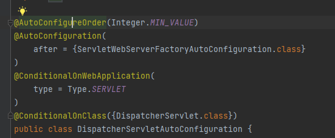

- @AutoConfigureOrder(Integer.MIN_VALUE)
  - AutoConfigureOrder : 클래스의 실행 순서
  - Integer.MIN_VALUE : 가장 낮은 순서
- @AutoConfiguration(after = {ServletWebServerFactoryAutoConfiguration.class})
  - AutoConfiguration : 현재 클래스가 다른 클래스에 의존하고 있음을 알려줌
  - ServletWebServerFactoryAutoConfiguration : 해당 클래스가 먼저 실행된 후에 실행
- @ConditionalOnWebApplication(type = Type.SERVLET)
  - 클래스가 Servlet 기반의 웹 애플리케이션에서만 적용되도록 제한
- @ConditionalOnClass({DispatcherServlet.class})
  - 클래스가 DispatcherServlet 클래스가 존재하는 경우에만 적용되도록 제한

#### 디폴트 오류 설정 : ErrorMvcAutoConfiguration
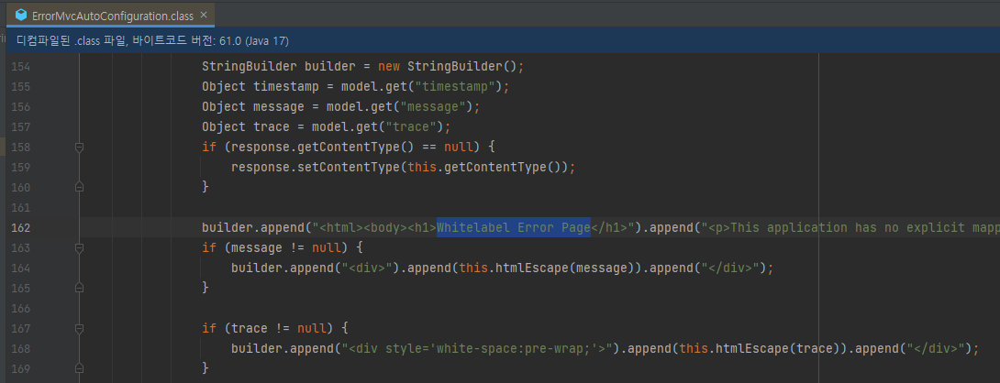

- 3단계에서 http://localhost:8080/ 주소로 접근시 'Whitelabel Error Page' 나타났던 것은 URL이 매핑되지 않은 페이지였기 때문이다.
- 'Whitelabel Error Page' 는 Srping의 디폴트 오류 페이지이며 `ErrorMvcAutoConfiguration`클래스에 설정되어 있다.

#### Spring Boot Starter Web
- xml.pom에서 spring-boot-starter-web -> spring-boot-starter -> spring-boot-autoconfigure 해당 경로로 이동이 가능하다.
- Spring Boot Starter Web 에서 자동 설정하고 있는 것 (중요한 것만)
  - Dispatcher Servlet 
  - Embedded Servlet Container
  - Tomcat
  - Default Error Pages
  - JSON 변환 
    - Jackson 프레임워크에서 실행됨 (JacksonHttpMessageConvertersConfiguration)
    - Spring Boot Starter Web에는 Jackson 라이브러리가 기본적으로 포함되어 있다.

## 8단계 - Spring Boot DevTools로 빠르게 빌드하기
[커밋 내역](https://github.com/PhiloMonx1/learning-spring-and-spring-boot-3.x/commit/765d7847779c2fb80154d17afdd129a9f5380abf)

코드 수정 이후 자동으로 서버를 다시 시작하고 코드 변경사항을 적용

#### DevTools 사용법
```xml
<dependency>
    <groupId>org.springframework.boot</groupId>
    <artifactId>spring-boot-devtools</artifactId>
</dependency>
```
- `spring-boot-devtools` 라이브러리를 추가하고 Maven을 통해 라이브러리를 불러온다.
- 인텔리제이의 경우 IDE 설정을 해주어야 한다.
  - 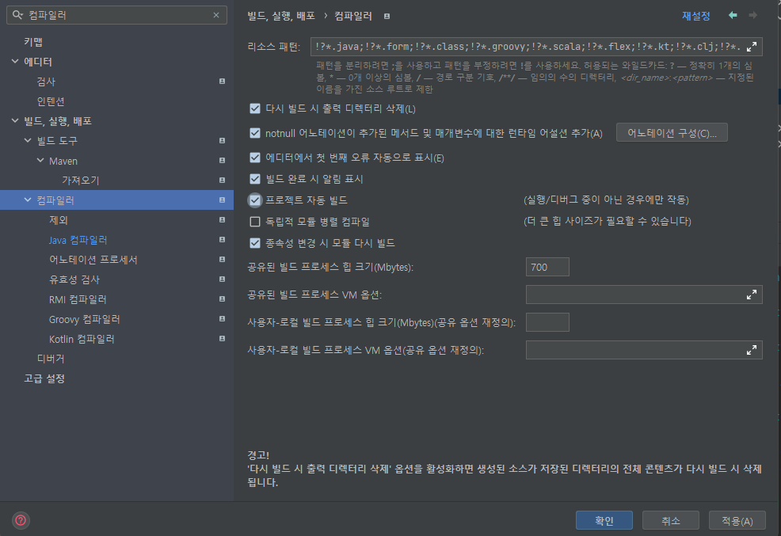
  - 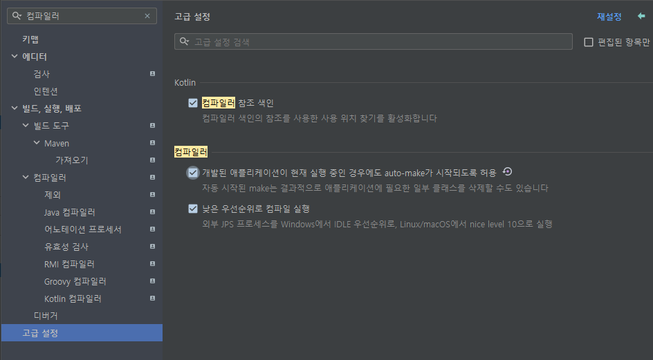

```java
@RestController
public class CourseController {
	@RequestMapping("/courses")
	public List<Course> retrieveAllCourses() {
		return Arrays.asList(
				new Course(1, "Learn AWS", "in28minutes"),
				new Course(2, "Learn DevOps", "in28minutes"),
				new Course(3, "Learn Azure", "in28minutes"),
				new Course(4, "Learn GCP", "in28minutes")
		);
	}
}
```
`spring-boot-devtools` 라이브러리 추가 후 서버를 실행 후 Course 3, 4번을 추가해서 저장하면 자동으로 서버가 재실행되는 것을 확인할 수 있다.

#### 주의 사항
-`spring-boot-devtools`는 pom.xml의 수정 사항은 처리할 수 없다.

## 9단계 - Spring Boot로 프로덕션 환경 배포 준비하기 -1- Profile
[커밋 내역](https://github.com/PhiloMonx1/learning-spring-and-spring-boot-3.x/commit/f697b76bd6219e7a6e17a1ab535fc59fb3e8d8a6)

Srping Boot의 중요한 기능 알아보기

#### 프로필 (Profiles)
- 애플리케이션에는 Dev, QA, Stage, Prod 등의 환경이 있다.
- 동일한 비즈니스 로직으로 다른 환경을 구축해야 한다.
  - dev 환경에서는 로컬 DB를 사용하는 것
  - 다른 웹 서비스를 호출하는 것
- Spring Boot는 프로필을 통해 이 과정을 지원한다.
  - 각 환경에 맞춰 프로필을 생성하면 된다.

#### 프로필 만들어보기
1. `logging.level.org.springframework` 로깅 수준 환경에 따라 분리하기
   - dev 환경 : trace 수준 로깅
     1. `application.properties` 파일 복제 후 `application-dev.properties` 만들기
     2. `logging.level.org.springframework=trace` 설정
   - prod 환경 : info 수준 로깅
     1. `application.properties` 파일 복제 후 `application-prod.properties` 만들기
     2. `logging.level.org.springframework=info` 설정
2. `application.properties`에서 프로필 선택하기
    ```
    spring.profiles.active=prod
    ```
    해당 방식으로 프로필을 선택할 수 있다.

#### logging.level.org.springframework 로깅 범위의 종류
- OFF : 로그 표시 하지 않음
- ERROR : 에러
- WARN : 에러 + 경고
- INFO : 에러 + 경고 + 정보성
- DEBUG : 디버그 + 에러 + 경고 + 정보성
- TRACE : 모든 로그 출력 

## 10단계 - Spring Boot로 프로덕션 환경 배포 준비하기 -2- ConfigurationProperties
[커밋 내역](https://github.com/PhiloMonx1/learning-spring-and-spring-boot-3.x/commit/d66e48f93d1e74f184cc775b66c7ede3b6a960d2)

애플리케이션에 특수한 설정이 필요한 경우가 있다고 가정하자 Spring은 이 설정을 어떻게 지원할까?

#### ConfigurationProperties
```java
//currency-service.url
//currency-service.username
//currency-service.key
public class CurrencyServiceConfiguration { }
```
- `CurrencyServiceConfiguration` 클래스에는 주석에 적힌 3개의 설정이 필요하다고 가정하자
1. `application.properties`에 `currency-service` 설정을 추가한다.
    ```
    currency-service.url=http://default.in28minutes.com
    currency-service.username=defaultusername
    currency-service.key=defaultkey
    ```
2. `@ConfigurationProperties` 어노테이션을 통해 불러올 수 있다.
    ```java
    @ConfigurationProperties(prefix = "currency-service")
    @Component
    public class CurrencyServiceConfiguration {
        private String url;
        private String username;
        private String key;
        
        // Getter & Setter 메서드
    }
    ```
3. 컨트롤러 연결
    ```java
    @RestController
    public class CurrencyConfigurationController {
    
        @Autowired
        private CurrencyServiceConfiguration configuration;
    
        @RequestMapping("/currency-configuration")
        public CurrencyServiceConfiguration retrieveAllCourses() {
            return configuration;
        }
    }
    ```
    - `CurrencyConfigurationController` 컨트롤러 선언
    - `CurrencyServiceConfiguration` 의존성 자동 연결
    - RequestMapping
4. 데이터 확인
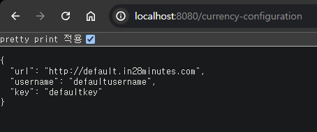
5. 해당 설정 역시 profile을 사용할 수 있다. profile 설정이 우선적으로 사용된다.

## 11단계 - Spring Boot로 프로덕션 환경 배포 준비하기 -3- Embedded Server
[커밋 내역](https://github.com/PhiloMonx1/learning-spring-and-spring-boot-3.x/commit/91cb0f3064f4afa82b8dd879f06689f2dfdbe1ce)

Spring Boot Embedded Server를 사용하여 배포를 간소화할 수 있다.
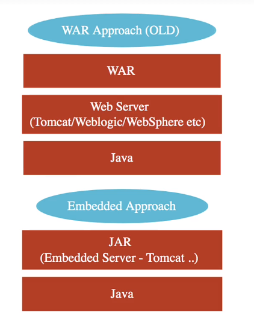

#### 배포 환경은 다양하다.
- dev, qa, stage, prod 등 다양한 환경은 모두 배포 대상이다.

#### WAR (Web ARchive) : 이전의 배포 방식
1. Java 설치
2. Web/Application 서버 설치 (Tomcat, Weblogic, WebSphere 등)
3. WAR 방식 애플리케이션 배포

#### Embedded Server : 더 단순한 대안
1. Java 설치
2. Jar 파일 run
   - 이미 Tomcat과 같은 서버가 JAR 파일에 포함되어 있음

#### 실습 (인텔리제이 기준)
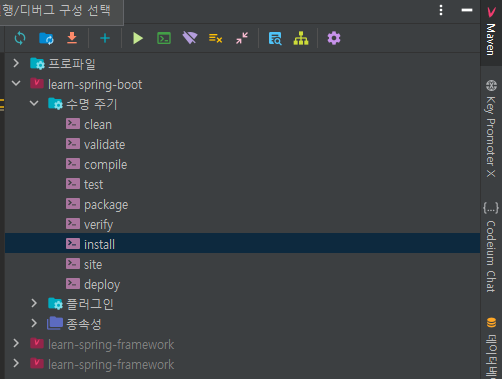
- 인텔리제이에서 Maven 빌드를 실행할 수 있다.
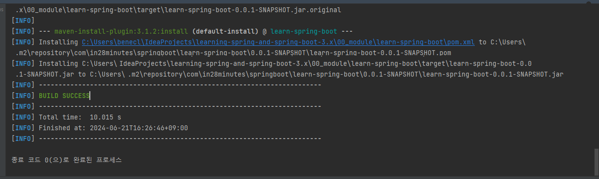
- 빌드 성공, jar 파일이 생성되었다.
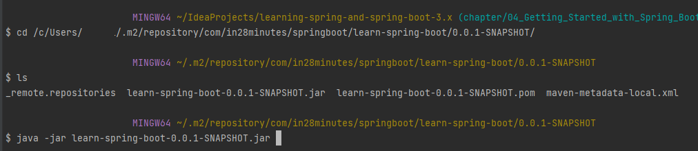
- 터미널을 통해 jar 파일을 실행시켜 애플리케이션을 구동할 수 있다.
  - 실행을 위해서 올바른 java 버전이 설치되어 있어야 한다. (Spring Boot 3 이상은 Java 17 이상이 설치되어 있어야 함)

#### Spring Boot에서 지원하는 대표적인 Embedded Server
- spring-boot-starter-tomcat : 디폴트
- spring-boot-starter-git
- spring-boot-starter-undertow

## 12단계 - Spring Boot로 프로덕션 환경 배포 준비하기 -4- Actuator
[커밋 내역](https://github.com/PhiloMonx1/learning-spring-and-spring-boot-3.x/commit/8e4b0917a4aac513c46f0d68945fe674a56b9916)

애플리케이션의 백그라운드에서 어떤 일이 발생하는지 확인하는 일을 모니터링이라고 한다.

#### Spring Boot Actuator
- 여러 개의 엔드포인트를 제공
  - beans : 애플리케이션 포함된 모든 Spring beans 확인
  - health : 애플리케이션의 상태 정보 확인
  - metrics : 애플리케이션의 매트릭스 확인
    - 성능 지표
      - CPU 사용량
      - 메모리 사용량
      - 응답 시간
      - 처리량 (throughput)
      - 병목 지점 등
    - 상태 지표
      - 애플리케이션 상태 (시작, 중지, 준비 등)
      - 오류 발생 횟수
      - 장애 발생 시간
      - 서비스 가용성 등
    - 사용량 지표
      - 사용자 수
      - 요청 수
      - 데이터 송/수신량
      - API 호출 횟수 등
  - mappings : 모든 요청 매핑 관련 세부사항
  - ...

#### Actuator 사용 실습
```xml
<dependency>
	<groupId>org.springframework.boot</groupId>
	<artifactId>spring-boot-starter-actuator</artifactId>
</dependency>
```
1. `spring-boot-starter-actuator` 라이브러리 추가
2. 애플리케이션 추가 후 '/actuator' 엔드포인트로 이동
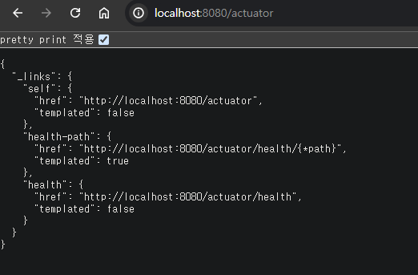
3. 기본적으로는 '/health' 만 노출된다.
4. `application.properties` 설정을 통해 더 많은 기능을 사용할 수 있다.
    ```
    management.endpoints.web.exposure.include=*
    ```
    - 해당 설정으로 Actuator 에서 제공하는 모든 엔드포인트를 노출할 수 있다.

#### 중요한 Actuator 엔드포인트
- /actuator/beans : 모든 Spring beans 표시
- /actuator/configprops : application.properties에서 설정할 수 있는 모든 항목 표시
  - 예민한 값은 '*****'로 가려져서 노출된다.
- /actuator/env : 환경에 관한 모든 세부 사항 표시
- /actuator/metrics : 모든 매트릭스 표시
  - /actuator/metrics/http.server.requests 방식으로 세부 항목을 더 자세히 보는게 가능하다.
  - 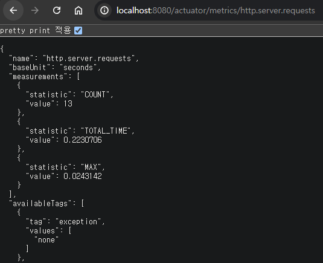
    - COUNT : 서버에 들어온 요청 갯수 (새로고침 시 늘어남)

#### 주의점
- Actuator의 엔드포인트를 많이 설정하면 그만큼 수집해야 하는 정보가 많아지고 CPU, 메모리 사용량이 증가한다.
- 명시적 사용이 올바르다
  ```
  management.endpoints.web.exposure.include=health,metrics
  ```

## 13단계 - Spring Boot, Spring, Spring MVC 이해하기
[커밋 내역](https://github.com/PhiloMonx1/learning-spring-and-spring-boot-3.x/commit/471e1791d30969429a629ae265f16504b0cf142b)

#### Spring : 의존성 주입이 가능하지만 강력한 애플리케이션을 만들기 위해서는 다른 프레임워크가 필요함
- 의존성 주입
  - @Component
  - @Service
  - 컴포넌트 스캔
- 생태계를 확장하여 다른 프레임워크와 쉽게 확장 가능

#### Spring MVC : Spring 모듈 
- 웹 애플리케이션과 REST API 빌드 과정을 간소화
  - Spring MVC 전에 'Struts'가 있었지만 빌드 과정이 복잡했음
  - 주요 어노테이션
    - @Controller
    - @RestController 
    - @RequestMapping

#### Spring Boot : Spring 프로젝트
- Starter Projects : 애플리케이션 개발에 필요한 의존성을 그룹으로 관리
- Auto Configuration : 클래스 경로에 있는 항목에 따라 디폴트 설정 자동 제공
- NFRs (Non-Functional Requirements) : 비즈니스 로직을 제외한 성능, 보안, 로깅 등의 요소
  - Embedded Server : 애플리케이션의 배포 과정 간소화 (서버 내장)
  - Actuator : 애플리케이션 모니터링 지원
  - 디폴트 로깅 & 오류 처리
  - ConfigurationProperties : 애플리케이션 설정 간소화

## 14단계 - Spring Boot 시작하기 - 복습
[커밋 내역](https://github.com/PhiloMonx1/learning-spring-and-spring-boot-3.x/commit/875e87b56f6ffcba7febf8ade810b15c13827cda)

해당 챕터의 목표는 Spring Boot를 대략적으로 살펴보는 것

#### Spring Boot의 중요한 용어
- Starter Projects
- Auto Configuration
- Actuator
- DevTools

#### Spring Boot의 장점
- 프로덕션 환경에 사용 가능한 기능을 빠르게 시작 가능

#### @SpringBootApplication
- @SpringBootConfiguration + @EnableAutoConfiguration + @ComponentScan
- 위의 세 가지 어노테이션의 결합이다.