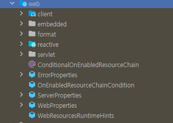

# 📒 [학습 노트] 챕터 4 : Spring Boot 시작하기

## 1단계 - Spring Boot 시작하기 - 목표

#### 질문
- Spring Boot 가 없어도 웹 애플리케이션과 REST API를 빌드할 수 있다. 그렇다면 왜 Spring Boot를 사용할까?
- Spring Boot의 목표는 무엇일까?
- Spring Boot는 어떻게 동작할까?
- Spring Boot vs Spring MVC vs Spring

#### 챕터 학습 과정
1. Spring Boot 없이 빌드된 애플리케이션은 어땠을지
2. Spring Boot를 활용해서 프로젝트를 만들어보기 
3. Spring Boot를 활용해서 간단한 REST API를 구현해보기
4. Spring Boot의 마법 같은 개념을 이해하기
   - 스프링 이널라이져 (Spring Initializr)
   - 스타터 프로젝트 (Starter Projects) 
   - 자동 설정 (Auto Configuration)
   - 개발 도구 (Developer Tools)
   - 액추에이터 (Actuator)
   - ...

## 2단계 - Spring Boot 이전 세계 이해 - 대략적으로 알아보기

Spring Boot 전에 Spring 프로젝트를 설정하는 작업은 쉽지 않았다.
#### 첫 번째 어려움 : 의존성

pom.xml에서 프레임워크와 버전을 관리해야 함

- REST API : Spring 프레임워크와 Spring MVC 프레임워크, JSON 바인딩 프레임워크, 로깅 등이 필요
- 단위 테스트 : Spring Test 프레임워크, Mockito, JUnit 등이 필요

#### 두 번째 어려움 : web.xml

웹 애플리케이션의 많은 것을 설정하기 위해 필요함
- Spring MVC를 활용하려는 경우
- DispatcherServlet을 설정하는 경우

#### 세 번째 어려움 : Spring 설정

여러 설정을 적절하게 지정해야 애플리케이션 사용 가능
- 컴포넌트 스캔 정의
- 뷰 리졸버 정의 (웹 애플리케이션의 경우)
- 데이터 소스 정의 (데이터베이스 관련 경우)
- ...

#### 네 번째 어려움 : 비기능 요구사항 고려 (NFRs)

아래의 기능을 수동 구현해야 함
- 로깅
- 에러 처리
- 모니터링

#### 그리고...
- 이 모든 작업은 새로운 프로젝트를 만들 때마다 반복해야 했었다.
- 이러한 작업을 설정하는 데에는 며칠씩 걸리는게 일반적었다.
- 유지보수에 어려움을 겪었다.

## 3단계 - Spring Initializer로 새 Spring Boot Project 설정하기

#### Spring Boot 프로젝트 만들기
[spring initializer](https://start.spring.io/)

- 가장 최신 버전의 Release를 사용하는 것을 권장.
- Java 17 이상부터 Spring Boot 3을 사용할 수 있다.
- Spring Web 라이브러리를 추가한다.
  - Spring MVC로 웹 애플리케이션과 REST API를 빌드할 때 사용하는 라이브러리
  - Apache Tomcat을 임베디드 컨테이너로 사용

#### 인텔리제이에서 모듈 추가
[챕터1 ReadME 3단계 참고](..%2F01_Getting_Started_with_Java_Spring_Framework%2FREADME.md)

#### 애플리케이션 실행
-`LearnSpringBootApplication` 애플리케이션을 실행한다.


- 8080 포트의 Tomcat 서버 실행을 성공했다고 나타난다.


- http://localhost:8080/ 주소로 접근시 'Whitelabel Error Page'가 나타나면 성공이다.
  - 포트 번호가 다르다면 해당 포트 번호 주소로 접근해야 한다.

## 4단계 - Spring Boot를 사용하여 Hello World API 빌드하기

#### 만들고자 하는 API


1. `Course` 클래스 생성
[Course.java](..%2F00_module%2Flearn-spring-boot%2Fsrc%2Fmain%2Fjava%2Fcom%2Fin28minutes%2Fspringboot%2Flearn_spring_boot%2FCourse.java)
2. 컨트롤러 작성
```java
@RestController
public class CourseController { }
```
컨트롤러 클래스에 `@RestController` 어노테이션을 부여한다.
3. 메서드에 리퀘스트 매핑
```java
@RestController
public class CourseController {

	@RequestMapping("/courses")
	public List<Course> retrieveAllCourses() {
		return Arrays.asList(
				new Course(1, "Learn AWS", "in28minutes"),
				new Course(2, "Learn DevOps", "in28minutes")
		);
	}
}
```
실행할 메서드에 `@RequestMapping` 어노테이션을 부여해서 매핑한다.
4. API 확인

`RequestMapping`에 매핑된 '/courses' 경로에서 API를 확인할 수 있다.

## 5단계 - Spring Boot의 목표 이해하기

#### Spring Boot의 목표 
프로덕션 환경에서 사용가능한 애플리케이션을 빠르게 빌드할 수 있도록 돕는 것

- 빠르게
  - Spring Initializer
    - Spring Boot 프로젝트를 간단하게 생성 가능함
  - Spring Boot Starter Projects
    - 프로젝트의 의존성을 빠르게 정의할 수 있음
  - Spring Boot Auto Configuration 
    - 클래스 경로에 있는 의존성에 따라 자동 설정이 제공됨
  - Spring Boot DevTools
    - 수동으로 서버를 재시작 하지 않고 애플리케이션 변경 가능
- 프로덕션 환경에서 사용 가능한
  - 로깅(Logging)
    - Spring Boot는 기본 로깅을 제공함
  - 환경(dev, qa, stage, prod 등)에 맞는 다양한 설정 제공 
    - Profiles
    - ConfigurationProperties
  - 모니터링 (Spring Boot Actuator)
    - 메모리가 충분한지 살펴보기
    - 애플리케이션의 측정항목 살펴보기

## 6단계 - Spring Boot의 강력함 이해하기 - Spring Boot Starter Project
일반적으로 애플리케이션을 빌드할 때는 프레임워크가 많이 필요하다.

#### 일반적으로 애플리케이션을 빌드할 때는 프레임워크가 많이 필요하다.
- REST API
  - Spring 프레임워크 
  - Spring MVC 프레임워크
  - Tomcat
  - JSON 변환
    - `CourseController::retrieveAllCourses()` 에서는 `Course` 객체의 List를 반환하지만 실제 응답은 JSON이다.
    - Course` 객체의 List 에서 JSON 데이터로 변환하는 과정을 'JSON 변환'이라고 말한다.
- 단위테스트 작성
  - JUnit 프레임워크
  - Mockito 프레임워크

#### Spring Boot Starter (Starter Project) : 편리한 의존성 디스크립터(구조체)
애플리케이션 빌드에 필요한 프레임워크를 그룹화
```xml
<dependencies>
    <dependency>
        <groupId>org.springframework.boot</groupId>
        <artifactId>spring-boot-starter-web</artifactId>
    </dependency>

    <dependency>
        <groupId>org.springframework.boot</groupId>
        <artifactId>spring-boot-starter-test</artifactId>
        <scope>test</scope>
    </dependency>
</dependencies>
```
- spring-boot-starter-web
  - REST API 와 웹 애플리케이션 빌드
  - 내부에 정의된 의존성 (spring-boot-starter-web 안에 의존성이 정의되어 있다.)
    - spring-boot-starter : Spring 컨텍스트를 실행
    - spring-boot-starter-json : Bean을 JSON으로 변환
    - spring-boot-starter-tomcat : Tomcat 서버에서 애플리케이션 실행
    - spring-web, spring-webmvc : Spring MVC 프레임워크를 사용하여 REST API를 빌드
- spring-boot-starter-test
  - 단위테스트 작성

spring-boot-starter-web 하나만 있어도 웹 애플리케이션 개발에 필요한 라이브러리를 모두 관리할 수 있다.

#### Spring Boot가 제공하는 다양한 Starter Project
- Spring Boot Starter Web : 웹 애플리케이션, REST API 빌드
- Spring Boot Starter Test : 단위테스트 작성
- Spring Boot Starter Data JPA : ORM을 사용해서 데이터베이스 통신 
- Spring Boot Starter JDBC : JDBC를 사용해서 데이터베이스 통신
- Spring Boot Starter Security : 웹 애플리케이션, REST API 보호

## 7단계 - Spring Boot의 강력함 이해하기 - Auto Configuration

#### 애플리케이션을 빌드할 때는 많은 설정이 필요하다.
- 컴포넌트 스캔 (Component Scan)
- DispatcherServlet
- 데이터 소스 (Data Sources)
- JSON 변환 (JSON Conversion)
- ...

#### Auto Configuration : Spring Boot 에서 제공하는 설정 자동화
- 클래스패스 분석 : 클래스 경로에 있는 프레임워크를 따라 생성
- 기본 설정 제공 : Spring Boot가 제공하는 디폴트 자동 설정 (커스터마이징)
  - 자체 설정을 통해 오버라이드 가능 
- 조건부 설정 : 특정 조건이 충족되는 경우에만 설정 적용
  - ex) 특정 라이브러리가 존재하는 경우에만 관련 구성 요소 설정

#### 인텔리제이에서 Auto Configuration 라이브러리 확인하기


- 프로젝트 -> 외부 라이브러리에서 `spring-boot-autoconfigure`를 찾을 수 있다.
- spring-boot-starter-web -> spring-boot-starter -> spring-boot-autoconfigure
  - xml.pom에서 경로를 따라가도 확인이 가능하다.



- `spring-boot-autoconfigure` 내부에서 wep 패키지를 확인 할 수 있다.
- [Spring 공식 문서](https://docs.spring.io/spring-boot/api/java/org/springframework/boot/autoconfigure/web/package-summary.html)

#### application.properties 에서 로깅
- 설정을 더 자세히 보고 싶다면 debug 로깅 모드로 설정을 확인 할 수 있다.
```
logging.level.org.springframework = debug
```
- `application.properties` 파일에서 설정 가능하다.
  - `application.properties` 에는 예민한 보안 정보가 있는 경우가 많아 Git 추적을 하지 않는다.
  - 대신 `[application.properties.example](..%2F00_module%2Flearn-spring-boot%2Fsrc%2Fmain%2Fresources%2Fapplication.properties.example)` 파일을 통해 설정의 'Key'를 노출하고 'value'를 예시 값으로 바꾸어 애플리케이션의 설정을 표기할 수 있다.
```
============================
CONDITIONS EVALUATION REPORT
============================


Positive matches:
-----------------
...(생략)
 DispatcherServletAutoConfiguration matched:
    - @ConditionalOnClass found required class 'org.springframework.web.servlet.DispatcherServlet' (OnClassCondition)
    - found 'session' scope (OnWebApplicationCondition)
...(생략)

Negative matches:
-----------------
...(생략)
```
- 서버를 실행했을 때 이와 같은 로그를 확인 할 수 있다.
  - Positive matches: 자동 설정된 항목
  - Negative matches: 자동 설정되지 않은 항목
- Positive matches 목록을 보면 DispatcherServlet 이나 Tomcat 등이 자동 설정된 것을 알 수 있다.

#### spring-boot-autoconfigure-wep 에서 DispatcherServletAutoConfiguration 확인
- `org.springframework.boot.autoconfigure.web.servlet.DispatcherServletAutoConfiguration`
- 인텔리제이 기준으로 Shift를 두번 눌러서 파일 검색을 할 수 있다.


- @AutoConfigureOrder(Integer.MIN_VALUE)
  - AutoConfigureOrder : 클래스의 실행 순서
  - Integer.MIN_VALUE : 가장 낮은 순서
- @AutoConfiguration(after = {ServletWebServerFactoryAutoConfiguration.class})
  - AutoConfiguration : 현재 클래스가 다른 클래스에 의존하고 있음을 알려줌
  - ServletWebServerFactoryAutoConfiguration : 해당 클래스가 먼저 실행된 후에 실행
- @ConditionalOnWebApplication(type = Type.SERVLET)
  - 클래스가 Servlet 기반의 웹 애플리케이션에서만 적용되도록 제한
- @ConditionalOnClass({DispatcherServlet.class})
  - 클래스가 DispatcherServlet 클래스가 존재하는 경우에만 적용되도록 제한

#### 디폴트 오류 설정 : ErrorMvcAutoConfiguration


- 3단계에서 http://localhost:8080/ 주소로 접근시 'Whitelabel Error Page' 나타났던 것은 URL이 매핑되지 않은 페이지였기 때문이다.
- 'Whitelabel Error Page' 는 Srping의 디폴트 오류 페이지이며 `ErrorMvcAutoConfiguration`클래스에 설정되어 있다.

#### Spring Boot Starter Web
- xml.pom에서 spring-boot-starter-web -> spring-boot-starter -> spring-boot-autoconfigure 해당 경로로 이동이 가능하다.
- Spring Boot Starter Web 에서 자동 설정하고 있는 것 (중요한 것만)
  - Dispatcher Servlet 
  - Embedded Servlet Container
  - Tomcat
  - Default Error Pages
  - JSON 변환 
    - Jackson 프레임워크에서 실행됨 (JacksonHttpMessageConvertersConfiguration)
    - Spring Boot Starter Web에는 Jackson 라이브러리가 기본적으로 포함되어 있다.