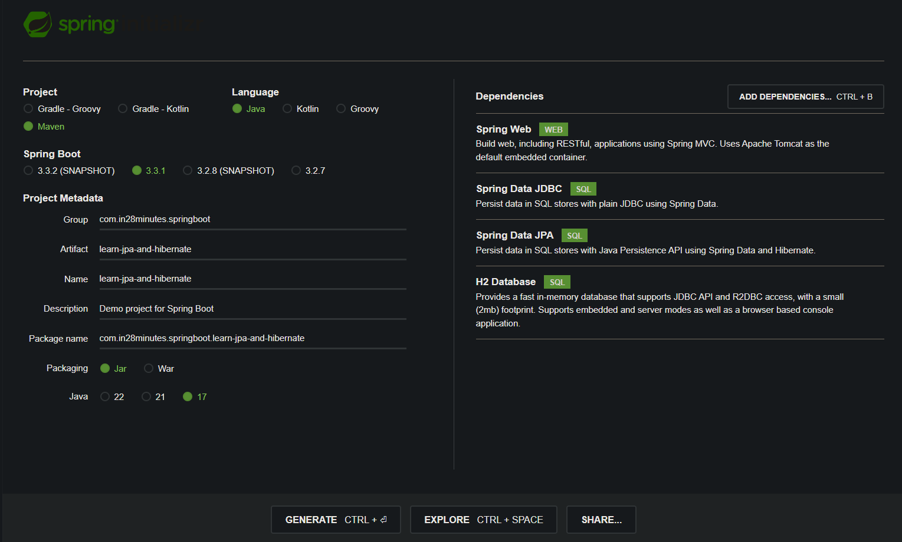
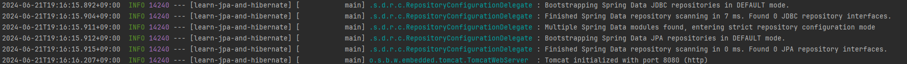
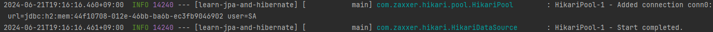
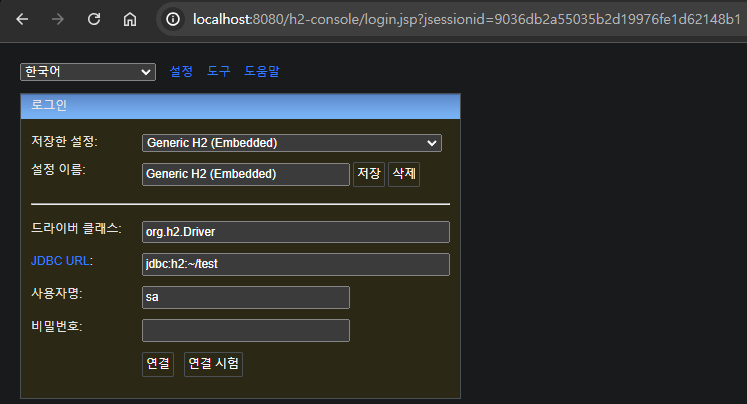
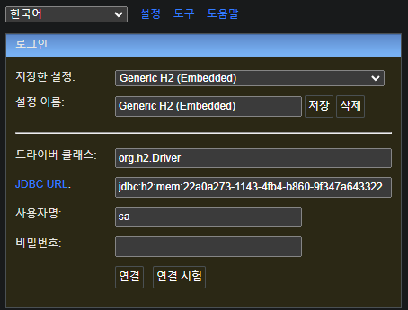
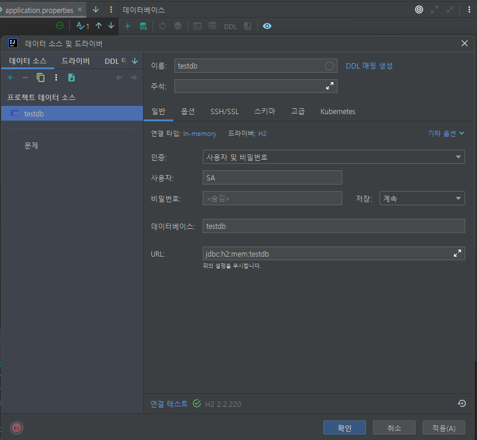
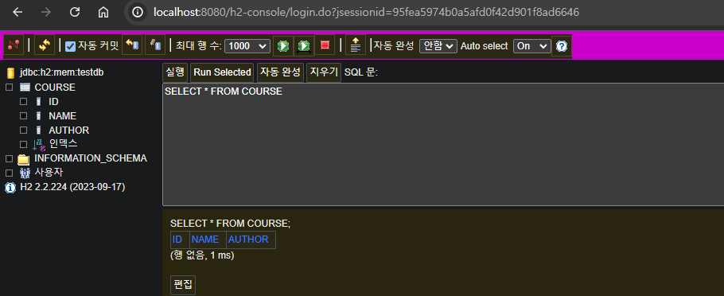

# 📒 [학습 노트] 챕터 6 : Spring과 Spring Boot로 JPA와 Hibernate 시작하기


## 1단계 - JPA와 Hibernate 시작하기 - 목표

#### 학습 목표
1. JPA 이전의 세계 이해하기
2. JDBC & Spring JDBC
3. JPA 와 Hibernate의 차이
4. Spring Boot Data JPA 사용해보기

#### 학습 접근 방식
1. H2(인메모리 DB)로 Spring Boot 프로젝트 생성
2. H2 Database에 `COURSE` 테이블 생성
3. JDBC를 사용해서 `COURSE` 테이블의 데이터 활용
4. JPA와 Hibernate 사용해서 `COURSE` 테이블의 데이터 활용
5. JPA와 Hibernate 차이점
6. Spring Data JPA를 사용
---

## 2단계 - JPA와 Hibernate에 맞는 새 Spring Boot 프로젝트 설정하기

#### 프로젝트 생성

- [Spring initializer](https://start.spring.io/) 를 통해 프로젝트를 생성한다.
- 라이브러리 목록
  - Spring Web
  - Spring Data JDBC
  - Spring Data JPA
  - H2 Database

#### 프로젝트 실행

- JDBC와 JPA가 실행된 것을 볼 수 있다.
---

## 3단계 - H2 콘솔 실행하기 및 H2에서 과정 테이블 생성하기

#### H2 데이터베이스 연결
1. 서버 실행 로그를 보면 H2 데이터베이스 로그를 찾을 수 있다.
   
2. [application.properties](..%2F00_module%2Flearn-jpa-and-hibernate%2Fsrc%2Fmain%2Fresources%2Fapplication.properties) 설정
    ```
    spring.h2.console.enabled=true
    ```
3. http://localhost:8080/h2-console 접속
   
4. 데이터베이스 로그인
    - JDBC URL 은 별도 설정하지 않았기에 랜덤으로 설정된다.
    - 로그에서 'url=jdbc:h2:mem:' 키워드로 찾을 수 있다.
      
5. 정적 URL 설정
    ```
    spring.datasource.url=jdbc:h2:mem:testdb
    ```
   - `spring.datasource.url=jdbc:h2:mem:` 다음으로 원하는 값을 주면 된다.
6. 인텔리제이 데이터베이스 툴에 연결
   
   1. 오른쪽 탭에서 '데이터베이스 클릭'
   2. '+'버튼(새로작성)을 클릭
   3. '데이터소스'에서 'H2' 선택
   4. '데이터소스 드라이버' 입력

#### 데이터베이스 테이블 생성
1. `schema.sql` 파일 생성
   - 'src/main/resources' 경로
2. 테이블 작성
    ```sql 
    create table course
    (
    id          bigint not null,
    name        varchar(255) not null,
    author      varchar(255) not null,
    primary key (id)
    );
    ```
3. 프로젝트 실행 후 테이블 확인
   
---