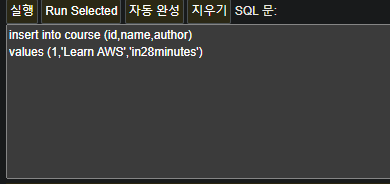
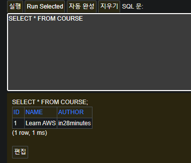
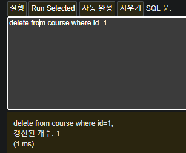

# 📒 [학습 노트] 챕터 6 : Spring과 Spring Boot로 JPA와 Hibernate 시작하기


## 1단계 - JPA와 Hibernate 시작하기 - 목표

#### 학습 목표
1. JPA 이전의 세계 이해하기
2. JDBC & Spring JDBC
3. JPA 와 Hibernate의 차이
4. Spring Boot Data JPA 사용해보기

#### 학습 접근 방식
1. H2(인메모리 DB)로 Spring Boot 프로젝트 생성
2. H2 Database에 `COURSE` 테이블 생성
3. JDBC를 사용해서 `COURSE` 테이블의 데이터 활용
4. JPA와 Hibernate 사용해서 `COURSE` 테이블의 데이터 활용
5. JPA와 Hibernate 차이점
6. Spring Data JPA를 사용
---

## 2단계 - JPA와 Hibernate에 맞는 새 Spring Boot 프로젝트 설정하기

#### 프로젝트 생성

- [Spring initializer](https://start.spring.io/) 를 통해 프로젝트를 생성한다.
- 라이브러리 목록
  - Spring Web
  - Spring Data JDBC
  - Spring Data JPA
  - H2 Database

#### 프로젝트 실행

- JDBC와 JPA가 실행된 것을 볼 수 있다.
---

## 3단계 - H2 콘솔 실행하기 및 H2에서 과정 테이블 생성하기

#### H2 데이터베이스 연결
1. 서버 실행 로그를 보면 H2 데이터베이스 로그를 찾을 수 있다.
   
2. [application.properties](..%2F00_module%2Flearn-jpa-and-hibernate%2Fsrc%2Fmain%2Fresources%2Fapplication.properties) 설정
    ```
    spring.h2.console.enabled=true
    ```
3. http://localhost:8080/h2-console 접속
   
4. 데이터베이스 로그인
    - JDBC URL 은 별도 설정하지 않았기에 랜덤으로 설정된다.
    - 로그에서 'url=jdbc:h2:mem:' 키워드로 찾을 수 있다.
      
5. 정적 URL 설정
    ```
    spring.datasource.url=jdbc:h2:mem:testdb
    ```
   - `spring.datasource.url=jdbc:h2:mem:` 다음으로 원하는 값을 주면 된다.
6. 인텔리제이 데이터베이스 툴에 연결
   
   1. 오른쪽 탭에서 '데이터베이스 클릭'
   2. '+'버튼(새로작성)을 클릭
   3. '데이터소스'에서 'H2' 선택
   4. '데이터소스 드라이버' 입력

#### 데이터베이스 테이블 생성
1. `schema.sql` 파일 생성
   - 'src/main/resources' 경로
2. 테이블 작성
    ```sql 
    create table course
    (
    id          bigint not null,
    name        varchar(255) not null,
    author      varchar(255) not null,
    primary key (id)
    );
    ```
3. 프로젝트 실행 후 테이블 확인
   
---

## 4단계 - Spring JDBC 시작하기

#### H2 데이터베이스 테이블에 데이터 조작(생성,조회,삭제) 방법
- 콘솔창에 SQL 문법을 입력하고 실행할 수 있다.
  
- 데이터 확인이 가능하다.
  
- 삭제
  

#### SQL (Structured Query Language)
- 관계형 데이터베이스 관리 시스템에서 데이터를 관리하고 조작하기 위해 사용하는 언어
- JDBC 와 Spring JDBC도 SQL을 작성해서 데이터를 관리해야 한다.
- Spring JDBC는 JDBC에 비해 더 적은 량의 Java code를 작성해도 된다는 장점이 있다.
  - JDBC 예시 코드
    ```java
    class exJDBC {
        public void deleteTodo(int id) {
            PreparedStatement st = null;
            try {
                st = db.conn.prepareStatement("delete from todo where id=?");
                st.setInt(1, id);
                st.execute();
            } catch (SQLException e) {
                logger.fatal("쿼리 실패 : ", e);
            } finally {
                if (st != null){
                    try {st.close();}
                    catch (SQLException e) {}
                }
            }
        }
    }
    ```
  - Spring JDBC 예시 코드
    ```java
    class exSpringJDBC {
        public void deleteTodo(int id){
            jdbcTemplate.update("delete from todo where id=?", id);
        }
    }
    ```
---

## 5단계 - Spring JDBC를 사용하여 하드코드로 작성된 데이터 삽입하기

#### Spring JDBC 사용
```sql
insert into course (id, name, author)
values (1, 'Learn AWS', 'in28minutes');

select * from course;

delete form course where id=1;
```
Spring JDBC를 사용해서 해당 쿼리를 실행해보려고 한다.

1. `CourseJdbcRepository` 클래스 생성 
    ```java
    @Repository
    public class CourseJdbcRepository {
        private JdbcTemplate springJdbcTemplate;
    }
    ```
   - @Repository : 데이터베이스에 연결되는 컴포넌트
   - JdbcTemplate : Spring JDBC 에서 제공하는 데이터베이스 조작 템플릿 클래스
2. 쿼리문 입력
    ```java
    @Repository
    public class CourseJdbcRepository {
        private static String INSERT_COURSE_SQL =
                        """
                        insert into course (id, name, author)
                        values (1, 'Learn AWS', 'in28minutes');
                        """;
   
   	    @Autowired
        private JdbcTemplate springJdbcTemplate;
    
        public void insert( ) {
            springJdbcTemplate.update(INSERT_COURSE_SQL);
        }
    }
    ```
   - springJdbcTemplate.update() 에 파라미터로 쿼리문을 줄 수 있다.
3. CommandLineRunner
    ```java
    @Component
    public class CourseJdbcCommandLineRunner implements CommandLineRunner {
        @Autowired
        private CourseJdbcRepository repository;
   
        @Override
        public void run(String... args) throws Exception {
            repository.insert();
        }
    }
    ```
    - Bean 이 SpringApplication 안에 포함되어 있을 때 실행할 특정 로직을 작성할 수 있는 인터페이스
    - `CommandLineRunner` 인터페이스를 구현하고 내부의 `run()` 를 구현하면 애플리케이션이 실행될 때 `run()` 메서드가 자동으로 실행된다.