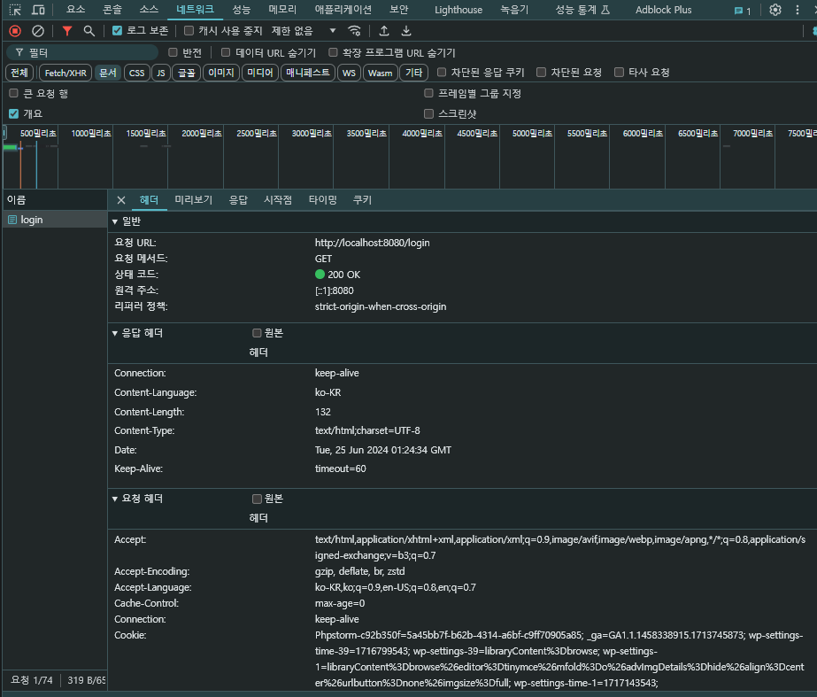

# 📒 [학습 노트] 챕터 6 : Spring Framework, Spring Boot, Hibernate로 Java 웹 애플리케이션 만들기

## 0단계 - Spring Boot를 이용한 웹 앱 제작 개요

#### 알아야 하는 키워드
- 브라우저 동작 원리
- HTML, CSS, 
- 요청, 응답, 양식, 세션, 인증
- Spring MVC
  - 디스패처 서블렛, 
  - 뷰, 
  - 리졸버, 
  - 모델 뷰, 
  - 컨트롤러, 
  - 검증
  - ...
- Spring Boot
  - 사용해야 할 스타터
  - 트리거할 자동 설정
  - ...
- 프레임워크 툴 통합
  - JSP, JSTL, JPA 통합
  - Bootstrap
  - Spring Security
  - DB (MySQL, H2)

#### 이번 챕터의 목표
현대적인 Srping Boot 접근법을 사용해서 To-do 관리 애플리케이션 만들기.

- 모든 개념을 실용적인 방식으로 탐색
- 단계별 접근법 사용

#### 애플리케이션 개요
1. 사용자 ID와 패스워드로 애플리케이션에 로그인
2. 웰컴페이지
3. Todo 관리 페이지
4. Todo 생성, 삭제, 수정
   - Todo 생성
   - 목표 날짜 설정

---

## 1단계 - Spring initalizr로 Spring Boot 웹 애플리케이션 만들기

#### 프로젝트 생성

- [Spring initializer](https://start.spring.io/) 를 통해 프로젝트를 생성한다.
- 라이브러리 목록
  - Spring Web
  - Spring Boot DevTools

---

## 2단계 - Spring Boot 프로젝트 간단히 살펴보기

#### 중요한 파일
1. [MyfirstwebappApplication.java](..%2F00_module%2Fmyfirstwebapp%2Fsrc%2Fmain%2Fjava%2Fcom%2Fin28minutes%2Fspringboot%2Fmyfirstwebapp%2FMyfirstwebappApplication.java) : 내부의 main() 메서드를 통해 애플리케이션 실행.
2. `application.properties` : 애플리케이션의 많은 세부정보를 설정할 수 있음 (예민한 정보가 적혀 있는 경우가 많아 gitignore처리함.)
3. [pom.xml](..%2F00_module%2Fmyfirstwebapp%2Fpom.xml) : Spring initializer 에서 프로젝트를 생성할 때 선택한 라이브러리(의존성)을 기록, 관리

---

## 3단계 - 첫 번째 Spring MVC 컨트롤러, @ResponseBody, @Controller

#### sayHello 실습
```java
@Controller
public class SayHelloController {
	@RequestMapping("say-hello")
	public String sayHello() {
		return "안녕하세요 오늘은 어떤 걸 배우고 계신가요?";
	}
}
```
이렇게 작성했을 때 /say-hello 엔드포인트에 접근하면 오류가 발생한다. Spring MVC 가 기본적으로 String을 리턴할 때 리턴한 문자열을 이름으로 하는 View를 검색하기 때문이다.

메서드에 `@ResponseBody` 어노테이션을 부여해서 해결할 수 있다

#### @ResponseBody
- 부여된 메서드가 반환하는 값을 HTTP 응답 바디에 직접 작성.
  - 반환 값을 JSON, XML, 문자열 등의 형식으로 변환하여 클라이언트에게 전송.

---

## 4단계 - HTML 응답을 제공하기 위해 Spring MVC 컨트롤러 개선하기

#### 하드코딩 HTML(Hyper Text Markup Language) 리턴하기
```java
@Controller
public class SayHelloController {
	@RequestMapping("say-hello-html")
	@ResponseBody
	public String sayHelloHtml() {
		StringBuffer html = new StringBuffer();
		html.append("<html>");
		html.append("<head>");
		html.append("<title>나의 첫 번째 HTML 페이지</title>");
		html.append("</head>");
		html.append("<body>");
		html.append("나의 첫 번째 HTML 페이지의 Body");
		html.append("</body>");
		html.append("</html>");

		return html.toString();
	}
}
```
- 한 줄의 텍스트를 HTML로 노출하기 위해 너무 많은 코드가 필요하다. 

---

## 5단계 - Spring Boot Controller, @ResponseBody, 뷰를 이용하여 JSP로 리디렉션하기

이전 단계에서 HTML을 직접 하드 코딩하는 것의 문제점을 알아보았다. 이 문제를 해결하기 위해 뷰를 사용할 수 있다.

#### JSP(Java Server Pages) 실습
1. tomcat-embed-jasper 라이브러리 추가 (JSP 파일을 해석하고 처리할 수 있음)
    ```
    <dependency>
        <groupId>org.apache.tomcat.embed</groupId>
        <artifactId>tomcat-embed-jasper</artifactId>
    </dependency>
    ```
2. jsp 파일 생성 ([sayHello.jsp](..%2F00_module%2Fmyfirstwebapp%2Fsrc%2Fmain%2Fresources%2FMETA-INF%2Freources%2FWEB-INF%2Fjsp%2FsayHello.jsp))
   - 일반적으로 모든 jsp는 특정한 폴더 안에서 만들어야 한다.
     - src/main/resources/META-INF/reources/WEB-INF/jsp
   - HTML을 입력하는 것과 같은 문법으로 작성할 수 있다.
   - 이렇게 작성한 jsp 파일을 '뷰'라고 부른다.
3. [application.properties](..%2F00_module%2Fmyfirstwebapp%2Fsrc%2Fmain%2Fresources%2Fapplication.properties) 설정
    ```
    spring.mvc.view.prefix=/WEB-INF/jsp/
    spring.mvc.view.suffix=.jsp
    ```
   - 컨트롤러에서 jsp 파일을 리턴해야 한다.
   - 경로 : src/main/resources/META-INF/reources/WEB-INF/jsp/sayHello.jsp
   - 경로에서 `sayHello`를 제외한 부분은 새로운 파일이 추가되어도 변하지 않기에 상수로 선언할 수 있다
     - 접두사(prefix) : `/src/main/resources/META-INF/resources` 부분은 Spring이 알고 있으니 나머지 부분만 입력
     - 접미사(suffix) : 파일의 확장자인 `.jsp`을 입력
4. API 추가
    ```java
    @Controller
    public class SayHelloController {
        @RequestMapping("say-hello-jsp")
        public String sayHelloJsp() {
            return "sayHello";
        }
    }
    ```
    - `@ResponseBody` 어노테이션을 부여하면 sayHello 문자열이 노출되니 주의해야 한다.
5. UTF-8 인코딩
    - jsp 내용을 한글로 작성했기 때문에 실제 페이지에서 깨지는 문제가 발생했다.
    - jsp 파일 최상단에 `<%@ page language="java" contentType="text/html; charset=UTF-8" pageEncoding="UTF-8"%>`를 입력해서 해결할 수 있다.
---

## 6단계 - 예제 - LoginController와 login 뷰 만들기

#### 로그인 jsp 실습
사용자가 "/login" 엔드포인트에 접근하면, login.jsp 를 통해 로그인 페이지를 보여주려고 한다.
1. [login.jsp](..%2F00_module%2Fmyfirstwebapp%2Fsrc%2Fmain%2Fresources%2FMETA-INF%2Fresources%2FWEB-INF%2Fjsp%2Flogin.jsp) 작성
2. [LoginController.java](..%2F00_module%2Fmyfirstwebapp%2Fsrc%2Fmain%2Fjava%2Fcom%2Fin28minutes%2Fspringboot%2Fmyfirstwebapp%2Flogin%2FLoginController.java) 작성

---

## 7단계 - 빠른 개요 - 웹의 작동 방식 - 요청과 응답

#### HTTP 요청 간단하게 살펴보기

- 요청 URL: 클라이언트가 서버에 보낸 요청의 URL
- 요청 메서드: 서버에 요청하는 동작 (GETm POST, PUT, DELETE 등이 있음)
- 상태 코드: 요청에 대한 서버의 응답 코드 (200은 정상을 의미함.)
  - 'Whitelabel Error Page'의 경우 응답 코드는 '404'로 존재하지 않는 페이지를 요청했다는 의미로 쓰임
- 원격 주소 : 클라이언트의 IP 주소 & 포트 번호
- 리퍼러 정책 : 웹 브라우저가 웹 페이지를 요청할 때 보내는 정보를 제어하는 것
  - 이 정보에는 사용자가 어디서 왔는지(이전 페이지의 주소)가 포함되어 있다.
  - ex) 사용자가 구글에서 아마존으로 이동하면 아마존 서버는 사용자가 구글에서 왔다는 것을 알 수 있음
    - 대표적인 리퍼러 정책 (정책 수준에 따라 어떤 정보까지 전송할지 선택할 수 있음)
      - no-referrer: 리퍼러 정보를 전달하지 않음. 
      - no-referrer-when-downgrade: 보안 수준이 낮아지는 경우(HTTPS -> HTTP)에만 리퍼러 정보를 전달하지 않음. 
      - origin: 프로토콜, 호스트, 포트 정보만 전달. 
      - origin-when-cross-origin: 같은 출처일 때는 전체 URL을, 다른 출처일 때는 origin 정보만 전달. 
      - strict-origin: 프로토콜, 호스트, 포트 정보만 전달하며, 보안 수준이 낮아지는 경우 전달하지 않음.
      - strict-origin-when-cross-origin: 같은 출처일 때는 전체 URL을, 다른 출처일 때는 프로토콜, 호스트, 포트 정보만 전달.
      - unsafe-url: 전체 URL 정보 전달.

#### 웹은 어떻게 동작하는가
1. URL을 입력한다.
2. 브라우저가 해당 URL로 요청을 전송한다. (HTTP요청 HttpRequest)
3. 서버에서 요청을 받는다.
4. 서버는 요청 URL을 식별한다.
5. URL과 연결된 로직으로 요청을 처리한다.
6. 처리 결과에 따른 응답을 브라우저에 반환한다. (HTTP응답 HttpResponse)

---

## 8단계 - RequestParam으로 쿼리 파라미터 잡기, 모델 소개

#### URL 파라미터
기존 /login 엔드포인트에 파라미터를 받아서 처리하는 로직을 추가할 것이다.

- /login?name=EH13
  - URL 엔드포인트에 '?'로 파라미터를 추가 전달할 수 있다.
  - 'name' 라는 key와 'EH13' 이라는 값으로 전달된다.

#### @RequestParam
```java
@Controller
public class LoginController {
	@RequestMapping("login")
	public String goToLoginPage(@RequestParam("name") String name) {
		System.out.println(name);
		return "login";
	}
}
```
- @RequestParam("name")
  - 파라미터를 지정한다. name이라는 이름으로 받을 수 있다. (명시하지 않을 시 Java 파라미터 이름으로 자동 연결됨)
- String name
  - 받은 파라미터를 Java 변수화 시켜 Java 코드 내에서 사용할 수 있도록 한다.

#### 모델(Model)
파라미터 JSP에 전달하기 위해 모델에 파라미터를 넣어서 사용할 수 있다.
```java
@Controller
public class LoginController {
	@RequestMapping("login")
	public String goToLoginPage(@RequestParam("name") String name, ModelMap models) {
		models.addAttribute("name", name);
		return "login";
	}
}
```
- ModelMap : Model 인터페이스의 구현체
  - 데이터의 키-값 쌍을 저장하고 이를 뷰에서 사용할 수 있도록 해줌.
  - 내부적으로 'LinkedHashMap'을 통해서 데이터를 관리함.
  - addAttribute : put()과 동일한 기능으로 데이터를 저장함 (강의에서는 put()을 사용하나 작성자는 Spring MVC의 관례에 맞게 `addAttribute`를 사용하였음.)

#### JSP에서 model 값 사용하기
- ${} : 중괄호 안에 model의 key를 넣어서 사용할 수 있다.
  - ex) ${name}

---

## 9단계 - 빠른 개요 - Spring Boot를 사용할 때 로깅의 중요성

#### Spring Boot 로깅 설정
- Spring Boot 에서는 [application.properties](..%2F00_module%2Fmyfirstwebapp%2Fsrc%2Fmain%2Fresources%2Fapplication.properties.example)를 통해 로깅을 설정할 수 있다.
- [4챕터 ReadME](..%2F04_Getting_Started_with_Spring_Boot%2FREADME.md) 9단계에서 로깅 범위를 확인할 수 있다.

#### Spring Boot 로깅 설정 심화 : 클래스를 선택해서 로깅하기
```properties
#application.properties

logging.level.org.springframework=info
logging.level.com.in28minutes.springboot.myfirstwebapp=debug
```
- 이처럼 `logging.level.` 이후에 패키지를 입력해서 특정 패키지의 로깅 범위를 지정할 수 있다.

#### slf4j.Logger를 사용해서 로깅하기.
지금까지는 `System.out.println()` 메서드를 사용해서 터미널에 직접 문자열을 노출하면서 로깅을 해왔다.

이번에는 Logger를 사용해서 로깅을 해볼 것이다.
```java
import org.slf4j.Logger;
import org.slf4j.LoggerFactory;

@Controller
public class LoginController {
	private Logger logger = LoggerFactory.getLogger(this.getClass());
	@RequestMapping("login")
	public String goToLoginPage(@RequestParam("name") String name, ModelMap models) {
		logger.debug("리퀘스트파람 : {}", name);
		models.addAttribute("name", name);
		return "login";
	}
}
```
- `private static final Logger logger = LoggerFactory.getLogger(현재 클래스명.class);`
  - Logger의 일반적인 선언 방식이다. 
- debug()
  - 로깅 메서드이다.
  - info, warn 등의 레벨도 선택이 가능하다.
- ("리퀘스트파람 : {}", name)
  - {} : 플레이스홀더, 특정 값이나 변수를 삽입하기 위한 자리 표시자의 역할 (name의 값이 자동으로 들어감)
  - name : 사용할 변수 {} 자리에 자동으로 들어감. 
  - 변수가 여러개일 경우 플레이스홀더를 추가로 입력해서 로깅할 수 있다.
    - ex) logger.debug("이름: {}, 나이: {}, 도시: {}", name, age, city);

#### Logger를 권장하는 이유
- 로그 레벨 관리: `logger.debug()`를 통해 디버그 수준의 로그로 설정했다.
- 출력 대상의 유연성: 로그를 콘솔, 파일, 데이터베이스, 원격 서버 등 다양한 출력 대상으로 보낼 수 있다.
- 성능: 비동기 로깅을 지원하여 성능 이점이 있다.
  - 다른 로직(비즈니스 로직)은 로깅 로직이 완료될 때까지 기다리지 않고 동시에 실행될 수 있다.
  - 로그 메시지를 즉시 출력하거나 저장하는 대신, 메시지를 큐(queue)에 넣고, 별도의 스레드가 이 큐에서 메시지를 가져와서 처리한다.

---