# 📒 [학습 노트] 챕터 6 : Spring Framework, Spring Boot, Hibernate로 Java 웹 애플리케이션 만들기

## 0단계 - Spring Boot를 이용한 웹 앱 제작 개요

#### 알아야 하는 키워드
- 브라우저 동작 원리
- HTML, CSS, 
- 요청, 응답, 양식, 세션, 인증
- Spring MVC
  - 디스패처 서블렛, 
  - 뷰, 
  - 리졸버, 
  - 모델 뷰, 
  - 컨트롤러, 
  - 검증
  - ...
- Spring Boot
  - 사용해야 할 스타터
  - 트리거할 자동 설정
  - ...
- 프레임워크 툴 통합
  - JSP, JSTL, JPA 통합
  - Bootstrap
  - Spring Security
  - DB (MySQL, H2)

#### 이번 챕터의 목표
현대적인 Srping Boot 접근법을 사용해서 To-do 관리 애플리케이션 만들기.

- 모든 개념을 실용적인 방식으로 탐색
- 단계별 접근법 사용

#### 애플리케이션 개요
1. 사용자 ID와 패스워드로 애플리케이션에 로그인
2. 웰컴페이지
3. Todo 관리 페이지
4. Todo 생성, 삭제, 수정
   - Todo 생성
   - 목표 날짜 설정

---

## 1단계 - Spring initalizr로 Spring Boot 웹 애플리케이션 만들기

#### 프로젝트 생성

- [Spring initializer](https://start.spring.io/) 를 통해 프로젝트를 생성한다.
- 라이브러리 목록
  - Spring Web
  - Spring Boot DevTools

---

## 2단계 - Spring Boot 프로젝트 간단히 살펴보기

#### 중요한 파일
1. [MyfirstwebappApplication.java](..%2F00_module%2Fmyfirstwebapp%2Fsrc%2Fmain%2Fjava%2Fcom%2Fin28minutes%2Fspringboot%2Fmyfirstwebapp%2FMyfirstwebappApplication.java) : 내부의 main() 메서드를 통해 애플리케이션 실행.
2. `application.properties` : 애플리케이션의 많은 세부정보를 설정할 수 있음 (예민한 정보가 적혀 있는 경우가 많아 gitignore처리함.)
3. [pom.xml](..%2F00_module%2Fmyfirstwebapp%2Fpom.xml) : Spring initializer 에서 프로젝트를 생성할 때 선택한 라이브러리(의존성)을 기록, 관리

---

## 3단계 - 첫 번째 Spring MVC 컨트롤러, @ResponseBody, @Controller

#### sayHello 실습
```java
@Controller
public class SayHelloController {
	@RequestMapping("say-hello")
	public String sayHello() {
		return "안녕하세요 오늘은 어떤 걸 배우고 계신가요?";
	}
}
```
이렇게 작성했을 때 /say-hello 엔드포인트에 접근하면 오류가 발생한다. Spring MVC 가 기본적으로 String을 리턴할 때 리턴한 문자열을 이름으로 하는 View를 검색하기 때문이다.

메서드에 `@ResponseBody` 어노테이션을 부여해서 해결할 수 있다

#### @ResponseBody
- 부여된 메서드가 반환하는 값을 HTTP 응답 바디에 직접 작성.
  - 반환 값을 JSON, XML, 문자열 등의 형식으로 변환하여 클라이언트에게 전송.

---

## 4단계 - HTML 응답을 제공하기 위해 Spring MVC 컨트롤러 개선하기

#### 하드코딩 HTML(Hyper Text Markup Language) 리턴하기
```java
@Controller
public class SayHelloController {
	@RequestMapping("say-hello-html")
	@ResponseBody
	public String sayHelloHtml() {
		StringBuffer html = new StringBuffer();
		html.append("<html>");
		html.append("<head>");
		html.append("<title>나의 첫 번째 HTML 페이지</title>");
		html.append("</head>");
		html.append("<body>");
		html.append("나의 첫 번째 HTML 페이지의 Body");
		html.append("</body>");
		html.append("</html>");

		return html.toString();
	}
}
```
- 한 줄의 텍스트를 HTML로 노출하기 위해 너무 많은 코드가 필요하다. 

---

## 5단계 - Spring Boot Controller, @ResponseBody, 뷰를 이용하여 JSP로 리디렉션하기

이전 단계에서 HTML을 직접 하드 코딩하는 것의 문제점을 알아보았다. 이 문제를 해결하기 위해 뷰를 사용할 수 있다.

#### JSP(Java Server Pages) 실습
1. tomcat-embed-jasper 라이브러리 추가 (JSP 파일을 해석하고 처리할 수 있음)
    ```
    <dependency>
        <groupId>org.apache.tomcat.embed</groupId>
        <artifactId>tomcat-embed-jasper</artifactId>
    </dependency>
    ```
2. jsp 파일 생성 ([sayHello.jsp](..%2F00_module%2Fmyfirstwebapp%2Fsrc%2Fmain%2Fresources%2FMETA-INF%2Freources%2FWEB-INF%2Fjsp%2FsayHello.jsp))
   - 일반적으로 모든 jsp는 특정한 폴더 안에서 만들어야 한다.
     - src/main/resources/META-INF/reources/WEB-INF/jsp
   - HTML을 입력하는 것과 같은 문법으로 작성할 수 있다.
   - 이렇게 작성한 jsp 파일을 '뷰'라고 부른다.
3. [application.properties](..%2F00_module%2Fmyfirstwebapp%2Fsrc%2Fmain%2Fresources%2Fapplication.properties) 설정
    ```
    spring.mvc.view.prefix=/WEB-INF/jsp/
    spring.mvc.view.suffix=.jsp
    ```
   - 컨트롤러에서 jsp 파일을 리턴해야 한다.
   - 경로 : src/main/resources/META-INF/reources/WEB-INF/jsp/sayHello.jsp
   - 경로에서 `sayHello`를 제외한 부분은 새로운 파일이 추가되어도 변하지 않기에 상수로 선언할 수 있다
     - 접두사(prefix) : `/src/main/resources/META-INF/resources` 부분은 Spring이 알고 있으니 나머지 부분만 입력
     - 접미사(suffix) : 파일의 확장자인 `.jsp`을 입력
4. API 추가
    ```java
    @Controller
    public class SayHelloController {
        @RequestMapping("say-hello-jsp")
        public String sayHelloJsp() {
            return "sayHello";
        }
    }
    ```
    - `@ResponseBody` 어노테이션을 부여하면 sayHello 문자열이 노출되니 주의해야 한다.
5. UTF-8 인코딩
    - jsp 내용을 한글로 작성했기 때문에 실제 페이지에서 깨지는 문제가 발생했다.
    - jsp 파일 최상단에 `<%@ page language="java" contentType="text/html; charset=UTF-8" pageEncoding="UTF-8"%>`를 입력해서 해결할 수 있다.

---

## 6단계 - 예제 - LoginController와 login 뷰 만들기

#### 로그인 jsp 실습
사용자가 "/login" 엔드포인트에 접근하면, login.jsp 를 통해 로그인 페이지를 보여주려고 한다.
1. [login.jsp](..%2F00_module%2Fmyfirstwebapp%2Fsrc%2Fmain%2Fresources%2FMETA-INF%2Fresources%2FWEB-INF%2Fjsp%2Flogin.jsp) 작성
2. [LoginController.java](..%2F00_module%2Fmyfirstwebapp%2Fsrc%2Fmain%2Fjava%2Fcom%2Fin28minutes%2Fspringboot%2Fmyfirstwebapp%2Flogin%2FLoginController.java) 작성

---

## 7단계 - 빠른 개요 - 웹의 작동 방식 - 요청과 응답

#### HTTP 요청 간단하게 살펴보기

- 요청 URL: 클라이언트가 서버에 보낸 요청의 URL
- 요청 메서드: 서버에 요청하는 동작 (GETm POST, PUT, DELETE 등이 있음)
- 상태 코드: 요청에 대한 서버의 응답 코드 (200은 정상을 의미함.)
  - 'Whitelabel Error Page'의 경우 응답 코드는 '404'로 존재하지 않는 페이지를 요청했다는 의미로 쓰임
- 원격 주소 : 클라이언트의 IP 주소 & 포트 번호
- 리퍼러 정책 : 웹 브라우저가 웹 페이지를 요청할 때 보내는 정보를 제어하는 것
  - 이 정보에는 사용자가 어디서 왔는지(이전 페이지의 주소)가 포함되어 있다.
  - ex) 사용자가 구글에서 아마존으로 이동하면 아마존 서버는 사용자가 구글에서 왔다는 것을 알 수 있음
    - 대표적인 리퍼러 정책 (정책 수준에 따라 어떤 정보까지 전송할지 선택할 수 있음)
      - no-referrer: 리퍼러 정보를 전달하지 않음. 
      - no-referrer-when-downgrade: 보안 수준이 낮아지는 경우(HTTPS -> HTTP)에만 리퍼러 정보를 전달하지 않음. 
      - origin: 프로토콜, 호스트, 포트 정보만 전달. 
      - origin-when-cross-origin: 같은 출처일 때는 전체 URL을, 다른 출처일 때는 origin 정보만 전달. 
      - strict-origin: 프로토콜, 호스트, 포트 정보만 전달하며, 보안 수준이 낮아지는 경우 전달하지 않음.
      - strict-origin-when-cross-origin: 같은 출처일 때는 전체 URL을, 다른 출처일 때는 프로토콜, 호스트, 포트 정보만 전달.
      - unsafe-url: 전체 URL 정보 전달.

#### 웹은 어떻게 동작하는가
1. URL을 입력한다.
2. 브라우저가 해당 URL로 요청을 전송한다. (HTTP요청 HttpRequest)
3. 서버에서 요청을 받는다.
4. 서버는 요청 URL을 식별한다.
5. URL과 연결된 로직으로 요청을 처리한다.
6. 처리 결과에 따른 응답을 브라우저에 반환한다. (HTTP응답 HttpResponse)

---

## 8단계 - RequestParam으로 쿼리 파라미터 잡기, 모델 소개

#### URL 파라미터
기존 /login 엔드포인트에 파라미터를 받아서 처리하는 로직을 추가할 것이다.

- /login?name=EH13
  - URL 엔드포인트에 '?'로 파라미터를 추가 전달할 수 있다.
  - 'name' 라는 key와 'EH13' 이라는 값으로 전달된다.

#### @RequestParam
```java
@Controller
public class LoginController {
	@RequestMapping("login")
	public String goToLoginPage(@RequestParam("name") String name) {
		System.out.println(name);
		return "login";
	}
}
```
- @RequestParam("name")
  - 파라미터를 지정한다. name이라는 이름으로 받을 수 있다. (명시하지 않을 시 Java 파라미터 이름으로 자동 연결됨)
- String name
  - 받은 파라미터를 Java 변수화 시켜 Java 코드 내에서 사용할 수 있도록 한다.

#### 모델(Model)
파라미터 JSP에 전달하기 위해 모델에 파라미터를 넣어서 사용할 수 있다.
```java
@Controller
public class LoginController {
	@RequestMapping("login")
	public String goToLoginPage(@RequestParam("name") String name, ModelMap models) {
		models.addAttribute("name", name);
		return "login";
	}
}
```
- ModelMap : Model 인터페이스의 구현체
  - 데이터의 키-값 쌍을 저장하고 이를 뷰에서 사용할 수 있도록 해줌.
  - 내부적으로 'LinkedHashMap'을 통해서 데이터를 관리함.
  - addAttribute : put()과 동일한 기능으로 데이터를 저장함 (강의에서는 put()을 사용하나 작성자는 Spring MVC의 관례에 맞게 `addAttribute`를 사용하였음.)

#### JSP에서 model 값 사용하기
- ${} : 중괄호 안에 model의 key를 넣어서 사용할 수 있다.
  - ex) ${name}

---

## 9단계 - 빠른 개요 - Spring Boot를 사용할 때 로깅의 중요성

#### Spring Boot 로깅 설정
- Spring Boot 에서는 [application.properties](..%2F00_module%2Fmyfirstwebapp%2Fsrc%2Fmain%2Fresources%2Fapplication.properties.example)를 통해 로깅을 설정할 수 있다.
- [4챕터 ReadME](..%2F04_Getting_Started_with_Spring_Boot%2FREADME.md) 9단계에서 로깅 범위를 확인할 수 있다.

#### Spring Boot 로깅 설정 심화 : 클래스를 선택해서 로깅하기
```properties
#application.properties

logging.level.org.springframework=info
logging.level.com.in28minutes.springboot.myfirstwebapp=debug
```
- 이처럼 `logging.level.` 이후에 패키지를 입력해서 특정 패키지의 로깅 범위를 지정할 수 있다.

#### slf4j.Logger를 사용해서 로깅하기.
지금까지는 `System.out.println()` 메서드를 사용해서 터미널에 직접 문자열을 노출하면서 로깅을 해왔다.

이번에는 Logger를 사용해서 로깅을 해볼 것이다.
```java
import org.slf4j.Logger;
import org.slf4j.LoggerFactory;

@Controller
public class LoginController {
	private Logger logger = LoggerFactory.getLogger(this.getClass());
	@RequestMapping("login")
	public String goToLoginPage(@RequestParam("name") String name, ModelMap models) {
		logger.debug("리퀘스트파람 : {}", name);
		models.addAttribute("name", name);
		return "login";
	}
}
```
- `private static final Logger logger = LoggerFactory.getLogger(현재 클래스명.class);`
  - Logger의 일반적인 선언 방식이다. 
- debug()
  - 로깅 메서드이다.
  - info, warn 등의 레벨도 선택이 가능하다.
- ("리퀘스트파람 : {}", name)
  - {} : 플레이스홀더, 특정 값이나 변수를 삽입하기 위한 자리 표시자의 역할 (name의 값이 자동으로 들어감)
  - name : 사용할 변수 {} 자리에 자동으로 들어감. 
  - 변수가 여러개일 경우 플레이스홀더를 추가로 입력해서 로깅할 수 있다.
    - ex) logger.debug("이름: {}, 나이: {}, 도시: {}", name, age, city);

#### Logger를 권장하는 이유
- 로그 레벨 관리: `logger.debug()`를 통해 디버그 수준의 로그로 설정했다.
- 출력 대상의 유연성: 로그를 콘솔, 파일, 데이터베이스, 원격 서버 등 다양한 출력 대상으로 보낼 수 있다.
- 성능: 비동기 로깅을 지원하여 성능 이점이 있다.
  - 다른 로직(비즈니스 로직)은 로깅 로직이 완료될 때까지 기다리지 않고 동시에 실행될 수 있다.
  - 로그 메시지를 즉시 출력하거나 저장하는 대신, 메시지를 큐(queue)에 넣고, 별도의 스레드가 이 큐에서 메시지를 가져와서 처리한다.

---

## 10단계 - 디스패처 서블릿, 모델 1, 모델 2, 프론트 컨트롤러 알아보기

#### 웹 애플리케이션 개발 역사
1. Model 1 아키텍처

    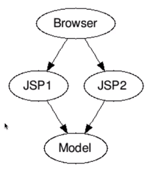
   - 특징 : 모든 코드가 View에 담겨있었다. (JSP안에서 모든 로직 처리)
     - View 로직 : HTML, CSS, JavaScript 등의 프레젠테이션 로직.
     - Flow 로직 : 애플리케이션의 흐름을 제어하는 제어문, 조건문, 반복문 등.
     - 데이터베이스 쿼리 : 데이터베이스와의 상호작용을 위한 SQL 쿼리.
   - 예시
        ```Html
        <%@ page import="java.sql.*" %>
        <html>
        <head>
            <title>예제 페이지</title>
        </head>
        <body>
            <%
                // 데이터베이스 연결
                String url = "jdbc:mysql://localhost:3306/mydb";
                String user = "user";
                String password = "password";
                Connection conn = DriverManager.getConnection(url, user, password);
                
                // 쿼리 실행
                Statement stmt = conn.createStatement();
                ResultSet rs = stmt.executeQuery("SELECT * FROM my_table");
        
                // 결과 출력
                while (rs.next()) {
                    out.println("<p>" + rs.getString("column_name") + "</p>");
                }
        
                // 연결 닫기
                rs.close();
                stmt.close();
                conn.close();
            %>
        </body>
        </html>
        ```
   - 문제점
     - 유지보수성 저하
     - 재사용성 부족
     - 테스트 어려움
     - 보안 문제


2. Modle 2 아키텍처

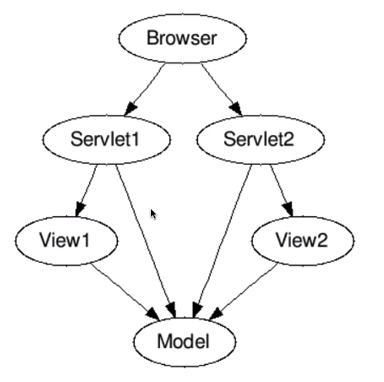
- 특징 : 역할이 구분됨
  - Model : View를 생성하는 데 사용하는 데이터 (DB 등에서 데이터를 받아옴)
  - View : 사용자에게 보여지는 영역
  - Controller(or Servlet) : 전체 흐름 제어
- 장점
  - 로직이 역할별로 구분되어 있음
  - 유지보수의 유연성
- 문제점 : 공통 기능을 모든 컨트롤러에 걸쳐 구현하는 방법은?
  - 인증과 같이 필수적인 코드가 모든 컨트롤러에서 중복해서 발생함


3. Modle 2 아키텍처 - 프론트 컨트롤러(Front Controller) 패턴

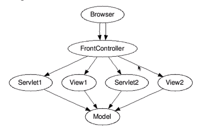
- 특징 : 브라우저에서 오는 모든 요청을 단 하나의 프론트 컨트롤러로 처리
  - ex) 보안 인증이 구현된 프론트 컨트롤러에서 먼저 보안을 검사한 후 적절한 컨트롤러에 요청을 재전달(하청)
- 역할
  - 프론트 컨트롤러 (Front Controller): 모든 요청을 수신하고, 요청을 처리하거나 다른 컨트롤러로 분기하는 중앙 집중화된 컨트롤러.
  - 디스패처 (Dispatcher): 프론트 컨트롤러가 요청을 적절한 핸들러(컨트롤러, 뷰 등)로 전달하는 역할.
  - 핸들러/컨트롤러 (Handler/Controller): 특정 요청을 처리하는 개별 컨트롤러.
  - 뷰 (View): 사용자에게 보여지는 영역
  - 모델 (Model): 데이터와 비즈니스 로직을 처리.

#### Spring MVC 프론트 컨트롤러 - 디스패처 서블릿 (Dispatcher Servlet)
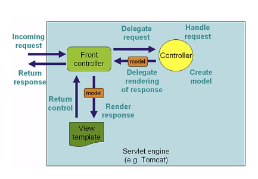
- 디스패처 서블릿 : Spring MVC에서 구현한 Front Controller 구현체 (스프링 부트로 애플리케이션을 실행하면 자동으로 일한다.)
  - 프론트 컨트롤러의 역할을 수행한다.
- HTTP 요청 처리 과정
  1. 모든 요청은 디스패처 서블릿이 가장 먼저 받게된다.
  2. URL이 무엇인지 식별한다. (예시 URL : localhost:8080/login)
  3. 요청을 처리할 수 있는 Controller의 메서드를 식별한다. ([LoginController::goToLoginPage()](..%2F00_module%2Fmyfirstwebapp%2Fsrc%2Fmain%2Fjava%2Fcom%2Fin28minutes%2Fspringboot%2Fmyfirstwebapp%2Flogin%2FLoginController.java))
  4. Controller에 요청을 전달한다.
  5. Controller의 메서드가 실행된다. (LoginController::goToLoginPage() 기준)
  6. Model과 View의 이름을 리턴한다.
  7. 디스패처 서블릿이 View의 이름에 맞는 적절한 View 를 매핑한다 ([login.jsp](..%2F00_module%2Fmyfirstwebapp%2Fsrc%2Fmain%2Fresources%2FMETA-INF%2Fresources%2FWEB-INF%2Fjsp%2Flogin.jsp))
     - 이 과정에서 디스패처 서블릿은 뷰 리졸버(View Resolver)를 사용하여 뷰 이름을 실제 뷰로 변환한다.
       - 뷰 리졸버 : 트롤러가 반환한 뷰 이름을 실제 뷰로 변환해주는 컴포넌트
  8. 뷰 리졸버가 `login.jsp`를 찾아서 뷰를 반환한다.
  9. 디스패처 서블릿이 해당 뷰를 사용하여 클라이언트에게 응답을 렌더링한다.
  10. `login.jsp`

---

## 11단계 - 로그인 양식 만들기

#### 실습
1. JSP에 form 추가
    ```HTML
        <form>
            이름: <input type="text" name="name">
            비밀번호: <input type="password" name="password">
            <input type="submit">
        </form>
    ```
2. form 확인
   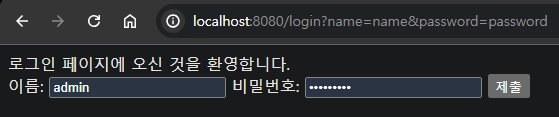
   - 입력란을 채운 후 '제출'을 누르면 url의 파라미터에 입력한 정보가 입력된다. (보안이슈)
     - 인터넷엔 수 많은 '라우터'가 있고 라우터는 url을 볼 수 있다.
3. `<form method="post">`
   - `form`에 `method`를 `post`로 지정해서 입력 데이터를 숨길 수 있다.

---

## 12단계 - 모델로 JSP에 로그인 자격증명 표시하기

로그인 페이지에서 자격증명을 입력하면 환영 페이지로 리다이렉션 실습을 할 것이다.

브라우저에서 `/login` 엔드포인트에 처음 접근할 때는 GET 메서드를 사용한다. 자격 증명을 입력한 후 '제출'을 클릭하면 페이지가 새로고침 되는데, 사실 해당 페이지는 POST 응답을 받은 것이다. (개발자 도구 네트워크 탭에서 POST 요청임을 확인 가능함) 

즉, `LoginController::goToLoginPage()`은 GET 과 POST 를 동시에 처리하고 있는 것이다. 

#### Welcome 페이지 작성
([welcome.jsp](..%2F00_module%2Fmyfirstwebapp%2Fsrc%2Fmain%2Fresources%2FMETA-INF%2Fresources%2FWEB-INF%2Fjsp%2Fwelcome.jsp))

#### `/login` 엔드포인트가 GET 요청만 처리하도록 만들기
브라우저에서 `/login` 엔드포인트에 처음 접근할 때는 GET 메서드를 사용한다. 자격 증명을 입력한 후 '제출'을 클릭하면 페이지가 새로고침 되는데, 사실 해당 페이지는 POST 응답을 받은 것이다.(개발자 도구 네트워크 탭에서 POST 요청임을 확인 가능함)

즉, `LoginController::goToLoginPage()`은 GET 과 POST 를 동시에 처리하고 있는 것이다.

```java
public class LoginController {
 @RequestMapping(value = "login", method = RequestMethod.GET)
 public String goToLoginPage() {
     return "login";
 }
}
```
- `method = RequestMethod.GET` 파라미터를 부여해서 처리 가능하다. (파라미터가 두 개가 되었기 때문에 생략되던 value도 명시 필요.)

#### POST 메서드 추가
앞선 순서까지 진행하고 `/login` 페이지에서 form 을 제출하면, 405 에러가 발생한다. (POST 처리할 수 있는 메서드가 없기 때문)

```java
public class LoginController {
    @RequestMapping(value = "login", method = RequestMethod.POST)
    public String goToWelcomePage() {
        return "welcome";
    }
}
```

POST 메서드를 추가하고 만들어 놓은 `welcome` 페이지를 리턴한다.

#### RequestParam : 사용자가 입력한 데이터 받기
```java
@Controller
public class LoginController {
	@RequestMapping(value = "login", method = RequestMethod.POST)
	public String goToWelcomePage(@RequestParam String name, @RequestParam String password, ModelMap models) {
		models.addAttribute("name", name);
		models.addAttribute("password", password);

		return "welcome";
	}
}
```
- `@RequestParam` 어노테이션을 파라미터에 부여해서 사용자 입력 데이터를 잡을 수 있다.

---

## 13단계 - 하드코딩된 사용자 ID 및 패스워드 검증 추가하기

간단한 인증을 실습하기 위헤서 아래의 조건으로 이름과 패스워드를 입력한 사용자만 웰컴페이지로 이동 시킬 것이다.

이름 : SpringBootJSP, 
패스워드 : ILoveSpring

#### AuthenticationService 추가
[단일 책임 원칙](https://ko.wikipedia.org/wiki/%EB%8B%A8%EC%9D%BC_%EC%B1%85%EC%9E%84_%EC%9B%90%EC%B9%99)에 따라 인증을 담당하는 클래스를 따로 선언한다.
```java
@Service
public class AuthenticationService {
	public static boolean authenticate(String username, String password) {
		boolean isValidUserName = username.equals("SpringBootJSP");
		boolean isValidPassword = password.equalsIgnoreCase("ILoveSpring");

		return isValidUserName && isValidPassword;
	}
}
```
- 간단하게 정해진 `username` 과 `password`를 검증하는 메서드를 작성했다.
- 패스워드의 대소문자는 구분하지 않기 위해 `equalsIgnoreCase`를 사용했다.
- `@Service` 어노테이션을 부여해서 컴포넌트로 등록한다.

#### 컨트롤러에 연결
```java
@Controller
public class LoginController {
	private AuthenticationService authenticationService;

	public LoginController(AuthenticationService authenticationService) {
		this.authenticationService = authenticationService;
	}
	
	//...(생략)
	
	@RequestMapping(value = "login", method = RequestMethod.POST)
	public String goToWelcomePage(@RequestParam String name, @RequestParam String password, ModelMap models) {
		if(authenticationService.authenticate(name, password)) {
			models.addAttribute("name", name);
			return "welcome";
		}
		return "login";
	}
}
```
- `AuthenticationService` 를 필드로 선언한다.
- 생성자 주입을 사용하기 위해 `AuthenticationService`를 초기화하는 생성자를 선언한다.
- `goToWelcomePage()`에 검증 로직을 작성한다.

#### 오류 메시지 추가
```java
public class LoginController {
	@RequestMapping(value = "login", method = RequestMethod.POST)
	public String goToWelcomePage(@RequestParam String name, @RequestParam String password, ModelMap models) {
		if(authenticationService.authenticate(name, password)) {
			models.addAttribute("name", name);
			return "welcome";
		}

		models.put("errorMessage", "유효하지 않은 자격증명 입니다.");
		return "login";
	}
}
```
- `ModelMap`에 원하는 커스텀 데이터를 입력하는 것이 가능하다.
```html
<body>
    로그인 페이지에 오신 것을 환영합니다.
    <form method="post">
        이름: <input type="text" name="name">
        비밀번호: <input type="password" name="password">
        <input type="submit">
    </form>
    <pre>${errorMessage}</pre>
</body>
```
- ${errorMessage}로 사용할 수 있으며 해당 값이 없을 경우 무시된다.

---

## 14단계 - Todo 기능 만들기 시작 - Todo와 TodoService 만들기

!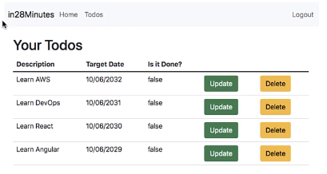

Todo 관리를 할 수 있는 Todo 애플리케이션을 만들려고 한다.

#### 기능
- Todo 생성 (설명, 목표 날짜, 완료 여부를 저장)
- Todo 업데이트
- Todo 삭제

#### Model 작성 ([Todo.java](..%2F00_module%2Fmyfirstwebapp%2Fsrc%2Fmain%2Fjava%2Fcom%2Fin28minutes%2Fspringboot%2Fmyfirstwebapp%2Ftodo%2FTodo.java))
- 필요한 필드
    - id
    - 작성자 (username)
    - 설명 (description)
    - 목표 일자 (targetDate)
    - 완료 여부 (done)

#### 정적 Todo List 생성 실습
```java
@Service
public class TodoService {

	private static List<Todo> todos;

	static {
		todos.add(new Todo(1, "EH13", "스프링부트 3 강의 완강하기", LocalDate.now().plusMonths(1), false));
		todos.add(new Todo(2, "EH13", "도커, 쿠버네티스 강의 완강하기", LocalDate.now().plusMonths(2), false));
		todos.add(new Todo(3, "EH13", "사이드 프로젝트 완성 하기", LocalDate.now().plusMonths(4), false));
	}

	public List<Todo> findByUsername(String username) {
		return todos;
	}
}
```
- 실습을 위해 정적 Todo를 작성했다.

---

## 15단계 - Todo 리스트 페이지 처음 만들기

#### Controller 작성
```java
@Controller
public class TodoController {
	private TodoService todoService;

	public TodoController(TodoService todoService) {
		this.todoService = todoService;
	}

	@RequestMapping("list-todos")
	public String listAllTodos(ModelMap models) {
		models.put("todos", todoService.findByUsername("EH13"));
		return "listTodos";
	}
}
```
- 생성자 주입으로 `TodoService`를 사용할 수 있다.
- `models.put("todos", todoService.findByUsername("EH13"));` 으로 `TodoService`에서 작성한 정적 Todos를 사용할 수 있다.

#### listTodos.jsp 작성 
[listTodos.jsp](..%2F00_module%2Fmyfirstwebapp%2Fsrc%2Fmain%2Fresources%2FMETA-INF%2Fresources%2FWEB-INF%2Fjsp%2FlistTodos.jsp)

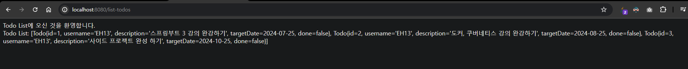

---

## 16단계 - 세션, 모델, 요청 이해하기 - @SessionAttributes

#### 요청 (Request)

- 요청에서 쓰인 payload 데이터는 해당 요청 안에서만 유효하다 (페이지를 이동하면 해당 페이지에서는 요청이 무효화 된다.)

#### 모델 (Model)
- 요청에 응답한 모델 역시 해당 요청 안에서만 유효하다. (페이지를 이동하면 사용할 수 없다.)
  - `login.jsp` 에서 응답한 `name` 모델을 `listTodos.jsp`에서 사용할 수 없다. 

#### 세션 (Session)
값을 여러 요청에 걸쳐 사용하기 위해선 세션이 필요하다.

- @SessionAttribute
    ```java
    @SessionAttributes("name")
    public class LoginController { }
    
    @SessionAttributes("name")
    public class TodoController { }
    ```
    - 값 공유를 원하는 모든 컨트롤러에 `@SessionAttributes` 어노테이션을 적용한다.

---

## 17단계 - Spring Boot 프로젝트에 JSTL을 추가하고 Todos를 테이블에 표시하기


페이지에서 응답하고 있는 데이터 값의 가독성이 좋지 않다. 이를 개선해보자.

#### JSTL 태그
```html
<div>Todo List: ${todos}</div>
```
Todo 리스트의 데이터는 `${todos}`를 사용해서 노출하고 있다. `${}` 처럼 사용하는 문법을 '표현언어'라고 한다.

하지만 `todos` 데이터는 표현언어로 사용하기에 적절하지 않다. `todos`를 테이블에 나열해서 가독성을 좋게 만들기 위해서 JSTL 태그를 사용할 수 있다.

1. 라이브러리 추가
    ```xml
    <dependencies>
        <dependency>
            <groupId>jakarta.servlet.jsp.jstl</groupId>
            <artifactId>jakarta.servlet.jsp.jstl-api</artifactId>
        </dependency>
        <dependency>
            <groupId>org.eclipse.jetty</groupId>
            <artifactId>glassfish-jstl</artifactId>
            <version>11.0.21</version>
        </dependency>
    </dependencies>
    ```
    - jakarta.servlet.jsp.jstl-api : JSTL API 라이브러리
    - glassfish-jstl : JSTL 구현체 라이브러리
      - 버전 명시를 하지 않으면 메이븐에서 라이브러리를 불러오지 못했음.
2. JSP에서 JSTL 임포트 ([JSTL core](https://docs.oracle.com/javaee/5/jstl/1.1/docs/tlddocs/c/tld-summary.html) 참고)
    ```html
    <%@ taglib prefix="c" uri="http://java.sun.com/jsp/jstl/core" %>
    ```    
    - JSTL core 에서 사용 가능한 태그를 확인 할 수 있다. 
    - `prefix="c"` : JSTL 태그를 사용하기 위한 이름 ex) `c:forEach`로 사용 가능
3. JSP에서 JSTL 태그 사용해서 테이블에 TodoList 넣기
    ```html
    <table>
        <thead>
            <tr>
                <th>id</th>
                <th>설명</th>
                <th>목표 일시</th>
                <th>완료 여부</th>
            </tr>
        </thead>
        <tbody>
            <c:forEach items="${todos}" var="todo">
                <tr>
                    <td>${todo.id}</td>
                    <td>${todo.description}</td>
                    <td>${todo.targetDate}</td>
                    <td>${todo.done}</td>
                </tr>
            </c:forEach>
        </tbody>
    </table>
    ```
    - `c:forEach` 태그 안에서 `${todos}`의 데이터를 사용할 수 있다.
    - `items` : 사용할 Model의 이름
    - `var="todo"` : 반복문 동안 todos의 각 인덱스
    - `${todo.id}` 방식으로 세부 데이터에 접근이 가능하다.
4. 확인하기

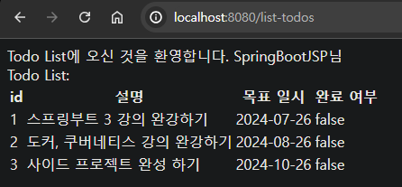

---

## 18단계 - webjars를 사용하여 Bootstrap CSS 프레임워크를 Spring Boot 프로젝트에 추가하기

#### Bootstrap 
- CSS 프레임워크
  - CSS(Cascading Style Sheets) : HTML을 꾸밀 때 사용하는 스타일 시트

#### webjars
- 클라이언트 측 라이브러리(예: JavaScript, CSS 등)를 관리하고 제공하기 위한 패키지 포맷
- 부트스트랩을 자동 관리할 수 있다.

#### webjars 사용하기
1. 라이브러리 추가
    ```xml
    <dependencies>
        <dependency>
            <groupId>org.webjars</groupId>
            <artifactId>bootstrap</artifactId>
            <version>5.1.3</version>
        </dependency>
        <dependency>
            <groupId>org.webjars</groupId>
            <artifactId>jquery</artifactId>
            <version>3.6.0</version>
        </dependency>
    </dependencies>
    ```
    - webjars를 통해 bootstrap과 jquery를 불러온다.
     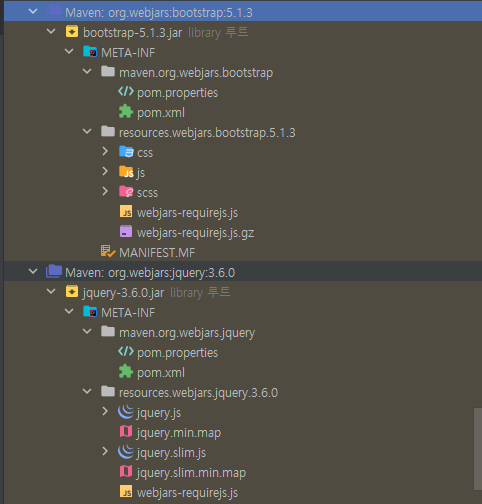
2. JSP에 추가하기
    ```html
    <head>
        <link href="webjars/bootstrap/5.1.3/css/bootstrap.min.css" rel="stylesheet">
        <!--...(생략)-->
    </head>
    <!--...(생략)-->
    <body>
        <!--...(생략)-->
        <script src="webjars/bootstrap/5.1.3/js/bootstrap.min.js"></script>
        <script src="webjars/jquery/3.6.0/jquery.min.js"></script>
    </body>
    ```
    - CSS 파일은 head 태그의 맨 앞에 위치한다.
    - js 파일은 body 태그의 맨 뒤에 위치한다.
3. 적용 확인
   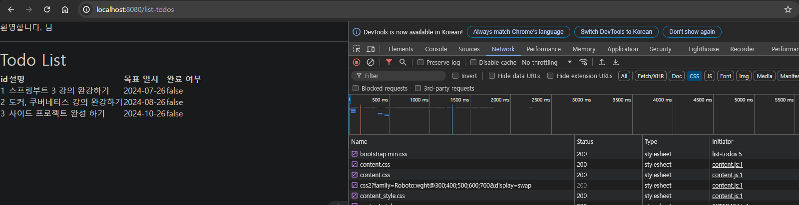

---

## 19단계 - Bootstrap CSS 프레임워크로 JSP 페이지 포맷 만들기

#### `<div class="container">`
- Bootstrap에서 레이아웃을 잡기 위해 사용되는 기본적인 클래스 중 하나 

#### class
- HTML의 구분자를 줘서 CSS에서 이를 활용할 수 있다.
- Bootstrap은 유용한 CSS를 미리 작성한 후 class에 연결시켜놓았다.
    - 지정한 class를 입력하는 것으로 Bootstrap이 작성한 CSS를 적용할 수 있다.
- 적용된 모습 
  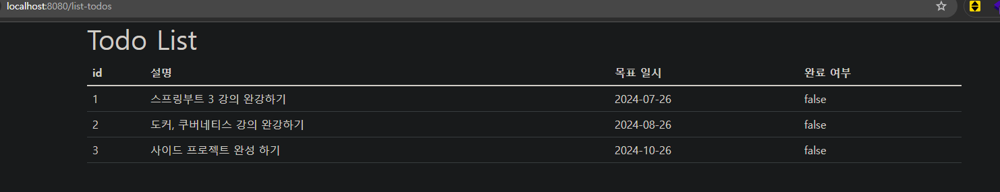
  - table 태그에 class="table"만 추가해도 그럴듯한 CSS의 테이블을 볼 수 있다. 

---

## 20단계 - Todo 추가하기 - 새로운 뷰 만들기

#### Todo 추가 기능 구현
1. Todo 추가 버튼 구현
    ```html
    <a href="add-todo" class="btn btn-success">Todo 추가</a>
    ```
    - `/add-todo` 엔드포인트로 이동하는 Todo 추가 버튼을 구현 (a 태그지만 부트스트랩 클래스로 버튼처럼 보이도록 함)
2. 컨트롤러 연결
    ```java
    public class TodoController {
        @RequestMapping(value = "add-todo" , method = RequestMethod.GET)
        public String showNewTodoPage() {
            return "todo";
        }
    }
    ```
3. `todo.jsp` 작성
4. POST API 작성
    ```java
    public class TodoController {
        @RequestMapping(value = "add-todo", method = RequestMethod.POST)
        public String addNewTodo() {
            return "redirect:list-todos";
        }
    }
    ```
    - 리턴 값으로 `redirect:{엔드포인트}`를 줘서 리다이렉트 할 수 있다.
      - JSP로 줄 경우 기존 `listAllTodos()`에서 사용하던 Model을 다시 작성해야 하기 때문에 작성된 엔드포인트로 이동하는 것이 더 유리하다.

---

## 21단계 - Todo를 추가하기 위해 TodoService 개선하기

#### Todo 추가 서비스 로직 구현
1. `TodoService` 개선
    ```java
    @Service
    public class TodoService {
	    //...(생략)
        private static int todoCount = 0;

	    //...(생략)
        public void addTodo(String username, String description, LocalDate targetDate, boolean done) {
            todos.add(new Todo(++todoCount, username, description, targetDate, done));
        }
    }
    ```
    - addTodo() 메서드를 사용해서 사용자가 입력한 값을 Todo로 등록시킬 것이다.
    - todoCount를 0으로 선언 후 `++todoCount` id를 자동으로 증가시키고 있다.
      - 흥미로운 방법이지만 삭제 로직이 추가되면 중복 id가 발생할 수 있다.
2. 컨트롤러 연결
    ```java
    @SessionAttributes("name")
    public class TodoController {
        //...(생략)
        @RequestMapping(value = "add-todo" , method = RequestMethod.POST)
        public String addNewTodo(@RequestParam String description, ModelMap models) {
            String username = (String) models.get("name");
            todoService.addTodo(username, description, LocalDate.now().plusDays(1), false);
            return "redirect:list-todos";
        }
    }
    ```
    - `@RequestParam` 을 사용해서 `description`을 받는다
    - `@SessionAttributes("name")`이 있기 때문에 `models.get("name")`으로 이름도 받을 수 있다.

---

## 22단계 - Spring Boot Starter Validation을 이용하여 검증 추가하기

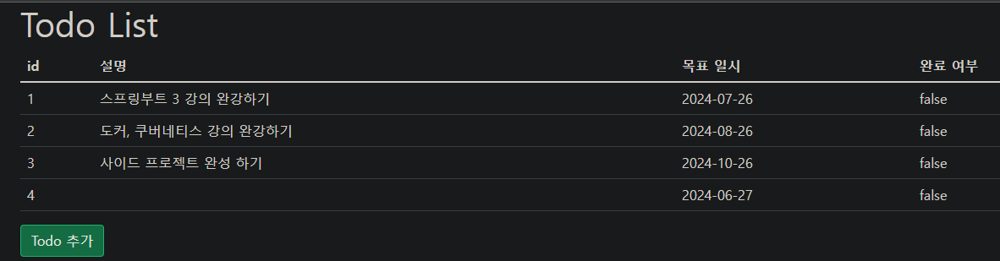
현재 Todo는 아무런 값을 입력하지 않아도 검증 없이 빈 값으로 만들어진다. 검증을 추가할 필요가 있다.

#### 프론트엔드 검증
```html
설명: <input type="text" name="description" required="required">
```
- 태그에 required 속성을 부여하는 것으로 빈 값 입력을 방지할 수 있다.
    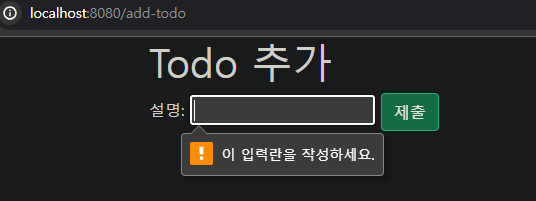

- 주의 : Html이나 JS 검증은 건너뛰기가 비교적 쉽기 때문에 서버측 추가 검증이 필요하다. 

#### Spring Boot를 사용해서 밸리데이션 하기 : 
1. 검증 라이브러리 추가
2. 커맨드 빈 (Command Vean) | 양식 보조 객체 (Form Backing Object) 사용하기
    - 양방향 바인딩 (2-way binding) 구현
3. `Todo.java` Bean에 검증 추가하기
4. 검증 오류를 `todo.jsp` View에 표시하기


#### 1. 검증 라이브러리 추가
- spring-boot-starter-validation : Spring Boot가 제공하는 밸리데이션 스타터 라이브러리
     ```xml
     <dependency>
         <groupId>org.springframework.boot</groupId>
         <artifactId>spring-boot-starter-validation</artifactId>
     </dependency>
     ```

#### 2.커맨드 빈 (Command Vean) | 양식 보조 객체 (Form Backing Object)
`TodoController::addNewTodo()` 에서는 사용자 입력 값을 `@RequestParam` 받고 있다. 그런데 사용자 입력 값이 아주 많아지면 어떻게 해야 할까? 모든 필드를 파라미터로 추가하는 대신에 `Todo` Bean에 직접 바인딩(연결) 하는 것이 가능하다.

1. `addNewTodo()`에서 양식 보조 객체 사용
    ```java
    //...(생략)
    @SessionAttributes("name")
    public class TodoController {
        //...(생략)
        @RequestMapping(value = "add-todo" , method = RequestMethod.POST)
        public String addNewTodo(ModelMap models, Todo todo) {
            String username = (String) models.get("name");
            todoService.addTodo(username, todo.getDescription(), LocalDate.now().plusDays(1), false);
            return "redirect:list-todos";
        }
    }
    ```
    - `Todo` 객체를 직접 파라미터로 받는다.
    - `todo.getDescription()`를 사용해서 `description` 값을 가져올 수 있다.
2. `todo.jsp`에서 양식 보조 객체 사용 (양방향 바인딩 구현)
- JSP에 태그 추가
    [Spring Reference](https://docs.spring.io/spring-framework/docs/3.2.x/spring-framework-reference/html/view.html#view-jsp-formtaglib) 참고
    ```html
    <%@ taglib prefix="form" uri="http://www.springframework.org/tags/form" %>
    <!-- ...(생략)    -->
    <form:form method="post" modelAttribute="todo">
        <form:input type="hidden" path="id" required="required" />
        <form:input type="hidden" path="done" required="required" />
        목표: <form:input type="text" path="description" required="required" />
        <input type="submit" class="btn btn-success" />
    </form:form>
    ```
    - `modelAttribute` 속성을 통해 사용할 Bean 객체를 지정한다.
    - id, done에 null 값이 들어가지 않도록 input을 추가해준다.
- showNewTodoPage() 연결
    ```java
    //...(생략)
    public class TodoController {
	    //...(생략)
        @RequestMapping(value = "add-todo" , method = RequestMethod.GET)
        public String showNewTodoPage(ModelMap models) {
            String username = (String) models.get("name");
            Todo todo = new Todo(0, username, "", LocalDate.now().plusDays(1), false);
            models.put("todo", todo);
            return "todo";
        }
    }
    ```
    - `new Todo`를 사용해서 초기값을 가진 객체를 생성한다.
      - 사용자가 값을 입력하면 초기값을 대체한다. (입력되지 않은 값에 대한 초기화)
    - 해당 메서드에서 `addNewTodo()` 메서드로 객체를 전달하기 때문에 id를 0으로 설정해도 `addNewTodo()` 내부에서 `todoService`가 일을 한다.

---

## 23단계 - 커맨드 빈으로 새 Todo 페이지 검증 구현하기

#### 단방향 바인딩 vs 양방향 바인딩
- 단방향 바인딩 : 데이터가 한 방향으로만 흐르는 경우를 의미. 즉, 데이터 소스에서 뷰로만 데이터가 전달되고, 뷰에서 데이터 소스로는 데이터가 전달되지 않는 경우
    ```java
    //...(생략)
    @SessionAttributes("name")
    public class TodoController {
        //...(생략)
        @RequestMapping(value = "add-todo", method = RequestMethod.GET)
        public String showNewTodoPage(ModelMap models) {
            String username = (String) models.get("name");
            Todo todo = new Todo(0, username, "여기에 디폴트 값을 입력합니다.", LocalDate.now().plusDays(1), false);
            models.put("todo", todo);
            return "todo";
        }
    }
    ```
    - `Todo` 인스턴스의 `description`을 특정한 값으로 지정한 후 애플리케이션을 실행해서 페이지를 살펴보면 초기값이 들어있는 것을 볼 수 있다.
    - 이것을 단방향 바인딩이라고 부른다. (`addNewTodo()` 에서 바인딩을 하고 있다는 전제가 필요.)
      - `showNewTodoPage()`의 코드만 봤을 때는 단방향 바인딩 보다는 "모델-뷰 데이터 전달"에 가깝다.
- 양방향 바인딩 
  - `todo.jsp`에서 POST 요청을 통해 값을 입력하고 submit을 하면 해당 입력 데이터가  `listTodos.jsp`에 반영된다. 
  - `todo.jsp` 로 시작해서 `addNewTodo()` 메서드를 거쳐 `listTodos.jsp`에 전달되는 과정을 양방향 바인딩이라고 한다.

#### Bean 검증 추가
```java
import jakarta.validation.constraints.Size;
//...(생략)
public class Todo {
	//...(생략)
	@Size(min = 3, message = "목표는 3글자 이상 적어주세요")
	private String description;
}
```
- `jakarta.validation.constraints` 에서 밸리데이션 어노테이션을 사용할 수 있다.
- [공식 문서](https://jakarta.ee/specifications/bean-validation/3.0/apidocs/jakarta/validation/constraints/package-summary)를 통해 사용가능한 기능을 확인할 수 있다.

```java
import jakarta.validation.Valid;
//...(생략)
@SessionAttributes("name")
public class TodoController {
	//...(생략)
	@RequestMapping(value = "add-todo", method = RequestMethod.POST)
	public String addNewTodo(ModelMap models, @Valid Todo todo) {
		String username = (String) models.get("name");
		todoService.addTodo(username, todo.getDescription(), LocalDate.now().plusDays(1), false);
		return "redirect:list-todos";
	}
}
```
- 바인딩 된 객체 앞에 `@Valid` 어노테이션을 부여해서 밸리데이션 검증을 활성화 할 수 있다.
  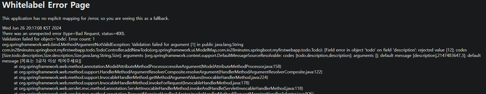

#### 검증 오류 View 노출
앞선 밸리데이션 검증은 동작은 잘 하지만 Server 에러를 노출한다. 사용자에게 보여주기에는 적절하지 않으니 View 노출을 개선해야 한다.
```java
import org.springframework.validation.BindingResult;
//...(생략)
@SessionAttributes("name")
public class TodoController {
	//...(생략)
	@RequestMapping(value = "add-todo" , method = RequestMethod.POST)
	public String addNewTodo(ModelMap models, @Valid Todo todo, BindingResult result) {
		if(result.hasErrors()) {
			return "todo";
		}
		String username = (String) models.get("name");
		todoService.addTodo(username, todo.getDescription(), LocalDate.now().plusDays(1), false);
		return "redirect:list-todos";
	}
}
``` 
- `BindingResult::hasErrors()` 메서드를 통해서 에러를 캐치할 수 있다. 에러가 발생할 경우 `todo.jsp`에 머물도록 해야 한다.
```html
목표: <form:input type="text" path="description" required="required" />
<form:errors path="description" cssClass="text-warning"/>
```
- `form:errors` 태그를 사용해서 `description` 필드의 검증 메시지를 노출할 수 있다.
  - `form:errors`는 HTML이 아닌 자바 코드이기 때문에 `cssClass`로 css 클래스를 지정해야 한다.

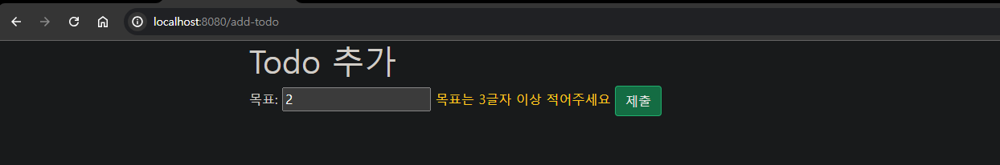

---

## 24단계 - Todo 삭제 기능 구현하기 - 새로운 뷰

#### 삭제 버튼 추가 (View)
```html
<td><a href="delete-todo?id=${todo.id}" class="btn btn-warning">삭제</a></td>
```
- url 뒤에 `id=${todo.id}` 으로 id 값을 파람으로 넘겨준다.
#### 삭제 로직 추가 (Service)
```java
//...(생략)
@Service
public class TodoService {
    //...(생략)
	public void deleteById(int id) {
		todos.removeIf(todo -> todo.getId() == id);
	}
}
```
#### API 작성 (Controller)
```java
//...(생략)
@Controller
public class TodoController {
	private TodoService todoService;

	//...(생략)
	@RequestMapping("delete-todo")
	public String deleteTodos(@RequestParam int id) {
		todoService.deleteById(id);
		return "redirect:list-todos";
	}
}
```

---

## 25단계 - Todo 업데이트 구현하기 - 1 - Todo 업데이트 페이지 표시하기

1. `listTodos.jsp` 수정 버튼 추가
2. `TodoService` Id가 일치하는 Todo 객체 리턴 메서드 추가
3. `TodoController` Todo 수정 API 추가

컨트롤러까지 연결해도 Todo의 수정은 반영되지 않는다.

---

## 26단계 - Todo 업데이트 구현하기 - 1 - Todo 변경사항 저장

#### 컨트롤러 분리
```java
public class TodoController {
	@RequestMapping(value = "update-todo", method = RequestMethod.GET)
	public String showUpdateTodoPage(@RequestParam int id, ModelMap models) {
		Todo todo = todoService.findById(id);
		models.addAttribute("todo", todo);
		return "todo";
	}

	@RequestMapping(value = "update-todo", method = RequestMethod.POST)
	public String updateTodo(@Valid Todo todo, BindingResult result) {
		if (result.hasErrors()) {
			return "todo";
		}
		todoService.updateTodo(todo);
		return "redirect:list-todos";
	}
}
```
- GET 과 POST로 API를 분리해야 한다.

#### Todo 수정 로직 작성
```java
public class TodoService {
	public void updateTodo(Todo todo) {
		deleteById(todo.getId());
		todos.add(todo);
	}
}

```

여기까지 진행하면 Todo 수정이 가능하다. 그러나 2가지 문제점이 나타난다.
1. 수정된 Todo는 id값이 낮아도 테이블 리스트의 맨 아래로 내려간다. (Todo를 삭제 후 다시 생성하기 때문에 인덱스가 최신화 됨)
2. `목표 일시`가 사라진다. (목표 일시를 작성하는 form input이 없기 때문에 빈 값으로 초기화 됨)

#### Todo 수정 로직 작성 (개인 코드)
```java
public class TodoService {
	public void updateTodo(Todo todo) {
		todos.forEach(originalTodo -> {
			if (originalTodo.getId() == todo.getId()) {
				originalTodo.setUsername(todo.getUsername());
				originalTodo.setDescription(todo.getDescription());
				originalTodo.setTargetDate(todo.getTargetDate());
				originalTodo.setDone(todo.isDone());
			}
		});
	}
}
```
- Todo 순서는 해결되었으나 여전히 목표 일시는 사라진다. (강의 진행을 위해 커밋은 강의 코드로 진행함)
  - 값이 존재하지 않을 시 기존 값으로 유지 하도록 예외처리 가능
---

## 27단계 - Todo 페이지에 목표 날짜 추가하기

#### 목표 일자 구현
```html
<fieldset class="m-3">
    <form:label path="targetDate">목표 일자</form:label>
    <form:input type="text" path="targetDate" required="required" />
    <form:errors path="targetDate" cssClass="text-warning"/>
</fieldset>
```
- `path="targetDate"`을 지정해서 목표일자 input 필드를 추가한다.
- 필요에 따라 컨트롤러, view 파일을 리팩토링 한다.
- 날짜 포맷 : `spring.mvc.format.date=yyyy-MM-dd`

#### Bootstrap Datepicker (날짜 선택기 플러그인)
- 라이브러리 설치
    ```xml
    <dependency>
        <groupId>org.webjars</groupId>
        <artifactId>bootstrap-datepicker</artifactId>
        <version>1.9.0</version>
    </dependency>
    ```
- JSP에 CSS, JS 불러오기
    ```html
    <link href="webjars/bootstrap-datepicker/1.9.0/css/bootstrap-datepicker.standalone.min.css" rel="stylesheet">
    <script src="webjars/bootstrap-datepicker/1.9.0/js/bootstrap-datepicker.min.js"></script>
    ```
- Datepicker 적용 : [bootstrap-datepicker](https://bootstrap-datepicker.readthedocs.io/en/latest/) 공식문서 참고
    ```html
    <script type="text/javascript">
      $('#datepicker').targetDate({
        format: 'yyyy-mm-dd',
      });
    </script>
    ```

- Datepicker 한글화 (추가 학습)
    ```html
    <script src="webjars/bootstrap-datepicker/1.9.0/locales/bootstrap-datepicker.ko.min.js"></script>
    <script type="text/javascript">
      $('#targetDate').datepicker({
        format: 'yyyy-mm-dd',
        language: 'ko',
        weekStart: 0,
        autoclose: true,
        todayHighlight: true,
      });
    </script>
    ```
    - weekStart : 달력 요일 시작 기준 (0은 일요일)
    - autoclose : 날짜 선택 후 자동으로 Datepicker가 닫힘
    - todayHighlight : 오늘 날짜를 가시적으로 하이라이트

---

## 28단계 - 내비게이션 바를 추가하고 JSP 프래그먼트 구현하기

#### 네비게이션 바 추가
- 코드스니펫
    ```html
    <nav class="navbar navbar-expand-md navbar-light bg-light mb-3 p-1">
        <a class="navbar-brand m-1" href="http://localhost:8080/">새싹 Todo</a>
        <div class="collapse navbar-collapse">
            <ul class="navbar-nav">
                <li class="nav-item"><a class="nav-link" href="/">Home</a></li>
                <li class="nav-item"><a class="nav-link" href="/list-todos">Todo 리스트</a></li>
            </ul>
        </div>
        <ul class="navbar-nav">
            <li class="nav-item"><a class="nav-link" href="/logout">로그아웃</a></li>
        </ul>
    </nav>
    ```

#### JSP 프래그먼트 (재사용 컴포넌트)
네비게이션 처럼 많은 페이지에 중복 작성되어야 하는 HTML이 있을 경우 JSP 프래그먼트를 만들어서 처리할 수 있다.

- `src/main/resources/META-INF/resources/WEB-INF/common` 경로에 JSP 프래그먼트 파일을 생성한다. (.jspf)
- `<%@ include file="common/navigation.jspf" %>` 해당 방식으로 불러올 수 있다. 
- jspf 파일도 UTF-8 인코딩에 대한 처리를 해주어야 한다.

---

## 29단계 - Spring Security 사용할 준비하기

#### 로그인 코드 변경
Spring Security 를 사용하기 위해서 기존의 로그인 관련 코드를 삭제했다. 

---

## 30단계 - Spring Boot Starter Security로 Spring Security 설정하기

#### 라이브러리 추가
```xml
<dependency>
    <groupId>org.springframework.boot</groupId>
    <artifactId>spring-boot-starter-security</artifactId>
</dependency>
```

#### 애플리케이션 실행 후 Spring Security 로그 확인
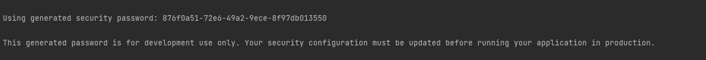
- 개발용으로만 사용 가능한 보안 패스워드 생성에 대한 안내를 로그에서 확인 할 수 있다.

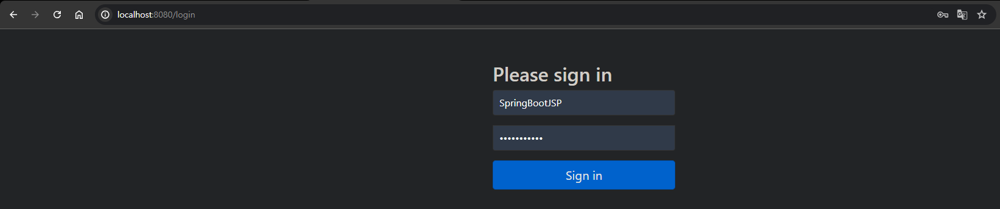
- 애플리케이션을 실행하면 모든 엔드포인트 접근을 막고, 자동으로 '/login' 으로 리다이렉트 된다. 
- ID에 'user' PW에 로그에 나타난 패스워드를 입력해서 인증이 가능하다. (애플리케이션 재시작 시 패스워드가 바뀐다.)

---

## 31단계 - 사용자 지정 유저와 패스워드 인코더를 이용하여 Spring Security 설정하기

#### InMemoryUserDetailsManager
데이터베이스 연결 없이 인메모리로 인증 구현을 할 수 있는 클래스

```java
@Configuration
public class SpringSecurityConfiguration {

	@Bean
	public InMemoryUserDetailsManager createUserDetailsManager() {
		return new InMemoryUserDetailsManager(
				User.withDefaultPasswordEncoder()
						.username("SpringBootJSP")
						.password("ILoveSpring")
						.roles("USER", "ADMIN")
						.build()
		);
	}
}
```
- 주의 : 해당 예제에서 사용한 `withDefaultPasswordEncoder()`는 도태된 기술이다.
- 이제 설정한 계정 정보로 인증이 가능하다.
- Spring Security에서는 로그인 뿐만 아니라 로그아웃('/logout')도 기본 제공한다.

#### PasswordEncoder 설정 (패스워드 암호화)
```java
@Configuration
public class SpringSecurityConfiguration {
	//...(생략)
	@Bean
	public PasswordEncoder passwordEncoder() {
		return new BCryptPasswordEncoder();
	}
}
```
- `PasswordEncoder`를 선언한 후 애플리케이션에서 인증을 진행하면 자격증명에 실패한다.
- `PasswordEncoder`에 의해 패스워드가 암호화가 되었기 때문에 `InMemoryUserDetailsManager`에서 리턴하는 유저도 암호화된 패스워드를 사용해야 한다.

#### 패스워드 인코딩
```java
@Configuration
public class SpringSecurityConfiguration {
	@Bean
	public InMemoryUserDetailsManager createUserDetailsManager() {
		return new InMemoryUserDetailsManager(
				User.builder()
						.passwordEncoder(passwordEncoder()::encode)
						.username("SpringBootJSP")
						.password("ILoveSpring")
						.roles("USER", "ADMIN")
						.build());
	}
	//...(생략)
}
```
- `withDefaultPasswordEncoder()`를 `builder()`로 대체했다.
- `passwordEncoder(passwordEncoder()::encode)` 를 사용해서 패스워드 인코딩을 진행한다.
  - `passwordEncoder()::encode` : 생략된 부분에 `passwordEncoder()`는 본질적으로 `BCryptPasswordEncoder`의 인스턴스를 리턴한다. 해당 인스터스의 `encode()` 함수를 사용한 것.
- 강의 코드
    ```java
    @Configuration
    public class SpringSecurityConfiguration {
        public InMemoryUserDetailsManager createUserDetailsManager(){
            Function<String, String> passwordEncoder
                    = input -> passwordEncoder().encode(input);
    
            return new InMemoryUserDetailsManager(
                    User.builder()
                            .passwordEncoder(passwordEncoder)
                            .username("SpringBootJSP")
                            .password("ILoveSpring")
                            .roles("USER", "ADMIN")
                            .build());
    
        }
    }
    ```
    - Function<String, String> 인터페이스를 이용하여 람다 표현식을 정의했다.
      - 동일한 코드이며, 코드 작성 스타일의 차이임 (내가 작성한 코드는 메서드 참조 방식이다.)
    - 진행에 영향을 주지 않을 것 같아서 강의 코드로 변경하진 않았다.
      - 강의 코드가 메서드 참조형 코드 보다 명시적이라는 장점이 있다.

---

## 32단계 - 하드코딩된 사용자 ID 삭제하고 리팩터링하기

#### Authentication 사용하기
스프링 시큐리티(Spring Security)에서 제공하는 인증 정보를 나타내는 인터페이스

```java
Authentication authentication = SecurityContextHolder.getContext().getAuthentication();
```
- SecurityContext : 보안 컨텍스트
- SecurityContextHolder : 현재 스레드에 관련된 보안 컨텍스트

#### 하드코딩된 username 개선하기
1. `WelcomeController::goToWelcomePage()` 개선
    ```java
    @SessionAttributes("name")
    public class WelcomeController {
    
        @RequestMapping(value = "/", method = RequestMethod.GET)
        public String goToWelcomePage(ModelMap models) {
            models.addAttribute("name", getLoggedinUserName());
            return "welcome";
        }
    
        private String getLoggedinUserName() {
            return SecurityContextHolder.getContext().getAuthentication().getName();
        }
    }
    ```
    - `SecurityContextHolder` 를 사용해 인증 객체의 name을 사용할 수 있다.

2. `TodoController`, `TodoService` 개선
    ```java
    @SessionAttributes("name")
    public class TodoController { }
    
    @Service
    public class TodoService {
        public List<Todo> findByUsername(String username) {
            return todos.stream()
                    .filter(todo -> todo.getUsername().equals(username))
                    .toList();
        }
    }
    ```
    - `@SessionAttributes("name")` 어노테이션으로 name 모델을 공유할 수 있다.
    - `TodoService::findByUsername()`을 개선한다. 

3. 문제점 및 해결

    애플리케이션을 실행해서 확인해보면 문제가 하나 있다. 웰컴 페이지('/')에서 '/todo-list' 페이지로 이동할 때는 name Model을 공유받으나, '/todo-list' 바로 접근하면 인증 객체로부터 name을 받을 수 없다.
    
    ```java
    public class TodoController {
        String username = getLoggendInUsername();
        
        private static String getLoggendInUsername() {
            return SecurityContextHolder.getContext().getAuthentication().getName();
        }
    }
    ```
    - `TodoController` 에서도 `getLoggendInUsername()`를 선언하여 해결 할 수 있다.
    - 중복된 코드는 강의가 진행됨에 따라 인증 객체를 관리하는 클래스를 만들어 개선할 것으로 예상된다.

---

## 33단계 - Todo 애플리케이션에 새로운 사용자 설정하기

#### 새로운 사용자 설정
```java
@Configuration
public class SpringSecurityConfiguration {

	@Bean
	public InMemoryUserDetailsManager createUserDetailsManager() {
		UserDetails userDetails1 = createNewUser("SpringBootJSP", "ILoveSpring");
		UserDetails userDetails2 = createNewUser("EH13", "backend");

		return new InMemoryUserDetailsManager(userDetails1, userDetails2);
	}
	//...생략
	public UserDetails createNewUser(String username, String password) {
		return User.builder()
				.passwordEncoder(passwordEncoder()::encode)
				.username(username)
				.password(password)
				.roles("USER", "ADMIN")
				.build();
	}
}
```
- `InMemoryUserDetailsManager`에 `UserDetails`을 인자로 여러 개 줄 수 있다.
    ```java
    package org.springframework.security.provisioning;
    public class InMemoryUserDetailsManager implements UserDetailsManager, UserDetailsPasswordService {
        public InMemoryUserDetailsManager(UserDetails... users) {
            for (UserDetails user : users) {
                createUser(user);
            }
        }
    }
    ```
    - `InMemoryUserDetailsManager` 생성자는 파라미터로 `UserDetails`의 '가변인자'를 받는다. 
      - 가변인자 : `타입... 변수명` 형태로 선언 : 여러 개의 인자를 쉼표로 구분해서 받을 수 있음 (내부적으로 배열 처리)
        - 가변 인자는 메서드에서 하나만 사용 가능하며, 반드시 마지막 위치에 있어야 한다.

#### InMemoryUserDetailsManager 에 대한 이해 (추가 학습)
- 사용자 정보를 메모리에 저장하는 객체
- 나중에 데이터 베이스로 이를 교체하게 된다.
- `UserDetails` 객체는 데이터 베이스의 유저 인증 관련 테이블이 될 것이다.

#### Spring Security 에 대한 이해 (추가 학습)
다음의 시나리오가 있다.
1. 100만 명의 User가 있는 DB와 연결된 애플리케이션이 있다.
2. 애플리케이션이 실행된다.
3. 유저가 로그인 한다.
4. 로그인을 했을 때 데이터 베이스에서 로그인 정보를 검증한다.
5. 검증이 성공하면, 인증 정보 (Authentication 객체)가 생성되고, 이를 SecurityContext에 설정한다.
6. 인증 정보를 유저에게 발행한다. (세션, jwt 등)
7. User는 API 요청 마다 인증 정보를 함께 제출해야 하며, 이를 Spring Security Context가 검증한 후 요청을 처리한다.
8. 이 때 100만명의 유저가 있다고 하더라도 Spring Security Context가 일하는 상황은 '로그인을 한 유저'에 제한된다.

#### SecurityContext 와 Authentication는 Bean이 아니다. (추가 학습)
- 범위(scope)
  - 주로 요청(Request) 또는 세션(Session) 범위에서만 유효함. 
  - 즉, 특정 사용자의 특정 세션이나 요청에 대해서만 유효한 정보를 담고 있다.
- 생성과 관리:
  - 사용자가 로그인할 때 생성되며, 현재 쓰레드의 SecurityContextHolder에 의해 관리된다. 
  - 특정 사용자와 관련된 정보이므로 전역적인 Bean으로 정의되지 않음.
- 스프링 컨텍스트와 구분되며, 스프링 시큐리티에서 별도로 구현한 것이다.
- SecurityContext는 스프링 시큐리티가 자체적으로 관리하므로 별도로 빈으로 관리할 필요가 없다.
  - 생성 및 초기화: 사용자가 로그인하면 스프링 시큐리티가 SecurityContext를 생성하고, Authentication 객체를 설정한다.
  - 전파: SecurityContext는 요청이 들어오는 동안 지속된다. 
    - HTTP 요청의 경우, 요청이 시작될 때 생성되고, 요청이 끝날 때 정리됨.
  - 저장 및 전파 전략: 기본적으로 ThreadLocal을 사용하여 현재 스레드에 SecurityContext를 저장한다. 
    - 필요에 따라 다른 저장 전략을 사용할 수도 있음. (예시 : InheritableThreadLocal -  자식 스레드가 부모 스레드의 SecurityContext를 상속)
  - 세션 관리: 웹 애플리케이션에서는 SecurityContext가 HTTP 세션에 저장되어 여러 요청 간에 지속될 수 있습니다.
    - 필요에 따라 다른 관리 전략을 사용할 수도 있음. (예시 : JWT)

#### SecurityContextHolder 이해 (추가 학습)
SecurityContext에서 설정한 인증 객체는 스프링 시큐리티 프레임워크를 통해 관리되며, 이를 통해 스프링 애플리케이션에서도 접근할 수 있다. 

이 과정에서 SecurityContextHolder가 중요한 역할을 한다.
- SecurityContextHolder는 SecurityContext를 저장하고 접근하는 데 사용되는 클래스이다.
- SecurityContext는 현재 스레드의 ThreadLocal에 저장된다. 
  - 이를 통해 애플리케이션의 어느 부분에서도 현재 인증된 사용자의 정보를 쉽게 조회할 수 있다.

---

## 34단계 - Spring Boot Starter Data JPA를 추가하고 H2 데이터베이스 준비하기

#### 라이브러리 추가
```xml
<dependencies>
  <dependency>
    <groupId>org.springframework.boot</groupId>
    <artifactId>spring-boot-starter-data-jpa</artifactId>
  </dependency>
  <dependency>
    <groupId>com.h2database</groupId>
    <artifactId>h2</artifactId>
    <scope>runtime</scope>
  </dependency>
</dependencies>
```
- scoep : 종속성이 프로젝트의 빌드 과정에서 어떤 단계에 포함될지 범위를 지정한다.
  - compile: 모든 단계에서 사용 (기본값)
  - provided: 컴파일, 테스트 단계 포함, 런타임 포함X
  - runtime: 런타임, 테스트 단계 포함, 컴파일 포함X
  - test: 테스트 단계 포함.
  - ...

#### application.properties 설정
```properties
spring.datasource.url=jdbc:h2:mem:testdb
```

여기까지 진행하고 /h2-console에 접근하면 Forbidden 에러가발생한다.
```
This application has no explicit mapping for /error, so you are seeing this as a fallback.

Thu Jun 27 16:39:07 KST 2024
There was an unexpected error (type=Forbidden, status=403).
Forbidden
```
Forbidden 에러는 권한이 없을 때 나타나는 것으로 Spring Security에 의한 것이다.

---

## 35단계 - H2 콘솔을 사용하기 위해 Spring Security 설정하기

#### Spring Security의 디폴트 설정
1. 모든 URL이 보호된다.
2. 승인되지 않은 요청에 대해 로그인 양식('/login')이 표시된다.
3. CSRF 보호가 기본적으로 활성화되어 있다.
4. X-Frame-Options 헤더를 통해 프레임 내 로딩이 기본적으로 비허용된다 (`DENY`).
5. 비밀번호는 Bcrypt를 사용하여 인코딩된다.
6. 기본적으로 폼 기반 인증이 사용된다.
7. 디폴트 사용자 이름은 'user'이며, 애플리케이션 시작 시 콘솔에 생성된 비밀번호가 출력된다.
8. 비밀번호는 Bcrypt를 사용하여 인코딩된다.
9. 로그아웃 URL은 '/logout'으로 설정되어 있으며, 로그아웃 성공 시 기본적으로 로그인 페이지로 리다이렉트된다.
10. ...


#### H2 콘솔에 접속하기 위해서
1. CSRF 비활성화
2. Frames 허용

#### `SecurityFilterChain` 설정
```java
@Configuration
public class SpringSecurityConfiguration {
	//...(생략)
	@Bean
	public SecurityFilterChain filterChain(HttpSecurity http) throws Exception {
		return http
				.authorizeHttpRequests(auth -> auth.anyRequest().authenticated())
				.formLogin(Customizer.withDefaults())
				.csrf(csrf -> csrf.disable())
				.headers(headers -> headers.frameOptions(frame -> frame.disable()))
				.build();
	}
	//...(생략)
}
```
Spring Security가 최신화 되면서 강의 코드의 몇몇 메서드가 더 이상 사용되지 않아. 최신 대체 메서드를 사용했다.

- SecurityFilterChain : Spring Security의 핵심 설정을 담고 있음
  - Spring Security는 디폴트 `SecurityFilterChain`를 정의하고 있으며 해당 코드에서는 그것을 오버라이딩 한 것이다.
- HttpSecurity : HTTP 요청에 대한 보안 구성 정의
  - 인증, 권한 부여, 폼 로그인, CSRF 보호, HTTP 헤더 설정 등을 구성 가능
- authorizeHttpRequests() : HTTP 요청에 대해 접근 권한 설정
  - auth.anyRequest() : 모든 HTTP 요청을 대상으로 설정
  - authenticated() : 인증된 사용자만 접근 가능 
- formLogin : 폼 기반 로그인을 설정
  - Customizer.withDefaults() : Spring Security가 제공하는 기본 설정 적용
- csrf : CSRF(Cross-Site Request Forgery) 보호 설정 구성
- headers : HTTP 응답 헤더 설정
  - frameOptions : X-Frame-Options 헤더를 설정 (페이지가 `<iframe>` 내에서 로드될 수 있는지 여부 제어)

#### 왜 H2 콘솔에 접근 못했는가? 
- CSRF(Cross-Site Request Forgery)
  - 사용자가 의도하지 않은 요청이 악의적 웹사이트를 통해 전송되는 공격
    - ex) 사용자가 은행 웹사이트에 로그인한 상태에서 악의적인 웹사이트를 방문하면, 해당 웹사이트가 사용자의 권한으로 은행 웹사이트에 요청을 보낼 수 있다.
  - 이를 방지하기 위해 CSRF 토큰을 사용 (서버에서 CSRF 토큰을 생성하고 클라이언트가 요청에 포함시켜 검증하는 방식이다.)
  - H2 : 간단하게 말해서 h2 콘솔이 CSRF 토큰을 제공하지 않거나, 토큰 검증이 실패하는 것.
- X-Frame-Options
  - 웹 페이지가 다른 웹 페이지의 `<iframe>` 내에서 렌더링되는 것을 제어하는 HTTP 응답 헤더 클릭재킹(Clickjacking) 공격을 방지한다.
    - 클릭재킹 : 사용자가 인식하지 못한 상태에서 악의적인 웹 페이지가 사용자의 클릭을 가로채는 공격
    - `<iframe>`은 클릭재킹에 취약하다.
  - X-Frame-Options에는 세 가지 옵션이 있다.
    - DENY: 완전 차단
    - SAMEORIGIN: 동일 출처에서만 허용
    - ALLOW-FROM uri: 지정 출처에서만 허용
  - H2 : 콘솔이 `<iframe>`으로 열리기 때문임.

원래는 H2 콘솔에 대한 엔드포인트에만 보안 설정을 열어주는 것이 안전하다. (혹은 prod 환경과 dev 환경의 보안 설정을 분리한다.)

---

## 36단계 - Todo 엔터티를 만들고 Todo 데이터를 H2에 채워넣기

#### `Todo` 클래스 엔티티 등록
1. `@Entity` 클래스 어노테이션 부여
2. `id` 필드에 `@Id` 어노테이션 부여
3. `id` 필드에 `@GeneratedValue` 어노테이션 부여
   - 기본 키 생성 전략을 지정하는 어노테이션.
   - AUTO, IDENTITY, SEQUENCE, TABLE 등이 있으며 기본 값은 'AUTO'이다.
4. 기본생성자 추가

#### Todo 테이블 시작 데이터 넣기 
- `data.sql` 작성
    ```sql
    insert into todo ( ID, USERNAME, DESCRIPTION, TARGET_DATE, DONE )
    values ( 10001, 'EH13', 'Spring Boot 웹 서비스를 만들기', CURRENT_DATE(), false );
    ```
    - 작성 후 애플리케이션을 실행하면 오류 메시지가 노출된다.
    - sql문이 테이블 생성 보다 먼저 실행되기 때문에 존재하지 않는 테이블에 데이터를 넣으려고 시도한 것으로 인식하는 문제이다.
      -  Spring Boot는 애플리케이션 컨텍스트 초기화 중에 데이터 소스를 초기화하고, 그 과정에서 schema.sql과 data.sql 파일을 실행하여 데이터베이스 스키마를 생성하거나 업데이트하고 초기 데이터를 삽입한다.
    
- `application.properties` 설정
    ```properties
    spring.jpa.defer-datasource-initialization=true
    ```
    - 애플리케이션 컨텍스트가 완전히 초기화된 후에 데이터 소스 초기화 실행 (JPA 엔티티 매핑 및 기타 애플리케이션 초기화 작업이 먼저 완료된다.)

---

## 37단계 - TodoRepository를 만들고 H2 데이터베이스와 list-todos 페이지 연결하기

#### TodoRepository
```java
@Repository
public interface TodoRepository extends JpaRepository<Todo, Integer> { }
```
1. 인터페이스로 만든다.
2. `@Repository` 어노테이션 부여
3. `JpaRepository` 상속

#### 컨트롤러 연결
1. `private TodoRepository todoRepository;` 필드 추가
2. TodoRepository를 포함해서 의존성이 필요한 모든 필드를 포함하는 생성자 추가

#### 레포지토리 사용
- findByUsername() 메서드 추가
    ```java
    @Repository
    public interface TodoRepository extends JpaRepository<Todo, Integer> {
        List<Todo> findByUsername(String username);
    }
    ```
- findByUsername() 메서드 교체
    ```java
    public class TodoControllerJPA {
        @RequestMapping("list-todos")
        public String listAllTodos(ModelMap models) {
            String username = getLoggendInUsername();
            models.addAttribute("todos", todoRepository.findByUsername(username));
            return "listTodos";
        }
    }
    ```
    - 기존 TodoService의 메서드를 TodoRepository 메서드로 교체한다.

---

## 38단계 - 01 - 모든 Todo 앱 기능을 H2 데이터베이스와 연결하기

[TodoControllerJPA.java](..%2F00_module%2Fmyfirstwebapp%2Fsrc%2Fmain%2Fjava%2Fcom%2Fin28minutes%2Fspringboot%2Fmyfirstwebapp%2Ftodo%2FTodoControllerJPA.java)
#### 생성
```java
String username = getLoggendInUsername();
todo.setUsername(username);
todoRepository.save(todo);
```
- username을 설정해줘야 한다.

#### 삭제
동일 이름 메서드가 서비스에 있었기 때문에 레포지토리로 바꿔서 바로 사용 할 수 있다.

#### 수정
save와 동일하다.

---

## 38단계 - 02 - Spring Boot Starter JPA와 JpaRepository의 세부 작동방식 이해하기

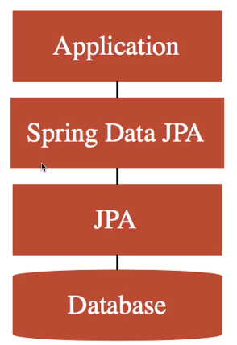

#### Spring Boot 자동 설정이 하는 일
Spring Data JPA를 사용하기 위해 우리가 해야 할은 Spring Data JPA와 H2 라이브러리를 추가한 것이다. 그것만 해도 Spring Boot는 아래 나열한 작업을 자동으로 진행한다.
- JPA, Spring Data JPA 프레임워크 초기화 
- H2 데이터베이스 시작 (인메모리)
- 데이터베이스 연결 풀 설정
- 스크립트 자동 실행 (data.sql)

#### 백그라운드에서 동작하는 SQL 쿼리
`application.properties` 설정으로 Spring Data JPA에 의해 백그라운드에서 실행되는 SQL쿼리문을 콘솔에 출력할 수 있다.
```properties
spring.jpa.show-sql=true
```
해당 설정을 한 후 Todo 조회, 생성, 삭제, 수정을 하면서 어떤 쿼리가 실행되는지 확인 해볼 수 있다.

---