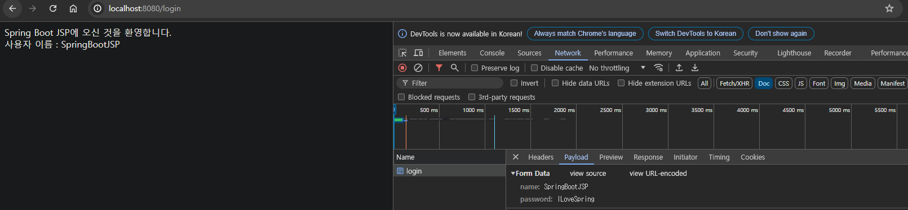

# 📒 [학습 노트] 챕터 6 : Spring Framework, Spring Boot, Hibernate로 Java 웹 애플리케이션 만들기

## 0단계 - Spring Boot를 이용한 웹 앱 제작 개요

#### 알아야 하는 키워드
- 브라우저 동작 원리
- HTML, CSS, 
- 요청, 응답, 양식, 세션, 인증
- Spring MVC
  - 디스패처 서블렛, 
  - 뷰, 
  - 리졸버, 
  - 모델 뷰, 
  - 컨트롤러, 
  - 검증
  - ...
- Spring Boot
  - 사용해야 할 스타터
  - 트리거할 자동 설정
  - ...
- 프레임워크 툴 통합
  - JSP, JSTL, JPA 통합
  - Bootstrap
  - Spring Security
  - DB (MySQL, H2)

#### 이번 챕터의 목표
현대적인 Srping Boot 접근법을 사용해서 To-do 관리 애플리케이션 만들기.

- 모든 개념을 실용적인 방식으로 탐색
- 단계별 접근법 사용

#### 애플리케이션 개요
1. 사용자 ID와 패스워드로 애플리케이션에 로그인
2. 웰컴페이지
3. Todo 관리 페이지
4. Todo 생성, 삭제, 수정
   - Todo 생성
   - 목표 날짜 설정

---

## 1단계 - Spring initalizr로 Spring Boot 웹 애플리케이션 만들기

#### 프로젝트 생성

- [Spring initializer](https://start.spring.io/) 를 통해 프로젝트를 생성한다.
- 라이브러리 목록
  - Spring Web
  - Spring Boot DevTools

---

## 2단계 - Spring Boot 프로젝트 간단히 살펴보기

#### 중요한 파일
1. [MyfirstwebappApplication.java](..%2F00_module%2Fmyfirstwebapp%2Fsrc%2Fmain%2Fjava%2Fcom%2Fin28minutes%2Fspringboot%2Fmyfirstwebapp%2FMyfirstwebappApplication.java) : 내부의 main() 메서드를 통해 애플리케이션 실행.
2. `application.properties` : 애플리케이션의 많은 세부정보를 설정할 수 있음 (예민한 정보가 적혀 있는 경우가 많아 gitignore처리함.)
3. [pom.xml](..%2F00_module%2Fmyfirstwebapp%2Fpom.xml) : Spring initializer 에서 프로젝트를 생성할 때 선택한 라이브러리(의존성)을 기록, 관리

---

## 3단계 - 첫 번째 Spring MVC 컨트롤러, @ResponseBody, @Controller

#### sayHello 실습
```java
@Controller
public class SayHelloController {
	@RequestMapping("say-hello")
	public String sayHello() {
		return "안녕하세요 오늘은 어떤 걸 배우고 계신가요?";
	}
}
```
이렇게 작성했을 때 /say-hello 엔드포인트에 접근하면 오류가 발생한다. Spring MVC 가 기본적으로 String을 리턴할 때 리턴한 문자열을 이름으로 하는 View를 검색하기 때문이다.

메서드에 `@ResponseBody` 어노테이션을 부여해서 해결할 수 있다

#### @ResponseBody
- 부여된 메서드가 반환하는 값을 HTTP 응답 바디에 직접 작성.
  - 반환 값을 JSON, XML, 문자열 등의 형식으로 변환하여 클라이언트에게 전송.

---

## 4단계 - HTML 응답을 제공하기 위해 Spring MVC 컨트롤러 개선하기

#### 하드코딩 HTML(Hyper Text Markup Language) 리턴하기
```java
@Controller
public class SayHelloController {
	@RequestMapping("say-hello-html")
	@ResponseBody
	public String sayHelloHtml() {
		StringBuffer html = new StringBuffer();
		html.append("<html>");
		html.append("<head>");
		html.append("<title>나의 첫 번째 HTML 페이지</title>");
		html.append("</head>");
		html.append("<body>");
		html.append("나의 첫 번째 HTML 페이지의 Body");
		html.append("</body>");
		html.append("</html>");

		return html.toString();
	}
}
```
- 한 줄의 텍스트를 HTML로 노출하기 위해 너무 많은 코드가 필요하다. 

---

## 5단계 - Spring Boot Controller, @ResponseBody, 뷰를 이용하여 JSP로 리디렉션하기

이전 단계에서 HTML을 직접 하드 코딩하는 것의 문제점을 알아보았다. 이 문제를 해결하기 위해 뷰를 사용할 수 있다.

#### JSP(Java Server Pages) 실습
1. tomcat-embed-jasper 라이브러리 추가 (JSP 파일을 해석하고 처리할 수 있음)
    ```
    <dependency>
        <groupId>org.apache.tomcat.embed</groupId>
        <artifactId>tomcat-embed-jasper</artifactId>
    </dependency>
    ```
2. jsp 파일 생성 ([sayHello.jsp](..%2F00_module%2Fmyfirstwebapp%2Fsrc%2Fmain%2Fresources%2FMETA-INF%2Freources%2FWEB-INF%2Fjsp%2FsayHello.jsp))
   - 일반적으로 모든 jsp는 특정한 폴더 안에서 만들어야 한다.
     - src/main/resources/META-INF/reources/WEB-INF/jsp
   - HTML을 입력하는 것과 같은 문법으로 작성할 수 있다.
   - 이렇게 작성한 jsp 파일을 '뷰'라고 부른다.
3. [application.properties](..%2F00_module%2Fmyfirstwebapp%2Fsrc%2Fmain%2Fresources%2Fapplication.properties) 설정
    ```
    spring.mvc.view.prefix=/WEB-INF/jsp/
    spring.mvc.view.suffix=.jsp
    ```
   - 컨트롤러에서 jsp 파일을 리턴해야 한다.
   - 경로 : src/main/resources/META-INF/reources/WEB-INF/jsp/sayHello.jsp
   - 경로에서 `sayHello`를 제외한 부분은 새로운 파일이 추가되어도 변하지 않기에 상수로 선언할 수 있다
     - 접두사(prefix) : `/src/main/resources/META-INF/resources` 부분은 Spring이 알고 있으니 나머지 부분만 입력
     - 접미사(suffix) : 파일의 확장자인 `.jsp`을 입력
4. API 추가
    ```java
    @Controller
    public class SayHelloController {
        @RequestMapping("say-hello-jsp")
        public String sayHelloJsp() {
            return "sayHello";
        }
    }
    ```
    - `@ResponseBody` 어노테이션을 부여하면 sayHello 문자열이 노출되니 주의해야 한다.
5. UTF-8 인코딩
    - jsp 내용을 한글로 작성했기 때문에 실제 페이지에서 깨지는 문제가 발생했다.
    - jsp 파일 최상단에 `<%@ page language="java" contentType="text/html; charset=UTF-8" pageEncoding="UTF-8"%>`를 입력해서 해결할 수 있다.
---

## 6단계 - 예제 - LoginController와 login 뷰 만들기

#### 로그인 jsp 실습
사용자가 "/login" 엔드포인트에 접근하면, login.jsp 를 통해 로그인 페이지를 보여주려고 한다.
1. [login.jsp](..%2F00_module%2Fmyfirstwebapp%2Fsrc%2Fmain%2Fresources%2FMETA-INF%2Fresources%2FWEB-INF%2Fjsp%2Flogin.jsp) 작성
2. [LoginController.java](..%2F00_module%2Fmyfirstwebapp%2Fsrc%2Fmain%2Fjava%2Fcom%2Fin28minutes%2Fspringboot%2Fmyfirstwebapp%2Flogin%2FLoginController.java) 작성

---

## 7단계 - 빠른 개요 - 웹의 작동 방식 - 요청과 응답

#### HTTP 요청 간단하게 살펴보기

- 요청 URL: 클라이언트가 서버에 보낸 요청의 URL
- 요청 메서드: 서버에 요청하는 동작 (GETm POST, PUT, DELETE 등이 있음)
- 상태 코드: 요청에 대한 서버의 응답 코드 (200은 정상을 의미함.)
  - 'Whitelabel Error Page'의 경우 응답 코드는 '404'로 존재하지 않는 페이지를 요청했다는 의미로 쓰임
- 원격 주소 : 클라이언트의 IP 주소 & 포트 번호
- 리퍼러 정책 : 웹 브라우저가 웹 페이지를 요청할 때 보내는 정보를 제어하는 것
  - 이 정보에는 사용자가 어디서 왔는지(이전 페이지의 주소)가 포함되어 있다.
  - ex) 사용자가 구글에서 아마존으로 이동하면 아마존 서버는 사용자가 구글에서 왔다는 것을 알 수 있음
    - 대표적인 리퍼러 정책 (정책 수준에 따라 어떤 정보까지 전송할지 선택할 수 있음)
      - no-referrer: 리퍼러 정보를 전달하지 않음. 
      - no-referrer-when-downgrade: 보안 수준이 낮아지는 경우(HTTPS -> HTTP)에만 리퍼러 정보를 전달하지 않음. 
      - origin: 프로토콜, 호스트, 포트 정보만 전달. 
      - origin-when-cross-origin: 같은 출처일 때는 전체 URL을, 다른 출처일 때는 origin 정보만 전달. 
      - strict-origin: 프로토콜, 호스트, 포트 정보만 전달하며, 보안 수준이 낮아지는 경우 전달하지 않음.
      - strict-origin-when-cross-origin: 같은 출처일 때는 전체 URL을, 다른 출처일 때는 프로토콜, 호스트, 포트 정보만 전달.
      - unsafe-url: 전체 URL 정보 전달.

#### 웹은 어떻게 동작하는가
1. URL을 입력한다.
2. 브라우저가 해당 URL로 요청을 전송한다. (HTTP요청 HttpRequest)
3. 서버에서 요청을 받는다.
4. 서버는 요청 URL을 식별한다.
5. URL과 연결된 로직으로 요청을 처리한다.
6. 처리 결과에 따른 응답을 브라우저에 반환한다. (HTTP응답 HttpResponse)

---

## 8단계 - RequestParam으로 쿼리 파라미터 잡기, 모델 소개

#### URL 파라미터
기존 /login 엔드포인트에 파라미터를 받아서 처리하는 로직을 추가할 것이다.

- /login?name=EH13
  - URL 엔드포인트에 '?'로 파라미터를 추가 전달할 수 있다.
  - 'name' 라는 key와 'EH13' 이라는 값으로 전달된다.

#### @RequestParam
```java
@Controller
public class LoginController {
	@RequestMapping("login")
	public String goToLoginPage(@RequestParam("name") String name) {
		System.out.println(name);
		return "login";
	}
}
```
- @RequestParam("name")
  - 파라미터를 지정한다. name이라는 이름으로 받을 수 있다. (명시하지 않을 시 Java 파라미터 이름으로 자동 연결됨)
- String name
  - 받은 파라미터를 Java 변수화 시켜 Java 코드 내에서 사용할 수 있도록 한다.

#### 모델(Model)
파라미터 JSP에 전달하기 위해 모델에 파라미터를 넣어서 사용할 수 있다.
```java
@Controller
public class LoginController {
	@RequestMapping("login")
	public String goToLoginPage(@RequestParam("name") String name, ModelMap models) {
		models.addAttribute("name", name);
		return "login";
	}
}
```
- ModelMap : Model 인터페이스의 구현체
  - 데이터의 키-값 쌍을 저장하고 이를 뷰에서 사용할 수 있도록 해줌.
  - 내부적으로 'LinkedHashMap'을 통해서 데이터를 관리함.
  - addAttribute : put()과 동일한 기능으로 데이터를 저장함 (강의에서는 put()을 사용하나 작성자는 Spring MVC의 관례에 맞게 `addAttribute`를 사용하였음.)

#### JSP에서 model 값 사용하기
- ${} : 중괄호 안에 model의 key를 넣어서 사용할 수 있다.
  - ex) ${name}

---

## 9단계 - 빠른 개요 - Spring Boot를 사용할 때 로깅의 중요성

#### Spring Boot 로깅 설정
- Spring Boot 에서는 [application.properties](..%2F00_module%2Fmyfirstwebapp%2Fsrc%2Fmain%2Fresources%2Fapplication.properties.example)를 통해 로깅을 설정할 수 있다.
- [4챕터 ReadME](..%2F04_Getting_Started_with_Spring_Boot%2FREADME.md) 9단계에서 로깅 범위를 확인할 수 있다.

#### Spring Boot 로깅 설정 심화 : 클래스를 선택해서 로깅하기
```properties
#application.properties

logging.level.org.springframework=info
logging.level.com.in28minutes.springboot.myfirstwebapp=debug
```
- 이처럼 `logging.level.` 이후에 패키지를 입력해서 특정 패키지의 로깅 범위를 지정할 수 있다.

#### slf4j.Logger를 사용해서 로깅하기.
지금까지는 `System.out.println()` 메서드를 사용해서 터미널에 직접 문자열을 노출하면서 로깅을 해왔다.

이번에는 Logger를 사용해서 로깅을 해볼 것이다.
```java
import org.slf4j.Logger;
import org.slf4j.LoggerFactory;

@Controller
public class LoginController {
	private Logger logger = LoggerFactory.getLogger(this.getClass());
	@RequestMapping("login")
	public String goToLoginPage(@RequestParam("name") String name, ModelMap models) {
		logger.debug("리퀘스트파람 : {}", name);
		models.addAttribute("name", name);
		return "login";
	}
}
```
- `private static final Logger logger = LoggerFactory.getLogger(현재 클래스명.class);`
  - Logger의 일반적인 선언 방식이다. 
- debug()
  - 로깅 메서드이다.
  - info, warn 등의 레벨도 선택이 가능하다.
- ("리퀘스트파람 : {}", name)
  - {} : 플레이스홀더, 특정 값이나 변수를 삽입하기 위한 자리 표시자의 역할 (name의 값이 자동으로 들어감)
  - name : 사용할 변수 {} 자리에 자동으로 들어감. 
  - 변수가 여러개일 경우 플레이스홀더를 추가로 입력해서 로깅할 수 있다.
    - ex) logger.debug("이름: {}, 나이: {}, 도시: {}", name, age, city);

#### Logger를 권장하는 이유
- 로그 레벨 관리: `logger.debug()`를 통해 디버그 수준의 로그로 설정했다.
- 출력 대상의 유연성: 로그를 콘솔, 파일, 데이터베이스, 원격 서버 등 다양한 출력 대상으로 보낼 수 있다.
- 성능: 비동기 로깅을 지원하여 성능 이점이 있다.
  - 다른 로직(비즈니스 로직)은 로깅 로직이 완료될 때까지 기다리지 않고 동시에 실행될 수 있다.
  - 로그 메시지를 즉시 출력하거나 저장하는 대신, 메시지를 큐(queue)에 넣고, 별도의 스레드가 이 큐에서 메시지를 가져와서 처리한다.

---

## 10단계 - 디스패처 서블릿, 모델 1, 모델 2, 프론트 컨트롤러 알아보기

#### 웹 애플리케이션 개발 역사
1. Model 1 아키텍처

    
   - 특징 : 모든 코드가 View에 담겨있었다. (JSP안에서 모든 로직 처리)
     - View 로직 : HTML, CSS, JavaScript 등의 프레젠테이션 로직.
     - Flow 로직 : 애플리케이션의 흐름을 제어하는 제어문, 조건문, 반복문 등.
     - 데이터베이스 쿼리 : 데이터베이스와의 상호작용을 위한 SQL 쿼리.
   - 예시
        ```Html
        <%@ page import="java.sql.*" %>
        <html>
        <head>
            <title>예제 페이지</title>
        </head>
        <body>
            <%
                // 데이터베이스 연결
                String url = "jdbc:mysql://localhost:3306/mydb";
                String user = "user";
                String password = "password";
                Connection conn = DriverManager.getConnection(url, user, password);
                
                // 쿼리 실행
                Statement stmt = conn.createStatement();
                ResultSet rs = stmt.executeQuery("SELECT * FROM my_table");
        
                // 결과 출력
                while (rs.next()) {
                    out.println("<p>" + rs.getString("column_name") + "</p>");
                }
        
                // 연결 닫기
                rs.close();
                stmt.close();
                conn.close();
            %>
        </body>
        </html>
        ```
   - 문제점
     - 유지보수성 저하
     - 재사용성 부족
     - 테스트 어려움
     - 보안 문제


2. Modle 2 아키텍처


- 특징 : 역할이 구분됨
  - Model : View를 생성하는 데 사용하는 데이터 (DB 등에서 데이터를 받아옴)
  - View : 사용자에게 보여지는 영역
  - Controller(or Servlet) : 전체 흐름 제어
- 장점
  - 로직이 역할별로 구분되어 있음
  - 유지보수의 유연성
- 문제점 : 공통 기능을 모든 컨트롤러에 걸쳐 구현하는 방법은?
  - 인증과 같이 필수적인 코드가 모든 컨트롤러에서 중복해서 발생함


3. Modle 2 아키텍처 - 프론트 컨트롤러(Front Controller) 패턴


- 특징 : 브라우저에서 오는 모든 요청을 단 하나의 프론트 컨트롤러로 처리
  - ex) 보안 인증이 구현된 프론트 컨트롤러에서 먼저 보안을 검사한 후 적절한 컨트롤러에 요청을 재전달(하청)
- 역할
  - 프론트 컨트롤러 (Front Controller): 모든 요청을 수신하고, 요청을 처리하거나 다른 컨트롤러로 분기하는 중앙 집중화된 컨트롤러.
  - 디스패처 (Dispatcher): 프론트 컨트롤러가 요청을 적절한 핸들러(컨트롤러, 뷰 등)로 전달하는 역할.
  - 핸들러/컨트롤러 (Handler/Controller): 특정 요청을 처리하는 개별 컨트롤러.
  - 뷰 (View): 사용자에게 보여지는 영역
  - 모델 (Model): 데이터와 비즈니스 로직을 처리.

#### Spring MVC 프론트 컨트롤러 - 디스패처 서블릿 (Dispatcher Servlet)

- 디스패처 서블릿 : Spring MVC에서 구현한 Front Controller 구현체 (스프링 부트로 애플리케이션을 실행하면 자동으로 일한다.)
  - 프론트 컨트롤러의 역할을 수행한다.
- HTTP 요청 처리 과정
  1. 모든 요청은 디스패처 서블릿이 가장 먼저 받게된다.
  2. URL이 무엇인지 식별한다. (예시 URL : localhost:8080/login)
  3. 요청을 처리할 수 있는 Controller의 메서드를 식별한다. ([LoginController::goToLoginPage()](..%2F00_module%2Fmyfirstwebapp%2Fsrc%2Fmain%2Fjava%2Fcom%2Fin28minutes%2Fspringboot%2Fmyfirstwebapp%2Flogin%2FLoginController.java))
  4. Controller에 요청을 전달한다.
  5. Controller의 메서드가 실행된다. (LoginController::goToLoginPage() 기준)
  6. Model과 View의 이름을 리턴한다.
  7. 디스패처 서블릿이 View의 이름에 맞는 적절한 View 를 매핑한다 ([login.jsp](..%2F00_module%2Fmyfirstwebapp%2Fsrc%2Fmain%2Fresources%2FMETA-INF%2Fresources%2FWEB-INF%2Fjsp%2Flogin.jsp))
     - 이 과정에서 디스패처 서블릿은 뷰 리졸버(View Resolver)를 사용하여 뷰 이름을 실제 뷰로 변환한다.
       - 뷰 리졸버 : 트롤러가 반환한 뷰 이름을 실제 뷰로 변환해주는 컴포넌트
  8. 뷰 리졸버가 `login.jsp`를 찾아서 뷰를 반환한다.
  9. 디스패처 서블릿이 해당 뷰를 사용하여 클라이언트에게 응답을 렌더링한다.
  10. `login.jsp`의 내용을 응답으로 반환한다.
---

## 11단계 - 로그인 양식 만들기

#### 실습
1. JSP에 form 추가
    ```HTML
        <form>
            이름: <input type="text" name="name">
            비밀번호: <input type="password" name="password">
            <input type="submit">
        </form>
    ```
2. form 확인
   
   - 입력란을 채운 후 '제출'을 누르면 url의 파라미터에 입력한 정보가 입력된다. (보안이슈)
     - 인터넷엔 수 많은 '라우터'가 있고 라우터는 url을 볼 수 있다.
3. `<form method="post">`
   - `form`에 `method`를 `post`로 지정해서 입력 데이터를 숨길 수 있다.

---

## 12단계 - 모델로 JSP에 로그인 자격증명 표시하기

로그인 페이지에서 자격증명을 입력하면 환영 페이지로 리다이렉션 실습을 할 것이다.

브라우저에서 `/login` 엔드포인트에 처음 접근할 때는 GET 메서드를 사용한다. 자격 증명을 입력한 후 '제출'을 클릭하면 페이지가 새로고침 되는데, 사실 해당 페이지는 POST 응답을 받은 것이다. (개발자 도구 네트워크 탭에서 POST 요청임을 확인 가능함) 

즉, `LoginController::goToLoginPage()`은 GET 과 POST 를 동시에 처리하고 있는 것이다. 

#### Welcome 페이지 작성
([welcome.jsp](..%2F00_module%2Fmyfirstwebapp%2Fsrc%2Fmain%2Fresources%2FMETA-INF%2Fresources%2FWEB-INF%2Fjsp%2Fwelcome.jsp))

#### `/login` 엔드포인트가 GET 요청만 처리하도록 만들기
브라우저에서 `/login` 엔드포인트에 처음 접근할 때는 GET 메서드를 사용한다. 자격 증명을 입력한 후 '제출'을 클릭하면 페이지가 새로고침 되는데, 사실 해당 페이지는 POST 응답을 받은 것이다.(개발자 도구 네트워크 탭에서 POST 요청임을 확인 가능함)

즉, `LoginController::goToLoginPage()`은 GET 과 POST 를 동시에 처리하고 있는 것이다.

```java
public class LoginController {
 @RequestMapping(value = "login", method = RequestMethod.GET)
 public String goToLoginPage() {
     return "login";
 }
}
```
- `method = RequestMethod.GET` 파라미터를 부여해서 처리 가능하다. (파라미터가 두 개가 되었기 때문에 생략되던 value도 명시 필요.)

#### POST 메서드 추가
앞선 순서까지 진행하고 `/login` 페이지에서 form 을 제출하면, 405 에러가 발생한다. (POST 처리할 수 있는 메서드가 없기 때문)

```java
public class LoginController {
    @RequestMapping(value = "login", method = RequestMethod.POST)
    public String goToWelcomePage() {
        return "welcome";
    }
}
```

POST 메서드를 추가하고 만들어 놓은 `welcome` 페이지를 리턴한다.

#### RequestParam : 사용자가 입력한 데이터 받기
```java
@Controller
public class LoginController {
	@RequestMapping(value = "login", method = RequestMethod.POST)
	public String goToWelcomePage(@RequestParam String name, @RequestParam String password, ModelMap models) {
		models.addAttribute("name", name);
		models.addAttribute("password", password);

		return "welcome";
	}
}
```
- `@RequestParam` 어노테이션을 파라미터에 부여해서 사용자 입력 데이터를 잡을 수 있다.

---

## 13단계 - 하드코딩된 사용자 ID 및 패스워드 검증 추가하기

간단한 인증을 실습하기 위헤서 아래의 조건으로 이름과 패스워드를 입력한 사용자만 웰컴페이지로 이동 시킬 것이다.

이름 : SpringBootJSP, 
패스워드 : ILoveSpring

#### AuthenticationService 추가
[단일 책임 원칙](https://ko.wikipedia.org/wiki/%EB%8B%A8%EC%9D%BC_%EC%B1%85%EC%9E%84_%EC%9B%90%EC%B9%99)에 따라 인증을 담당하는 클래스를 따로 선언한다.
```java
@Service
public class AuthenticationService {
	public static boolean authenticate(String username, String password) {
		boolean isValidUserName = username.equals("SpringBootJSP");
		boolean isValidPassword = password.equalsIgnoreCase("ILoveSpring");

		return isValidUserName && isValidPassword;
	}
}
```
- 간단하게 정해진 `username` 과 `password`를 검증하는 메서드를 작성했다.
- 패스워드의 대소문자는 구분하지 않기 위해 `equalsIgnoreCase`를 사용했다.
- `@Service` 어노테이션을 부여해서 컴포넌트로 등록한다.

#### 컨트롤러에 연결
```java
@Controller
public class LoginController {
	private AuthenticationService authenticationService;

	public LoginController(AuthenticationService authenticationService) {
		this.authenticationService = authenticationService;
	}
	
	//...(생략)
	
	@RequestMapping(value = "login", method = RequestMethod.POST)
	public String goToWelcomePage(@RequestParam String name, @RequestParam String password, ModelMap models) {
		if(authenticationService.authenticate(name, password)) {
			models.addAttribute("name", name);
			return "welcome";
		}
		return "login";
	}
}
```
- `AuthenticationService` 를 필드로 선언한다.
- 생성자 주입을 사용하기 위해 `AuthenticationService`를 초기화하는 생성자를 선언한다.
- `goToWelcomePage()`에 검증 로직을 작성한다.

#### 오류 메시지 추가
```java
public class LoginController {
	@RequestMapping(value = "login", method = RequestMethod.POST)
	public String goToWelcomePage(@RequestParam String name, @RequestParam String password, ModelMap models) {
		if(authenticationService.authenticate(name, password)) {
			models.addAttribute("name", name);
			return "welcome";
		}

		models.put("errorMessage", "유효하지 않은 자격증명 입니다.");
		return "login";
	}
}
```
- `ModelMap`에 원하는 커스텀 데이터를 입력하는 것이 가능하다.
```html
<body>
    로그인 페이지에 오신 것을 환영합니다.
    <form method="post">
        이름: <input type="text" name="name">
        비밀번호: <input type="password" name="password">
        <input type="submit">
    </form>
    <pre>${errorMessage}</pre>
</body>
```
- ${errorMessage}로 사용할 수 있으며 해당 값이 없을 경우 무시된다.

---

## 14단계 - Todo 기능 만들기 시작 - Todo와 TodoService 만들기

!

Todo 관리를 할 수 있는 Todo 애플리케이션을 만들려고 한다.

#### 기능
- Todo 생성 (설명, 목표 날짜, 완료 여부를 저장)
- Todo 업데이트
- Todo 삭제

#### Model 작성 ([Todo.java](..%2F00_module%2Fmyfirstwebapp%2Fsrc%2Fmain%2Fjava%2Fcom%2Fin28minutes%2Fspringboot%2Fmyfirstwebapp%2Ftodo%2FTodo.java))
- 필요한 필드
    - id
    - 작성자 (username)
    - 설명 (description)
    - 목표 일자 (targetDate)
    - 완료 여부 (done)

#### 정적 Todo List 생성 실습
```java
@Service
public class TodoService {

	private static List<Todo> todos;

	static {
		todos.add(new Todo(1, "EH13", "스프링부트 3 강의 완강하기", LocalDate.now().plusMonths(1), false));
		todos.add(new Todo(2, "EH13", "도커, 쿠버네티스 강의 완강하기", LocalDate.now().plusMonths(2), false));
		todos.add(new Todo(3, "EH13", "사이드 프로젝트 완성 하기", LocalDate.now().plusMonths(4), false));
	}

	public List<Todo> findByUsername(String username) {
		return todos;
	}
}
```
- 실습을 위해 정적 Todo를 작성했다.

---

## 15단계 - Todo 리스트 페이지 처음 만들기

#### Controller 작성
```java
@Controller
public class TodoController {
	private TodoService todoService;

	public TodoController(TodoService todoService) {
		this.todoService = todoService;
	}

	@RequestMapping("list-todos")
	public String listAllTodos(ModelMap models) {
		models.put("todos", todoService.findByUsername("EH13"));
		return "listTodos";
	}
}
```
- 생성자 주입으로 `TodoService`를 사용할 수 있다.
- `models.put("todos", todoService.findByUsername("EH13"));` 으로 `TodoService`에서 작성한 정적 Todos를 사용할 수 있다.

#### listTodos.jsp 작성 
[listTodos.jsp](..%2F00_module%2Fmyfirstwebapp%2Fsrc%2Fmain%2Fresources%2FMETA-INF%2Fresources%2FWEB-INF%2Fjsp%2FlistTodos.jsp)


---

## 16단계 - 세션, 모델, 요청 이해하기 - @SessionAttributes

#### 요청 (Request)

- 요청에서 쓰인 payload 데이터는 해당 요청 안에서만 유효하다 (페이지를 이동하면 해당 페이지에서는 요청이 무효화 된다.)

#### 모델 (Model)
- 요청에 응답한 모델 역시 해당 요청 안에서만 유효하다. (페이지를 이동하면 사용할 수 없다.)
  - `login.jsp` 에서 응답한 `name` 모델을 `listTodos.jsp`에서 사용할 수 없다. 

#### 세션 (Session)
값을 여러 요청에 걸쳐 사용하기 위해선 세션이 필요하다.

- @SessionAttribute
    ```java
    @SessionAttributes("name")
    public class LoginController { }
    
    @SessionAttributes("name")
    public class TodoController { }
    ```
    - 값 공유를 원하는 모든 컨트롤러에 `@SessionAttributes` 어노테이션을 적용한다.
---

## 17단계 - Spring Boot 프로젝트에 JSTL을 추가하고 Todos를 테이블에 표시하기


페이지에서 응답하고 있는 데이터 값의 가독성이 좋지 않다. 이를 개선해보자.

#### JSTL 태그
```html
<div>Todo List: ${todos}</div>
```
Todo 리스트의 데이터는 `${todos}`를 사용해서 노출하고 있다. `${}` 처럼 사용하는 문법을 '표현언어'라고 한다.

하지만 `todos` 데이터는 표현언어로 사용하기에 적절하지 않다. `todos`를 테이블에 나열해서 가독성을 좋게 만들기 위해서 JSTL 태그를 사용할 수 있다.

1. 라이브러리 추가
    ```xml
    <dependencies>
        <dependency>
            <groupId>jakarta.servlet.jsp.jstl</groupId>
            <artifactId>jakarta.servlet.jsp.jstl-api</artifactId>
        </dependency>
        <dependency>
            <groupId>org.eclipse.jetty</groupId>
            <artifactId>glassfish-jstl</artifactId>
            <version>11.0.21</version>
        </dependency>
    </dependencies>
    ```
    - jakarta.servlet.jsp.jstl-api : JSTL API 라이브러리
    - glassfish-jstl : JSTL 구현체 라이브러리
      - 버전 명시를 하지 않으면 메이븐에서 라이브러리를 불러오지 못했음.
2. JSP에서 JSTL 임포트 ([JSTL core](https://docs.oracle.com/javaee/5/jstl/1.1/docs/tlddocs/c/tld-summary.html) 참고)
    ```html
    <%@ taglib prefix="c" uri="http://java.sun.com/jsp/jstl/core" %>
    ```    
    - JSTL core 에서 사용 가능한 태그를 확인 할 수 있다. 
    - `prefix="c"` : JSTL 태그를 사용하기 위한 이름 ex) `c:forEach`로 사용 가능
3. JSP에서 JSTL 태그 사용해서 테이블에 TodoList 넣기
    ```html
    <table>
        <thead>
            <tr>
                <th>id</th>
                <th>설명</th>
                <th>목표 일시</th>
                <th>완료 여부</th>
            </tr>
        </thead>
        <tbody>
            <c:forEach items="${todos}" var="todo">
                <tr>
                    <td>${todo.id}</td>
                    <td>${todo.description}</td>
                    <td>${todo.targetDate}</td>
                    <td>${todo.done}</td>
                </tr>
            </c:forEach>
        </tbody>
    </table>
    ```
    - `c:forEach` 태그 안에서 `${todos}`의 데이터를 사용할 수 있다.
    - `items` : 사용할 Model의 이름
    - `var="todo"` : 반복문 동안 todos의 각 인덱스
    - `${todo.id}` 방식으로 세부 데이터에 접근이 가능하다.
4. 확인하기


---

## 18단계 - webjars를 사용하여 Bootstrap CSS 프레임워크를 Spring Boot 프로젝트에 추가하기

#### Bootstrap 
- CSS 프레임워크
  - CSS(Cascading Style Sheets) : HTML을 꾸밀 때 사용하는 스타일 시트

#### webjars
- 클라이언트 측 라이브러리(예: JavaScript, CSS 등)를 관리하고 제공하기 위한 패키지 포맷
- 부트스트랩을 자동 관리할 수 있다.

#### webjars 사용하기
1. 라이브러리 추가
    ```xml
    <dependencies>
        <dependency>
            <groupId>org.webjars</groupId>
            <artifactId>bootstrap</artifactId>
            <version>5.1.3</version>
        </dependency>
        <dependency>
            <groupId>org.webjars</groupId>
            <artifactId>jquery</artifactId>
            <version>3.6.0</version>
        </dependency>
    </dependencies>
    ```
    - webjars를 통해 bootstrap과 jquery를 불러온다.
     
2. JSP에 추가하기
    ```html
    <head>
        <link href="webjars/bootstrap/5.1.3/css/bootstrap.min.css" rel="stylesheet">
        <!--...(생략)-->
    </head>
    <!--...(생략)-->
    <body>
        <!--...(생략)-->
        <script src="webjars/bootstrap/5.1.3/js/bootstrap.min.js"></script>
        <script src="webjars/jquery/3.6.0/jquery.min.js"></script>
    </body>
    ```
    - CSS 파일은 head 태그의 맨 앞에 위치한다.
    - js 파일은 body 태그의 맨 뒤에 위치한다.
3. 적용 확인
   

---

## 19단계 - Bootstrap CSS 프레임워크로 JSP 페이지 포맷 만들기

#### `<div class="container">`
- Bootstrap에서 레이아웃을 잡기 위해 사용되는 기본적인 클래스 중 하나 

#### class
- HTML의 구분자를 줘서 CSS에서 이를 활용할 수 있다.
- Bootstrap은 유용한 CSS를 미리 작성한 후 class에 연결시켜놓았다.
    - 지정한 class를 입력하는 것으로 Bootstrap이 작성한 CSS를 적용할 수 있다.
- 적용된 모습 
  
  - table 태그에 class="table"만 추가해도 그럴듯한 CSS의 테이블을 볼 수 있다. 
---

## 20단계 - Todo 추가하기 - 새로운 뷰 만들기

#### Todo 추가 기능 구현
1. Todo 추가 버튼 구현
    ```html
    <a href="add-todo" class="btn btn-success">Todo 추가</a>
    ```
    - `/add-todo` 엔드포인트로 이동하는 Todo 추가 버튼을 구현 (a 태그지만 부트스트랩 클래스로 버튼처럼 보이도록 함)
2. 컨트롤러 연결
    ```java
    public class TodoController {
        @RequestMapping(value = "add-todo" , method = RequestMethod.GET)
        public String showNewTodoPage() {
            return "todo";
        }
    }
    ```
3. `todo.jsp` 작성
4. POST API 작성
    ```java
    public class TodoController {
        @RequestMapping(value = "add-todo", method = RequestMethod.POST)
        public String addNewTodo() {
            return "redirect:list-todos";
        }
    }
    ```
    - 리턴 값으로 `redirect:{엔드포인트}`를 줘서 리다이렉트 할 수 있다.
      - JSP로 줄 경우 기존 `listAllTodos()`에서 사용하던 Model을 다시 작성해야 하기 때문에 작성된 엔드포인트로 이동하는 것이 더 유리하다.
---

## 21단계 - Todo를 추가하기 위해 TodoService 개선하기

#### Todo 추가 서비스 로직 구현
1. `TodoService` 개선
    ```java
    @Service
    public class TodoService {
	    //...(생략)
        private static int todoCount = 0;

	    //...(생략)
        public void addTodo(String username, String description, LocalDate targetDate, boolean done) {
            todos.add(new Todo(++todoCount, username, description, targetDate, done));
        }
    }
    ```
    - addTodo() 메서드를 사용해서 사용자가 입력한 값을 Todo로 등록시킬 것이다.
    - todoCount를 0으로 선언 후 `++todoCount` id를 자동으로 증가시키고 있다.
      - 흥미로운 방법이지만 삭제 로직이 추가되면 중복 id가 발생할 수 있다.
2. 컨트롤러 연결
    ```java
    @SessionAttributes("name")
    public class TodoController {
        //...(생략)
        @RequestMapping(value = "add-todo" , method = RequestMethod.POST)
        public String addNewTodo(@RequestParam String description, ModelMap models) {
            String username = (String) models.get("name");
            todoService.addTodo(username, description, LocalDate.now().plusDays(1), false);
            return "redirect:list-todos";
        }
    }
    ```
    - `@RequestParam` 을 사용해서 `description`을 받는다
    - `@SessionAttributes("name")`이 있기 때문에 `models.get("name")`으로 이름도 받을 수 있다.
---

## 22단계 - Spring Boot Starter Validation을 이용하여 검증 추가하기


현재 Todo는 아무런 값을 입력하지 않아도 검증 없이 빈 값으로 만들어진다. 검증을 추가할 필요가 있다.

#### 프론트엔드 검증
```html
설명: <input type="text" name="description" required="required">
```
- 태그에 required 속성을 부여하는 것으로 빈 값 입력을 방지할 수 있다.
    

- 주의 : Html이나 JS 검증은 건너뛰기가 비교적 쉽기 때문에 서버측 추가 검증이 필요하다. 

#### Spring Boot를 사용해서 밸리데이션 하기 : 
1. 검증 라이브러리 추가
2. 커맨드 빈 (Command Vean) | 양식 보조 객체 (Form Backing Object) 사용하기
    - 양방향 바인딩 (2-way binding) 구현
3. `Todo.java` Bean에 검증 추가하기
4. 검증 오류를 `todo.jsp` View에 표시하기


#### 1. 검증 라이브러리 추가
- spring-boot-starter-validation : Spring Boot가 제공하는 밸리데이션 스타터 라이브러리
     ```xml
     <dependency>
         <groupId>org.springframework.boot</groupId>
         <artifactId>spring-boot-starter-validation</artifactId>
     </dependency>
     ```

#### 2.커맨드 빈 (Command Vean) | 양식 보조 객체 (Form Backing Object)
`TodoController::addNewTodo()` 에서는 사용자 입력 값을 `@RequestParam` 받고 있다. 그런데 사용자 입력 값이 아주 많아지면 어떻게 해야 할까? 모든 필드를 파라미터로 추가하는 대신에 `Todo` Bean에 직접 바인딩(연결) 하는 것이 가능하다.

1. `addNewTodo()`에서 양식 보조 객체 사용
    ```java
    //...(생략)
    @SessionAttributes("name")
    public class TodoController {
        //...(생략)
        @RequestMapping(value = "add-todo" , method = RequestMethod.POST)
        public String addNewTodo(ModelMap models, Todo todo) {
            String username = (String) models.get("name");
            todoService.addTodo(username, todo.getDescription(), LocalDate.now().plusDays(1), false);
            return "redirect:list-todos";
        }
    }
    ```
    - `Todo` 객체를 직접 파라미터로 받는다.
    - `todo.getDescription()`를 사용해서 `description` 값을 가져올 수 있다.
2. `todo.jsp`에서 양식 보조 객체 사용 (양방향 바인딩 구현)
- JSP에 태그 추가
    [Spring Reference](https://docs.spring.io/spring-framework/docs/3.2.x/spring-framework-reference/html/view.html#view-jsp-formtaglib) 참고
    ```html
    <%@ taglib prefix="form" uri="http://www.springframework.org/tags/form" %>
    <!-- ...(생략)    -->
    <form:form method="post" modelAttribute="todo">
        <form:input type="hidden" path="id" required="required" />
        <form:input type="hidden" path="done" required="required" />
        목표: <form:input type="text" path="description" required="required" />
        <input type="submit" class="btn btn-success" />
    </form:form>
    ```
    - `modelAttribute` 속성을 통해 사용할 Bean 객체를 지정한다.
    - id, done에 null 값이 들어가지 않도록 input을 추가해준다.
- showNewTodoPage() 연결
    ```java
    //...(생략)
    public class TodoController {
	    //...(생략)
        @RequestMapping(value = "add-todo" , method = RequestMethod.GET)
        public String showNewTodoPage(ModelMap models) {
            String username = (String) models.get("name");
            Todo todo = new Todo(0, username, "", LocalDate.now().plusDays(1), false);
            models.put("todo", todo);
            return "todo";
        }
    }
    ```
    - `new Todo`를 사용해서 초기값을 가진 객체를 생성한다.
      - 사용자가 값을 입력하면 초기값을 대체한다. (입력되지 않은 값에 대한 초기화)
    - 해당 메서드에서 `addNewTodo()` 메서드로 객체를 전달하기 때문에 id를 0으로 설정해도 `addNewTodo()` 내부에서 `todoService`가 일을 한다.
---

## 23단계 - 커맨드 빈으로 새 Todo 페이지 검증 구현하기

#### 단방향 바인딩 vs 양방향 바인딩
- 단방향 바인딩 : 데이터가 한 방향으로만 흐르는 경우를 의미. 즉, 데이터 소스에서 뷰로만 데이터가 전달되고, 뷰에서 데이터 소스로는 데이터가 전달되지 않는 경우
    ```java
    //...(생략)
    @SessionAttributes("name")
    public class TodoController {
        //...(생략)
        @RequestMapping(value = "add-todo", method = RequestMethod.GET)
        public String showNewTodoPage(ModelMap models) {
            String username = (String) models.get("name");
            Todo todo = new Todo(0, username, "여기에 디폴트 값을 입력합니다.", LocalDate.now().plusDays(1), false);
            models.put("todo", todo);
            return "todo";
        }
    }
    ```
    - `Todo` 인스턴스의 `description`을 특정한 값으로 지정한 후 애플리케이션을 실행해서 페이지를 살펴보면 초기값이 들어있는 것을 볼 수 있다.
    - 이것을 단방향 바인딩이라고 부른다. (`addNewTodo()` 에서 바인딩을 하고 있다는 전제가 필요.)
      - `showNewTodoPage()`의 코드만 봤을 때는 단방향 바인딩 보다는 "모델-뷰 데이터 전달"에 가깝다.
- 양방향 바인딩 
  - `todo.jsp`에서 POST 요청을 통해 값을 입력하고 submit을 하면 해당 입력 데이터가  `listTodos.jsp`에 반영된다. 
  - `todo.jsp` 로 시작해서 `addNewTodo()` 메서드를 거쳐 `listTodos.jsp`에 전달되는 과정을 양방향 바인딩이라고 한다.

#### Bean 검증 추가
```java
import jakarta.validation.constraints.Size;
//...(생략)
public class Todo {
	//...(생략)
	@Size(min = 3, message = "목표는 3글자 이상 적어주세요")
	private String description;
}
```
- `jakarta.validation.constraints` 에서 밸리데이션 어노테이션을 사용할 수 있다.
- [공식 문서](https://jakarta.ee/specifications/bean-validation/3.0/apidocs/jakarta/validation/constraints/package-summary)를 통해 사용가능한 기능을 확인할 수 있다.

```java
import jakarta.validation.Valid;
//...(생략)
@SessionAttributes("name")
public class TodoController {
	//...(생략)
	@RequestMapping(value = "add-todo", method = RequestMethod.POST)
	public String addNewTodo(ModelMap models, @Valid Todo todo) {
		String username = (String) models.get("name");
		todoService.addTodo(username, todo.getDescription(), LocalDate.now().plusDays(1), false);
		return "redirect:list-todos";
	}
}
```
- 바인딩 된 객체 앞에 `@Valid` 어노테이션을 부여해서 밸리데이션 검증을 활성화 할 수 있다.
  

#### 검증 오류 View 노출
앞선 밸리데이션 검증은 동작은 잘 하지만 Server 에러를 노출한다. 사용자에게 보여주기에는 적절하지 않으니 View 노출을 개선해야 한다.
```java
import org.springframework.validation.BindingResult;
//...(생략)
@SessionAttributes("name")
public class TodoController {
	//...(생략)
	@RequestMapping(value = "add-todo" , method = RequestMethod.POST)
	public String addNewTodo(ModelMap models, @Valid Todo todo, BindingResult result) {
		if(result.hasErrors()) {
			return "todo";
		}
		String username = (String) models.get("name");
		todoService.addTodo(username, todo.getDescription(), LocalDate.now().plusDays(1), false);
		return "redirect:list-todos";
	}
}
``` 
- `BindingResult::hasErrors()` 메서드를 통해서 에러를 캐치할 수 있다. 에러가 발생할 경우 `todo.jsp`에 머물도록 해야 한다.
```html
목표: <form:input type="text" path="description" required="required" />
<form:errors path="description" cssClass="text-warning"/>
```
- `form:errors` 태그를 사용해서 `description` 필드의 검증 메시지를 노출할 수 있다.
  - `form:errors`는 HTML이 아닌 자바 코드이기 때문에 `cssClass`로 css 클래스를 지정해야 한다.


---

## 24단계 - Todo 삭제 기능 구현하기 - 새로운 뷰

#### 삭제 버튼 추가 (View)
```html
<td><a href="delete-todo?id=${todo.id}" class="btn btn-warning">삭제</a></td>
```
- url 뒤에 `id=${todo.id}` 으로 id 값을 파람으로 넘겨준다.
#### 삭제 로직 추가 (Service)
```java
//...(생략)
@Service
public class TodoService {
    //...(생략)
	public void deleteById(int id) {
		todos.removeIf(todo -> todo.getId() == id);
	}
}
```
#### API 작성 (Controller)
```java
//...(생략)
@Controller
public class TodoController {
	private TodoService todoService;

	//...(생략)
	@RequestMapping("delete-todo")
	public String deleteTodos(@RequestParam int id) {
		todoService.deleteById(id);
		return "redirect:list-todos";
	}
}
```

---

## 25단계 - Todo 업데이트 구현하기 - 1 - Todo 업데이트 페이지 표시하기

1. `listTodos.jsp` 수정 버튼 추가
2. `TodoService` Id가 일치하는 Todo 객체 리턴 메서드 추가
3. `TodoController` Todo 수정 API 추가

컨트롤러까지 연결해도 Todo의 수정은 반영되지 않는다.

---

## 26단계 - Todo 업데이트 구현하기 - 1 - Todo 변경사항 저장

#### 컨트롤러 분리
```java
public class TodoController {
	@RequestMapping(value = "update-todo", method = RequestMethod.GET)
	public String showUpdateTodoPage(@RequestParam int id, ModelMap models) {
		Todo todo = todoService.findById(id);
		models.addAttribute("todo", todo);
		return "todo";
	}

	@RequestMapping(value = "update-todo", method = RequestMethod.POST)
	public String updateTodo(@Valid Todo todo, BindingResult result) {
		if (result.hasErrors()) {
			return "todo";
		}
		todoService.updateTodo(todo);
		return "redirect:list-todos";
	}
}
```
- GET 과 POST로 API를 분리해야 한다.

#### Todo 수정 로직 작성
```java
public class TodoService {
	public void updateTodo(Todo todo) {
		deleteById(todo.getId());
		todos.add(todo);
	}
}
```

여기까지 진행하면 Todo 수정이 가능하다. 그러나 2가지 문제점이 나타난다.
1. 수정된 Todo는 id값이 낮아도 테이블 리스트의 맨 아래로 내려간다. (Todo를 삭제 후 다시 생성하기 때문에 인덱스가 최신화 됨)
2. `목표 일시`가 사라진다. (목표 일시를 작성하는 form input이 없기 때문에 빈 값으로 초기화 됨)

#### Todo 수정 로직 작성 (개인 코드)
```java
public class TodoService {
	public void updateTodo(Todo todo) {
		todos.forEach(originalTodo -> {
			if (originalTodo.getId() == todo.getId()) {
				originalTodo.setUsername(todo.getUsername());
				originalTodo.setDescription(todo.getDescription());
				originalTodo.setTargetDate(todo.getTargetDate());
				originalTodo.setDone(todo.isDone());
			}
		});
	}
}
```
- Todo 순서는 해결되었으나 여전히 목표 일시는 사라진다. (강의 진행을 위해 커밋은 강의 코드로 진행함)
  - 값이 존재하지 않을 시 기존 값으로 유지 하도록 예외처리 가능
---

## 27단계 - Todo 페이지에 목표 날짜 추가하기

#### 목표 일자 구현
```html
<fieldset class="m-3">
    <form:label path="targetDate">목표 일자</form:label>
    <form:input type="text" path="targetDate" required="required" />
    <form:errors path="targetDate" cssClass="text-warning"/>
</fieldset>
```
- `path="targetDate"`을 지정해서 목표일자 input 필드를 추가한다.
- 필요에 따라 컨트롤러, view 파일을 리팩토링 한다.
- 날짜 포맷 : `spring.mvc.format.date=yyyy-MM-dd`

#### Bootstrap Datepicker (날짜 선택기 플러그인)
- 라이브러리 설치
    ```xml
    <dependency>
        <groupId>org.webjars</groupId>
        <artifactId>bootstrap-datepicker</artifactId>
        <version>1.9.0</version>
    </dependency>
    ```
- JSP에 CSS, JS 불러오기
    ```html
    <link href="webjars/bootstrap-datepicker/1.9.0/css/bootstrap-datepicker.standalone.min.css" rel="stylesheet">
    <script src="webjars/bootstrap-datepicker/1.9.0/js/bootstrap-datepicker.min.js"></script>
    ```
- Datepicker 적용 : [bootstrap-datepicker](https://bootstrap-datepicker.readthedocs.io/en/latest/) 공식문서 참고
    ```html
    <script type="text/javascript">
      $('#datepicker').targetDate({
        format: 'yyyy-mm-dd',
      });
    </script>
    ```

- Datepicker 한글화 (추가 학습)
    ```html
    <script src="webjars/bootstrap-datepicker/1.9.0/locales/bootstrap-datepicker.ko.min.js"></script>
    <script type="text/javascript">
      $('#targetDate').datepicker({
        format: 'yyyy-mm-dd',
        language: 'ko',
        weekStart: 0,
        autoclose: true,
        todayHighlight: true,
      });
    </script>
    ```
    - weekStart : 달력 요일 시작 기준 (0은 일요일)
    - autoclose : 날짜 선택 후 자동으로 Datepicker가 닫힘
    - todayHighlight : 오늘 날짜를 가시적으로 하이라이트
---