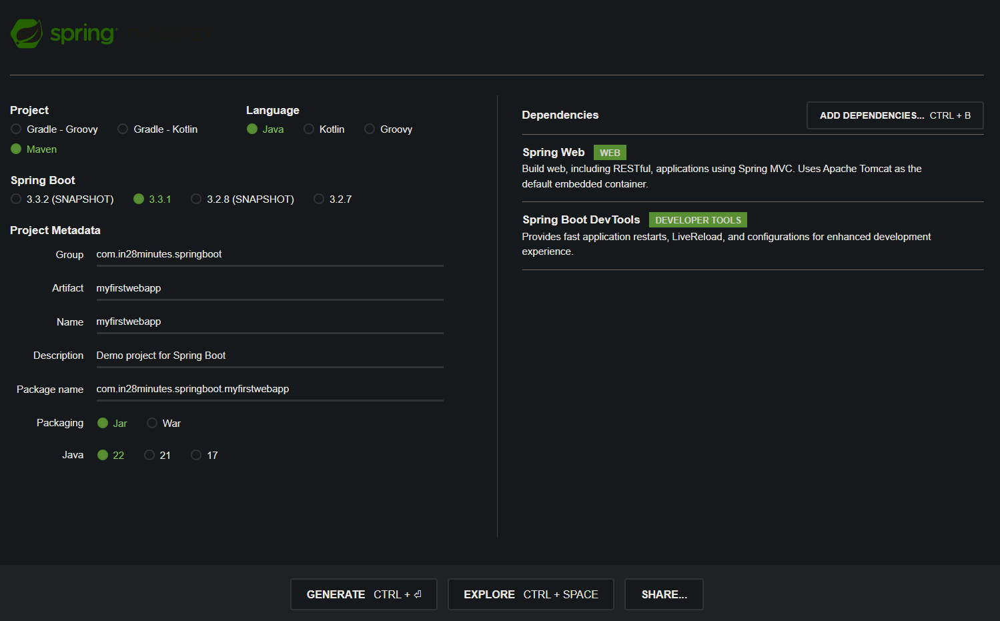

# 📒 [학습 노트] 챕터 6 : Spring Framework, Spring Boot, Hibernate로 Java 웹 애플리케이션 만들기

## 0단계 - Spring Boot를 이용한 웹 앱 제작 개요

#### 알아야 하는 키워드
- 브라우저 동작 원리
- HTML, CSS, 
- 요청, 응답, 양식, 세션, 인증
- Spring MVC
  - 디스패처 서블렛, 
  - 뷰, 
  - 리졸버, 
  - 모델 뷰, 
  - 컨트롤러, 
  - 검증
  - ...
- Spring Boot
  - 사용해야 할 스타터
  - 트리거할 자동 설정
  - ...
- 프레임워크 툴 통합
  - JSP, JSTL, JPA 통합
  - Bootstrap
  - Spring Security
  - DB (MySQL, H2)

#### 이번 챕터의 목표
현대적인 Srping Boot 접근법을 사용해서 To-do 관리 애플리케이션 만들기.

- 모든 개념을 실용적인 방식으로 탐색
- 단계별 접근법 사용

#### 애플리케이션 개요
1. 사용자 ID와 패스워드로 애플리케이션에 로그인
2. 웰컴페이지
3. Todo 관리 페이지
4. Todo 생성, 삭제, 수정
   - Todo 생성
   - 목표 날짜 설정

---

## 1단계 - Spring initalizr로 Spring Boot 웹 애플리케이션 만들기

#### 프로젝트 생성

- [Spring initializer](https://start.spring.io/) 를 통해 프로젝트를 생성한다.
- 라이브러리 목록
  - Spring Web
  - Spring Boot DevTools

---

## 2단계 - Spring Boot 프로젝트 간단히 살펴보기

#### 중요한 파일
1. [MyfirstwebappApplication.java](..%2F00_module%2Fmyfirstwebapp%2Fsrc%2Fmain%2Fjava%2Fcom%2Fin28minutes%2Fspringboot%2Fmyfirstwebapp%2FMyfirstwebappApplication.java) : 내부의 main() 메서드를 통해 애플리케이션 실행.
2. `application.properties` : 애플리케이션의 많은 세부정보를 설정할 수 있음 (예민한 정보가 적혀 있는 경우가 많아 gitignore처리함.)
3. [pom.xml](..%2F00_module%2Fmyfirstwebapp%2Fpom.xml) : Spring initializer 에서 프로젝트를 생성할 때 선택한 라이브러리(의존성)을 기록, 관리

---

## 3단계 - 첫 번째 Spring MVC 컨트롤러, @ResponseBody, @Controller

#### sayHello 실습
```java
@Controller
public class SayHelloController {
	@RequestMapping("say-hello")
	public String sayHello() {
		return "안녕하세요 오늘은 어떤 걸 배우고 계신가요?";
	}
}
```
이렇게 작성했을 때 /say-hello 엔드포인트에 접근하면 오류가 발생한다. Spring MVC 가 기본적으로 String을 리턴할 때 리턴한 문자열을 이름으로 하는 View를 검색하기 때문이다.

메서드에 `@ResponseBody` 어노테이션을 부여해서 해결할 수 있다

#### @ResponseBody
- 부여된 메서드가 반환하는 값을 HTTP 응답 바디에 직접 작성.
  - 반환 값을 JSON, XML, 문자열 등의 형식으로 변환하여 클라이언트에게 전송.

---

## 4단계 - HTML 응답을 제공하기 위해 Spring MVC 컨트롤러 개선하기

#### 하드코딩 HTML(Hyper Text Markup Language) 리턴하기
```java
@Controller
public class SayHelloController {
	@RequestMapping("say-hello-html")
	@ResponseBody
	public String sayHelloHtml() {
		StringBuffer html = new StringBuffer();
		html.append("<html>");
		html.append("<head>");
		html.append("<title>나의 첫 번째 HTML 페이지</title>");
		html.append("</head>");
		html.append("<body>");
		html.append("나의 첫 번째 HTML 페이지의 Body");
		html.append("</body>");
		html.append("</html>");

		return html.toString();
	}
}
```
- 한 줄의 텍스트를 HTML로 노출하기 위해 너무 많은 코드가 필요하다. 

---

## 5단계 - Spring Boot Controller, @ResponseBody, 뷰를 이용하여 JSP로 리디렉션하기

이전 단계에서 HTML을 직접 하드 코딩하는 것의 문제점을 알아보았다. 이 문제를 해결하기 위해 뷰를 사용할 수 있다.

#### JSP(Java Server Pages) 실습
1. tomcat-embed-jasper 라이브러리 추가 (JSP 파일을 해석하고 처리할 수 있음)
    ```
    <dependency>
        <groupId>org.apache.tomcat.embed</groupId>
        <artifactId>tomcat-embed-jasper</artifactId>
    </dependency>
    ```
2. jsp 파일 생성 ([sayHello.jsp](..%2F00_module%2Fmyfirstwebapp%2Fsrc%2Fmain%2Fresources%2FMETA-INF%2Freources%2FWEB-INF%2Fjsp%2FsayHello.jsp))
   - 일반적으로 모든 jsp는 특정한 폴더 안에서 만들어야 한다.
     - src/main/resources/META-INF/reources/WEB-INF/jsp
   - HTML을 입력하는 것과 같은 문법으로 작성할 수 있다.
   - 이렇게 작성한 jsp 파일을 '뷰'라고 부른다.
3. [application.properties](..%2F00_module%2Fmyfirstwebapp%2Fsrc%2Fmain%2Fresources%2Fapplication.properties) 설정
    ```
    spring.mvc.view.prefix=/WEB-INF/jsp/
    spring.mvc.view.suffix=.jsp
    ```
   - 컨트롤러에서 jsp 파일을 리턴해야 한다.
   - 경로 : src/main/resources/META-INF/reources/WEB-INF/jsp/sayHello.jsp
   - 경로에서 `sayHello`를 제외한 부분은 새로운 파일이 추가되어도 변하지 않기에 상수로 선언할 수 있다
     - 접두사(prefix) : `/src/main/resources/META-INF/resources` 부분은 Spring이 알고 있으니 나머지 부분만 입력
     - 접미사(suffix) : 파일의 확장자인 `.jsp`을 입력
4. API 추가
    ```java
    @Controller
    public class SayHelloController {
        @RequestMapping("say-hello-jsp")
        public String sayHelloJsp() {
            return "sayHello";
        }
    }
    ```
    - `@ResponseBody` 어노테이션을 부여하면 sayHello 문자열이 노출되니 주의해야 한다.
5. UTF-8 인코딩
    - jsp 내용을 한글로 작성했기 때문에 실제 페이지에서 깨지는 문제가 발생했다.
    - jsp 파일 최상단에 `<%@ page language="java" contentType="text/html; charset=UTF-8" pageEncoding="UTF-8"%>`를 입력해서 해결할 수 있다.
---

