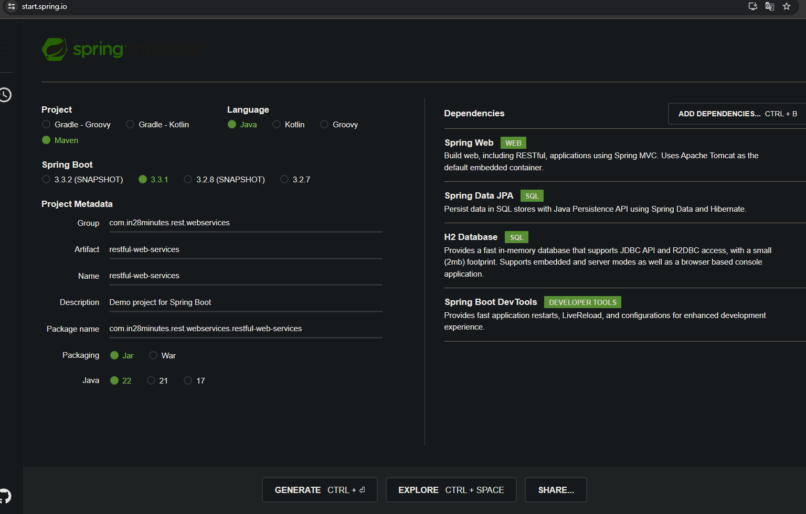
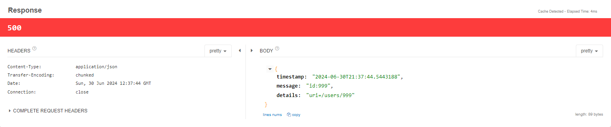
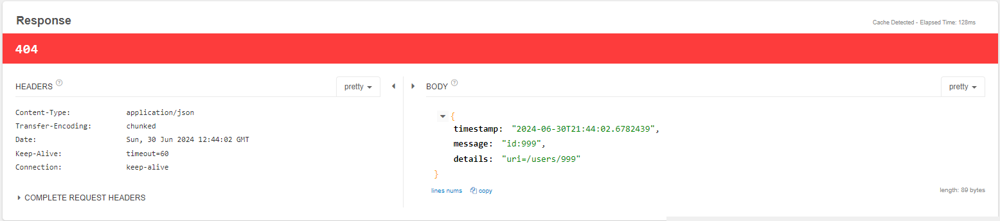
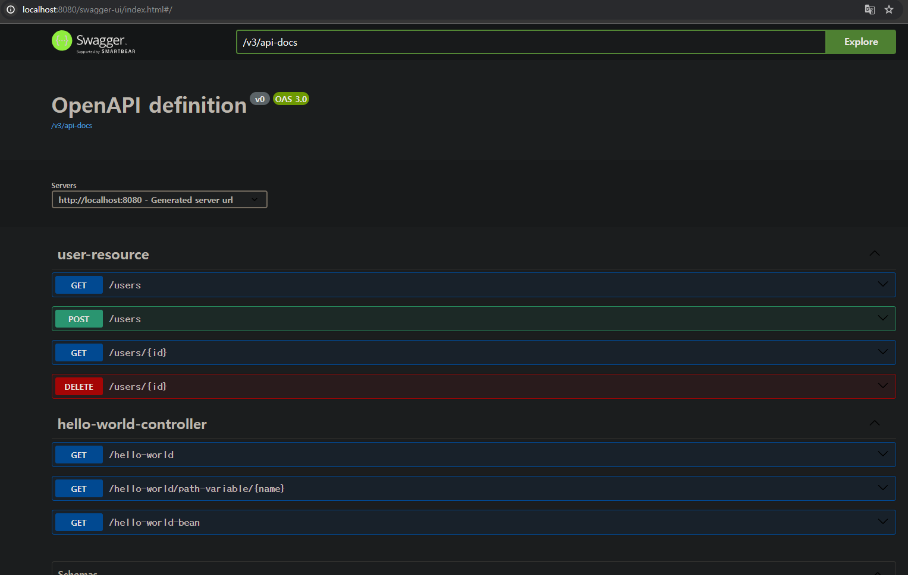
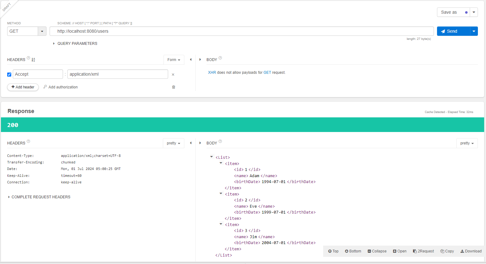
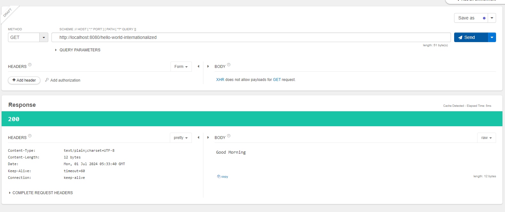
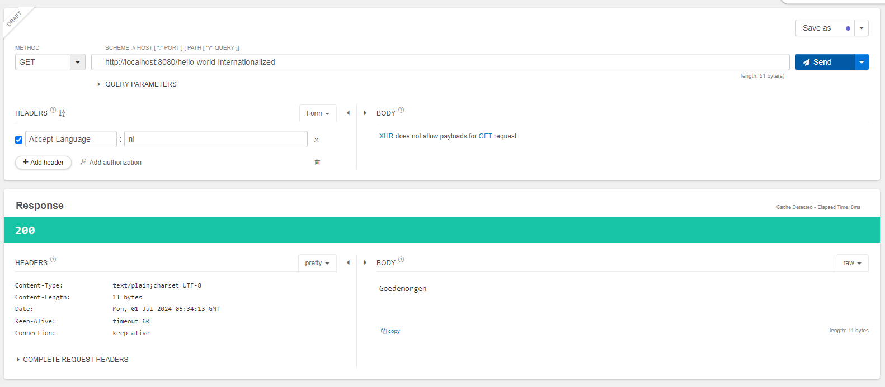
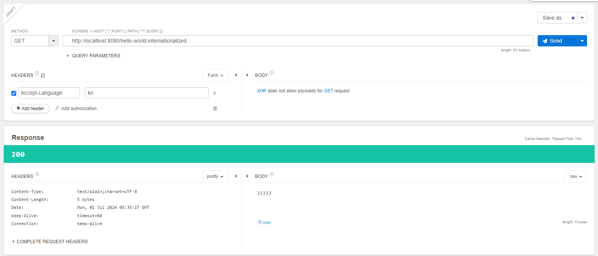
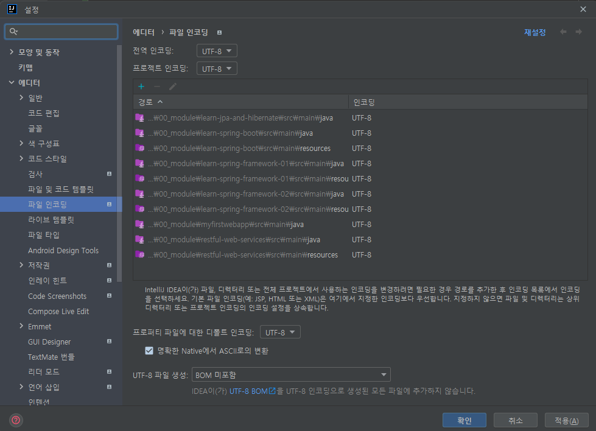
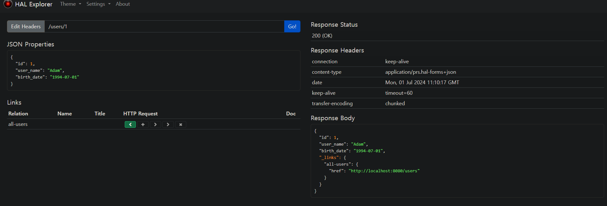

# 📒 [학습 노트] 챕터 7 : Spring Boot와 Spring Framework, Hibernate로 Java REST API 생성하기

## 목록
0. [Spring Boot로 REST API 생성하기 - 개요](#0단계---spring-boot로-rest-api-생성하기---개요)
1. [Spring Boot로 REST API 프로젝트 초기화하기](#1단계---spring-boot로-rest-api-프로젝트-초기화하기)
2. [Spring Boot로 Hello World REST API 생성하기](#2단계---spring-boot로-hello-world-rest-api-생성하기)
3. [Hello World REST API를 업그레이드하여 Bean 반환하기](#3단계---hello-world-rest-api를-업그레이드하여-bean-반환하기)
4. [백엔드에서는 어떤 일이 벌어지고 있을까? Spring Boot 스타터와 자동 설정](#4단계---백엔드에서는-어떤-일이-벌어지고-있을까-spring-boot-스타터와-자동-설정)
5. [패스 변수로 Hello World REST API 업그레이드하기](#5단계---패스-변수로-hello-world-rest-api-업그레이드하기)
6. [SNS 애플리케이션용 REST API 설계하기](#6단계---sns-애플리케이션용-rest-api-설계하기)
7. [사용자 Bean과 UserDaoService 생성하기](#7단계---사용자-bean과-userdaoservice-생성하기)
8. [User Resource에서 GET 메서드 구현하기](#8단계---user-resource에서-get-메서드-구현하기)
9. [User Resource에서 POST 메서드 구현하기](#9단계---user-resource에서-post-메서드-구현하기)
10. [POST 메소드를 개선해 올바른 HTTP 상태 코드와 locat](#10단계---post-메소드를-개선해-올바른-http-상태-코드와-location)
11. [예외 처리 구현하기 - 404 Resource Not found](#11단계---예외-처리-구현하기---404-resource-not-found)
12. [모든 리소스를 대상으로 예외 처리 구현하기](#12단계---모든-리소스를-대상으로-예외-처리-구현하기)
13. [DELETE 메소드로 사용자 리소스 삭제하기](#13단계---delete-메소드로-사용자-리소스-삭제하기)
14. [REST API에서 유효성 검증하기](#14단계---rest-api에서-유효성-검증하기)
15. [고급 REST API 기능의 개요](#15단계---고급-rest-api-기능의-개요)
16. [Open API 사양 및 Swagger 파악하기](#16단계---open-api-사양-및-swagger-파악하기)
17. [Swagger 문서의 자동 생성 구성하기](#17단계---swagger-문서의-자동-생성-구성하기)
18. [콘텐츠 협상 알아보기 - XML 지원 구현하기](#18단계---콘텐츠-협상-알아보기---xml-지원-구현하기)
19. [REST API의 국제화 알아보기](#19단계---rest-api의-국제화-알아보기)
20. [REST API 버전 관리 - URI 버전 관리](#20단계---rest-api-버전-관리---uri-버전-관리)
21. [REST API 버전 관리 - 요청 매개변수, 헤더, 콘텐츠 협상](#21단계---rest-api-버전-관리---요청-매개변수-헤더-콘텐츠-협상)
22. [REST API HATEOAS 구현하기](#22단계---rest-api-hateoas-구현하기)
23. [REST API 정적 필터링 구현하기](#23단계---rest-api-정적-필터링-구현하기)
24. [REST API 동적 필터링 구현하기](#24단계---rest-api-동적-필터링-구현하기)
25. [Spring Boot Actuator로 API 모니터링하기](#25단계---spring-boot-actuator로-api-모니터링하기)
26. [Spring Boot HAL Explorer로 API 탐색하기](#26단계---spring-boot-hal-explorer로-api-탐색하기)
27. [JPA와 Hibernate를 이용해 REST API를 H2에 연결하기 - 개요](#27단계---jpa와-hibernate를-이용해-rest-api를-h2에-연결하기---개요)

---

## 0단계 - Spring Boot로 REST API 생성하기 - 개요

#### 챕터 목표
1. REST API를 빌드하는 데 Spring Boot가 최적의 프레임워크 중 하나인 이유
2. 훌륭한 REST API 빌드하는 법
   - REST API 포함해야 돼는 리소스는?
   - 리소스에서 수행할 수 있는 작업을 식별하는 방법?
   - 요청과 응답 구조 정의 방식?
3. REST API 의 우수 사례 (늘 소비자 관점에서 생각하는 것이 가장 중요)
   - 검증
   - 국제화
   - 예외 처리
   - HATEOAS
   - 버전 관리
   - 문서화
   - 콘텐츠 협상
   - ...

#### 기초 학습 접근법
1. ‘Hello World’ REST API를 빌드
2. Spring Boot를 통한 REST API 빌드의 기본 알아보기
3. 신규 어노테이션 학습
   - @RestController
   - @RequestMapping
   - @GetMapping
   - @PutMapping
   - @PathVariable
4. JSON 변환 이해하기

#### SNS 애플리케이션용 REST API 빌드 (RESTful API)
1. 올바른 요청 및 응답 구조 학습
2. REST API에 보안 구현
3. 검증 및 예외처리 구현
4. 고급 REST API 기능 추가
   - 국제화
   - HATEOAS
   - 버전 관리
   - 문서화
   - 콘텐츠 협상
   - ...
5. JPA와 Hibernate를 사용해서 REST API를 데이터베이스에 연결
   - H2 데이터베이스를 연결해서 JPA와 Hibernate의 원리를 이해
   - MySQL로 교체

챕터의 목표는 'Spring Boot로 훌륭한 REST API를 빌드'하고 해당 문서에 작성된 '중요한 용어' 들을 이해하는 것이다.

---

## 1단계 - Spring Boot로 REST API 프로젝트 초기화하기

#### 프로젝트 생성

- [Spring initializer](https://start.spring.io/) 를 통해 프로젝트를 생성한다.
- 라이브러리 목록
   - Spring Web
   - Spring Boot DevTools

---

## 2단계 - Spring Boot로 Hello World REST API 생성하기

#### Hello Wolrd GET API 작성
```java
@RestController
public class HelloWorldController {

	@RequestMapping(method = RequestMethod.GET, path = "/hello-world")
	public String helloWorld() {
		return "Hello World";
	}
}
```
- @RestController : `@Controller` + `@ResponseBody `
  - `@Controller` 는 보통 View를 리턴하는 데 사용한다. (데이터를 리턴하기 위해서는 `@ResponseBody`와 함께 사용해야 한다.)
  - `@RestController` 는 데이터를 리턴하는 데 사용한다. (내부에 `@Controller`와 `@ResponseBody`를 함께 가지고 있다.)
- @GetMapping : `@RequestMapping(method = RequestMethod.GET, path = "/hello-world")` 와 동일한 기능이다.

---

## 3단계 - Hello World REST API를 업그레이드하여 Bean 반환하기

```java
@RestController
public class HelloWorldController {
	//...(생략)
	@GetMapping("/hello-world-bean")
	public HelloWorldBean helloWorldBean() {
		return new HelloWorldBean("Hello World");
	}
}

public class HelloWorldBean {
   private String message;
   
   //Getter, Setter 생략
}
```
- 엔드포인트로 들어가면 아래의 데이터를 받을 수 있다.
   ```json
   {
     "message": "Hello World"
   }
   ```

---

## 4단계 - 백엔드에서는 어떤 일이 벌어지고 있을까? Spring Boot 스타터와 자동 설정

#### 디스패처 서블릿 (Dispatcher Servlet)
- 애플리케이션의 모든 요청을 중앙 집권 관리하는 주체 '검문소'에 비유할 수 있다.
- 모든 요청을 가장 먼저 받아서 해당 요청을 처리할 수 있는 핸들러(컨트롤러)에 연결하는 역할을 가진다.
- 디스패처 서블릿의 루트 매핑은 '/' 이기 때문에 모든 요청을 처리할 수 있는 것이다.
- ps : 스프링 시큐리티의 요청 처리보단 뒤에서 일어난다.
  - 스프링 시큐리티는 '서블릿 필터'를 사용해서 동작하며, '서블릿 필터'는 검문소에 도착하기 전 거쳐야 하는 '검문 초소'에 비유할 수 있음.

#### 디스패처 서블릿 설정
- Spring Boot의 자동 설정(Auto-configuration)에 의해 설정된다.
  - [DispatcherServletAutoConfiguration 클래스](https://docs.spring.io/spring-boot/api/java/org/springframework/boot/autoconfigure/web/servlet/DispatcherServletAutoConfiguration.html) 참고.
  - 애플리케이션 실행 debug 로그에서 'DispatcherServletAutoConfiguration matched:'를 검색해서 현재 애플리케이션의 설정을 확인해볼 수 있다.

#### JSON 변환
`/hello-world-bean` API는 Bean 객체를 자동으로 JSON 변환하여 응답하고 있다.
- `@ResponseBody` : 응답 리턴을 HTTP 응답 본문으로 직접 전송
  - `@RestController` 어노테이션 내부에서 같이 사용하고 있다. 
- `JacksonHttpMessageConvertersConfiguration` : JSON 처리를 위한 HttpMessageConverter 자동 구성 (Jackson 라이브러리)
  - `org.springframework.boot.autoconfigure.http.JacksonHttpMessageConvertersConfiguration` 클래스
  - 역시 애플리케이션 실행 debug 로그에서 'JacksonHttpMessageConvertersConfiguration'를 검색해서 현재 애플리케이션의 설정을 확인해 볼 수 있다.

#### `/hello-world-bean` GET 요청 시 발생하는 로그
```
DEBUG 13972 --- [restful-web-services] [nio-8080-exec-2] o.s.web.servlet.DispatcherServlet        : GET "/hello-world-bean", parameters={}
DEBUG 13972 --- [restful-web-services] [nio-8080-exec-2] s.w.s.m.m.a.RequestMappingHandlerMapping : Mapped to com.in28minutes.rest.webservices.restful_web_services.helloworld.HelloWorldController#helloWorldBean()
DEBUG 13972 --- [restful-web-services] [nio-8080-exec-2] o.j.s.OpenEntityManagerInViewInterceptor : Opening JPA EntityManager in OpenEntityManagerInViewInterceptor
DEBUG 13972 --- [restful-web-services] [nio-8080-exec-2] m.m.a.RequestResponseBodyMethodProcessor : Using 'application/json;q=0.8', given [text/html, application/xhtml+xml, image/avif, image/webp, image/apng, application/xml;q=0.9, */*;q=0.8, application/signed-exchange;v=b3;q=0.7] and supported [application/json, application/*+json]
DEBUG 13972 --- [restful-web-services] [nio-8080-exec-2] m.m.a.RequestResponseBodyMethodProcessor : Writing [HelloWorldBean{message='Hello World'}]
DEBUG 13972 --- [restful-web-services] [nio-8080-exec-2] o.j.s.OpenEntityManagerInViewInterceptor : Closing JPA EntityManager in OpenEntityManagerInViewInterceptor
DEBUG 13972 --- [restful-web-services] [nio-8080-exec-2] o.s.web.servlet.DispatcherServlet        : Completed 200 OK
```
- 첫 번째 줄 : 디스패처 서블릿이 GET 요청을 받음
- 두 번째 줄 : 디스패처 서블릿이 요청을 처리할 적절한 핸들러(컨트롤러 메서드)를 찾음
- 세 번째 줄 : JPA EntityManager를 열어서 데이터베이스 작업을 준비함 (트랜잭션 관리)
   - DB를 연결하지 않았기에 실제 DB 작업을 진행하지는 않는다
- 네 번째 줄 : 응답의 Content-Type을 'application/json'으로 지정함
- 다섯 번째 줄 : 컨트롤러에서 반환된 객체를 JSON 형식으로 변환하여 응답 본문에 작성
- 여섯 번째 줄 : 요청이 끝났으므로 EntityManager를 닫음
- 일곱 번째 줄 : 요청 처리를 완료하고 200 응답을 보냄

#### 오류 매핑 
브라우저에 존재하지 않는 URL 엔드포인트를 입력할 시 404 'Whitelabel Error Page' 를 볼 수 있다.
- [ErrorMvcAutoConfiguration 클래스](https://docs.spring.io/spring-boot/api/java/org/springframework/boot/autoconfigure/web/servlet/error/ErrorMvcAutoConfiguration.html)에 의해 설정된다.
- 애플리케이션 실행 debug 로그에서 'ErrorMvcAutoConfiguration matched:'를 검색해서 현재 애플리케이션의 설정을 확인해볼 수 있다.

#### 스타터 프로젝트 (Spring Boot Starter)
애플리케이션 실행 debug 로그를 보면 'Spring MVC', 'Jackson', 'Tomcat' 등 키워드가 노출되는 것을 볼 수 있다. 그런데 해당 애플리케이션에는 'Jackson', 'Tomcat' 둥의 라이브러리를 추가하지 않았다.
- `spring-boot-starter-web`
  - pom.xml 에서 확인 할 수 있는 라이브러리이다.
  - 해당 라이브리 내부에서 상기한 'Spring MVC', 'Jackson', 'Tomcat' 등의 라이브러리가 포함되어 있다.
- Spring Boot Starter 프로젝트는 개발에 필수적인 라이브러리를 함께 제공하는 '모음집'으로 비유할 수 있다.

---

## 5단계 - 패스 변수로 Hello World REST API 업그레이드하기

#### @PathVariable
```java
@RestController
public class HelloWorldController {
	@GetMapping("/hello-world/path-variable/{name}")
	public HelloWorldBean helloWorldPathVariable(@PathVariable String name) {
		return new HelloWorldBean(String.format("Hello World, %s", name));
	}
}
```
- url 엔드포인트에서 파라미터가 아닌 패스 변수를 받는 것이 가능하다.
- 엔드포인트에서는 `{}` 중괄호에 변수명을 작성한다.
- 메서드 파라미터에 `@PathVariable`와 함께 변수명을 매핑시켜서 변수를 받을 수 있다.
- 브라우저에서 '/hello-world/path-variable/패스변수'로 접근시 '패스변수' 문자열이 `name` 변수로 매핑된다.

---

## 6단계 - SNS 애플리케이션용 REST API 설계하기

#### 주요 리소스 (Model)
- Users : 사용자
   - id
   - name : 이름
   - birthDay : 생일
- Posts : 게시물
   - id
   - description : 내용

#### 주요 API 메서드
- GET : 특정 리소스의 상세 정보 검색
- POST : 새 리소르 생성
- PUT : 기존 리소스의 상세 정보 수정
  - 기존 리소스를 완전히 대체한다. 
  - 기존과 동일한 값이 있더라도 같은 값으로 덮어 씌움
- PATCH : 기존 리소스의 일부 상세 정보 업데이트
  - 변경된 부분만 업데이트 한다.
  - 기존과 동일한 값의 경우 업데이트를 무시하고 변경점만 반영
- DELETE : 기존 리소스 삭제

#### 주요 엔드포인트 예시 (일반적으로 엔드포인트의 복수형 영단어를 사용한다.)
- 전체 사용자 조회
  - GET '/users'
- 신규 사용자 생성
  - POST '/users'
- 특정 사용자 조회
  - GET '/users/{id}'
  - ex) '/users/1' : id 값이 '1' 인 사용자 조회
- 특정 사용자 삭제
  - DELETE '/users/{id}'
- 특정 사용자의 모든 게시물 조회
  - GET '/users/{id}/posts'
- 특정 사용자의 특정 게시물 조회
  - GET '/users/{id}/posts/{id}'
  - ex) '/users/30/posts/24' : id 값이 30인 사용자의 id 값이 24인 게시물 검색
  - ps : 개인적으로 '/posts/{id}'로 충분하다고 생각한다. 게시물의 id가 중복되지는 않기 때문이다. 그러나 카테고리 등의 중복될 수 있는 패스변수의 경우 '특정 사용자의 특정 카테고리의 게시물'은 합리적인 설계이다.

---

## 7단계 - 사용자 Bean과 UserDaoService 생성하기

#### User 클래스 선언
[User.java](..%2F00_module%2Frestful-web-services%2Fsrc%2Fmain%2Fjava%2Fcom%2Fin28minutes%2Frest%2Fwebservices%2Frestful_web_services%2Fuser%2FUser.java)

#### UserDaoService 선언
JPA와 Hibernate를 사용하기 전 정적 ArrayList를 사용하여 간단한 인-메모리 데이터 저장소를 구현하고자 한다.
```java
@Component
public class UserDaoService {

	private static List<User> users = new ArrayList<>();

	static {
		users.add(new User(1, "Adam", LocalDate.now().minusYears(30)));
		users.add(new User(2, "Eve", LocalDate.now().minusYears(25)));
		users.add(new User(3, "Jim", LocalDate.now().minusYears(20)));
	}

}
```

#### DAO(Data Access Object)
- 데이터베이스에 직접 접근하여 데이터를 조작하는 객체 
- 레포지토리와 유사한 목적을 가지고 있다.
- 레포지토리 보다 더 낮은 추상화 수준에서 작동하는 패턴이다. (데이터베이스와 더 직접적으로 상호작용)
  - 특정 데이터베이스에 특화된 기술을 사용하기 유용하다. ex) MySQL 만의 기술 등
  - 레포지토리 패턴에 비해 비즈니스 로직과 데이터 접근 로직을 명확히 분리되지 않는다.

---

## 8단계 - User Resource에서 GET 메서드 구현하기

#### 모든 Users 검색
```java
@RestController
public class UserResource {

	private UserDaoService service;

	public UserResource(UserDaoService service) {
		this.service = service;
	}

	@GetMapping("/users")
	public List<User> retrieveAllUsers() {
		return service.findAll();
	}
}

@Component
public class UserDaoService {

	private static List<User> users = new ArrayList<>();

	static {
		users.add(new User(1, "Adam", LocalDate.now().minusYears(30)));
		users.add(new User(2, "Eve", LocalDate.now().minusYears(25)));
		users.add(new User(3, "Jim", LocalDate.now().minusYears(20)));
	}

	public List findAll() {
		return users;
	}
}
```

#### 단일 User 검색
```java
@RestController
public class UserResource {
	//...(생략)
	@GetMapping("/users/{id}")
	public User retrieveUser(@PathVariable int id) {
		return service.findOne(id);
	}

}

@Component
public class UserDaoService {
    //...(생략)
	public User findOne(int id) {
		return users.stream().filter(user -> user.getId() == id).findFirst().get();
	}
}
```

---

## 9단계 - User Resource에서 POST 메서드 구현하기

#### User POST API 추가
```java
@RestController
public class UserResource {
	//...(생략)
	@PostMapping("/users")
	public void createUser(@RequestBody User user) {
		service.save(user);
	}
}

@Component
public class UserDaoService {
	private static List<User> users = new ArrayList<>();
	private static int usersCount = 0;

	static {
		users.add(new User(++usersCount, "Adam", LocalDate.now().minusYears(30)));
		users.add(new User(++usersCount, "Eve", LocalDate.now().minusYears(25)));
		users.add(new User(++usersCount, "Jim", LocalDate.now().minusYears(20)));
	}
    //...(생략)
	public User save(User user) {
		user.setId(++usersCount);
		users.add(user);
		return user;
	}
}
```

#### [Talend API Tester](https://chromewebstore.google.com/detail/talend-api-tester-free-ed/aejoelaoggembcahagimdiliamlcdmfm) 사용해서 API 테스트
GET 메서드와 달리 웹 브라우저에서 바로 POST 요청을 보낼 수 있는 방법은 없다. 때문에 'REST API 클라이언트' 라는 것을 사용해야 한다. 'Postman', '인텔리제이의 `.http` 확장자' 등 여러 가지가 있으나 강의에서는 구글 크롬 확장 프로그램인 'Talend API Tester'를 사용했다.


1. API 메서드 
2. API URL 
3. 요청 헤더
    - Content-Type : 요청 데이터의 유형
4. 요청 바디
5. 결과

현 시점에서 알아야 할 사용법은 이미지로 대체한다.

---

## 10단계 - POST 메소드를 개선해 올바른 HTTP 상태 코드와 Location

#### REST API의 다양한 응답 형태
REST API를 구현할 때는, 정확한 응답 상태를 반환하는 것이 중요하다.
- 중요한 응답 코드
- 200(OK) : 성공
- 201(Created) : 성공, POST 요청으로 새 리소스를 생성한 경우
- 204(No Content) : 성공, 응답으로 반환할 본문이 없음
  - PUT이나 DELETE 후 정상적으로 데이터베이스 반영이 되었음을 알리는 용도로 사용한다.
- 400(Bad Request) : 요청 시 전달 받은 정보의 검증이 실패한 경우
- 401(Unauthorized) : 인증, 인가 실패 경우
- 403(Forbidden) : 인증은 성공했으나 권한이 없는 경우 
  - USER 권한을 가진 사용자가 ADMIN 권한이 필요한 요청을 했을 경우 사용한다.
- 404(Not Found) : 요청한 리소스를 찾지 못했을 경우
- 405(Method Not Allowed) : 허용되지 않은 HTTP 메서드로 요청했을 경우
  - ex) 현재 '/users/{id}' 엔드포인트에는 GET으로 작성된 API만 있고, PUT이나 DELETE로 작성된 API가 없다. PUT이나 DELETE로 '/users/{id}' 엔드포인트에 요청을 보낼 시 발생할 수 있다.
- 409(Conflict): 리소스의 현재 상태와 요청이 충돌한 경우 (리소스의 무결성 조건 위반의 경우)
  - 이미 존재하는 리소스를 생성하려는 경우
  - 여러 클라이언트가 하나의 리소스를 동시에 수정하려는 경우
- 429(Too Many Requests): 사용자가 일정 시간 동안 너무 많은 요청을 보냈을 경우
- 500(Internal Server Error) : 서버에서 예외가 발생한 경우
  - 이 경우에는 클라이언트가 대응하지 않고 서버가 대응해야 해야 한다.

#### User POST API에 201 HTTP 코드 반환 실습
```java
@RestController
public class UserResource {
	//...(생략)
	@PostMapping("/users")
	public ResponseEntity<User> createUser(@RequestBody User user) {
		service.save(user);
		return ResponseEntity.created(null).build();
	}
}
```
- `ResponseEntity.created()`의 `created()` 메서드는 201(Created)를 의미한다.
  - 때문에 `ResponseEntity.noContent()` 등도 있다.

#### Location
```java
@RestController
public class UserResource {
	//...(생략)
	@PostMapping("/users")
	public ResponseEntity<User> createUser(@RequestBody User user) {
		User savedUser = service.save(user);

		URI location = ServletUriComponentsBuilder.fromCurrentRequest().
				path("/{id}").
				buildAndExpand(savedUser.getId())
				.toUri();

		return ResponseEntity.created(location).build();
	}
}
```
- 기존 null로 입력했던 `created()` 메서드의 파라미터를 `location` 으로 채워넣었다.
- location 코드 설명
  - URI(Uniform Resource Identifier) : URL의 상위 개념으로 본래 의미는 "리소스를 식별하는 문자열 형식의 식별자"이나, 여기서는 URL과 동일하다고 이해해도 된다.
  - `ServletUriComponentsBuilder.fromCurrentRequest()` : HTTP 요청 정보를 기반으로 URI 빌더를 생성
  - `path("/{id}")` : 생성된 리소스의 URI 경로에 {id} 부분을 추가
- 응답 헤더의 location에 API 요청으로 인해 생성된 `User`의 id가 포함된 url이 리턴된다.
  - ex) 'http://localhost:8080/users/4' 
  - 해당 로케이션 url을 GET 메서드로 요청해 생성된 `User`을 확인할 수 있다.

---

## 11단계 - 예외 처리 구현하기 - 404 Resource Not found

GET 'users/{id}' 엔드포인트에 존재하지 않는 id를 입력시 500(서버)에러가 발생한다. 존재하지 않은 User을 조회하려는 시도이기 때문에 404(Not Found)로 변경이 필요하다.

#### 500에러가 발생하는 이유
```
This application has no explicit mapping for /error, so you are seeing this as a fallback.

There was an unexpected error (type=Internal Server Error, status=500).
No value present`
java.util.NoSuchElementException: No value present
	at java.base/java.util.Optional.get(Optional.java:143)
    at com.in28minutes.rest.webservices.restful_web_services.user.UserDaoService.findOne(UserDaoService.java:25)
...(생략)
```
- `spring-boot-devtools` 라이브러리가 있을 경우 에러가 발생했을 때 자바 디버그 에러를 확인할 수 있다. (응답 Body의 'trace'로 리턴 됨)
- 에러를 해석하면 'UserDaoService.findOne(UserDaoService.java:25)' 에러가 발생한 메서드를 알려주고 있다.

#### `UserDaoService::findOne()` 메서드 수정
```java
@RestController
public class UserResource {
    //...(생략)
	public User findOne(int id) {
		return users.stream().filter(user -> user.getId() == id).findFirst().orElse(null);
	}
	//...(생략)
}
```
- 반환 값을 `get()`에서 `orElse(null)`로 변경해 id가 일치하는 User 객체를 찾지 못했을 경우 null을 리턴하도록 변경한다.
- 해당 사항을 적용한 후 존재하지 않는 User를 조회하면 에러페이지가 나타나지 않고 응답도 '200(OK)'로 반환된다.

#### 예외처리 ([UserNotFoundException.java](..%2F00_module%2Frestful-web-services%2Fsrc%2Fmain%2Fjava%2Fcom%2Fin28minutes%2Frest%2Fwebservices%2Frestful_web_services%2Fuser%2FUserNotFoundException.java))
```java
@ResponseStatus(code = HttpStatus.NOT_FOUND)
public class UserNotFoundException extends RuntimeException {

	public UserNotFoundException(String message) {
		super(message);
	}
}
```
- 커스텀 예외 클래스를 생성한다.
- `@ResponseStatus` 어노테이션을 통해 HTTP 코드를 정할 수 있다.
- 생성자를 통해 예외 메시지를 외부에서 주입할 수 있다. 
  - 입력한 메시지는 응답 바디의 "message"로 리턴된다. (`RuntimeException`를 상속했기에 가능함)

#### `UserResource::retrieveUser()` '/users/{id}' API 예외처리
```java
@RestController
public class UserResource {
    //...(생략)
	@GetMapping("/users/{id}")
	public User retrieveUser(@PathVariable int id) {
		User user = service.findOne(id);
		if (user == null) {
			throw new UserNotFoundException("id:" + id);
		}
		return user;
	}
	//...(생략)
}
```
- `service::findOne()`의 결과가 null로 리턴되었을 때 예외처리

#### spring-boot-devtools 의 예외 처리
```
This application has no explicit mapping for /error, so you are seeing this as a fallback.

There was an unexpected error (type=Internal Server Error, status=500).
No value present`
java.util.NoSuchElementException: No value present
	at java.base/java.util.Optional.get(Optional.java:143)
    at com.in28minutes.rest.webservices.restful_web_services.user.UserDaoService.findOne(UserDaoService.java:25)
...(생략)
```
에러가 발생한 페이지에는 이와 같은 구체적인 JAVA 디버그 에러를 확인 할 수 있다. 응답 바디에서는 "trace"로 리턴된다. `spring-boot-devtools` 라이브러리의 기본 예외처리 방식에 의한 것이다. 개발 환경에서는 유용하지만 프로덕션 환경에서는 경우에 따라 예민한 정보가 노출될 위험이 있다.

- 해결법 : `application.properties` 설정으로 비활성화 할 수 있다.
    ```properties
    server.error.include-stacktrace=never
    ```
- 프로덕션 환경 : 빌드된 jar 파일로 애플리케이션을 실행할 때 `spring-boot-devtools` 라이브러리는 자동으로 비활성화 된다.

---

## 12단계 - 모든 리소스를 대상으로 예외 처리 구현하기

#### [ErrorDetails.java](..%2F00_module%2Frestful-web-services%2Fsrc%2Fmain%2Fjava%2Fcom%2Fin28minutes%2Frest%2Fwebservices%2Frestful_web_services%2Fexception%2FErrorDetails.java) 커스텀 예외 구조 생성
```java
public class ErrorDetails {
	private LocalDateTime timestamp;
	private String message;
	private String details;
	//생성자 및 Getter, Setter
}
```
- timestamp : 오류 발생 시점
- message : 오류 메시지
- details : 오류에 대한 추가 상세 정보

#### ResponseEntityExceptionHandler
```json
{
"timestamp": "2024-06-30T10:39:01.153+00:00",
"status": 404,
"error": "Not Found",
"message": "id:4",
"path": "/users/4"
}
```
API 요청 중 예외가 발생할 경우 기본 예외 형식이다.
- [ResponseEntityExceptionHandler](https://docs.spring.io/spring-framework/docs/current/javadoc-api/org/springframework/web/servlet/mvc/method/annotation/ResponseEntityExceptionHandler.html)::handleException() 메서드에서 정의하고 있다.
  - `ResponseEntityExceptionHandler` 클래스를 상속 받는 클래스를 선언하여 형식을 커스텀할 수 잇다.

#### `ResponseEntityExceptionHandler` 를 상속하는 커스텀 예외 핸들러 생성
```java
@ControllerAdvice
public class CustomizedResponseEntityExceptionHandler extends ResponseEntityExceptionHandler {
	@ExceptionHandler(Exception.class)
	public final ResponseEntity<ErrorDetails>handleAllException(Exception ex, WebRequest request){
		ErrorDetails errorDetails = new ErrorDetails(LocalDateTime.now(), ex.getMessage(), request.getDescription(false));
		return new ResponseEntity<>(errorDetails, HttpStatus.INTERNAL_SERVER_ERROR);
	}
}
```


#### 특정 예외 클래스에 대한 커스텀 예외 처리
현재 예외 처리는 모든 예외에 대한 전역 처리를 하고 있어 일치하는 유저를 찾지 못한 상황에서 404가 아닌 500 에러코드를 노출한다. 특정 예외 클래스에 대한 예외처리를 별도 지정하는 것으로 해결할 수 있다.
```java
@ControllerAdvice
public class CustomizedResponseEntityExceptionHandler extends ResponseEntityExceptionHandler {
	//handleAllException() 메서드 생략
	@ExceptionHandler(UserNotFoundException.class)
	public final ResponseEntity<ErrorDetails>handleUserNotFoundException(Exception ex, WebRequest request){
		ErrorDetails errorDetails = new ErrorDetails(LocalDateTime.now(), ex.getMessage(), request.getDescription(false));
		return new ResponseEntity<>(errorDetails, HttpStatus.NOT_FOUND);
	}
}
```


#### 어떻게 가능한 걸까?
- @ControllerAdvice : 애플리케이션 전체에서 발생하는 예외를 처리하는 클래스에게 부여하는 어노테이션.
  - 일반적으로 ResponseEntityExceptionHandler 클래스를 확장하여 사용하나 필수는 아니다.
  - 여러 클래스에 적용할 수 있으나 `@Order`를 통해 순서를 정해주지 않으면 예상치 못한 에러가 발생할 수 있다. 
- @ExceptionHandler : 특정 예외를 처리하는 메서드를 지정하는 어노테이션
  - 어노테이션의 파라미터로 처리할 예외 클래스를 지정한다. ex) `@ExceptionHandler(UserNotFoundException.class)`
  - 지정된 클래스 및 지정된 클래스를 상속 받는 클래스 예외가 발생했을 때 부여된 메서드가 실행된다.

즉, `@ControllerAdvice`와 `@ExceptionHandler`의 조합으로 인해 전역 예외 처리가 가능하며 `ResponseEntityExceptionHandler` 클래스를 굳이 상속할 필요는 없다.

---

## 13단계 - DELETE 메소드로 사용자 리소스 삭제하기

#### User 삭제 메서드 추가
```java
@Component
public class UserDaoService {
    //...(생략)
	public void deleteById(int id) {
		users.removeIf(user -> user.getId() == id);
	}
}
```

#### User 삭제 API 추가
```java
@RestController
public class UserResource {
    //...(생략)
	@DeleteMapping("/users/{id}")
	public void deleteUser(@PathVariable int id) {
		service.deleteById(id);
	}
}
```

#### API 리팩토링
강의에서는 위의 과정까지 진행하지만 개인적으로 리팩토링을 하고 싶으면 아래 코드를 참고할 수 있다.
```java
	@DeleteMapping("/users/{id}")
	public ResponseEntity<User> deleteUser(@PathVariable int id) {
		User user = service.findOne(id);
		if(user == null) {
			throw new UserNotFoundException("id:" + id);
		}
		service.deleteById(id);

		return ResponseEntity.noContent().build();
	}
```
- 삭제하려는 User가 존재하지 않을 경우 예외처리 추가
- 요청이 성공했을 경우 200이 아닌 204 코드 반환

강의 진행을 위해 코드는 롤백시킨 후 커밋함.

---

## 14단계 - REST API에서 유효성 검증하기

POST 신규 User 생성 API에는 몇 가지 문제가 있다. 1:필드가 빈 값이거나, 2:출생일이 현시점 미래 날짜여도 생성이 가능하다. 유효성 검증을 추가해서 문제점을 해결할 것이다.

#### POST 신규 User 생성 API 유효성 검증 추가
- 문제점
  1. 필드가 빈 값이어도 생성이 가능하다.
  2. 출생일이 현시점 미래 날짜여도 생성이 가능하다.

#### `spring-boot-starter-validation` 라이브러리 추가
```xml
<dependency>
    <groupId>org.springframework.boot</groupId>
    <artifactId>spring-boot-starter-validation</artifactId>
</dependency>
```

#### `@Valid` : 검증이 필요한 파라미터에 부여
```java
	@PostMapping("/users")
	public ResponseEntity<User> createUser(@Valid @RequestBody User user) {
		//...(생략)
	}
```

#### User 클래스 필드 밸리데이션 추가
```java
public class User {

	private Integer id;
	@Size(min = 2, message = "'name' 필드는 2글자 이상이어야 합니다.")
	private String name;

	@Past(message = "'birthDate' 필드는 미래 날짜일 수 없습니다.")
	private LocalDate birthDate;
	//...(생략)
}
```

#### 400 에러에 대한 예외 처리 추가 
```java
@Override
protected ResponseEntity<Object> handleMethodArgumentNotValid(MethodArgumentNotValidException ex, HttpHeaders headers, HttpStatusCode status, WebRequest request) {
	ErrorDetails errorDetails = new ErrorDetails(LocalDateTime.now(),
			"전체 오류: " + ex.getErrorCount() + " 대표 오류: " + ex.getFieldError().getDefaultMessage(), 
            request.getDescription(false));
	return new ResponseEntity<>(errorDetails, HttpStatus.BAD_REQUEST);
}
```
- 400에러에 대한 `@ExceptionHandler`를 쓰는 대신 `ResponseEntityExceptionHandler::handleMethodArgumentNotValid()` 메서드를 오버라이드 했다.
- `ex.getMessage()`가 너무 많은 내용을 담고 있어 커스텀 메시지를 리턴했다.
  - `ex.getErrorCount()` : 발생한 오류 갯수
  - `ex.getFieldError().getDefaultMessage()` : 첫 번째 오류 메시지
  - 해당 방법이 아닌 for 문을 돌면서 모든 메시지를 문자열에 연결해서 담아내는 방법을 사용할 수도 있다.

---

## 15단계 - 고급 REST API 기능의 개요

#### 학습 키워드
1. Documentation : REST API에 대한 문서
2. Content Negotiation : 콘텐츠 협상
3. Internationalization - i18n : i18n 국제화
4. Versioning : 버전관리
5. HATEOAS
6. Static Filtering : 정적 필터링
7. Dynamic Filtering : 동적 필터링
8. Monitoring : 모니터링
9. ...

---

## 16단계 - Open API 사양 및 Swagger 파악하기

#### API 컨슈머가 알아야 하는 정보
- 노출되는 리소스
- Actions (수행되는 작업)
- 요청/응답 구조 및 요청 형식(밸리데이션 등)

#### 고려해야 할 사항
- 문서는 늘 최신버전이어야 한다.
- 문서는 정확해야 한다. (코드와 동기화)
- 문서는 일관된 형식으로 이루어져 있어야 한다.

#### 문서를 다루는 방법
1. 수동
   - REST API의 관련 문서를 관리하는 문서나 HTML 파일을 직접 가지고 있고, 관리하는 방식
   - 고려해야 할 사항을 지키기 위해 노력이 필요하다.
2. 코드에서 자동 생성
   - 프로젝트 코드를 읽어서 이에 대한 문서를 자동으로 생성하는 방법

#### Swagger Quick overview
- 2011: 'Swagger Specification' & 'Swagger Tools' 도입
- 2016: 'Swagger Specification'을 기반으로 오픈 API 사양 등장

#### Swagger
- REST API 문서화 및 시각화를 위한 프레임워크
- Swagger Tools
  - [Swagger Ui](https://swagger.io/tools/swagger-ui/) : API 문서 자동 생성 Tool

#### OpenAPI 사양
- REST API를 정의하기 위한 표준 인터페이스
  - API의 구조, 엔드포인트, 작업, 요청/응답 형식 등을 상세히 기술한다.
  - 프로그래밍 언어나 플랫폼에 구애받지 않고 API를 설명할 수 있어야 한다.
  - 사람과 컴퓨터 모두가 읽을 수 있는 형식으로 작성한다.
  - API 인터페이스를 일관된 방식으로 문서화한다.
  - ...
- Swagger Ui 통해 자동 생성 가능.

---

## 17단계 - Swagger 문서의 자동 생성 구성하기

#### 라이브러리 추가 [springdoc-openapi](https://springdoc.org/#getting-started)
```xml
<dependency>
    <groupId>org.springdoc</groupId>
    <artifactId>springdoc-openapi-starter-webmvc-ui</artifactId>
    <version>2.6.0</version>
</dependency>
```
- Spring 공식 라이브러리가 아니므로 [공식 페이지](https://springdoc.org/)에서 사양 확인을 권장한다.
- 해당 라이브러리가 지원하는 것들 (24.07.01)
  - OpenAPI 3
  - Spring-boot v3 (Java 17 & Jakarta EE 9)
  - JSR-303, specifically for @NotNull, @Min, @Max, and @Size. 
  - Swagger-ui 
  - OAuth 2 
  - GraalVM native images
- 강의에서는 2.0.0 버전을 사용했으나 공식문서를 참고하여 최신버전으로 사용하기로 했다. 

#### API 문서 확인
- ['/swagger-ui.html'](http://localhost:8080/swagger-ui/index.html) 엔드포인트로 접근해서 자동 생성된 API 문서를 확인할 수 있다.
    
  - 각 API를 클릭해서 세부 정보를 확인할 수 있다.
    - API를 직접 실행해보는 것도 가능하다. (실제로 반영되니 주의해서 사용해야 함)
- ['/v3/api-docs'](http://localhost:8080/v3/api-docs) 엔드포인트로 접근해서 API에 대한 오픈 API 사양을 확인할 수 있다.
    ```json
    {
    "openapi": "3.0.1",
    "info": {...}, // 2 items
    "servers": {...}, // 1 items
    "paths": {...}, // 5 items
    "components": {...} // 1 items
    }
    ```
    - info : 제목, 버전 등 일반적인 정보가 담겨있다.
    - servers : API 서버의 노출 위치(URL)를 확인할 수 있다.
    - paths : 서버에서 제공하는 API의 엔드포인트 리스트를 볼 수 있다.
      - 각 엔드포인트 패스에서 메소드별로 분리된 API 세부 사양을 확인할 수 있다.
    - components : 'schemas' 내부에 API에 연관된 객체 및 객체의 세부정보를 볼 수 있다.

---

## 18단계 - 콘텐츠 협상 알아보기 - XML 지원 구현하기

클라이언트와 서버가 주고받을 데이터의 형식(예: JSON, XML)을 결정하는 과정을 의미

#### 예시
  - 동일한 API에 대해 다른 컨텐츠 타입 - JSON | XML | ...
    - Accept header (MIME typrs - application/xml) 등으로 접근하게 할 수 있다.
  - 동일한 API에 대해 다른 언어 - 한국어 | 영어 | ...
    - Accept-Language 헤더를 추가해서 원하는 언어를 선택하도록 할 수 있다.

#### 리소스에 대해 XML 표현 추가하기 (Accept 헤더를 이용한 방법)
1. 라이브러리 추가 (jackson-dataformat-xml)
    ```xml
    <dependency>
        <groupId>com.fasterxml.jackson.dataformat</groupId>
        <artifactId>jackson-dataformat-xml</artifactId>
    </dependency>
    ```
2. XML형식으로 API 요청
   
    - 헤더(HEADERS) 섹션에 'key=Accept', 'value=application/xml' 헤더를 추가한 후 요청을하면 xml 형태로 데이터 리소스를 받을 수 있다.

---

## 19단계 - REST API의 국제화 알아보기

다양한 국가의 소비자를 위해 API를 다양한 언어로 사용자 정의화 하는 것.

#### i18n (internationalization)
- 국제화를 처리할 때 HTTP Request 헤더를 사용한다.
  - ex) 'key=Accept-Language', 'value=en'은 영어.
- ps : 'i18n'는 쿠버네티스(Kubernetes)를 'k8s'로 줄여서 부르는 것처럼 'internationalization' 단어가 'i'와 'n' 사이의 18글자가 있다는 것으로 줄여부르는 용어이다.

#### 국제화 구현 실습 
1. `messages.properties` 생성 (번역 파일)
   - 'src/main/resources/messages.properties' 폴더 경로와 파일명을 유의하여 예시와 일치하도록 작성해야 한다. (MessageSourceAutoConfiguration 자동 설정 클래스에 설정되어 있다.)
    ```properties
    good.morning.message=Good Morning
    ```
2. `MessageSource` 의존성 주입 (컨트롤러 API에 연결)
    ```java
    @RestController
    public class HelloWorldController {
    
        private MessageSource messageSource;
    
        public HelloWorldController(MessageSource messageSource) {
            this.messageSource = messageSource;
        }
    
        //...(생략)
    
        @GetMapping("/hello-world-internationalized")
        public String helloWorldInternationalized() {
            Locale locale = LocaleContextHolder.getLocale();
            return messageSource.getMessage("good.morning.message", null, "Default Message", locale);
        }
    }
    ```
    - `MessageSource` 의존성 주입
    - `LocaleContextHolder.getLocale()` : `Accept-Language` 헤더의 값을 인식하며 값이 존재하지 않을 시 로컬 시스템 기본 값으로 지정된다.
      
       
3. 다른 언어로 국제화 (네덜란드어)
- `messages_nl.properties` 생성
    ```properties
    good.morning.message=Goedemorgen
    ```
    
  - 헤더 `key=Accept-Language`, `value=nl`로 요청

#### 한국어 국제화 문자열 깨지는 문제 (인텔리제이 IDE)

[messages_ko.properties](..%2F00_module%2Frestful-web-services%2Fsrc%2Fmain%2Fresources%2Fmessages_ko.properties)를 추가한 후 '안녕하세요' 문자열이 깨지는 문제가 발생함. 인텔리제이가 `messages_ko.properties` 파일을 인코딩 할 때 'USO-8859-1'로 인코딩 했기 때문에 발생한다.

#### 한국어 깨지는 문제 해결법

- 인텔리제이 IDE 설정에서 `messages_ko.properties` 파일을 인코딩 할 때 UTF-8로 인코딩하도록 설정을 변경한다
- 적용이 되지 않은 경우 이미 파일이 인코딩 된 상태로 저장된 것으로 파일을 삭제 후 다시 생성하면 설정한대로 UTF-8로 `messages_ko.properties` 파일을 인코딩 한다.

#### `messages_en.properties` 추가
로컬 시스템 언어가 자동으로 'ko'를 잡기 때문에 `messages_ko.properties` 파일을 생성하면 'Accept-Language' 헤더가 주어지지 않을 경우 `messages_ko.properties` 파일을 기준으로 국제화가 진행된다.

- `messages_en.properties` 파일을 추가해서 해결할 수 있다.
- `messages.properties` 파일은 일종의 템플릿으로 생각하는 것이 좋다.

---

## 20단계 - REST API 버전 관리 - URI 버전 관리

이미 공개된 API에 변경 사항이 발생하게 된다면 어떻게 해야 할까? 그 변경 사항이 API 요청이나 응답에 영향을 주는 경우 변경 사항은 해당 API를 사용하고 있는 고객이나 다른 시스템에 큰 영향을 줄 수 있다. 이 문제를 해결 하기 위해서 API를 버전 별로 분리해서 기존 API에 영향을 주지 않고 변경사항을 적용해 새로운 버전의 API를 동시 운영하는 것이 권장된다.

#### REST API 버전 관리 방법의 종류
1. URL
   - URL 엔드포인트로 버전을 나누는 방법
2. 요청 파라미터
   - 요청 파라미터에 버전을 받는 방법
3. Header
4. Media Type

#### URL을 통한 버전 관리 방법 실습
```java
@RestController
public class VersioningPersonController {

	@GetMapping("/v1/person")
	public PersonV1 getFirstVersionOfPerson(){
		return new PersonV1("김첨지");
	}

	@GetMapping("/v2/person")
	public PersonV2 getSecondVersionOfPerson(){
		return new PersonV2(new Name("김", "첨지"));
	}

}
```
- URL 엔드포인트에 v1, v2 구분을 주는 것으로 사용자가 API 버전을 선택하게 할 수 있다.

---

## 21단계 - REST API 버전 관리 - 요청 매개변수, 헤더, 콘텐츠 협상

#### 요청 파라미터를 사용한 버전 관리 구현 실습
```java
@RestController
public class VersioningPersonController {
    //...(생략)
	@GetMapping(path = "/person", params = "version=1")
	public PersonV1 getFirstVersionOfPersonRequestParameter() {
		return new PersonV1("이첨지");
	}

	@GetMapping(path = "/person", params = "version=2")
	public PersonV2 getSecondVersionOfPersonRequestParameter() {
		return new PersonV2(new Name("이", "첨지"));
	}
}
```

#### 헤더를 사용한 버전 관리 구현 실습
```java
@RestController
public class VersioningPersonController {
	//...(생략)
	@GetMapping(path = "/person", headers = "X_API_VERSION=1")
	public PersonV1 getFirstVersionOfPersonHeaders(){
		return new PersonV1("박첨지");
	}

	@GetMapping(path = "/person", headers = "X_API_VERSION=2")
	public PersonV2 getSecondVersionOfPersonHeaders(){
		return new PersonV2(new Name("박", "첨지"));
	}
}
```
- 'key=X_API_VERSION', 'value=1' 헤더를 포함해서 요청을 보내는 것으로 사용할 수 있다.

#### 미디어 유형을 사용한 버전 관리 구현 실습
```java
@RestController
public class VersioningPersonController {
	@GetMapping(path = "/person", produces = "application/vnd.company.app-v1+json")
	public PersonV1 getFirstVersionOfPersonAcceptHeader(){
		return new PersonV1("최첨지");
	}

	@GetMapping(path = "/person", produces = "application/vnd.company.app-v2+json")
	public PersonV2 getSecondVersionOfPersonAcceptHeader(){
		return new PersonV2(new Name("최", "첨지"));
	}
}
```
- 'key=Accept', 'value=application/vnd.company.app-v1+json' 헤더를 포함해서 요청을 보내는 것으로 사용할 수 있다.
- 해당 방법의 장점은 '콘텐츠 협상(Content Negotiation)과의 일치성'이다.
  - 미디어 타입을 사용한 버전 관리는 HTTP의 콘텐츠 협상 메커니즘과 자연스럽게 통합된다.
  - Accept 헤더를 통해 원하는 버전의 리소스를 요청하는 것은 HTTP 프로토콜의 기본 원칙과 일치한다.

#### REST API 버전 관리의 방법을 결정할 때 고려해야 할 여러 요인
1. URI 오염 (URI Pollution) : 
   - URI 버전 관리와 요청 파라미터 버전 관리의 경우 불필요하게 URL이 길어진다는 점을 유의해야 한다. 
2. HTTP 헤더의 오용 : 
   - HTTP 헤더는 버전 관리 용도로 사용해서는 안된다. 
     - HTTP 헤더는 주로 요청이나 응답에 대한 메타데이터를 전달하는 데 사용되기 때문에 버전 관리는 본래 목적에 어긋난다는 주장이다.
     - 반론 : 버전 정보는 리소스에 대한 메타데이터로 볼 수 있으며, HTTP 헤더는 메타데이터를 전달하는 데 적합한 메커니즘이라는 주장도 있다.
3. 캐싱 (Caching) : 
   - 헤더 버전 관리와 미디어 유형 버전 관리에서는 URL을 기반으로 캐싱을 할 수 없다.
4. 브라우저에서 요청을 수행할 수 있는지 여부 : 
   - URI 버전 관리와 요청 매개변수 버전 관리의 경우, 브라우저에서 간편하게 실행 가능하다. 
   - 헤더를 사용한 방식은 헤더에 대한 이해 및 REST API 클라이언트 등의 도구가 필요하다.
5. API 문서
   - API 문서 도구가 헤더를 기준으로 구분하는 문서의 생성을 지원하지 않을 가능성이 있다.

따라서 버전 관리에 대한 완벽한 솔루션은 없다. 여러 기업에서도 각자 다른 방식을 사용한다. (URI = Twitter, 요청 파라미터 = Amazon, 헤더 = Microsoft, 미디어 유형 = GitHub)

다만 어떠한 버전 관리를 채택하든 일관된 하나의 버전 관리 방식을 유지하는 것이 권장된다.

ps. 개인적으로 URL 방식이 가장 명확하게 버전 파악이 가능하다는 점과, 캐싱의 용이성, 사용 편의성의 우수함을 갖추고 있다고 생각한다. 버전 관리는 실제 버전을 사용하는 사용자 입장에 맞춰서 고려하는 것이 좋다.

---

## 22단계 - REST API HATEOAS 구현하기

#### HATEOAS (Hypermedia as the engine of Application State)
RESTful API 설계의 한 원칙으로, API 응답에 관련된 다른 리소스에 대한 하이퍼링크를 포함시키는 방식
- API 사용자가 API 문서 전체를 보지 않고도 API 사용에 큰 지장이 없도록 하는 RESTful API 작성 방식.
- ex) User 스키마에 관련된 API 전체를 보지 않고 User 생성이나 단일 조회만 했을 때, 응답에 관련된 API (예를 들어 전체 유저 조회, 유저 삭제)에 대한 정보를 함께 포함하는 것

#### HATEOAS API의 응답 예시
```json
{
  "name" : "Adam",
  "birthDate" : "2022-08-16",
  "_links" : {
    "all-users" : {
      "href" : "http://localhost:8080/users"
    }
  }
}
```
- 리소스 뿐만 아니라 "_links"를 통해 연결된 API 링크를 포함하고 있다.

#### 구현 방식
1. 사용자 정의 구현 (Custom Implementation) : API 개발자가 직접 HATEOAS 구조를 설계 및 구현
2. 표준 구현 : 'HAL' 등의 표준화된 방식으로 구현 (`Spring HATEOAS` 등의 라이브러리를 사용할 수 있다.)
    - HAL(Hypertext Application Language) : RESTful API에서 하이퍼미디어 링크를 표현하기 위한 표준화된 형식의 이름이다.
    - 위에서 제시한 예시 JSON이 'HAL' 표준을 따르고 있다.

#### 구현 실습
1. 라이브러리 추가 (spring-boot-starter-hateoas)
    ```xml
    <dependency>
        <groupId>org.springframework.boot</groupId>
        <artifactId>spring-boot-starter-hateoas</artifactId>
    </dependency>
    ```
2. 컨트롤러 수정
    ```java
    @RestController
    public class UserResource {
        //...(생략)
        @GetMapping("/users/{id}")
        public EntityModel<User> retrieveUser(@PathVariable int id) {
            User user = service.findOne(id);
            if (user == null) {
                throw new UserNotFoundException("id:" + id);
            }
    
            WebMvcLinkBuilder link = WebMvcLinkBuilder.linkTo(
                    WebMvcLinkBuilder.methodOn(this.getClass()).retrieveAllUsers()
            );
    
            // HATEOAS
            EntityModel<User> entityModel = EntityModel.of(user);
            entityModel.add(link.withRel("all-users"));
    
            return entityModel;
        }
        //...(생략)
    }
    ```
    - EntityModel : 'HATEOAS'를 적용하기 위해서는 리턴 타입이 `EntityModel`이어야 한다. 
      - `link.withRel()` EntityModel에 링크를 포함시킨다. 인자를 전달해서 링크의 이름을 지정할 수 있다.
    - WebMvcLinkBuilder : HATEOAS 원칙을 구현하기 위한 링크 생성 클래스 (Spring HATEOAS 라이브러리에서 제공)
      -  methodOn(Class).method() : 컨트롤러 클래스의 메서드를 참조하는 데 사용하는 메서드
        - 클래스와 해당 클래스의 메서드 호출을 함께 사용해야 한다.
        - 메서드를 통해 부여된 API URL을 참조할 수 있다. (추후 URL이 바뀌어도 해당 코드는 바뀔 필요가 없다는 장점이 있다.) 
3. API 확인
    ```json
    {
      "id": 1,
      "name": "Adam",
      "birthDate": "1994-07-01",
      "_links": {
        "all-users": {
          "href": "http://localhost:8080/users"
        }
      }
    }
    ```

#### HATEOAS를 적용할 때 고려할 사항
1. 필요성 기반: 모든 API 엔드포인트가 HATEOAS를 필요로 하지는 않는다. 복잡한 워크플로우나 상태 전이가 필요한 리소스를 우선 적용하는 것이 좋다.
2. 성능 고려: HATEOAS는 응답 크기를 증가시킬 수 있으므로, 성능이 중요한 일부 엔드포인트에서는 제외할 수 있다.
3. 문서화 : HATEOAS가 있다고 해서 API 문서화가 필요 없는 것은 아니다. (특히 일부 API에만 적용한다면 문서화를 통해 명시하는 것이 좋다.)

---

## 23단계 - REST API 정적 필터링 구현하기

#### 직렬화 (Serialization) : 객체를 스트림(Stream)으로 전환하는 프로세스
EntityModel<User>이나 List<User>를 JSON | XML 등으로 전환하는 전환하는 작업을 의미한다.
- 지금까지 써왔던 'Jackson'은 'JSON 직렬화 프레임워크'이다.

#### 반환하는 객체 커스터마이징
현재 '/users/{id}' API가 반환하는 값은 `User` 객체와 완전 동일하다. (User 클래스 내부에 정의된 필드를 모두 반환) 만약에 패스워드와 같은 일부 항목을 전달하고 싶지 않을 때는 어떻게 해야 할까?
1. `@JSONProperty` :필드 이름 커스터마이징 
    ```java
    //...(생략)
    public class User {
        //...(생략)
        @JsonProperty("user_name")
        private String name;
        //...(생략)
    }
    ```
    - 응답 리소스에 'user_name' 로 노출된다.
2. 필터링(Filtering) : 선택한 필드만 반환
   - 정적 필터링(Static Filtering) : API와 관계없이 항상 특정 필드를 차단하거나 필터링
     - @JsonIgnoreProperties, @JsonIgnore
   - 동적 필터링(Dynamic Filtering) : 특정 API에서만 특정 필드를 차단하거나 필터링
     - @JsonFilter with FilterProvider

#### 정적 필터링 실습
```java
@JsonIgnoreProperties("field1")
public class SomeBean {

	private String field1;

	@JsonIgnore
	private String field2;
	private String field3;
}
```
- `SomeBean` 객체를 리턴하는 모든 API의 리소스에 `field1`, `field2`는 제외된다.
- `@JsonIgnore` : 필드에 부여할 수 있다.
- `@JsonIgnoreProperties()` : 클래스에 적용, 인자로 필드명을 전달해서 필드를 지정한다. (쉼표로 구분하여 여러 개의 필드를 지정할 수 있다.)
  - 필드의 이름이 바뀌면 함께 변경해줘야 하는 단점이 있다.

---

## 24단계 - REST API 동적 필터링 구현하기

객체의 특정 필드를 API 구분 없이 노츨하지 않는 정적 필터링과 달리 동적 필터링은 API를 선택해서 노출 여부를 결정할 수 있다.

#### API 수정
```java
@RestController
public class FilteringController {

	@GetMapping("/filtering")
	public MappingJacksonValue Filtering() {
		MappingJacksonValue mappingJacksonValue =
				new MappingJacksonValue(new SomeBean("value1", "value2", "value3"));

		SimpleBeanPropertyFilter filter = SimpleBeanPropertyFilter.filterOutAllExcept("field3");
		FilterProvider filters = new SimpleFilterProvider().addFilter("SomeBeanFilter", filter);

		mappingJacksonValue.setFilters(filters);

		return mappingJacksonValue;
	}
	//...(생략)
}
```
- MappingJacksonValue : JSON 직렬화 과정을 제어하기 위한 Spring 클래스
  - setFilters() : 특정 필터를 적용하는 setter 
- SimpleBeanPropertyFilter : 자바 Bean 필터링
  - filterOutAllExcept() : 인자로 전달한 필드만 반환 값에 포함.
- FilterProvider : 필터 관리를 위한 인터페이스 (한 번에 여러 개의 필터 적용 가능)
  - SimpleFilterProvider : FilterProvider의 기본 구현체
    - addFilter() : 특정 이름으로 필터 등록

#### `SomeBean` 객체 클래스 필터 적용
```java
@JsonFilter("SomeBeanFilter")
public class SomeBean {
//...(생략)
}
```
- `@JsonFilter` 어노테이션에 생성된 필터 이름을 인자로 전달해서 객체에 필터를 적용할 수 있다.

#### List에 필터링 적용
```java
@RestController
public class FilteringController {
	//...(생략)
	@GetMapping("/filtering-list")
	public MappingJacksonValue FilteringList() {
		List<SomeBean> someBeanList = Arrays.asList(
				new SomeBean("value1", "value2", "value3"),
				new SomeBean("value4", "value5", "value6"),
				new SomeBean("value7", "value8", "value9")
		);

		SimpleBeanPropertyFilter filter = SimpleBeanPropertyFilter.filterOutAllExcept("field2",
				"field3");
		FilterProvider filters = new SimpleFilterProvider().addFilter("SomeBeanFilter", filter);

		MappingJacksonValue mappingJacksonValue = new MappingJacksonValue(someBeanList);
		mappingJacksonValue.setFilters(filters);

		return mappingJacksonValue;
	}
}
```
- `MappingJacksonValue`에는 List도 주입할 수 있다.

---

## 25단계 - Spring Boot Actuator로 API 모니터링하기

[4챕터 ReadMe 12단계](..%2F04_Getting_Started_with_Spring_Boot%2FREADME.md) 참고.
#### Spring Boot Actuator 적용 실습
1. 라이브러리 추가
    ```xml
    <dependency>
        <groupId>org.springframework.boot</groupId>
        <artifactId>spring-boot-starter-actuator</artifactId>
    </dependency>
    ```
2. 모니터링 확인
- ['/actuator'](http://localhost:8080/actuator) 엔드포인트 접근
    ```json
    {
      "_links": {
        "self": {
          "href": "http://localhost:8080/actuator",
          "templated": false
        },
        "health": {
          "href": "http://localhost:8080/actuator/health",
          "templated": false
        },
        "health-path": {
          "href": "http://localhost:8080/actuator/health/{*path}",
          "templated": true
        }
      }
    }
    ```
    - 'HATEOAS'가 적용된 API로 이동할 수 있는 다른 엔드포인트를 보여주고 있다.

3. 추가 정보 확인
   - `application.properties` 파일 설정.
       ```properties
       management.endpoints.web.exposure.include=*
       ```
        - '*'로 전체 엔드포인트를 활성화.
   - 'beans', 'env', 'loggers', 'metrics' 등 자세한 정보를 확인 할 수 있다.
     - beans : 애플리케이션 컨텍스트에 로드된 모든 Spring 빈의 정보를 제공
     - env : 애플리케이션 실행 환경에 대한 세부 정보 제공
     - loggers : 로그 제공

---

## 26단계 - Spring Boot HAL Explorer로 API 탐색하기

#### HAL Explorer
HAL을 이용하는 RESTful 하이퍼미디어 API를 탐색하는 API 탐색기
- 비전문가 팀도 API를 쉽게 활용할 수 있다.

#### 실습
1. 라이브러리 추가
    ```xml
    <dependency>
        <groupId>org.springframework.data</groupId>
        <artifactId>spring-data-rest-hal-explorer</artifactId>
    </dependency>
    ```

2. HAL explorer 메인 페이지
   
    - '/' 루트 엔드포인트로 접근하면 자동으로 HAL 익스플로러와 연결된다.

3. HAL explorer 사용법
   
   - 주소 입력란에 엔드포인트를 입력하고 'Go' 버튼을 클릭하면 해당 엔드포인트의 HAL 링크를 나열한다.
   - 링크 HTTP Request에 GET, POST, PUT, DELETE 메서드에 해당하는 버튼이 각각 있다.

---

## 27단계 - JPA와 Hibernate를 이용해 REST API를 H2에 연결하기 - 개요

JPA와 Hibernate를 이용해 REST API를 데이터베이스에 연결하는 법을 중점적으로 알아볼 예정이다.
- H2(인메모리 데이터베이스)로 작업하다가 MySQL로 바꿀 것이다.
- `UserResource`를 업그레이드 할 것이다.
  - 기존 `UserResource`는 정적 리스트로 작업을 진행했다.
  - `UserResource` -> `UserRepository`로 바꿀 것 
    -  JPA와 Hibernate를 이용해 데이터베이스와 소통
- 라이브러리는 프로젝트를 생성할 당시 추가했기에 추가할 필요가 없다.
    ```xml
        <dependencies>
            <dependency>
                <groupId>org.springframework.boot</groupId>
                <artifactId>spring-boot-starter-data-jpa</artifactId>
            </dependency>
            <dependency>
                <groupId>com.h2database</groupId>
                <artifactId>h2</artifactId>
                <scope>runtime</scope>
            </dependency>
        </dependencies>
    ```

---