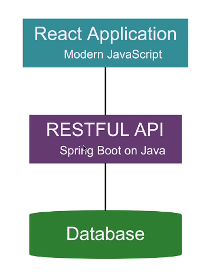
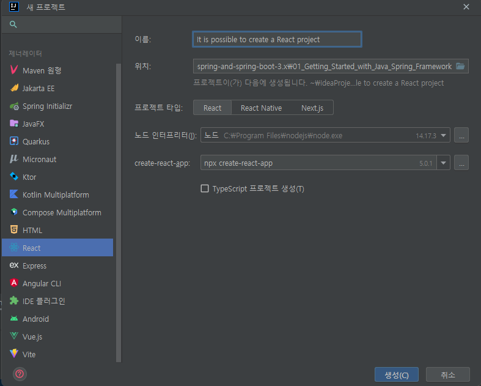
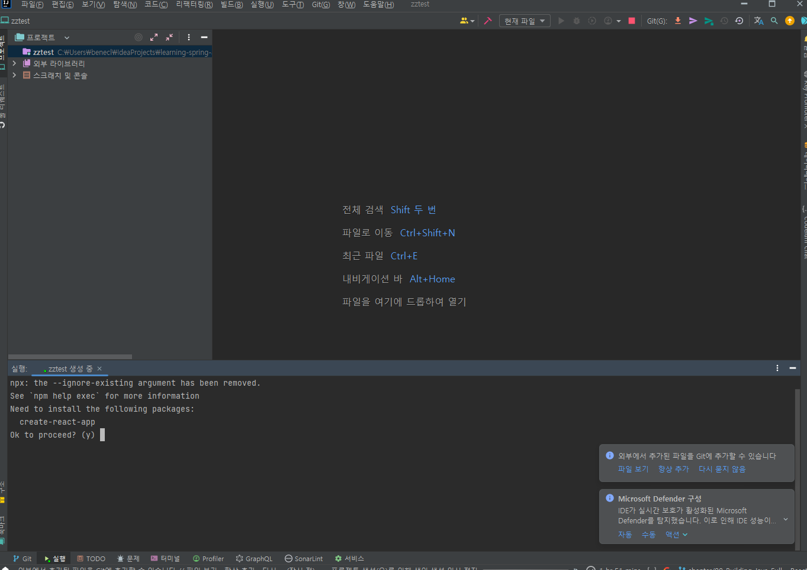
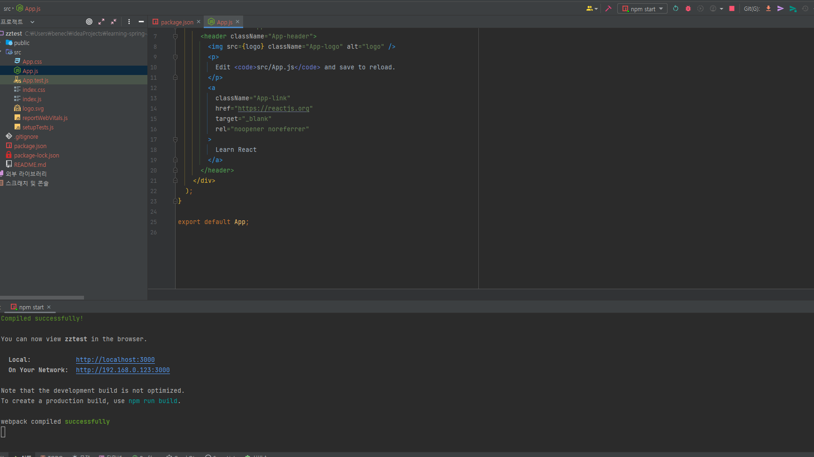
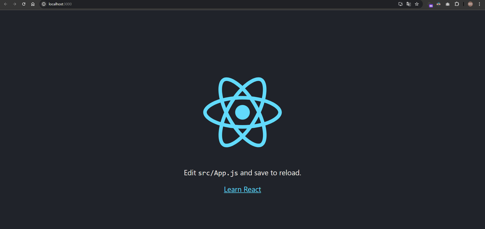

# 📒 [학습 노트] 챕터 8 : Spring Boot와 Spring Framework, Hibernate로 Java REST API 생성하기

## 목록
1. [시작하기 - 풀 스택 Spring Boot와 React 애플리케이션](#1단계---시작하기---풀-스택-spring-boot와-react-애플리케이션)
2. [풀 스택 아키텍처는 무엇이며 왜 필요한가](#2단계---풀-스택-아키텍처는-무엇이며-왜-필요한가)
3. [JavaScript와 ECMA Script의 역사 이해하기](#3단계---javascript와-ecma-script의-역사-이해하기)
4. [Visual Studio Code 설치](#4단계---visual-studio-code-설치)
5. [Node.js와 npm 설치](#5단계---nodejs와-npm-설치)
6. [Create React App으로 React 앱 생성하기](#6단계---create-react-app으로-react-앱-생성하기)
7. [중요한 Node.js 명령어 살펴보기 - Create React App](#7단계---중요한-nodejs-명령어-살펴보기---create-react-app)
8. [Visual Studio Code와 Create React App 살펴보기](#8단계---visual-studio-code와-create-react-app-살펴보기)
9. [Create React App의 폴더 구조 살펴보기](#9단계---create-react-app의-폴더-구조-살펴보기)
10. [React 컴포넌트 시작하기](#10단계---react-컴포넌트-시작하기)
11. [첫 번째 React 컴포넌트 생성 등](#11단계---첫-번째-react-컴포넌트-생성-등)
12. [React에서 State 시작하기 - Hook으로 State 사용하기](#12단계---react에서-state-시작하기---hook으로-state-사용하기)
13. [JSX 탐색 - React 뷰](#13단계---jsx-탐색---react-뷰)
14. [JavaScript 모범 사례 따라하기 - 모듈로 리팩토링](#14단계---javascript-모범-사례-따라하기---모듈로-리팩토링)

---

## 1단계 - 시작하기 - 풀 스택 Spring Boot와 React 애플리케이션

#### 중요 키워드
1. Modern JavaScript (ECMA 스크립트 등장 이후의 JS)
2. 리액트 (React Fundamentals) 
3. 리액트 컴포넌트 (Component)
4. State
5. 라우팅 (Routing)
6. REST API 호출
7. 풀스택 애플리케이션 인증 구현

#### 실습 예제
1. 카운터 애플리케이션
   - 리액트의 기초 이해 
     - 컴포넌트가 무엇인가
     - 컴포넌트가 왜 필요한가
     - 컴포넌트는 어떻게 구축하는가
     - State는 무엇인가
     - 속성을 뜻하는 Props는 무엇인가
2. Todo 관리 애플리케이션 (풀 스택 애플리케이션)
   - Todo 애플리케이션의 기능 (백엔드 실습 때 만들어 보았던 기능)
   - 로그인, 로그아웃
     - JWT
     - JSON 웹 토큰

---

## 2단계 - 풀 스택 아키텍처는 무엇이며 왜 필요한가

#### 풀 스택 애플리케이션

- 일반적인 풀 스택 아키텍쳐는 3가지 컴포넌트로 구성된다.
  - 프론트엔드 : 주로 브라우저에서 실행된다. (해당 과정에서는 리액트로 구성)
  - 백엔드 : 서버에서 실행된다. (해당 과정에서는 Spring Boot로 구성)
  - 데이터베이스 : 서버와 연결된 데이터 저장소 (해당 과정에서는 H2, MySQL로 구성)
- 애플리케이션에 인증은 필수적이다.
  - REST API를 보호하기 위함 (해당 과정에서는 Spring Security로 구성)
    - Basic Security로 시작해서 JWT를 구현할 것이다.

#### 왜 풀 스택 아키텍처인가?
풀 스택 아키텍처는 구현 난이도가 복잡하다. 여러 언어를 이해해야 하고 다양한 프레임워크를 알아야 한다. 프론트엔드와 백엔드는 빌드 도구 등도 차이가 있다. 그럼에도 왜 풀 스택 아키텍처를 사용할까?

- 풀 스택 아키텍처는 유연하고, REST API 사용이 가능하다.
- REST API가 있으면 다른 애플리케이션을 만들어서 API와 소통하도록 할 수 있다. ex) 모바일 앱, IoT 앱 등

---

## 3단계 - JavaScript와 ECMA Script의 역사 이해하기

#### JS(Java Script) 역사
- 지속적으로 진화해왔다.
  - ES5, ES6, ES7, ES13, ES14 등
- 초기 버전은 'DOM'을 다루는 데 사용되었고, 작성이 어려웠다.
  - DOM(Document Object Model) : HTML의 id, class 등을 통해 접근, 조작 가능한 객체

#### ES(ECMA Script)
- ECMA-262 기술 규격에 따라 정의한 표준화된 스크립트 프로그래밍 언어.
  - 지속적인 버전 업데이트를 거쳐왔다.
  - 자바스크립트의 표준화된 버전이다.

---

## 4단계 - Visual Studio Code 설치

#### VS 코드 설치
[공식페이지 - 다운로드](https://code.visualstudio.com/download)

#### 부록 : 인텔리제이에서 React 프로젝트 생성


- 인텔리제이 프로젝트 생성 tool에서도 React를 지원한다.
- 리액트 프로젝트를 시작하는 명령어가 포함된다.
- 주의 : Node JS가 설치되어 있어야 한다.


- 프로젝트 파일 생성이 완료된 후 리액트 프로젝트 생성 명령어에 대한 응답을 요청한다.
  - y를 눌러 진핼할 수 있다.


- 리액트 초기화가 완료되면, 인텔리제이에서 'run' 버튼으로 `npm start` 명령어를 실행할 수 있다.

---

## 5단계 - Node.js와 npm 설치

#### Node js 설치
[공식페이지 - 다운로드](https://nodejs.org/en/download/)
```
node --version
```
- 명령어로 node 설치가 정상적으로 되었는지 확인할 수 있다.

#### NPM(Node.js Package Manager)
- 패키지 관리자 (Spring의 Maven | gradle 과 유사하다)
- node를 설치하면 자동으로 node 버전에 호환되는 npm이 함께 설치된다.
  ```
  npm -version 
  ```
  - 명령어로 npm 버전을 확인해서 설치가 정상적으로 되었는지 확인할 수 있다.

#### Node 프로젝트 생성
```
npm init
```
- 현재 경로의 폴더에 node 프로젝트를 생성한다. (package name만 작성해주고 나머지는 모두 엔터를 눌러 기본값으로 설정할 수 있다.)
  - package name: 프로젝트 이름
  - version: 프로젝트 버전
  - description: 프로젝트 설명
  - entry point: 프로젝트의 메인 파일 (기본값 index.js)
  - test command: 테스트 명령어
  - git repository: Git 저장소 URL
  - keywords: 프로젝트 키워드
  - author: 작성자 정보
  - license: 라이선스 정보 (기본값 ISC)

#### package.json
프로젝트의 메타데이터, 의존성, 스크립트 등 중요한 정보를 포함하고 있는 '매니페스트' 파일

프로젝트 설정을 마치고 생성이 끝나면 폴더 경로에 'package.json' 파일이 생성된다.
```json
{
  "name": "first-npm-projet",
  "version": "1.0.0",
  "description": "",
  "main": "index.js",
  "scripts": {
    "test": "echo \"Error: no test specified\" && exit 1"
  },
  "author": "",
  "license": "ISC"
}
```
- 프로젝트를 생성할 때 설정한 내용이 명시되어 있다.

#### 프로젝트에 라이브러리 추가 (jquery)
```
npm install jquery
```
- 프로젝트 경로에 해당 명령어를 입력한다.
- 패키지 경로에 'node_modules' 폴더가 생기고 내부에 'jquery' 폴더가 생긴 것을 볼 수 있다.

```json
{
  "name": "first-npm-projet",
  "version": "1.0.0",
  "description": "",
  "main": "index.js",
  "scripts": {
    "test": "echo \"Error: no test specified\" && exit 1"
  },
  "author": "",
  "license": "ISC",
  "dependencies": {
    "jquery": "^3.7.1"
  }
}
```
- 'package.json' 파일을 보면 'dependencies' 항목에 "jquery"가 추가 된 것을 볼 수 있다.

---

## 6단계 - Create React App으로 React 앱 생성하기

#### 리액트 (React)
SPA(Single Page Application) 구축에 가장 인기 있는 JavaScript 라이브러리
- facebook 으로 유명한 Meta에서 만든 오픈 소스 프로젝트이다.
- 컴포넌트 기반 : 컴포넌트를 조합하여 애플리케이션을 만든다.
  - Spring의 컨포넌트와는 다르다.
- 

#### SPA(Single Page Application)
초기에 하나의 HTML 페이지만 로드하고, 이후 필요한 데이터만 동적으로 갱신하는 기술

예를 들어 JSP로 만든 'Todo' 관리 웹 애플리케이션의 경우 Todo List 페이지에서 새로운 Todo를 생성 할 때 페이지 전체가 새로고침 되면서 변경 사항을 반영한다. SPA는 페이지를 새로고침 하지 않고, 변경 부분만 새로고침 하여 반영할 수 있다.

#### Create React App을 사용해서 React 프로젝트 시작하기
```
npx create-react-app todo-app
```
- 해당 명령어를 입력해서 'todo-app'라는 이름으로 React 프로젝트를 생성할 수 있다. (todo-app 폴더까지 자동으로 생성된다.)


- 생성이 완료되면 `npm start` 명령어로 리액트 애플리케이션을 실행할 수 있다.

#### 부록 : 인텔리제이에서 React 프로젝트 생성


- 인텔리제이 프로젝트 생성 tool에서도 React를 지원한다.
- 리액트 프로젝트를 시작하는 명령어가 포함된다.
- 주의 : Node JS가 설치되어 있어야 한다.


- 프로젝트 파일 생성이 완료된 후 리액트 프로젝트 생성 명령어에 대한 응답을 요청한다.
  - y를 눌러 진핼할 수 있다.


- 리액트 초기화가 완료되면, 인텔리제이에서 'run' 버튼으로 `npm start` 명령어를 실행할 수 있다.

---

## 7단계 - 중요한 Node.js 명령어 살펴보기 - Create React App

1. npm start : 개발 모드에서 애플리케이션 실행
   - `npm start`로 리액트 애플리케이션을 실행하고 프로젝트 경로 '/public/index.html' 파일을 수정하면 수정 사항이 바로 웹 페이지에 반영되는 것을 볼 수 있다.
2. npm test : React 프로젝트 코드의 유닛 단위 테스트를 실행할 수 있다.
3. npm run build : 배포 가능 유닛을 프로덕션으로 빌드한다.
  - 코드를 압축해서 main에 해당하는 html, js, css 파일을 생성한다.
4. npm install : 특정 라이브러리를 설치한다. ex) npm install jquery

---

## 8단계 - Visual Studio Code와 Create React App 살펴보기

VS Code 사용법 및 팁 (파일 검색 등)을 강의했으나 인텔리제이를 사용하는 관계로 노트를 작성하지 않았다.

---

## 9단계 - Create React App의 폴더 구조 살펴보기

#### 프로젝트 폴더 구조
```프로젝트 디렉토리 트리
todo-app
├── /build
├── /node_modules
├── /public
│   └── index.html
├── /src
│   ├── index.js
│   └── App.js
├── package.json
└── README.md
```
대표적인 폴더 및 파일 구조만 그렸다.
- '/build' : `npm run build` 명령어로 빌드한 결과물
- '/node_modules' : 라이브러리 루트 폴더
- '/public/index.html' : React를 초기화 할 때 처음으로 로드되는 파일
- '/src/index.js' : 'index.html' 파일 내부에 들어가는 컴포넌트를 연결하는 파일
- '/src/App.js' : 프로젝트 실행을 위한 컴포넌트
- 'package.json' : 프로젝트 설정 & 라이브러리 목록에 대한 정보를 담은 json 파일
- 'README.md' : 프로젝트를 설명하는 문서

#### React 애플리케이션의 간단한 실행 원리
1. 'index.html' 로드
```html
<!-- /public/index.html -->

<!DOCTYPE html>
<html lang="en">
<!-- (생략) -->
  <body>
    <noscript>You need to enable JavaScript to run this app.</noscript>
    <div id="root"></div>
    <!-- (생략) -->
  </body>
</html>
```
- `<div id="root"></div>` root id를 가진 태그에 주목하자 (index.js 파일과 연결.)

2. index.js
```js
import React from 'react';
import ReactDOM from 'react-dom/client';
import './index.css';
import App from './App';
import reportWebVitals from './reportWebVitals';

const root = ReactDOM.createRoot(document.getElementById('root'));
root.render(
  <React.StrictMode>
    <App />
  </React.StrictMode>
);

// If you want to start measuring performance in your app, pass a function
// to log results (for example: reportWebVitals(console.log))
// or send to an analytics endpoint. Learn more: https://bit.ly/CRA-vitals
reportWebVitals();
```
- 파일 내부 임포트 문을 보면 'index.css', '/App' 등을 불러오는 것을 알 수 있다.
- 'root' 변수를 보면 `ReactDOM.createRoot(document.getElementById('root'))`으로 'root'라는 id를 가진 HTML 요소를 선택하고 있다.
- `root.render()`를 통해 내부에서 `<App />`을 불러오고 있다. (App.js)

#### App.js
```js
import logo from './logo.svg';
import './App.css';

function App() {
  return (
    <div className="App">
      <header className="App-header">
        
        <p>
          Edit <code>src/App.js</code> and save to reload.
        </p>
        <a
          className="App-link"
          href="https://reactjs.org"
          target="_blank"
          rel="noopener noreferrer"
        >
          Learn React
        </a>
      </header>
    </div>
  );
}

export default App;
```
- 리액트 애플리케이션을 실행했을 때 나타난 페이지를 정의하고 있다.

---

## 10단계 - React 컴포넌트 시작하기

웹 클라이언트 애플리케이션은 HTML 요소로 구성된 많은 페이지를 가지고 있다. 그리고 어떤 HTML 요소(헤더, 푸터, 네비게이션 등)는 많은 페이지에 중복으로 삽입되기도 한다.
- React 컴포넌트는 이러한 중복 요소를 줄이기 위해 사용하는 코드조각이다. (jpsf 와 유사함)
- React 컴포넌트는 헤더, 푸터 뿐만 아니라 페이지의 모든 요소를 블럭화 하는 방식으로 사용한다. (리액트 애플리케이션은 컴포넌트로만 구성됨)
- React 컴포넌트는 단순히 코드 중복을 줄이는 것을 넘어서 각 컴포넌트가 자체적인 상태를 가질 수 있다.
  - 즉, 페이지 내의 HTML 요소들이 개별적 상태를 가지기 때문에 페이지 새로고침 없이 특정 컴포넌트를 업데이트 하는 것이 가능하다.

#### 추가 이론 학습
- 일반적으로 'App.js'가 첫 번째로 로드되는 컴포넌트이고, 커스텀 컴포넌트는 'App.js'의 자식으로 만든다.
- 리액트 컴포넌트는 JSX를 사용한다.
- JS를 통해 로직을 정의하고, CSS로 스타일을 정의할 수 있다.
- 컴포넌트의 State(상태)는 컴포넌트 내부의 데이터 저장소와 비슷하다.
- Props를 통해 컴포넌트 간의 데이터 전달이 가능하다.
- 컴포넌트의 이름은 항상 대문자로 시작해야 한다.

---

## 11단계 - 첫 번째 React 컴포넌트 생성 등

#### 함수 컴포넌트
```js 
//경로 : /src/App.js

import logo from './logo.svg';
import './App.css';

function App() {
  return (
    <div className="App">
      <FirstComponent></FirstComponent>
      <SecondComponent></SecondComponent>
    </div>
  );
}

function FirstComponent() {
  return (
      <div className="FirstComponent">첫 번째 컴포넌트</div>
  );
}

function SecondComponent() {
  return (
      <div className="SecondComponent">두 번째 컴포넌트</div>
  );
}

export default App;
```
- Js 함수를 선언하고 return으로 원하는 HTML을 입력한다.
- 함수와 동일한 이름의 커스텀 HTML 태그(컴포넌트)를 사용할 수 있다. (IDE에서 자동완성 지원됨)
- 함수 형태로 선언하기 때문에 '함수 컴포넌트' 라고 부른다.

#### 클래스 컴포넌트
```js
//경로 : /src/App.js

import logo from './logo.svg';
import './App.css';
import { Component } from 'react';

function App() {
  return (
          <div className="App">
            <FirstComponent></FirstComponent>
            <SecondComponent></SecondComponent>
          </div>
  );
}

//...(생략)

class ThirdComponent extends Component {
  render() {
    return (
            <div className="ThirdComponent">세 번째 컴포넌트</div>
    );
  }
}

class FourthComponent extends Component {
  render() {
    return (
            <div className="FourthComponent">네 번째 컴포넌트</div>
    );
  }
}
```
1. `import { Component } from 'react';` : 리액트의 'Component'를 임포트한다
2. Component를 상속하는 클래스를 작성한다.
3. 클래스에 'render()' 함수를 작성하고 리턴할 HTML문을 작성한다.

---

## 12단계 - React에서 State 시작하기 - Hook으로 State 사용하기

#### 함수 컴포넌트 vs 클래스 컴포넌트
- State : 특정 컴포넌트에 대한 정보(데이터)를 의미함.
  - 초기 버전의 리액트에서는 클래스 컴포넌트 State를 가질 수 있었다.
- Hooks : 함수 컴포넌트에도 State를 추가할 수 있다. (16.8 버전 이후)
  - 리액트 버전 확인은 'package.json' 파일 내부에서 확인할 수 있다.

---

## 13단계 - JSX 탐색 - React 뷰

#### JSX(JavaScript XML) 
JSX는 React 컴포넌트를 구성하는 언어이다. HTML보다 엄격한 문법 규칙을 고수하고 있다.
1. 닫는 태그가 필수이다.
  ```js
  function FirstComponent() {
    return (
            <div className="FirstComponent">
    );
  }
  ```
  - 해당 문법은 `<div>`의 닫는 태그가 없어서 컴파일 에러가 발생한다.
  - `<div className="FirstComponent" / >` 와 같이 'self-closing' 태그를 사용하는 것은 허용된다.
2. 최상위 태그는 하나만 가능하다. (공유 부모로 묶어줘야 한다.)
  ```js
  function FirstComponent() {
    return (
            <div className="FirstComponent">첫 번째 컴포넌트</div>
            <div className="SecondComponent">두 번째 컴포넌트</div>
    );
  }
  ```
  - 해당 코드는 최상위 div 태그가 하나를 초과해서 컴파일 에러가 발생한다. (두 태그를 묶는 부모 태그 안에 위치시키면 해결된다.) 
    - 부모 태그는 `<></>`로 빈 태그를 사용해도 가능하다.
3. 컴포넌트 이름은 대문자로 시작해야 한다. (파스칼 케이스)
   - HTML 태그가 전부 소문자로 시작하기 때문. (HTML과 리액트 컴포넌트 간의 구분 용이를 위해)
4. JSX 전용 특정 CSS 클래스에 유의해야 한다.
   - ex) 'class' 가 아닌 'className'

#### 컴포넌트 CSS 적용법
```css
/* /src/App.css */

.FirstComponent {
  color: #ff0000;
}
```

#### Bable
ES는 계속해서 발전해왔으며 많은 버전이 있다. 간혹 오래된 브라우저는 최신 ES를 지원하지 않는 경우가 있다. 이 문제를 해결하는 것이 'Bable'이다.
- 최신 JS 코드를 작성해도 옛날 브라우저에서 실행할 수 있도록 해준다.
- JSX를 JS 코드로 변환하는 작업을 해준다.
- [babeljs.io](https://babeljs.io/repl)에서 데모를 사용해볼 수 있다.
  - 데모 사이트에서 틀린 문법으로 JSX를 작성하면 경고를 피드백해준다.

---

## 14단계 - JavaScript 모범 사례 따라하기 - 모듈로 리팩토링

#### 각 컴포넌트는 각 모듈(파일)에 분리되어 있어야 한다.
```js
// /src/components/learning-examples/FirstComponent.jsx

export default function FirstComponent() {
  return (
      <div className="FirstComponent">첫 번째 컴포넌트</div>
  );
}
```
- 컴포넌트를 분리했다.
- `export default`를 붙여서 내보내주어야 외부 파일에서 해당 컴포넌트 사용이 가능하다.

```js
// /src/App.js

import './App.css';
import FirstComponent from './components/learning-examples/FirstComponent';
import SecondComponent from "./components/learning-examples/SecondComponent";
import ThirdComponent from "./components/learning-examples/ThirdComponent";
import FourthComponent from "./components/learning-examples/FourthComponent";

function App() {
  return (
    <div className="App">
      <FirstComponent></FirstComponent>
      <SecondComponent></SecondComponent>
      <ThirdComponent></ThirdComponent>
      <FourthComponent></FourthComponent>
    </div>
  );
}

export default App;
```
- 분리한 컴포넌트를 import 해서 사용할 수 있다.

#### export default
1. export default 는 모듈 내에서 하나의 컴포넌트에만 사용할 수 있다.
   - 모듈에 다른 컴포넌트가 있다면 하나를 제외하고는 모두 'export' 만 붙여서 선언해야 한다.
2. 모듈 내 기본 컴포넌트를 의미한다.
    ```js
    // /src/components/learning-examples/FirstComponent.jsx
    
    export default function FirstComponent() {
      return (
              <div className="FirstComponent">첫 번째 컴포넌트</div>
      );
    }
    
    export function FifthComponent() {
      return (
              <div className="FifthComponent">다섯 번째 컴포넌트</div>
      );
    }
    
    
    // /src/App.js
    
    import './App.css';
    import FirstComponent from './components/learning-examples/FirstComponent';
    //...(생략)
    import FifthComponent from './components/learning-examples/FirstComponent';
    
    function App() {
      return (
              <div className="App">
                <FirstComponent></FirstComponent>
                // ...(생략)
                <FifthComponent></FifthComponent>
              </div>
      );
    }
    
    export default App;
    
    ```
    - 이렇게 작성해도 'FifthComponent' 컴포넌트는 노출되지 않는다. 대신 기본 컴포넌트인 'FirstComponent'가 노출된다.

    ```js
    // /src/App.js
   
    import './App.css';
    import FirstComponent from './components/learning-examples/FirstComponent';
    //...(생략)
    import 아무이름 from './components/learning-examples/FirstComponent';
    
    function App() {
      return (
              <div className="App">
                <FirstComponent></FirstComponent>
                // ...(생략)
                <아무이름></아무이름>
              </div>
      );
    }
    
    export default App;
    ```
    - 심지어 이렇게 실제 모듈에 등록되어 있지 않는 이름으로 선언해도 'FirstComponent'가 노출된다.

#### 모듈 내의 여러 개 컴포넌트 export
```js
// /src/App.js

import './App.css';
import FirstComponent from './components/learning-examples/FirstComponent';
//...(생략)
import {FifthComponent} from './components/learning-examples/FirstComponent';

function App() {
  return (
          <div className="App">
            <FirstComponent></FirstComponent>
            // ...(생략)
            <FifthComponent></FifthComponent>
          </div>
  );
}

export default App;
```
- 이와 같이 컴포넌트를 임포트 할 때 `{FifthComponent}` 중괄호로 묶어주면 기본 컴포넌트가 아닌 해당 이름을 가진 컴포넌트를 가져온다.

#### 래퍼 컴포넌트 (Wrapper Component)를 사용해서 리팩토링
App.js 파일에서 많은 컴포넌트를 임포트하고 있다. 앞으로 더 많은 컴포넌트가 생겨나게 되면 임포트문이 훨씬 길어지게 될 것이다. 이 문제를 개선할 방법이 있다.

```js
// /src/components/learning-examples/LearningComponent.jsx

import FirstComponent from "./FirstComponent";
import SecondComponent from "./SecondComponent";
import ThirdComponent from "./ThirdComponent";
import FourthComponent from "./FourthComponent";
import {FifthComponent} from "./FirstComponent";

export default function LearningComponent() {
  return (
      <>
        <FirstComponent></FirstComponent>
        <SecondComponent></SecondComponent>
        <ThirdComponent></ThirdComponent>
        <FourthComponent></FourthComponent>
        <FifthComponent></FifthComponent>
      </>
  );
}
```
- 이후 App.js에서는 `LearningComponent` 컴포넌트만 불러와서 한 번에 사용하는 것이 가능하다.

---