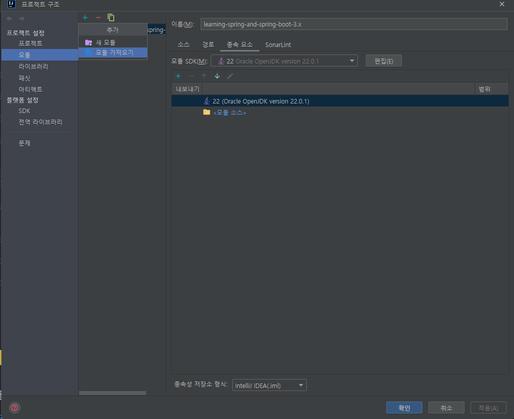
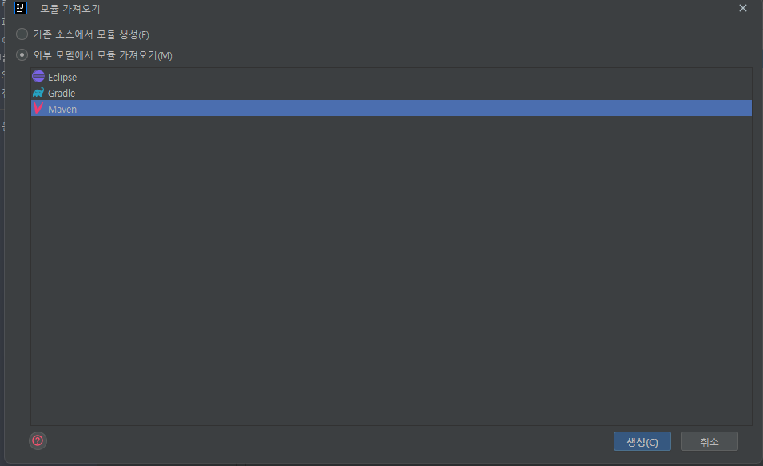

# 📒 [학습 노트] 챕터 11: Spring Boot REST API와 React 프론트엔드 연결하기 - Java 풀스택 앱

## 목록
1. [React 풀 스택 애플리케이션을 위해 Todo REST API 프로젝트 설정하기](#1단계---react-풀-스택-애플리케이션을-위해-todo-rest-api-프로젝트-설정하기)
2. [React Hello World 컴포넌트에서 Spring Boot Hello World REST API 호출하기](#2단계---react-hello-world-컴포넌트에서-spring-boot-hello-world-rest-api-호출하기)
3. [Spring Boot REST API에 대해 CORS 요청 활성화하기](#3단계---spring-boot-rest-api에-대해-cors-요청-활성화하기)
4. [React에서 Spring Boot Hello World Bean과 패스 변수 REST API 호출하기](#4단계---react에서-spring-boot-hello-world-bean과-패스-변수-rest-api-호출하기)
5. [Spring Boot REST API 호출 코드를 별도의 모듈에 리팩터링하기](#5단계---spring-boot-rest-api-호출-코드를-별도의-모듈에-리팩터링하기)
6. [Spring Boot REST API에서 Axios를 사용하는 최적의 방식](#6단계---spring-boot-rest-api에서-axios를-사용하는-최적의-방식)

---

## 1단계 - React 풀 스택 애플리케이션을 위해 Todo REST API 프로젝트 설정하기

챕터 목표 : 기존 Spring Boot로 제작한 백엔드 애플리케이션을 재활용해서 풀 스택 애플리케이션을 만들 것이다.

원활한 진행을 위해 정돈된 백엔드 [애플리케이션 프로젝트](https://github.com/in28minutes/master-spring-and-spring-boot/blob/main/13-full-stack/99-reuse/01-rest-api-starting-code.zip)를 제공한다.

#### REST API 목록
1. Hello World REST API
- GET '/hello-world'
- GET '/hello-world-bean'
- GET '/hello-world/path-variable/{name}'
2. Todo REST API
- GET '/user/{username}/todos'
- GET '/user/{username}/todos/{id}'
- POST '/user/{username}/todos/{id}'
- PUT '/user/{username}/todos/{id}'
- DELETE '/user/{username}/todos/{id}'

#### 프로젝트 설치 & 모듈 등록 (IntelliJ IDE)
[링크](https://github.com/in28minutes/master-spring-and-spring-boot/blob/main/13-full-stack/99-reuse/01-rest-api-starting-code.zip)에서 제공

1. 필요 없는 파일 삭제. (이클립스 설정 파일 삭제)
- '.settings' 디렉토리 및 내부 파일
- '.classpath' 파일
- '.project' 파일

2. 모듈 등록
- 프로젝트 구조 (Ctrl + Alt + Shift + S)설정에 들어간다.
- 추가(Alt + insert) 버튼을 클릭 후 '모듈 가져오기'를 선택한다.
  - 
- 모듈로 가져올 프로젝트를 선택하고 '확인' 버튼을 클릭한다.
- '외부 모델에서 모듈 가져오기'에서 'Maven'을 선택 후 '생성' 버튼을 클릭한다.
  - 
- '적용' 혹은 '확인'을 누른 후 모듈을 불러올 때까지 기다린다.

3. 프로젝트 실행
모듈 불러오기가 끝난 후 'RestfulWebServicesApplication' 애플리케이션을 실행하고, ['/hello-world'](http://localhost:8080/hello-world) GET API를 확인한다.

---

## 2단계 - React Hello World 컴포넌트에서 Spring Boot Hello World REST API 호출하기

#### Axios
브라우저와 Node.js에서 사용할 수 있는 Promise 기반의 HTTP 클라이언트 라이브러리
- Promise : 비동기 작업을 처리하기 위한 객체
  - 비동기 작업 : 특정 코드의 실행이 완료될 때까지 기다리지 않고 다음 코드를 먼저 실행하는 방식의 작업
    - ex) 서버에 요청을 보낸 후 응답을 기다리는 동안 다른 작업을 진행할 수 있다. 

#### Axios 설치
```
npm install axios
```

#### Axios 사용
```jsx
import axios from "axios";

function callHelloWorldRestApi() {
    console.log("callHelloWorldRestApi")
    axios.get('http://localhost:8080/hello-world')
    .then ((response) => successfulResponse(response))
    .catch((error) => failedResponse(error))
    .finally(() => console.log("finally"))
}

function successfulResponse(response) {
  console.log(response)
}

function failedResponse(error) {
  console.log(error)
}
```
- then : 요청 성공
- catch : 요청 실패
- finally : 성공과 실패 상관하지 않음
- Promise 체이닝(Promise chaining) : 여러 개의 비동기 작업을 순차적으로 처리할 때 사용되는 기법
  - then이 정상적으로 완료되면 catch는 실행되지 않는다.
  - then은 여러 번 사용할 수 있다.
  - catch와 finally는 일반적으로 체인의 끝에 한 번씩 사용된다.

---

## 3단계 - Spring Boot REST API에 대해 CORS 요청 활성화하기


2단계를 진행 후 실제 브라우저에서 API 요청을 보내면 
```
"Access to XMLHttpRequest at 'http://localhost:8080/hello-world' from origin 'http://localhost:3000' has been blocked by CORS policy: No 'Access-Control-Allow-Origin' header is present on the requested resource."
```
다음과 같은 에러 메시지가 콘솔에 출력된다. 해석하자면 API 요청이 "CORS 정책에 의해 차단되었다"는 것이다.

#### cross-origin request
API가 차단된 이유는 3000번 포트(클라이언트)에서 8080번 포트(서버)로 보내는 요청이 'cross-origin request'이기 때문이다.
- 다른 출처(origin)로 보내는 요청을 의미함. 아래 세 가지 중 하나라도 다르다면 다른 출처로 인식한다.
  - 프로토콜 (예: http, https)
  - 호스트 (도메인 또는 IP 주소)
  - 포트 번호
- 기본적으로 브라우저는 Same-Origin Policy를 따라 Cross-Origin 요청을 제한
  - 대표적인 공격으로 CSRF 공격이 있다.

#### CSRF(Cross-Site Request Forgery) 공격
악의적인 웹사이트가 사용자의 브라우저를 통해 다른 신뢰할 수 있는 사이트에 요청을 보내 민감한 정보를 탈취하거나 원치 않는 작업을 수행하는 것
1. 은행, SNS 등의 서비스를 이용하면서 로그인이 된 상태의 브라우저 환경에서
2. 악의적인 웹 사이트에 사용자가 접속한다.
3. 브라우저에 저장된 정보 ex) 은행 인증 권한, SNS 인증 권한 등을 악의적 웹 사이트가 탈취한다.
4. 악의적 웹 사이트에서 사용자의 인증 권한으로 은행이나 SNS에 요청을 보낸다.
5. 의도하지 않은 계좌 이체, 게시물 작성 등의 피해가 발생한다.

이와 같은 시나리오를 CSRF 공격이라고 한다.

#### CORS (Cross-Origin Resource Sharing)
Cross-Origin 요청에 대해 리소스 공유를 허용하는 옵션.
- 브라우저에 의해 구현되는 보안 메커니즘
- 서버가 특정 출처로부터의 요청을 허용한다고 명시적으로 알리면 브라우저는 해당 출처로부터의 Cross-Origin 요청을 서버에 전송하는 것을 허용한다.
- 서버에서 클라이언트 출처(http://localhost:3000/)를 명시하여 클라이언트에서의 Cross-Origin 요청을 허용할 수 있다.

#### CORS 설정하기 (WebMvcConfigurer)
대부분의 보안 설정은 Spring Security에서 지원한다. CORS 역시 Spring Security에서 지원하는 설정이다.

그런테 CORS의 경우 브라우저에서 동작하는 보안 정책이다. 즉, 서버가 어떠한 보안 정책 및 보안 설정을 가지고 있는지 브라우저는 알지 못한 상태로 CORS를 강제한다. Spring Security를 사용하지 않는 서버의 경우도 CORS 보안 정책을 피해갈 수 없다.
서버 애플리케이션이 Spring Security 라이브러리를 사용하지 않는 경우를 대비해서 스프링 프레임워크에선 기본적으로 CORS 설정을 할 수 있는 방법을 제공한다.

- 애플리케이션 메인 파일에 선언.
```java
@SpringBootApplication
public class RestfulWebServicesApplication {

	public static void main(String[] args) {
		SpringApplication.run(RestfulWebServicesApplication.class, args);
	}

	@Bean
	public WebMvcConfigurer corsConfigurer() {
		return new WebMvcConfigurer() {
			@Override
			public void addCorsMappings(org.springframework.web.servlet.config.annotation.CorsRegistry registry) {
				registry.addMapping("/**")
						.allowedMethods("*")
						.allowedOrigins("http://localhost:3000/");
			}
		};
	}

}
```
- [WebMvcConfigurer](https://docs.spring.io/spring-framework/docs/current/javadoc-api/org/springframework/web/servlet/config/annotation/WebMvcConfigurer.html) : Spring MVC 구성을 사용자 정의하는 데 사용되는 인터페이스
  - addCorsMappings : CORS 설정을 위한 메서드 (오버라이드 함)
    - addMapping() : 허용 API 엔드포인트, "/**"를 통해 모든 API 허용 
      - 특정 API만 허용 가능 : ex) "/api/**": /api로 시작하는 모든 경로에 적용
        - addMapping()의 경우 한 번에 하나의 경로만 지정할 수 있다.
          - addMapping()를 추가 선언해서 다른 경로에 대한 설정을 추가할 수 있다.
            ```java
            @Bean
            public WebMvcConfigurer corsConfigurer() {
              return new WebMvcConfigurer() {
                @Override
                public void addCorsMappings(org.springframework.web.servlet.config.annotation.CorsRegistry registry) {
                  registry.addMapping("/api/**")
                          .allowedMethods("*")
                          .allowedOrigins("http://localhost:3000");
                  registry.addMapping("/user")
                          .allowedMethods("*")
                          .allowedOrigins("http://localhost:3000");
                }
              };
            }
            ```
    - allowedMethods() : 허용 HTTP 메서드, ("*")를 통해 모든 HTTP 메서드 허용 
      - 특정 메서드만 허용 가능 : ex) allowedMethods("GET", "POST", "PUT", "DELETE")
    - allowedOrigins() : 허용 출처, 클라이언트 도메인:포트 명시적 허용
      - 여러 출처 허용 가능: ex) allowedOrigins("http://localhost:3000", "https://example.com")

---\

## 4단계 - React에서 Spring Boot Hello World Bean과 패스 변수 REST API 호출하기

####
```jsx
export default function WelcomeComponent() {
  const [message, setMessage] = useState(null)

  function callHelloWorldRestApi() {
    console.log("callHelloWorldRestApi")
    axios.get('http://localhost:8080/hello-world-bean')
    .then ((response) => successfulResponse(response))
    .catch((error) => failedResponse(error))
    .finally(() => console.log("finally"))
  }

  function successfulResponse(response) {
    console.log(response)
    setMessage(response.data.message)
  }
  
  //...(생략)
  return (
        // ...(생략)
        <div className="text-info">{message}</div>
  );
}
```
- useState에 API response을 담을 수 있다.
- response.data : API의 응답 데이터
  ```json
  {
    "message" : "Hello World"
  }
  ```
  - 값이 message key에 담겨서 오기 때문에 "Hello World"를 노출하기 위해서는 `response.data.message`로 접근해야 한다.

---

## 5단계 - Spring Boot REST API 호출 코드를 별도의 모듈에 리팩터링하기

#### HelloWolrdBean API 리팩토링
```js
// HelloWorldApiService.js 
export function retrieveHelloWorldBean() {
  return axios.get('http://localhost:8080/hello-world-bean')
}
```
- 이와 같이 axios.get 부분만 분리해서 컴포넌트 모듈에서 axios를 직접 임포트하지 않고 `retrieveHelloWorldBean()` 함수를 사용해서 api 요청을 하도록 할 수 있다.

```js
export const retrieveHelloWorldBean = () => axios.get('http://localhost:8080/hello-world-bean')
```
- 이와 같이 변수화 시켜서 사용하는 것도 가능하다.

```jsx
  function callHelloWorldRestApi() {
  retrieveHelloWorldBean()
  .then ((response) => successfulResponse(response))
  .catch((error) => failedResponse(error))
  .finally(() => console.log("finally"))
}
```
- 사용할 때는 `axios.get('http://localhost:8080/hello-world-bean')` 대신 `retrieveHelloWorldBean()`를 사용하기만 하면 된다.

---

## 6단계 - Spring Boot REST API에서 Axios를 사용하는 최적의 방식

#### Axios에서 API 패스변수 처리하기
```
export const retrieveHelloWorldPathVariable = (username) => axios.get(`http://localhost:8080/hello-world/path-variable/${username}`)
```
- 이와 같은 방식으로 패스변수를 전달할 수 있다.

#### Axios API 베이스 URL 설정하기
```js
import axios from "axios";

const apiClient = axios.create({
  baseURL: 'http://localhost:8080'
});

export const retrieveHelloWorldBean = () => apiClient.get('/hello-world-bean')
export const retrieveHelloWorldPathVariable = (username) => apiClient.get(`/hello-world/path-variable/${username}`)
```
- 중복해서 발생하는 서버도메인을 해당 방식으로 개선할 수 있다.
  - 베이스 URL 설정과 함께 선언한 `apiClient`를 통해 api요청을 한다.

---