# 📒 [학습 노트] 챕터 13: JUnit으로 단위 테스트하기

## 목록
1. [JUnit과 단위 테스트는 무엇인가](#1단계---junit과-단위-테스트는-무엇인가)
2. [첫 번째 JUnit 프로젝트 성공하기](#2단계---첫-번째-junit-프로젝트-성공하기)

---

## 1단계 - JUnit과 단위 테스트는 무엇인가

#### 통합 테스트(시스템 테스트)
애플리케이션을 빌드, 배포 후 테스트 팀이 유저 입장에서 테스트를 하는 방식

#### 단위 테스트
애플리케이션 코드의 특정한 단위를 독립적으로 테스트
- 버그를 조기에 발견할 수 있다.
- 작은 메서드 단위의 디버깅이 가능하다.
- 테스트 미통과 시 커밋이 불가능하도록 하는 등의 기능 사용이 가능하다.

---

## 2단계 - 첫 번째 JUnit 프로젝트 성공하기

#### 프로젝트 세팅
강의에서 이클립스 IDE를 사용해서 프로젝트 세팅을 진행한다. 해당 노트에서는 인텔리제이로 강의 프로젝트 세팅 환경을 구성할 것이다.
1. 모듈 생성
   - 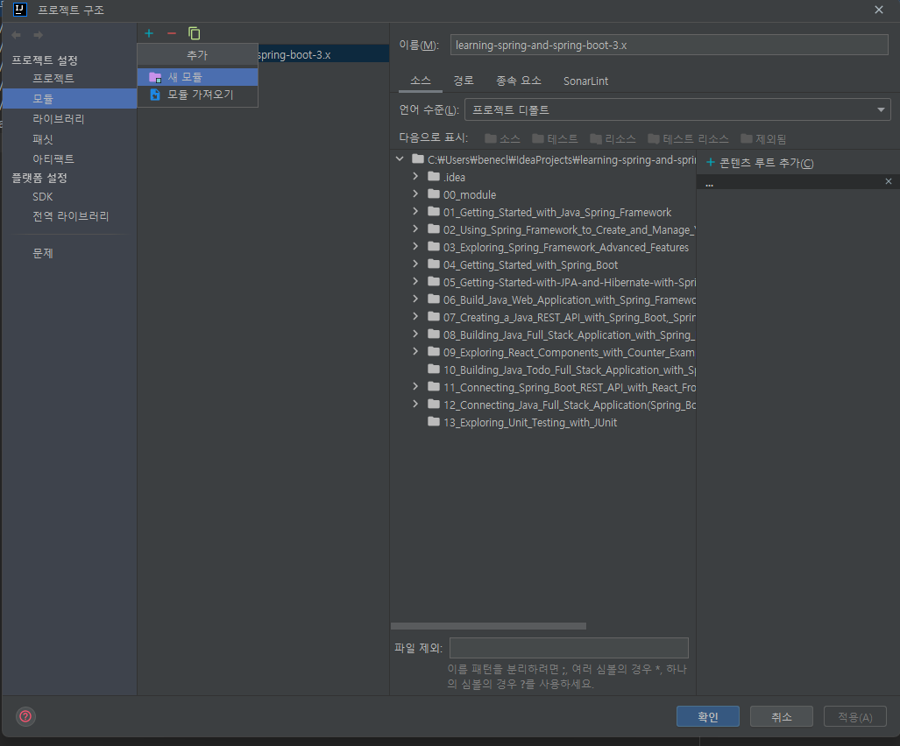
     - 프로젝트 구조(Ctrl + Alt + Shift + S) 설정에 진입한다.
     - 상단에 플러스 모양 버튼(Alt + insert)을 클릭 후 '새 모듈'을 선택한다.
     - 모듈 사용을 하지 않는 경우 모듈 대신 '새 프로젝트'로 진입
   - 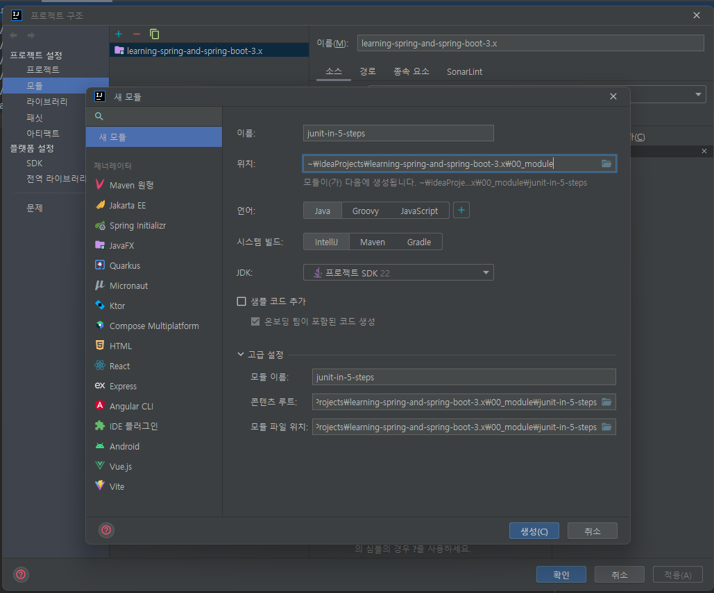
     - 강의에서 제시하는 'junit-in-5-steps' 이름으로 프로젝트를 생성한다.
       - 제너레이터를 사용하지 않는다.
       - '샘프 코드 추가' 옵션을 해제한다.
2. 소스 루트 확인
   - 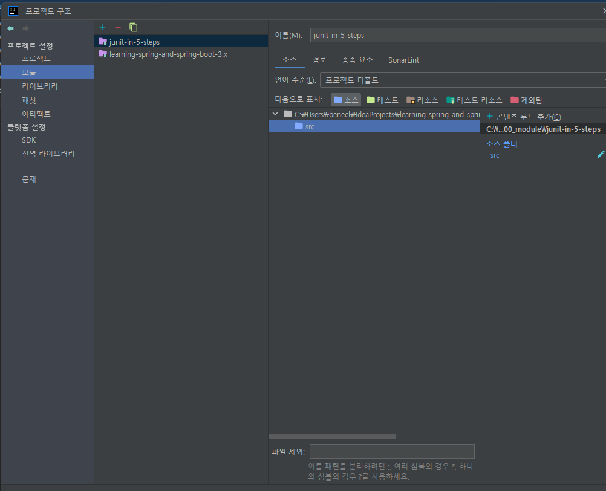
     - 프로젝트 구조 설정 화면에서 등록된 모듈을 클릭해서 소스 루트가 제대로 설정되었는지 확인한다.
3. 패키지 생성
   - 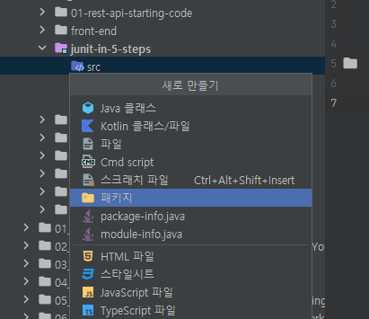
   - 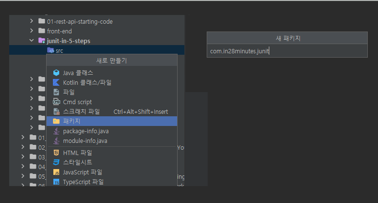
     - 소스 루트에 'com.in28minutes.junit' 패키지를 생성한다.
     - 프로젝트 루트(소스 상위 루트)에 'test' 패키지를 생성한다.
4. test 패키지 프로젝트 구조 설정
   - 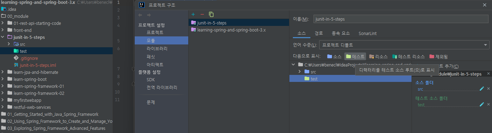
     - 프로젝트 구조 설정에서 test 패키지를 '테스트로 표시'하도록 설정한다.
5. Java 파일 및 테스트 생성
   - 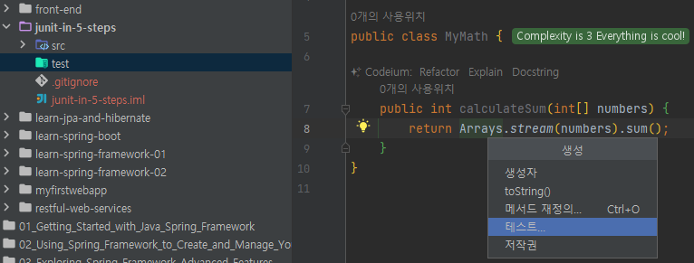
     - 강의를 따라 'MyMath' 파일을 작성하고 클래스 내부에서 'Alt + Insert'로 '테스트' 생성을 한다.
   - 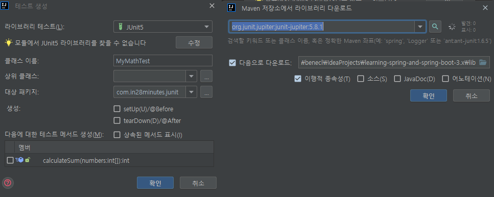
     - 테스트 생성 화면에서 'JUnit5'를 선택하고 "모듈에서 JUnit5 라이브러리를 찾을 수 없습니다." 안내가 나타나면 '수정' 버튼을 눌러 라이브러리를 설치한다.
   - 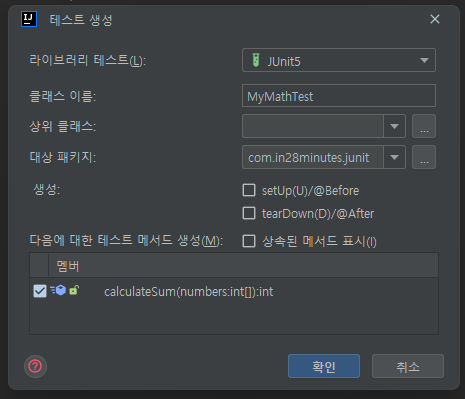
   - 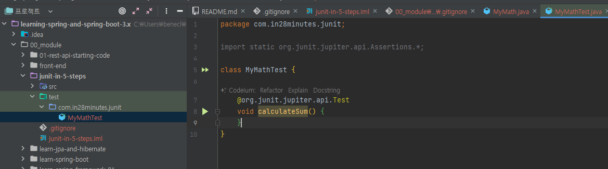
     - 이후 테스트를 생성하면 자동으로 test 폴더 내에 패키지 경로 및 테스트 파일이 생성된다.
6. 컴파일이 실패할 경우
   - `java: error: release version 5 not supported` 등의 메시지가 나타나면서 컴파일에 실패할 경우
   - 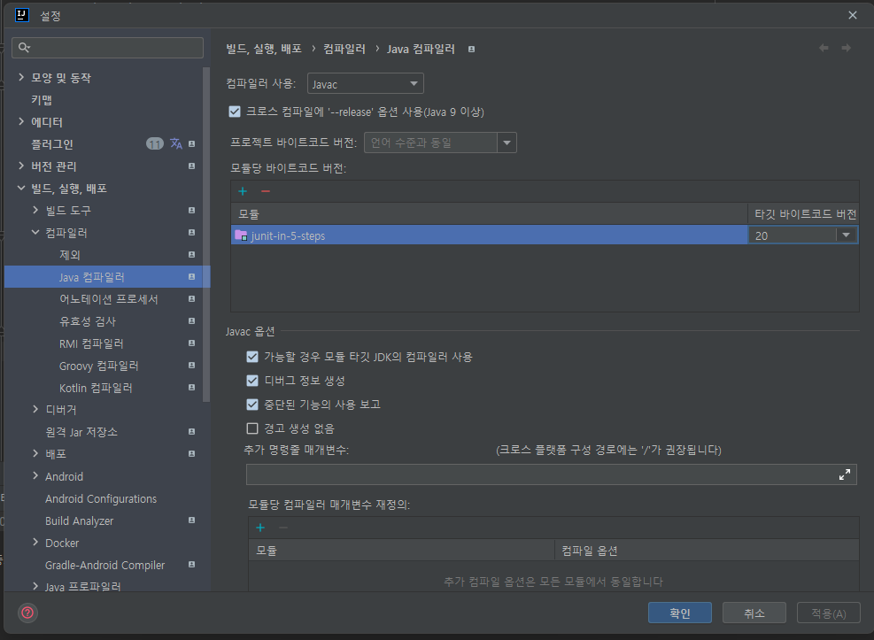
     - 설정 -> 빌드, 실행, 배포 -> 컴파일러 -> Java 컴파일러 에서 모듈의 타깃 바이트코드 버전을 설정해주면 된다.

#### 테스트 작성
```java
public class MyMath {

	public int calculateSum(int[] numbers) {
		return Arrays.stream(numbers).sum();
	}
}
```
- calculateSum() : 파라미터로 들어온 int 배열의 모든 인덱스 값을 더한 후 리턴하는 메서드이다.

```java
class MyMathTest {

	@Test
	void calculateSum() {
		MyMath myMath = new MyMath();
		int sum = myMath.calculateSum(new int[] { 1, 2, 3 });

		assertEquals(9, sum);
	}
}
```
- public을 붙일 필요가 없다. (JUnit 5 일 경우)
- @Test : 메서드가 테스트 메서드임을 명시
- assertEquals() : 첫 번째 인자 = 예상되는 값, 두 번째 인자 = 메서드 결과
  - 메서드가 내가 예상한대로 동작하는지 테스트 할 수 있다.
  - 코딩테스트의 테스트 케이스와 비슷하다.

---