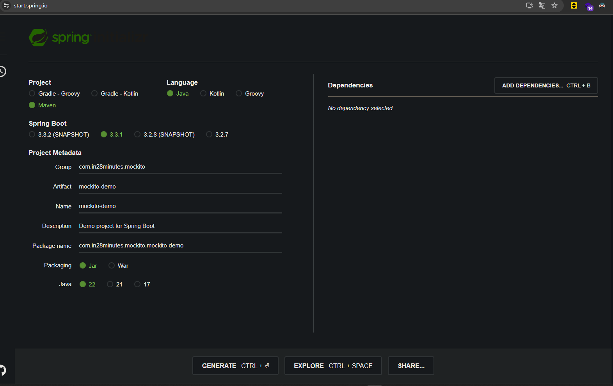

# 📒 [학습 노트] 챕터 14: Spring Boot 프로젝트에서 Mockito로 모킹하기

## 목록
0. [섹션 소개: Mockito 사용 5단계](#0단계---챕터-소개-mockito-사용-5단계)
1. [Spring Boot 프로젝트 설정하기](#1단계---spring-boot-프로젝트-설정하기)
2. [Stub의 문제점 이해하기](#2단계---stub의-문제점-이해하기)

---

## 0단계 - 챕터 소개: Mockito 사용 5단계

#### Mocking
테스트를 위해 실제 객체 대신 가짜 객체를 사용하는 기법, Mocking을 사용하면 복잡한 의존성을 가진 객체도 쉽게 테스트할 수 있다.
- Mockito : 널리 사용되는 Mocking 프레임워크로, 가짜 객체 생성과 동작 제어를 지원한다.

#### Mocking의 필요성
소프트웨어에 있어 단위 테스트가 훌륭하면 유지 보수가 간단해진다. 
그러나 여러 개의 종속성이 포함되어 있는 등 비즈니스 로직이 복잡하다면 단위 테스트를 작성하는 비용이 증가하게 된다. 
이 문제를 Mocking이 해결해준다.

#### Stub vs Mock
데이터베이스에 저장된 데이터를 사용하지 않고 비즈니스 계층의 단위 테스트를 실행하고 싶다면 크게 두 가지 방법을 사용할 수 있다.
1. Stub
2. Mock

이번 챕터에서는 Stub은 무엇이고 Mock은 무엇인지, 그리고 Mockito에서 이 방법들을 어떻게 사용하는지 다룰 것이다.

---

## 1단계 - Spring Boot 프로젝트 설정하기

#### 프로젝트 생성

- [Spring initializer](https://start.spring.io/) 를 통해 프로젝트를 생성한다.
- 라이브러리는 추가하지 않았다.
  - `spring-boot-starter-web` 라이브러리가 없기 때문에 애플리케이션 실행 시 웹 서버가 켜지지 않는다.

#### Mockito 라이브러리
```xml
    <dependency>
      <groupId>org.mockito</groupId>
      <artifactId>mockito-core</artifactId>
      <version>5.11.0</version>
      <scope>compile</scope>
    </dependency>
    <dependency>
      <groupId>org.mockito</groupId>
      <artifactId>mockito-junit-jupiter</artifactId>
      <version>5.11.0</version>
      <scope>compile</scope>
    </dependency>
```
- `spring-boot-starter-test` 라이브러리 내부에서 'mockito' 라이브러리를 포함하고 있는 것을 확인할 수 있다.
- Spring initializer 에서 라이브러리를 아무것도 추가하지 않아도 'mockito' 는 기본 스프링 스타터에 제공된다.

#### 연습용 클래스 작성
```java
package com.in28minutes.mockito.mockito_demo.business;

import java.util.Arrays;

public class SomeBusinessImpl {

	private DataService dataService;

	public int findTheGreatestFromAllData() {
		int[] data = dataService.retrieveAllData();
		return Arrays.stream(data).max().getAsInt();
	}

}

interface DataService {

	int[] retrieveAllData();
}
```
- DataService 인터페이스의 구현체를 의존성으로 가지는 클래스를 생성.
- PSA를 적용할 수 있는 기반 구현으로 볼 수 있다.

#### PSA(Portable Service Abstraction) 원칙
Spring 프레임워크의 핵심 설계 철학 중 하나로 특정 기술에 종속되지 않는 방식으로 추상화된 상위 계층의 인터페이스를 제공하는 것을 의미한다.
- 기술 독립성: 특정 기술에 종속되지 않는 코드 작성
- 유연성: 기술 변경 시 최소한의 코드 수정으로 대응 가능
- 테스트 용이성: 모의 객체를 사용한 단위 테스트 촉진
- 일관성: 다양한 기술에 대해 일관된 프로그래밍 모델 제공

코드 재사용성이 늘어나고 클래스간의 의존도를 낮추어 변경 및 확장에 유연하게 대처할 수 있다.

---

## 2단계 - Stub의 문제점 이해하기

#### Stub 사용해서 단위테스트 작성
```java
class MockitoDemoApplicationTest {

	@Test
	void findTheGreatestFromAllData_basicScenario() {
		DataService dataServiceStub = new DataServiceStub();
		SomeBusinessImpl businessImpl = new SomeBusinessImpl(dataServiceStub);
		int result = businessImpl.findTheGreatestFromAllData();
		assertEquals(25, result);
	}
}

class DataServiceStub implements DataService {

	@Override
	public int[] retrieveAllData() {
		return new int[] { 25, 15, 5 };
	}
}
```

#### Stub의 문제점
- `DataService` 인터페이스에 신규 메서드가 추가될 때마다 `DataServiceStub` 구현체에서도 메서드를 구현해야 한다.
  - 추가된 메서드를 실제로 사용하지 않는다고 하더라도 인터페이스의 메서드는 반드시 구현해야 하기 때문에 구현이 강제된다.
- 다양한 시나리오 케이스를 테스트하기가 어렵다
  - { 25, 15, 5 } 말고 다른 시나리오를 테스트 하기 위해 새로운 Stub를 추가해야 한다.

---