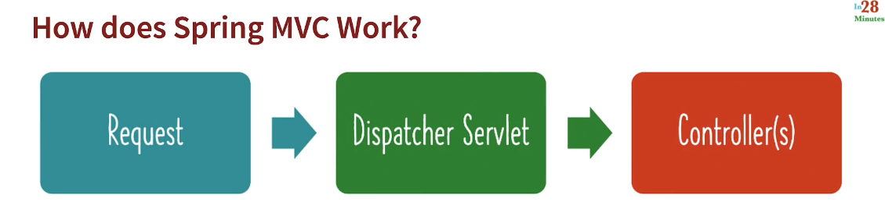
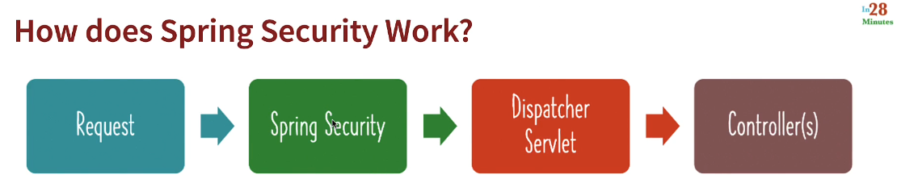
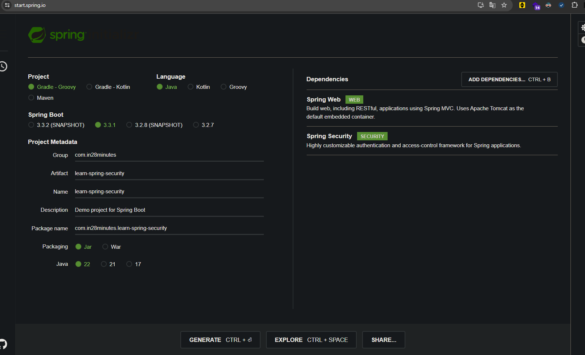
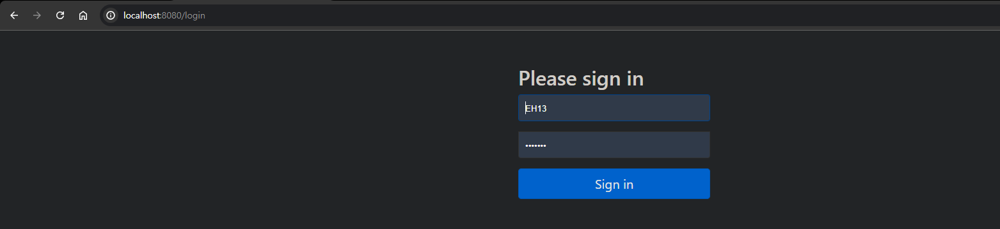
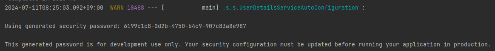
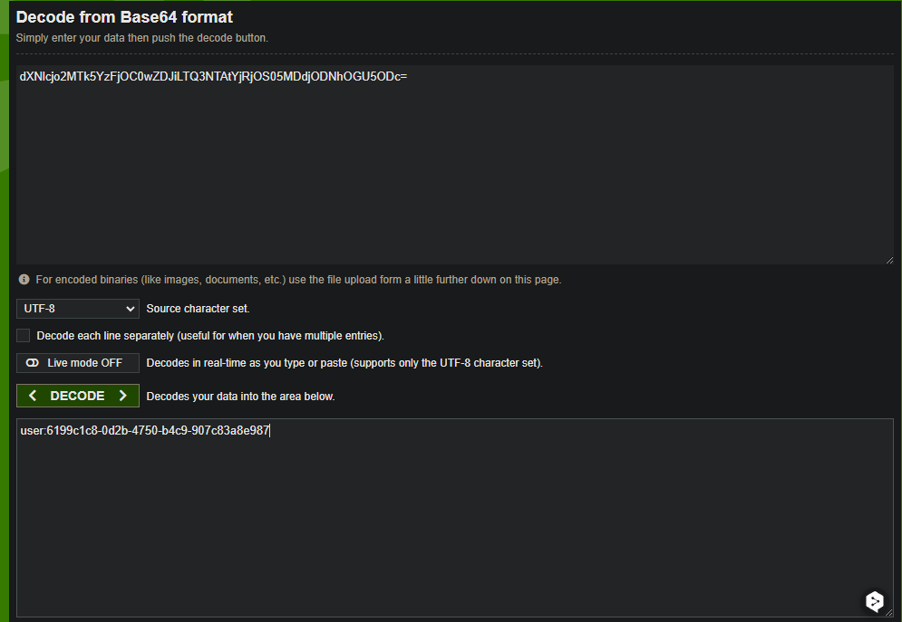
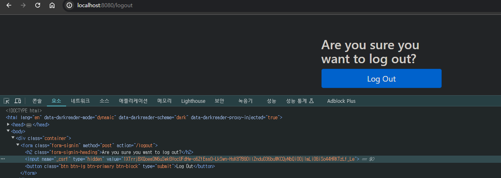
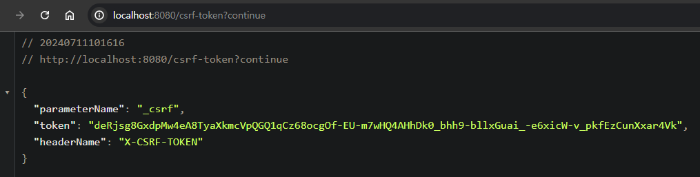
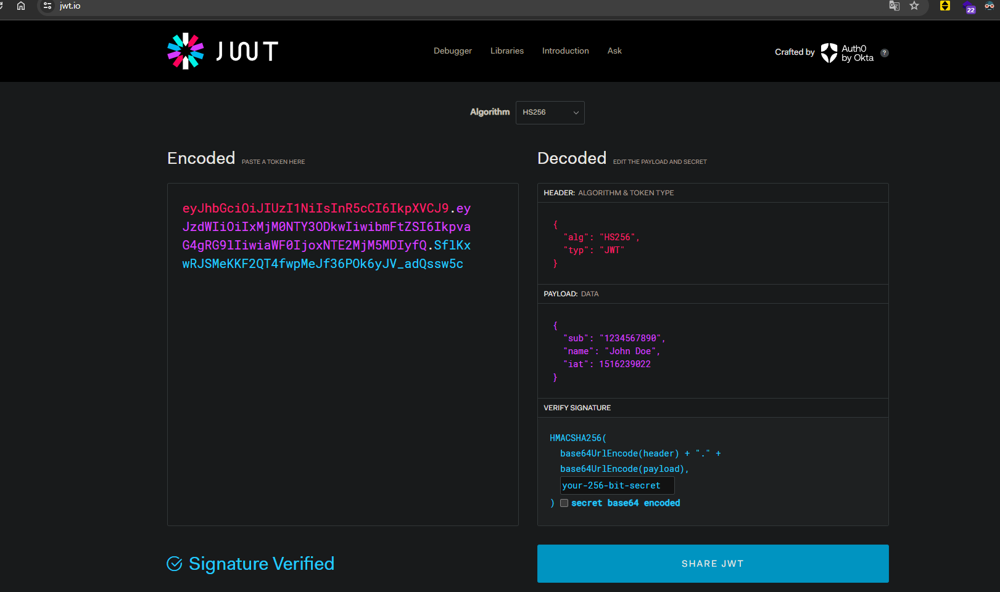

# 📒 [학습 노트] 챕터 15 : Spring Security로 Spring Boot 앱 보호하기

## 목록
0. [Spring Security 시작하기](#0단계---spring-security-시작하기)
1. [보안의 기초 이해하기](#1단계---보안의-기초-이해하기)
2. [보안의 원칙 이해하기](#2단계---보안의-원칙-이해하기)
3. [Spring Security 시작하기](#3단계---spring-security-시작하기)
4. [Spring Security 기본 설정 살펴보기](#4단계---spring-security-기본-설정-살펴보기)
5. [Spring Security용 Spring Boot 프로젝트 생성하기](#5단계---spring-security용-spring-boot-프로젝트-생성하기)
6. [Spring Security 살펴보기 - 폼 인증](#6단계---spring-security-살펴보기---폼-인증)
7. [Spring Security 살펴보기 - 기본 인증](#7단계---spring-security-살펴보기---기본-인증)
8. [Spring Security 살펴보기 - 크로스 사이트 요청 위조](#8단계---spring-security-살펴보기---크로스-사이트-요청-위조)
9. [Spring Security 살펴보기 - REST API에서의 CSRF](#9단계---spring-security-살펴보기---rest-api에서의-csrf)
10. [CSRF를 사용하지 않도록 Spring Security 설정 생성하기](#10단계---csrf를-사용하지-않도록-spring-security-설정-생성하기)
11. [Spring Security 살펴보기 - CORS 시작하기](#11단계---spring-security-살펴보기---cors-시작하기)
12. [Spring Security 살펴보기 - 메모리에 사용자 자격증명 저장하기](#12단계---spring-security-살펴보기---메모리에-사용자-자격증명-저장하기)
13. [Spring Security 살펴보기 - JDBC를 사용해 사용자 자격증명 저장하기](#13단계---spring-security-살펴보기---jdbc를-사용해-사용자-자격증명-저장하기)
14. [인코딩, 해싱, 암호화 이해하기](#14단계---인코딩-해싱-암호화-이해하기)
15. [Spring Security 살펴보기 - Bcrypt 인코딩 암호 저장하기](#15단계---spring-security-살펴보기---bcrypt-인코딩-암호-저장하기)
16. [JWT 인증 시작하기](#16단계---jwt-인증-시작하기)

---

## 0단계 - Spring Security 시작하기

#### 챕터 학습 목표
1. 6가지 보안 원칙 : 애플리케이션을 빌드할 때 고려해야 할 중요 보안 사항
2. 인증과 권한 부여의 차이
3. Spring Security의 기초 살펴보기
   - Spring Security Filter Chain이 무엇인지
   - Spring Security가 애플리케이션에 들어오는 요청을 모두 인터셉트하는 이유는 무엇인지
4. 다양한 종류의 인증 방식 (비교 및 차이점)
   - 폼 인증
   - 기본 인증
   - JWT 인증
5. 모범 사례
   - CSRF 
   - CORS
   - ...
6. OAuth

---

## 1단계 - 보안의 기초 이해하기

#### 인증
- 사용자가 기억할 수 있는 정보 제공
  - ID/PW
- 사용자가 가진 소유물이나 생체 정보를 기반으로 인증
  - 홍채, 지문 인식, 모바일 앱 등
- 다단계 인증 : 다양한 요소 결합
  - SNS 인증 등
    - Google SNS 인증의 경우 Google 계정 정보를 사용자가 기억해야 하고, 계정 권한을 소유한 모바일 기기 등으로 다른 애플리케이션의 인증을 시도할 수 있다.

#### 권한 부여
인증된 사용자에게 액세스 권한을 부여해, 사용자가 인증된 후 적절한 액세스 권한을 가지고 있는지 판단하여 특정 작업에 대한 접근 여부를 설정하는 것
ex) '사용자 A, B, X' 는 '데이터를 읽는 것'만 가능하고, '사용자 C, F, T'는 '데이터를 읽고, 수정하는 것'이 가능하다.

#### 인증과 권한의 차이 비유로 알아보기
- 케이스 1 : 공항
  - 인증 : 여권, 신분증
  - 권한 : 항공권, 탑승권 
- 케이스 2 : 놀이공원 테마파크
  - 인증 : 신분증, 예약 or 결제 정보 확인
  - 권한 : 입장권, 프리패스, VIP 티켓

---

## 2단계 - 보안의 원칙 이해하기

#### 보안 원칙 6계명
1. Trust Nothing : 무엇도 신뢰하지 말라
    - 모든 입력과 시스템 구성 요소(요청)를 의심하고 검증해야 한다.
2. Least Privileges : 최소 권한만 할당하라
    - 사용자나 프로세스에게 필요한 최소한의 권한만을 부여해야 한다.
    - 각 사용자에게 필요한 사용자 역할과 액세스 권한을 명확히 정해야 한다.
3. Complete Mediation : 완전 매개를 구축하라
    - 요청이 들어올 때마다 액세스 권한을 확인해야 한다.
    - 중세 시대의 수성에 비유해보자. 모든 사람이 하나의 정문을 통해 요새에 출입할 수 있다.
        - 이와 유사하게 애플리케이션이나 시스템에도 효과적으로 구현된 보안 필터가 필요하다.
4. Defense In Depth : 심층적인 방어를 구축하라
    - 전송 레이어 -> 네트워크 레이어 -> 인프라 등으로 층을 나누어 모든 곳에 보안을 적용해야 한다.
    - ex) 사용자 개인정보를 DB에 저장할 때 암호화를 적용해서 만약에 DB 데이터가 탈취 당해도 개인정보가 탈취 당하지 않도록 한다.
5. Economy Of Mechanism : 보안 아키텍처를 가능한 한 간단하게 유지하라
    - 간단한 시스템을 보호하기가 더 쉽다. 복잡할 수록 취약점 노출도가 증가한다.
    - 매커니즘의 효율성을 추구하라.
6. Openness Of Design : 설계의 개방성을 보장하라.
    - 보안 시스템의 설계와 구현을 비밀로 유지하는 것이 더 나은 보안을 제공한다는 잘못된 믿음을 버려야 한다.
        - 보안 메커니즘의 설계는 공개되어 검토될 수 있어야 한다.
        - 여러 보안 전문가들이 협업하여 검토하고 보완할 수 있도록 하는 것이 유리하다.
    - ex) JWT : [jwt.io](https://jwt.io/) 에서 토큰의 페이로드를 보는 것이 가능하다.

---

## 3단계 - Spring Security 시작하기

#### Spring MVC 작동 방식

- Spring 웹 애플리케이션으로 오는 모든 요청은 '디스패처 서블릿'에서 처리한다.

#### Spring Security 작동 방식
 
- 중간 레이어(Spring Security )가 추가 된다.
  - 디스패처 서블릿 전에 Spring Security가 요청을 인터셉트한다.
- Spring Security에 설정된 필터 체인이 요청을 처리한다.
  - 이 과정에서 인증과 권한 부여가 동작한다.
  - 인증, 권한 확인이 완료되면 디스패처 서블릿으로 요청을 전송한다.

---

## 4단계 - Spring Security 기본 설정 살펴보기

#### Spring Security Filter Chain
요청이 들어왔을 때 Spring Security가 실행 시키는 일련의 필터 처리 과정
- 인증 : 요청자가 적절한 사용자인지 확인한다. ex) BasicAuthenticationFilter
- 권한 확인 : 요청자가 요청에 필요한 적절한 권한을 가지고 있는 확인한다. ex) AuthorizationFilter
  - URL 패턴을 통해 판단하기 때문에 해당 API의 서비스 로직을 알지 못해도 처리가 가능하다.
- 보안 관련 베스트 프랙티스
  - CORS(Cross-Origin Resource Sharing) 설정 ex) CorsFilter
  - CSRF(Cross-Site Request Forgery) 설정 ex) CsrfFilter
  - Login Page, Logout Page 설정 (기본 제공되며 커스텀 가능)
  - Http 응답에 대한 다양한 예외 처리 ex) ExceptionTranslationFilter

필터는 특정한 순서대로 실행하며 심층적으로 동작한다.
- ex) 기본 필터(CORS, CSRF) -> 인증 -> 권한 확인 -> 디스패처 서블릿

필터체인에서 애플리케이션 전역의 보안 설정을 담당하여 서비스 로직에서는 보안 설정 코드를 신경 쓸 필요 없이 관심사를 분리할 수 있다. (AOP)

---

## 5단계 - Spring Security용 Spring Boot 프로젝트 생성하기

#### 프로젝트 생성

- [Spring initializer](https://start.spring.io/) 를 통해 프로젝트를 생성한다.
- 빌드 도구를 'Gradle - Groovy'로 설정한다.
- 라이브러리 목록
  - Spring Web
  - Spring Security

---

## 6단계 - Spring Security 살펴보기 - 폼 인증

#### Spring Security 기본 로그인
```java
@RestController
public class HelloWorldResource {

	@GetMapping("/login")
	public String hello() {
		return "Hello World";
	}
}
```
'/login' 엔드포인트로 접근하면 "Hello world"를 출력하는 간단한 GET API이다.


- api로 접근 시 선언된 메서드가 아닌 Spring Security의 기본 로그인 Form이 노출된다.
- 심지어 존재하지 않는 URL 엔드포인트를 입력해도 해당 로그인 페이지로 리다이렉트 되는 것을 볼 수 있다.
  - API 사용자는 인증이 되기 전에는 엔드포인트가 유효한지 조차 볼 수 없다.
  - 실제 서비스 로직에 도달하기 전에 Spring Security 필터 체인이 인증을 확인을 수행하기 때문이다.
  - 'Complete Mediation - 완전 매개' 보안 윈칙을 지키는 것이다.

#### Form 기반 인증
로그인 `<form>`에 자격 증명을 입력한 후 제출하면 자격증명을 확인하고 인증하는 방식
- Spring Security 의 디폴트 인증 방식
- 작동 원리
  - Spring Security 기본적으로 '/login', '/logout' 페이지를 제공한다.
  - 로그인 시 해당 사용자에 대해 쿠키가 생성된다. ex) JSESSIONID : BCC81C00DD10079468F3BF57594595B6
    - Spring Security의 AuthenticationFilter(ex : UsernamePasswordAuthenticationFilter)가 이 요청을 가로챈다.
    - 입력된 자격 증명을 바탕으로 Authentication 객체를 생성하고, 이 때 AuthenticationManager(AuthenticationProvider) 등이 일한다.
    - 인증이 성공되면 해당 Authentication 객체는 SecurityContext에 저장되고, SecurityContextPersistenceFilter를 사용해서 HTTP 세션에 저장한다.
  - 해당 세션 쿠키는 요청과 함께 전송된다.
  - '/logout' 을 통해 로그아웃을 진행하면 서버 측에서 현재 사용자의 세션을 무효화한다. (세션 정보 삭제를 의미함)
    - Spring Security의 SecurityContext(ex : SecurityContextHolder)에서 현재 인증 정보가 제거된다.

---

## 7단계 - Spring Security 살펴보기 - 기본 인증

#### Basic 인증 기법
- 사용자가 입력한 자격 증명 정보를 Base 64 인코딩해서 전달한다.
  - 헤더 'Authorization' Key, 'Basic {Base 64 인코딩 자격증명}' Value 형태로 요청과 함께 전송된다.

#### Basic 인증의 문제점


- Base 64 문자열은 디코드가 쉽다.
- 만료기간이 없다.
- 사용자 액세스 권한이나 역할에 관한 정보가 없다.

---

## 8단계 - Spring Security 살펴보기 - 크로스 사이트 요청 위조

#### CSRF 공격
브라우저 쿠키 등에 인증 정보가 저장된 상태로 악성 웹사이트에 접근했을 때, 해당 웹사이트가 사용자 의도와 상관 없이 쿠키에 액세스 후 위조된 요청을 보내는 공격.
- 일반적으로 브라우저 쿠키의 자동 전송 시스템을 악용해서 공격하는 방식이다.
  - 브라우저는 요청을 처리할 때 해당 도메인에 대한 쿠기를 자동으로 전송한다. (HTTP 프로토콜의 기본 동작 방식)
- 공격 시나리오 예시
  - 은행에 로그인 한다. (쿠키에 인증 정보가 저장된다.)
  - 로그아웃을 하지 않은 상태로 웹 서핑을 하다가 악성 웹사이트에 접속한다.
  - 악성 웹사이트는 사용자의 브라우저를 통해 은행 서버로 위조된 요청을 보내도록 유도한다.
    - ex) '쿠폰 받기' 등의 위장된 버튼을 클릭하게 만든다. -> 버튼은 사실 은행 사이트의 계좌 이체 버튼과 동일한 로직을 수행한다. (쿠키에 저장된 인증 정보를 헤더에 담아 계좌 이체 API를 요청하는 로직)
  - 브라우저는 은행 도메인에 대한 저장된 쿠키를 자동으로 요청에 포함시켜 보낸다.
  - 은행 서버는 이 요청을 정상적인 사용자의 요청으로 인식하고 처리한다.
- 주요 포인트
  - 쿠키에 저장된 인증 정보를 따로 식별하거나 탈취하지 않으며 그대로 사용하는 것이다.
    - 쿠키에 저장된 인증 정보의 암호화에 영향을 받지 않는다. (인증 정보를 위조하는 개념이 아니기 때문)

#### CSRF 공격 방지
1. CSRF 토큰 : 동기화 토큰 패턴
   - 쿠키가 아닌 다른 방식으로 저장되는 토큰을 추가 발급한다.
     - HTML 폼의 hidden 필드, JavaScript 변수 등
     - 브라우저의 자동 쿠키 전송 메커니즘을 우회한다.
   - 클라이언트는 요청 시 쿠키에 저장되는 인증 객체와 함께 CSRF 방지 토큰을 함께 전송해야 한다.
   - CSRF 토큰을 매 요청마다 갱신하도록 하면 보안이 상승한다.
   - POST, PUT, DELETE 등의 요청에서만 CSRF 토큰을 확인하도록 할 수 있다.
2. 다른 출처(Cross-Site | Cross-Origin)의 요청 제한
   - 요청에는 출처(HTTP 프로토콜, IP-도메인, 포트번호) 등이 포함된다.
   - 보호받아야 할 요청의 경우 약속된 클라이언트의 출처만 허용하고 나머지는 제한하는 방식으로 방지할 수 있다.
3. SameSite 쿠키 속성 사용
   - 쿠키에 SameSite 속성을 설정하여 크로스 사이트 요청에서 쿠키 전송을 제한할 수 있다.
   - 브라우저의 쿠키 전송 정책에 의존하지 않고, Strict, Lax, None 등의 옵션을 통해 쿠키 전송 정책을 세밀하게 제어하는 방식이다.
4. Double Submit Cookie & 사용자 상호작용 요구
   - 중요 동작의 경우 CSRF 토큰을 쿠키와 요청 파라미터 모두에 포함시켜서 쿠키 만으로 중요한 요청을 처리할 수 없도록 제한하는 방식이다.
   - 중요 동작의 경우 사용자에게 비밀번호를 다시 묻는 방식으로도 일부 방지가 가능하다. ex) 사용자 정보 변경 시 패스워드를 한 번 더 입력 등

이러한 방법들을 구현할 때 성능과 사용자 경험에 미치는 영향도 고려해야 한다. 모든 방식을 사용하면 보안이 높아지지만, 그만큼 시스템 부하 및 사용자의 불편함도 증가할 수 있다.

---

## 9단계 - Spring Security 살펴보기 - REST API에서의 CSRF

#### Spring Security의 기본 CSRF 방어 방식
Spring Security는 CSRF 토큰을 사용한 방어 방식을 기본 값으로 수행한다.

- Spring의 기본 로그아웃이 from으로 구현되어 있다. 
- 로그아웃 form 내부에 hidden input 필드로 CSRF 토큰이 삽입되어 있다.
  - Spring에서 CSRF 토큰을 자동으로 생성해 추가한 것이다.
  - GET 메서드 API에서는 CSRF 토큰을 확인하지 않으나 POST, PUT의 경우 자동으로 확인한다.
    - 직접 작성한 API 역시 POST, PUT 메서드를 사용한다면 CSRF 토큰 검증을 수행하므로, 토큰 없이 요청 시 401에러를 노출하게 된다.

#### CSRF 토큰 생성 실습
```java
@RestController
public class SpringSecurityPlayResource {

	@GetMapping("/csrf-token")
	public CsrfToken retrieveCsrfToken(HttpServletRequest request) {
		return (CsrfToken) request.getAttribute("_csrf");
	}
}
```
- HttpServletRequest : 현재 요청의 정보를 받을 수 있다.
- getAttribute("_csrf") : '_csrf'라는 이름의 요청 속성을 지정한다.
  - 서버 측에서 요청 객체에 추가하는 데이터이며, 클라이언트가 직접 설정하거나 접근할 수는 없다.
- 주의 : API로 CSRF를 직접 노출시키는 것은 지양해야 한다.
  - 해당 코드는 Spring Security의 모든 요청에는 자동으로 CSRF 토큰이 포함되는 것을 보여주기 위함이다.
    - Attribute에 토큰이 포함되는 것은 서버 측에서 처리하는 것으로 실제 토큰을 사용해서 요청을 성공시키기 위해선 헤더에 담아야 한다.
  - Spring Security는 자동으로 폼 기반 제출에 CSRF 토큰을 포함시킨다.
    - RESTful API를 사용하는 경우, 일반적으로 다른 방식(예: 세션 기반 인증 대신 토큰 기반 인증 사용)으로 CSRF 공격을 방지한다.


- 'X-CSRF-TOKEN'를 Key로, 노출된 토큰을 Value로 헤더에 추가해서 요청을 보내면 요청이 통과된다.

---

## 10단계 - CSRF를 사용하지 않도록 Spring Security 설정 생성하기

#### SameSite 쿠키
```properties
server.servlet.session.cookie.same-site=strict
```
- 세션 쿠키(예: JSESSIONID)는 오직 동일 사이트(same-site) 요청에서만 전송됨.
  - 클라이언트와 서버가 분리된 REST API 아키텍처에는 사용되지 않는다.
  - 프로토콜, 도메인(ip), 포트 번호 중 하나라도 다른 경우 다른 사이트(cross-site)이기 때문이다.

#### CSRF 해제하기
세션 상태를 관리하지 않는 REST API의 경우 CSRF 사용을 해제하는 것이 일반적이다.
```java
@Configuration
public class BasicAuthSecurityConfiguration {

        @Bean
        public SecurityFilterChain securityFilterChain(HttpSecurity http) throws Exception {
            return http
                    .authorizeHttpRequests(auth -> auth.anyRequest().authenticated())
		            .sessionManagement(session -> session.sessionCreationPolicy(SessionCreationPolicy.STATELESS))
		            .httpBasic(Customizer.withDefaults())
				    .csrf(csrf -> csrf.disable())
                    .build();
        }
    }
```
- SecurityFilterChain 타입의 Bean을 선언해서 자동으로 해당 Bean을 스프링이 의존성 주입하도록 만들 수 있다.
  - org.springframework.boot.autoconfigure.security.servlet 패키지의 SpringBootWebSecurityConfiguration 클래스에 Spring Security의 기본 필터체인이 정의되어 있다.
- `csrf(csrf -> csrf.disable())` 해당 코드로 csrf 보안을 비활성화 할 수 있다.
  - authorizeHttpRequests : 요청 처리에 대한 설정
    - 모든 요청에 인증이 필요하도록 설정함
  - sessionManagement : 세션 관리 정책에 대한 설정
    - 세션을 저장하지 않는 것으로 설정함
  - httpBasic : Basic 인증 활성화
    - 폼 로그인을 사용하지 않고 팝업창으로 인증한다. (로그아웃 페이지도 동작하지 않는다.)
    - 별도 인증 수단이 없기 때문에 활성화 하지 않으면 인증 자체가 불가하다.
      - authorizeHttpRequests 에서 모든 요청에 인증을 받기로 했기 때문.

---

## 11단계 - Spring Security 살펴보기 - CORS 시작하기

#### CORS (Cross-Origin Resource Sharing)
웹 브라우저에서 다른 출처의 리소스에 접근할 수 있도록 하는 보안 메커니즘
- 다른 출처
  - 프로토콜, 도메인(ip), 포트 중 하나라도 다르면 다른 출처이다.
- 브라우저는 기본적으로 보안상의 이유로 다른 출처로의 요청을 차단한다.

#### CORS 설정법
- 글로벌 설정
  - WebMvcConfigurer를 사용해서 설정한다.
  - 예시
    ```java
    @Bean
    public WebMvcConfigurer corsConfigurer() {
        return new WebMvcConfigurer() {
            public void addCorsMappings (CorsRegistry registry) { 
                    registry.addMapping("/**") 
                            .allowedMethods ("*")
                            .allowedOrigins("http://localhost:3000");
            }
        };
    }
    ```
- 컨트롤러별 로컬 설정
  - 특정 컨트롤러나 메서드에 어노테이션을 부여해서 설정한다.
  - 예시
    ```java
    @RestController
    @CrossOrigin(origins = "http://localhost:3000")
    public class MyController {
        // ...
    }
    ```

#### Spring Security 필터체인으로 CORS 설정
Spring Security를 사용하는 경우 가장 권장되는 방법이다.
```java
@Configuration
public class BasicAuthSecurityConfiguration {

	@Bean
	public SecurityFilterChain securityFilterChain(HttpSecurity http) throws Exception {
		return http
				.authorizeHttpRequests(auth -> auth.anyRequest().authenticated())
				.sessionManagement(session -> session.sessionCreationPolicy(SessionCreationPolicy.STATELESS))
				.httpBasic(Customizer.withDefaults())
				.cors(cors -> cors.configurationSource(corsConfigurationSource()))
				.csrf(csrf -> csrf.disable())
				.build();
	}

	@Bean
	public CorsConfigurationSource corsConfigurationSource() {
		CorsConfiguration usersConfig = new CorsConfiguration();
		usersConfig.setAllowedOrigins(Arrays.asList("https://admin.myapp.com"));
		usersConfig.setAllowedMethods(Arrays.asList("GET", "POST"));
		usersConfig.setAllowedHeaders(Arrays.asList("Authorization"));
		usersConfig.setExposedHeaders(Arrays.asList("X-Total-Count"));

		CorsConfiguration configuration = new CorsConfiguration();
		configuration.setAllowedOrigins(Arrays.asList("http://localhost:3000"));
		configuration.setAllowedMethods(Arrays.asList("GET", "POST", "PUT", "DELETE"));
		configuration.setAllowedHeaders(Arrays.asList("*"));

		UrlBasedCorsConfigurationSource source = new UrlBasedCorsConfigurationSource();
		source.registerCorsConfiguration("/users/**", usersConfig);
		source.registerCorsConfiguration("/**", configuration);
		return source;
	}
}
```
- CorsConfiguration : CORS 설정을 위한 객체
  - setAllowedOrigins : 허용되는 출처
  - setAllowedMethods : 허용되는 메서드
  - setAllowedHeaders : 허용되는 헤더
- UrlBasedCorsConfigurationSource : URL 기반 CORS 설정 소스
  - CORS 설정을 적용할 엔드포인트를 지정한다.
  - `/**` 보다 `/users/**` 처럼 세분화 된 엔드포인트가 우선 순위가 더 높다.

---

## 12단계 - Spring Security 살펴보기 - 메모리에 사용자 자격증명 저장하기

#### Basic 인증 자격 증명(ID,PW) 커스텀하기
```properties
spring.security.user.name=eh13
spring.security.user.password=950127
```
해당 설정을 통해 Spring Security의 Basic 인증의 자격증명을 커스텀할 수 있다.
- 인메모리에 저장된다.

#### 사용자 자격 증명을 저장하는 방법
- 인메모리 : 프로덕트 환경에서는 권장되지 않는다.
- 데이터베이스
- LDAP(Lightweight Directory Access Protocol) : 경량 디렉터리 액세스 프로토콜
  - 인증 및 디렉터리 관리를 위한 특수 목적 데이터베이스
  - 주로 사용자 정보, 조직 구조 등의 디렉터리 서비스에 특화되어 있으며 빠른 읽기와 검색 작업에 최적화 되어 있다.

#### UserDetailsService
Spring Security에서 사용자의 정보를 로드하는 핵심 인터페이스, 일종의 자격증명 매커니즘이다.
- 데이터 베이스의 User(회원) 테이블 처럼 인메모리에 User 자격 증명(ID/PW) 및 회원의 정보를 저장할 수 있다.
- 실제 운영 환경에서는 데이터 베이스의 회원 정보를 UserDetailsService에 담아 Spring Security에 제공하는 방식으로 사용한다. 

####
```java
@Configuration
public class BasicAuthSecurityConfiguration {
    //...생략
	@Bean
	public UserDetailsService userDetailsService() {
		UserDetails user = User.withDefaultPasswordEncoder()
				.username("user")
				.password("{noop}password")
				.roles("USER")
				.build();

		UserDetails admin = User.withDefaultPasswordEncoder()
				.username("admin")
				.password("{noop}admin")
				.roles("USER", "ADMIN")
				.build();

		return new InMemoryUserDetailsManager(user, admin);
	}
}
```
- 코드 설명
  - UserDetails : 사용자 자격 증명 객체
  - roles : 사용자 역할
  - {noop} : 인코딩을 하지 않을 것이라는 의미 (패스워드는 기본적으로 암호화 인코딩을 진행한다)
  - InMemoryUserDetailsManager : 인메모리에 사용자 자격 증명 객체를 저장
- 별도의 필터 체인 등록 없이 Spring이 UserDetailsService를 의존성 주입하여 Spring Security가 사용 가능하다.

---

## 13단계 - Spring Security 살펴보기 - JDBC를 사용해 사용자 자격증명 저장하기

#### 라이브러리 설치
```gradle
implementation 'org.springframework.boot:spring-boot-starter-jdbc'
implementation 'com.h2database:h2'
```
- jdbc : DB 연결 및 관리를 도와주는 라이브러리
- h2 : 인메모리 데이터베이스

#### H2 콘솔 접근하기
1. application.properties 파일 설정
    ```properties
    spring.h2.console.enabled=true
    spring.datasource.url=jdbc:h2:mem:testdb
    spring.datasource.driverClassName=org.h2.Driver
    spring.datasource.username=sa
    spring.datasource.password=
    ```
2. securityFilterChain 설정
    ```java
    @Bean
    public SecurityFilterChain securityFilterChain(HttpSecurity http) throws Exception {
        return http
                //...(기존 설정)
                .headers(headers -> headers
                        .addHeaderWriter(new XFrameOptionsHeaderWriter(XFrameOptionsMode.SAMEORIGIN)))
                .build();
    }
    ```
    - h2 콘솔이 XFrame으로 구성되어 있으므로 동일 출처에 대한 XFrame 헤더를 허용했다.

'/h2-console' 엔드포인트에서 접근이 가능하다.

#### JDBC 기본 User 스키마 ([JdbcDaoImpl](https://docs.spring.io/spring-security/site/docs/current/api/org/springframework/security/core/userdetails/jdbc/JdbcDaoImpl.html))
```java
package org.springframework.security.core.userdetails.jdbc;

public class JdbcDaoImpl extends JdbcDaoSupport implements UserDetailsService, MessageSourceAware {

	public static final String DEFAULT_USER_SCHEMA_DDL_LOCATION = "org/springframework/security/core/userdetails/jdbc/users.ddl";
	//...(생략)
}
```
- Spring Security에서 JDBC를 통한 사용자 인증을 구현할 때 사용되는 기본 클래스
- UserDetailsService 인터페이스를 구현하여 데이터베이스에서 사용자 정보를 조회하는 기능 제공
- 내부에 'DEFAULT_USER_SCHEMA_DDL_LOCATION'가 정의되어 있다.
  - users.ddl 내용
      ```sql
      create table users(username varchar_ignorecase(50) not null primary key,password varchar_ignorecase(500) not null,enabled boolean not null);
      create table authorities (username varchar_ignorecase(50) not null,authority varchar_ignorecase(50) not null,constraint fk_authorities_users foreign key(username) references users(username));
      create unique index ix_auth_username on authorities (username,authority);
      ```
      - Spring Security의 Basic 인증에 필요한 테이블을 생성하는 SQL 쿼리문 (Spring Security의 기본 값이다.)
      - 구조
        - users 테이블: 사용자 정보
          - 컬럼 : username, password, enabled 
        - authorities 테이블: 사용자의 권한 정보
          - 컬럼 : username(FK), authority

#### JDBC 기본 User 스키마 사용하기
```java
public class BasicAuthSecurityConfiguration {
    //...(생략)
	@Bean
	public DataSource dataSource() {
		return new EmbeddedDatabaseBuilder()
				.setType(EmbeddedDatabaseType.H2)
				.addScript(JdbcDaoImpl.DEFAULT_USER_SCHEMA_DDL_LOCATION)
				.build();
	}
}
```
- DataSource : 데이터베이스 연결을 위한 표준 인터페이스. 커넥션 풀링, 트랜잭션 관리 등의 기능을 제공한다.
  - Spring Data JPA도 내부적으로 사용한다.
  - 대부분의 경우 개발자가 DataSource를 명시적으로 설정하지 않아도 Spring Boot가 자동으로 적절한 DataSource를 구성하여 사용한다.
- EmbeddedDatabaseBuilder : 메모리 기반의 임베디드 데이터베이스용 빌더

실제 개발에서는 User 엔티티를 선언해서 스프링이 자동으로 DataSource를 사용해서 테이블을 구성한다.

#### JDBC 기본 User 스키마에 UserDetails 데이터 삽입하기
```java
public class BasicAuthSecurityConfiguration {
	//...(생략)
	@Bean
	public UserDetailsService userDetailsService(DataSource dataSource) {
		UserDetails user = User.withUsername("user")
				.password("{noop}password")
				.roles("USER")
				.build();

		UserDetails admin = User.withUsername("admin")
				.password("{noop}admin")
				.roles("ADMIN")
				.build();

		JdbcUserDetailsManager userDetailsManager = new JdbcUserDetailsManager(dataSource);
		userDetailsManager.createUser(user);
		userDetailsManager.createUser(admin);

		return userDetailsManager;
	}
	// dataSource() 메서드
}
```
- 기존 userDetailsManager를 인메모리에서 JDBC로 변경한다. 
- 부록
  - 기존 UserDetails를 사용할 때 withDefaultPasswordEncoder() 메서드를 사용했었다. 해당 메서드는 패스워드 암호화를 진행한다.
    - 즉, {noop}를 붙이면 평문으로 패스워드를 저장하는 옵션을 무시하고 "{noop}admin" 문자열을 암호화한다.
  
---

## 14단계 - 인코딩, 해싱, 암호화 이해하기

#### 인코딩
데이터를 원래 형식에서 다른 형식으로 변환하는 과정 ex) base64, WAV, MP3
- Key나 Password를 사용하지 않는다.
- 가역적이며 디코딩(원래대로 돌리는 과정)이 쉽다.
- 데이터 보안에 사용하는 것이 아닌 압축, 스트리밍 하는 것이 목적이다.
  - 데이터 변환의 목적은 주로 데이터 표현, 저장, 전송의 효율성을 위한 것이다.

#### 해싱
데이터를 해시 문자열로 변환하는 과정 ex) HA-256, bcrypt, scrypt
- 알고리즘을 통해 고정된 길이의 문자열로 변환한다.
- 단방향 프로세스이며, 비가역적이다. (해시에서 원래 데이터를 구하는 것이 어렵다.)
- 충돌 저항성(서로 다른 입력에 대해 같은 해시 값이 나오기 어려움) 특징을 가지고 있다.
- 데이터의 무결성을 검증하는 데 사용한다.
  - 해싱된 데이터(패스워드 등)를 저장한 후 비교 데이터가 들어왔을 때 비교 데이터를 해싱하여 저장된 해싱 데이터와 비교 해싱 데이터가 동일한지 검증한다.

#### 암호화
Key나 Password를 사용해 데이터를 인코딩하는 과정 ex) RSA
- 암호화 때와 동일한 Key나 Password를 사용해 복호화할 수 있다.
- 데이터 보호를 목적으로 사용한다.

---

## 15단계 - Spring Security 살펴보기 - Bcrypt 인코딩 암호 저장하기

#### SHA-256 해싱 알고리즘의 문제점
- 시스템의 발전으로 연산 속도가 빨라져 무차별 대입 공격(brute-force attack)에 취약하다.
- 패스워드 등의 탈취가 예민한 정보에 대해서는 단독으로 사용하지 않는 것이 안전하다.
  - 비밀번호 해싱에 사용할 경우, 반드시 솔트(salt)를 추가하고 여러 번 반복하는 등의 추가 보안 조치가 필요하다.
    - 솔트(salt) : 해시 함수에 추가되는 랜덤한 데이터 (난독화를 더 복잡하게 만든다.)

#### Spring Security에서 권장하는 패스워드 저장 방법
1초를 워크 팩터로 적용해 적응형 단방향 함수를 사용
- 단방향 함수 : 한 방향으로 동작하는 함수, 데이터를 해싱할 순 있지만 해싱된 결과물을 다시 데이터로 복구할 수는 없다.
  - ex) bcrypt, scrypt, argon2
- 워크 팩터 : 시스템에서 패스워드를 확인하는 데 걸리는 시간 (패스워드를 해싱하고 해싱된 데이터를 저장된 값과 비교하는 데 걸리는 시간)
  - 워크 팩터가 너무 빠르면 무차별 대입 공격(brute-force attack)에 취약해지고, 너무 느리면 사용자 경험이 떨어지기 때문에 1초 정도의 시간을 제안하는 것이다.

#### PasswordEncoder
단방향 패스워드 변환을 수행하는 Spring Security의 인터페이스 이름은 인코더이지만 내부적으로 해싱을 수행한다.
- 추천 구현체 : BCryptPasswordEncoder
  - 비밀번호 해싱에 특화되어 설계되었다.
  - 솔트를 자동으로 생성하고 적용
  - 적절한 수준의 워크 팩터를 가지고 있음.
    - 워크 팩터 커스텀 가능

#### BCryptPasswordEncoder 사용해서 패스워드 해싱 실습
```java
public class BasicAuthSecurityConfiguration {
	//...(생략)
	@Bean
	public UserDetailsService userDetailsService(DataSource dataSource) {
		UserDetails user = User.withUsername("user")
				.password("password")
				.passwordEncoder(passwordEncoder()::encode)
				.roles("USER")
				.build();

		UserDetails admin = User.withUsername("admin")
				.password("admin")
				.passwordEncoder(passwordEncoder()::encode)
				.roles("ADMIN")
				.build();

		JdbcUserDetailsManager userDetailsManager = new JdbcUserDetailsManager(dataSource);
		userDetailsManager.createUser(user);
		userDetailsManager.createUser(admin);

		return userDetailsManager;
	}
    //...(생략)
	@Bean
	public BCryptPasswordEncoder passwordEncoder() {
		return new BCryptPasswordEncoder();
	}
}
```
- BCryptPasswordEncoder 타입의 Bean 메서드를 선언한다.
- UserDetails 에서 passwordEncoder() 메서드를 사용해서 패스워드 해싱을 진행할 수 있다.

---

## 16단계 - JWT 인증 시작하기

#### Basic 인증의 문제점
1. 만료시간이 없다.
2. 사용자에 관련된 세부정보가 없다. (권한도 알 수 없음)
3. 디코딩이 쉽다.

#### JWT(Json Web Token)
두 당사자(ex : 클라이언트와 서버)들 간에 안전하게 클레임을 표시하기 위한 공개 산업 표준
- 사용자 세부정보와 인증을 담을 수 있다.
  - 헤더: 토큰의 타입, 사용된 해싱 알고리즘 등 
  - 페이로드 : 발행자, 생성 시간, 커스텀 정보 등
  - 시그니처 : 토큰 변조를 검증하기 위한 부분
  - 각 부분이 Base64Url로 인코딩된다

#### [jwt.io](https://jwt.io/)
JWT를 디코드, 검증, 생성할 수 있는 사이트

- 마침표(.)를 기준으로 3 부분으로 나뉜다.
  - 첫 번째 부분 : 헤더
  - 두 번째 부분 : 페이로드
  - 세 번째 부분 : 시그니처 

#### 대칭 키 암호화 vs 비대칭 키 암호화
- 대칭 키 암호화 : 암호화 알고리즘과 복호화 알고리즘 모두에서 동일한 데이터 암호화 키를 사용
- 비대칭 키 암호화 : 공개 키와 개인 키를 사용해서 암호화 및 복호화를 수행 때는 개인키, 암호화를 검증할 때는 공개 키를 사용
  - JWT는 비대칭 키 암호화를 사용하는 것이 정석이다.

#### 전반적인 JWT 흐름
1. JWT 생성
2. 세부정보 인코딩
   - 사용자 자격증명
   - 사용자 데이터 (페이로드)
   - 키 쌍 (비대칭 키)
3. JWT 발급
4. 요청 헤더에 JWT 포함해서 요청
5. 서버에서 확인 (공개키를 사용해서 디코딩)
6. 인증

---