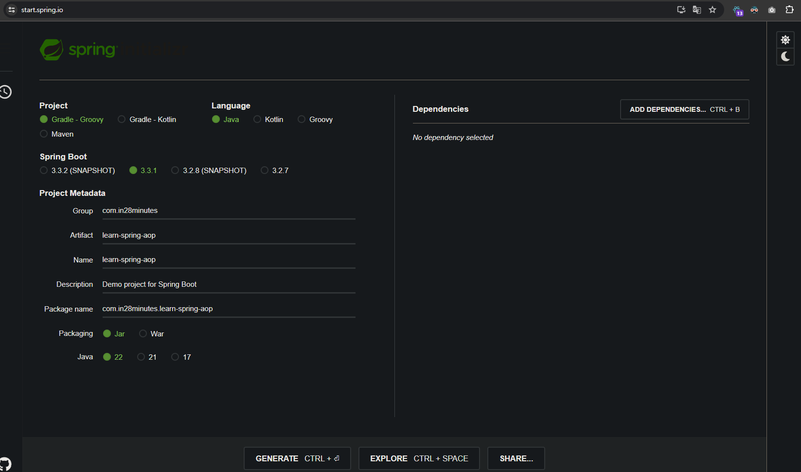

# 📒 [학습 노트] 챕터 16 : Spring Boot과 함께 하는 Spring AOP 배우기

## 목록
1. [Spring AOP 시작하기 – 개요](#1단계---spring-aop-시작하기--개요)
2. [관점 지향 프로그래밍이란](#2단계---관점-지향-프로그래밍이란)
3. [Spring AOP를 이용한 Spring Boot 프로젝트 생성하기](#3단계---spring-aop를-이용한-spring-boot-프로젝트-생성하기)
4. [Spring AOP에 필요한 Spring 컴포넌트 만들기](#4단계---spring-aop에-필요한-spring-컴포넌트-만들기)

---

## 1단계 - Spring AOP 시작하기 – 개요

#### 학습 키워드
1. AOP(관점 지향 프로그래밍, Aspect Oriented Programming)
2. AOP의 개념 (AOP Concepts) 
3. 포인트컷 (Pointcut)
4. 애스팩트 (Aspect)
5. 어드바이스 (Advice)
6. Annotations
   - @Before : 코드를 실행하기 전 수행해야 하는 작업들 처리
   - @After : 코드가 실행되고 난 후 수행해양 하는 작업들 처리
   - @Around : 코드가 실행되기 전과 실행된 후 해야 하는 작업들 처리
7. 모범 사례 (Beat Practices)

---


## 2단계 - 관점 지향 프로그래밍이란

#### 계층적 접근(Layered Architecture)
소프트웨어 애플리케이션을 여러 개의 논리적 계층으로 나누어 구성하는 아키텍처 패턴, 애플리케이션에 따라 다양한 패턴의 계층 구조가 있을 수 있다.
- ex) 일반적인 웹 애플리케이션의 계층적 접근 패턴
  - 웹 레이어 (프레젠테이션 레이어): 사용자 인터페이스 View, 컨트롤러
  - 비즈니스 레이어 (서비스 레이어): 핵심 비즈니스 로직
  - 데이터 레이어 (영속성 레이어): 데이터베이스 상호작용
- 각각의 층은 역할 및 책임이 분리되어 있기에 다루는 일이 다르다.

#### 모든 레이어의 공통 부문
1. 보안 : 층과 상관 없이 모든 레이어에 필요하다. (보안 원칙 중 '심층적 방어를 구축하라'가 있다.)
2. 성능 측정
3. 로깅 

이와 같이 모든 계층에 동일하게 적용해야 하는 공통 부문을 '공통 관심사'라고 표현한다.

#### AOP : 효율적인 공통 관심사 구현
모든 층 마다 동일한 공통 관심사를 따로 구현하는 것은 중복 작업이 발생할 수 있다. 이러한 문제를 해결할 때 AOP를 주로 사용한다.

AOP가 하는 작업
- 공통 관심사를 '애스팩트'로 만든다.
   - 보안 애스팩트, 로깅 애스팩트 등...
- 애스팩트를 어디에 적용할 것인지를 명시하는 로직을 정의한다. (이것을 포인트컷이라고 부름)

#### Java 진영의 AOP
- Spring AOP (Spring Aspect Oriented Programming) : Spring Bean을 이용해 사용
- AspectJ : Spring Bean이 아니어도 사용할 수 있기 때문에 스프링을 사용하지 않을 경우 대안이 될 수 있다.

---

## 3단계 - Spring AOP를 이용한 Spring Boot 프로젝트 생성하기

#### 프로젝트 생성

- [Spring initializer](https://start.spring.io/) 를 통해 프로젝트를 생성한다.
- 빌드 도구를 'Gradle - Groovy'로 설정한다.
- 라이브러리는 추가하지 않았다.

---

## 4단계 - Spring AOP에 필요한 Spring 컴포넌트 만들기

#### 데이터 레이어
```java
package com.in28minutes.learn_spring_aop.data;

import org.springframework.stereotype.Repository;

@Repository
public class DataService {

	public int[] retrieveData() {
		return new int[] { 11, 22, 33, 44, 55 };
	}

}
```

#### 비즈니스 레이어
```java
package com.in28minutes.learn_spring_aop.business;

import com.in28minutes.learn_spring_aop.data.DataService;
import java.util.Arrays;
import org.springframework.stereotype.Service;

@Service
public class BusinessService1 {
	private final DataService dataService;

	public BusinessService1(DataService dataService) {
		this.dataService = dataService;
	}

	public int calculateMax() {
		int[] data = dataService.retrieveData();
		return Arrays.stream(data).max().orElse(0);
	}
}
```

#### 코드 사용부 `CommandLineRunner` 사용
```java
package com.in28minutes.learn_spring_aop;

import com.in28minutes.learn_spring_aop.business.BusinessService1;
import org.slf4j.Logger;
import org.slf4j.LoggerFactory;
import org.springframework.boot.CommandLineRunner;
import org.springframework.boot.SpringApplication;
import org.springframework.boot.autoconfigure.SpringBootApplication;

@SpringBootApplication
public class LearnSpringAopApplication implements CommandLineRunner {

	private Logger logger = LoggerFactory.getLogger(getClass());
	private final BusinessService1 businessService1;

	public LearnSpringAopApplication(BusinessService1 businessService1) {
		this.businessService1 = businessService1;
	}

	public static void main(String[] args) {
		SpringApplication.run(LearnSpringAopApplication.class, args);
	}

	@Override
	public void run(String... args) throws Exception {
		logger.info( "가장 큰 값은 {}", businessService1.calculateMax() );
	}
}
```
- CommandLineRunner : 스프링 부트 애플리케이션의 구동 시점에 특정 코드를 실행하기 위해 사용되는 인터페이스
  - run() 메서드를 구현해야 하며 해당 메서드 내의 로직을 자동 실행한다.

---