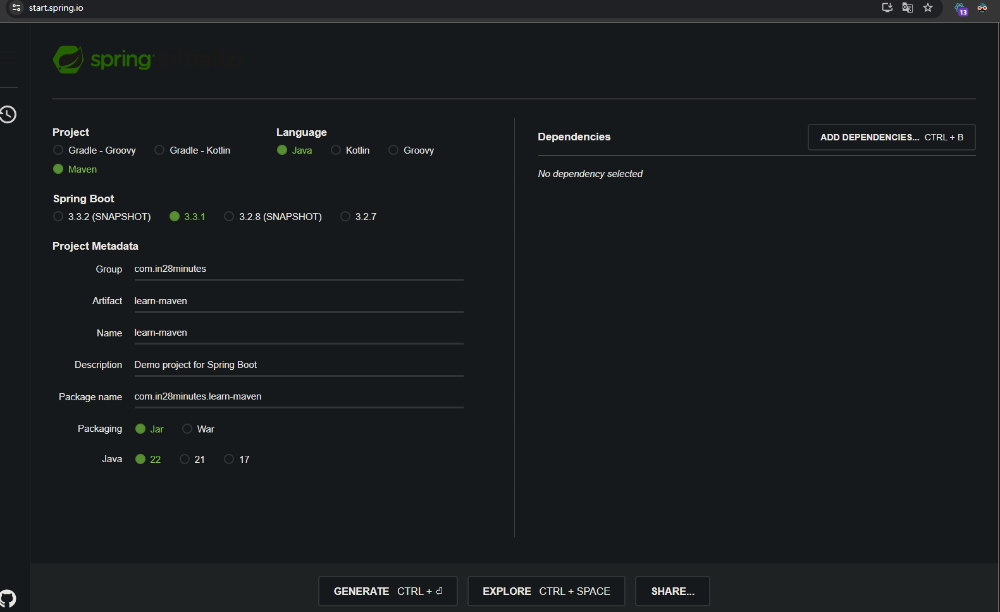

# 📒 [학습 노트] 챕터 17 :Spring과 Spring Boot로 Maven 배우기

## 목록
1. [Maven 소개](#1단계---maven-소개)
2. [Maven으로 Spring Boot 프로젝트 생성하기](#2단계---maven으로-spring-boot-프로젝트-생성하기)
3. [Spring Boot 프로젝트의 Maven pom.xml 살펴보기](#3단계---spring-boot-프로젝트의-maven-pomxml-살펴보기)
4. [Spring Boot 프로젝트의 Maven 상위 POM 살펴보기](#4단계---spring-boot-프로젝트의-maven-상위-pom-살펴보기)
5. [Maven 더 자세히 파헤치기](#5단계---maven-더-자세히-파헤치기)
6. [Spring Boot 프로젝트로 Maven 빌드 생명주기 살펴보기](#6단계---spring-boot-프로젝트로-maven-빌드-생명주기-살펴보기)
7. [Maven의 작동 원리](#7단계---maven의-작동-원리)
8. [Maven 명령어 실행하기](#8단계---maven-명령어-실행하기)

---

## 1단계 - Maven 소개

#### [Apache Maven 공식 사이트](https://maven.apache.org/)
공식 홈페이지의 Maven 소개이다. "Apache Maven은 소프트웨어 프로젝트 관리 및 이해 도구입니다. 프로젝트 객체 모델(POM)의 개념을 기반으로 Maven은 중앙 정보에서 프로젝트의 빌드, 보고 및 문서를 관리할 수 있습니다."
- 소프트웨어 프로젝트 관리 및 이해 도구 : 소프트웨어 개발 프로젝트를 효율적으로 계획, 실행, 모니터링하고 관리하는 데 사용되는 도구
- 프로젝트 객체 모델(POM)의 개념을 기반 : 프로젝트의 구조, 의존성, 빌드 설정 등을 XML 파일로 정의
- 중앙 정보에서 프로젝트의 빌드, 보고 및 문서를 관리 : 필요한 라이브러리와 플러그인을 중앙 저장소(Maven 서버)에서 자동으로 다운로드

#### Spring 에서의 Maven
- 라이브러리 관리
- 프로젝트 빌드
- 단위 테스트도 실행

---

## 2단계 - Maven으로 Spring Boot 프로젝트 생성하기

#### 프로젝트 생성

- [Spring initializer](https://start.spring.io/) 를 통해 프로젝트를 생성한다.
- 빌드 도구를 'Maven"으로 설정한다.
- 라이브러리는 추가하지 않았다.

#### pom.xml 파일 확인
프로젝트 경로 pom.xml 파일에서 프로젝트 세팅 및 의존성을 확인할 수 있다.

---

## 3단계 - Spring Boot 프로젝트의 Maven pom.xml 살펴보기

#### Maven의 의존성(dependencies)
의존성(dependencies) : 프로젝트에 사용하는 프레임워크 및 라이브러리
```xml
<dependencies>
    <dependency>
        <groupId>org.springframework.boot</groupId>
        <artifactId>spring-boot-starter</artifactId>
    </dependency>

    <dependency>
        <groupId>org.springframework.boot</groupId>
        <artifactId>spring-boot-starter-test</artifactId>
        <scope>test</scope>
    </dependency>
</dependencies>
```
- 각 의존성 안에 또 다른 의존성이 있을 수 있다. (압축 개념)
  - starter 라이브러리가 대게 여러 라이브러리를 모아서 한 번에 제공하는 압축 라이브러리로 쓰인다.
  - 압축된 의존성을 '전이 의존성' 이라고 부른다.

#### Maven 의존성 추가 : 라이브러리 추가
```xml 
    <dependencies>
  <dependency>
    <groupId>org.springframework.boot</groupId>
    <artifactId>spring-boot-starter</artifactId>
  </dependency>
  <dependency>
    <groupId>org.springframework.boot</groupId>
    <artifactId>spring-boot-starter-web</artifactId>
  </dependency>


  <dependency>
    <groupId>org.springframework.boot</groupId>
    <artifactId>spring-boot-starter-test</artifactId>
    <scope>test</scope>
  </dependency>
</dependencies>
```
- spring-boot-starter-web 라이브러리를 xml 문법에 맞게 작성하면 Maven이 해당 라이브러리를 중앙 저장소(Maven 서버)에서 식별해 자동으로 다운로드 한다.


---

## 4단계 - Spring Boot 프로젝트의 Maven 상위 POM 살펴보기

#### 상위 POM (parent POM)
```xml
<parent>
	<groupId>org.springframework.boot</groupId>
	<artifactId>spring-boot-starter-parent</artifactId>
	<version>3.3.1</version>
	<relativePath/> <!-- lookup parent from repository -->
</parent>
```
- 현재 프로젝트의 POM이 상속받는 POM
  - 현재 프로젝트의 부모 프로젝트 정보를 의미한다.
- 상위 POM의 역할
  - 여러 하위 프로젝트에서 공통으로 사용할 수 있는 설정을 정의한다. 
  - 하위 프로젝트는 부모 프로젝트의 의존성을 상속 받는다.
  - 하위 프로젝트는 부모 프로젝트의 프로퍼티(속성 및 설정)를 상속 받는다. 
    - 필요한 경우 상위 POM의 설정을 오버라이딩 할 수 있다.

---

## 5단계 - Maven 더 자세히 파헤치기

#### groupId, artifactId
```xml
<groupId>com.in28minutes</groupId>
<artifactId>learn-maven</artifactId>
```
- Spring initializer를 통해 직접 생성한 groupId, artifactId 이다.
  - 라이브러리 역시 groupId, artifactId로 구성되어 있음을 알 수 있다.
  - 해당 프로젝트도 빌드 후 다른 프로젝트에서 라이브러리로 사용할 수 있다. 

#### 버전
```xml
<version>0.0.1-SNAPSHOT</version>
```
- 버전 정보도 들어있다.
- 수동으로 버전을 변경하여 버전 관리를 할 수 있다.
  - 버전 변경 시기:
    - 새로운 기능을 추가했을 때
    - 중요한 버그를 수정했을 때
    - 주요 리팩토링을 완료했을 때
    - 릴리스 준비가 되었을 때 (SNAPSHOT 제거)
      - SNAPSHOT : 개발 중인 버전임을 의미.

---

## 6단계 - Spring Boot 프로젝트로 Maven 빌드 생명주기 살펴보기

#### Maven 빌드 생명주기
프로젝트 빌드와 배포의 여러 단계를 정의한 것
- validate: 프로젝트가 올바른지 확인하고 필요한 모든 정보를 사용할 수 있는지 확인.
- compile: 프로젝트의 소스 코드를 컴파일.
- test: 단위 테스트를 실행. 이 단계에서는 컴파일된 소스 코드와 테스트 소스 코드를 사용.
- package: 컴파일된 코드를 가져와서 JAR 등 배포 가능한 형식으로 패키징.
- verify: 통합 테스트 결과에 대한 검사를 실행하여 품질 기준을 충족하는지 확인.
- install: 패키지를 로컬 저장소에 설치. 다른 프로젝트에서 종속성으로 사용할 수 있게 됨.
- deploy: 패키지를 원격 저장소에 복사하여 다른 개발자 및 프로젝트와 공유.

이러한 단계들은 순서대로 실행되며, 각 단계는 이전 단계에 의존함
- 'test' 단계를 실행하면 자동으로 'compile' 단계가 실행

Maven 명령어를 사용하여 특정 단계까지 빌드를 실행할 수 있다.
- mvn compile: 소스 코드를 컴파일.
- mvn test: 컴파일 후 단위 테스트를 실행.
- mvn package: 컴파일, 테스트 후 패키징.
- mvn install: 패키지를 로컬 저장소에 설치.

---

## 7단계 - Maven의 작동 원리

#### 파일 구조
- Maven은 사전 정의된 폴더 구조를 제공하며 이로 인해 자바 프로젝트의 일관성을 만들어 의존성을 관리하는 것이 가능하다.
  - ex) 'src/main/resources', 'src/test/java'
  - 이러한 폴더 구조 설정 역시 오버라이드가 가능하다.

#### Maven 중앙 저장소
[Mvn Repository](https://mvnrepository.com/)
- 해당 사이트에서 버전별로 정리된 라이브러리들을 확인할 수 있다.
- 필요한 의존성의 groupId, artifactId, version만 명시하면 Maven이 자동으로 해당 라이브러리를 다운로드한다.

---

## 8단계 - Maven 명령어 실행하기

#### Maven 주요 명령어
1. mvn --version : Maven 버전 확인
2. mvn compile : 소스 컴파일
   - mvn test-compile : 테스트 코드만 컴파일
3. mvn install : Maven 빌드 생명주기를 따라 컴파일, 테스트, 패키징, 빌드를 하는 일련의 과정 실행
4. mvn clean : 빌드를 통해서 생성된 'target' 폴더 삭제
5. mvn test : 테스트 실행
6. mvn help:effective-pom : 프로젝트의 유효한(effective) POM을 보여준다.
   - 최종 POM, 상속 구조, 기본 설정 등의 사항을 보다 자세하게 볼 수 있다.
7. mvn dependency:tree : 프로젝트의 의존성 트리를 보여준다.
   - 프로젝트에서 사용되는 모든 라이브러리와 그들 간의 의존 관계를 계층 구조로 볼 수 있다.

---