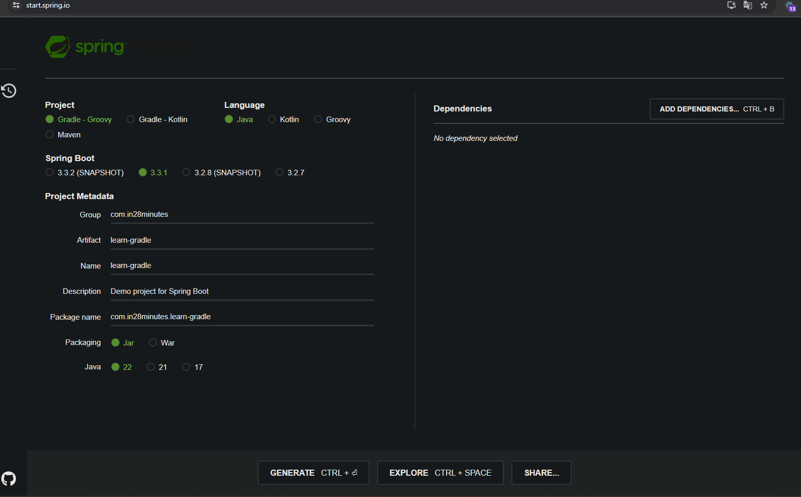

# 📒 [학습 노트] 챕터 18 :Spring과 Spring Boot로 Gradle 학습하기

## 목록
1. [Gradle 시작하기](#1단계---gradle-시작하기)
2. [Gradle로 Spring Boot 프로젝트 생성하기](#2단계---gradle로-spring-boot-프로젝트-생성하기)
3. [Gradle 빌드 및 설정 파일 살펴보기](#3단계---gradle-빌드-및-설정-파일-살펴보기)
4. [Java 및 Spring Boot용 Gradle 플러그인 살펴보기](#4단계---java-및-spring-boot용-gradle-플러그인-살펴보기)
5. [Maven 또는 Gradle - Spring Boot 프로젝트에 어느 것을 사용해야 할까요?](#5단계---maven-또는-gradle---spring-boot-프로젝트에-어느-것을-사용해야-할까요)

---

## 1단계 - Gradle 시작하기
[커밋 내역](https://github.com/PhiloMonx1/learning-spring-and-spring-boot-3.x/commit/bdf5b42b50dba10afd3e8ea4aceedb8bb2d34d49)

오픈 소스 빌드 자동화 도구, Maven을 대체할 수 있다.

#### Maven과의 차이
- 유연성 & 확장성: DSL을 사용하여 빌드 스크립트를 작성하며, 이는 POM 보다 더 유연하고 표현력이 풍부하다.
- 성능 : 증분 빌드, 빌드 캐시, 병렬 실행 등의 최적화 기능으로 Maven 보다 빠른 빌드 성능을 제공한다.
  - 증분 빌드 : 변경 파일만 빌드해서 빌드에 필요한 자원을 아끼는 전략

Gradle은 Maven의 대체제로 사용할 수 있으며, 특히 Maven과 동일한 폴더 구조를 채택해서 호환성 또한 좋다.
- Gradle를 사용해서 생성한 라이브러리를 Maven에서 사용할 수 있으며 그 반대도 가능함.

---

## 2단계 - Gradle로 Spring Boot 프로젝트 생성하기
[커밋 내역](https://github.com/PhiloMonx1/learning-spring-and-spring-boot-3.x/commit/7104ea91ee43ee7d56ecf56c074c9a69fc4f2409)

#### 프로젝트 생성

- [Spring initializer](https://start.spring.io/) 를 통해 프로젝트를 생성한다.
- 빌드 도구를 'Gradle - Groovy"로 설정한다.
- 라이브러리는 추가하지 않았다.

#### build.gradle
Maven의 pom.xml 에 대응하는 파일
- DSL을 사용해서 작성한다.

#### settings.gradle
프로젝트명이 포함되어 있는 파일
- 주로 멀티 모듈 프로젝트에서 사용된다.
  - 멀티 모듈 프로젝트 : 하나의 프로젝트에 여러 모듈로 구성된 프로젝트 
    - 하나의 애플리케이션 내에서 코드를 논리적으로 분리한 것으로 아키텍처 자체가 독립적인 MSA 와는 다르다.
  - 프로젝트 구조를 정의하고, 하위 모듈을 포함시키는 데 사용

---

## 3단계 - Gradle 빌드 및 설정 파일 살펴보기
[커밋 내역](https://github.com/PhiloMonx1/learning-spring-and-spring-boot-3.x/commit/fce5ec02f32b69a0f474588fb7e5a388c5e3ca3b)

#### build.gradle
```
plugins {
	id 'java'
	id 'org.springframework.boot' version '3.3.1'
	id 'io.spring.dependency-management' version '1.1.5'
}
```
- 프로젝트가 사용중인 플러그인 정보

```
group = 'com.in28minutes'
version = '0.0.1-SNAPSHOT'
```
- 프로젝트 정보
  - 프로젝트 Artifact ID는 'settings.gradle' 에서 확인할 수 있다.

```
java {
	toolchain {
		languageVersion = JavaLanguageVersion.of(22)
	}
}
```
- JAVA 버전

```
repositories {
	mavenCentral()
}
```
- 레포지토리 저장소 : 레포지토리를 설치하는 곳을 `mavenCentral()`를 통해 Maven 중앙 저장소로 설정

```
dependencies {
	implementation 'org.springframework.boot:spring-boot-starter'
	testImplementation 'org.springframework.boot:spring-boot-starter-test'
	testRuntimeOnly 'org.junit.platform:junit-platform-launcher'
}
```
- 라이브리러 목록

```
tasks.named('test') {
	useJUnitPlatform()
}
```
- 그레이들이 테스트를 진행할 때 사용할 툴 정의 (JUnit 사용)

#### settings.gradle
```
rootProject.name = 'learn-gradle'
```
- 프로젝트 Artifact ID

---

## 4단계 - Java 및 Spring Boot용 Gradle 플러그인 살펴보기
[커밋 내역](https://github.com/PhiloMonx1/learning-spring-and-spring-boot-3.x/commit/83998316ff84ae9c35370cf0c0cf2f3e16f086c9)

#### plugins
```
plugins {
	id 'java'
	id 'org.springframework.boot' version '3.3.1'
	id 'io.spring.dependency-management' version '1.1.5'
}
```
- id 'java' : 자바 컴파일 담당
  - 자바 코드를 테스트하고 자바 파일을 빌드에 쓰이는 기본 레이아웃을 제공한다. (Maven과 같은 폴더 구조를 가지는 것도 해당 플러그인의 역할이다.)
- id 'org.springframework.boot' version '3.3.1' : Spring Boot 플러그인
- id 'io.spring.dependency-management' version '1.1.5' : 의존성 관리 플러그인

---

## 5단계 - Maven 또는 Gradle - Spring Boot 프로젝트에 어느 것을 사용해야 할까요?
[커밋 내역](https://github.com/PhiloMonx1/learning-spring-and-spring-boot-3.x/commit/2c6bb3de750513dc24f532c27fe5d91254d96b34)

#### 유명한 프레임워크는 어떤 빌드 도구를 사용할까?
- Gradle :
  - Spring : v3.2.0(2012년) 부터 사용
  - Spring Boot : v2.3.0 부터 사용
- Maven : 
  - Spring Cloud : 현재(2024-07)까지 Maven을 유지중이다.

#### 비교
- Maven 
  - Gradle에 비해 단순한 사용법으로 학습이 쉽다.
- Gradle
  - Groovy 코드를 사용할 수 있어 유연하다. (JAVA 코드를 build.gradle에서 사용할 수도 있다.)
    - 프로그램을 작성하고 빌드의 일부로 실행하는 것이 가능하다. 
  - 빌드 시간이 Maven에 비해 짧다.

빌드 시간을 단축하고 싶으시다면 Gradle을 사용하는 것이 권장되나 빌드가 단순하고, 클린 설치를 해서 빌드 스텝을 추가하지 않는다면 Maven이 더 나은 선택일 수 있다. 

---