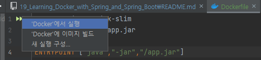
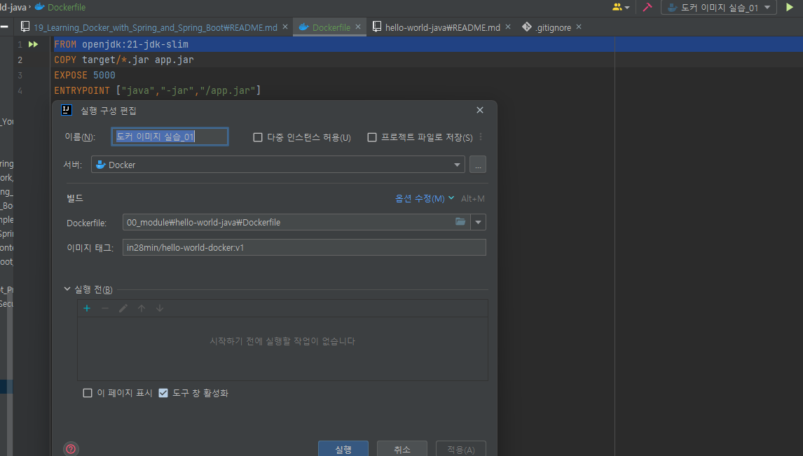

# 📒 [학습 노트] 챕터 19 :Spring 및 Spring Boot로 Docker 학습하기

## 목록
1. [Docker 시작하기](#1단계---Docker-시작하기)
2. [Docker의 기초 이해하기](#2단계---docker의-기초-이해하기)
3. [Docker의 작동 방식 이해하기](#3단계---docker의-작동-방식-이해하기)
4. [Docker 용어 이해하기](#4단계---docker-용어-이해하기)
5. [Spring Boot 프로젝트용 Docker 이미지 생성하기 - Dockerfile](#5단계---spring-boot-프로젝트용-docker-이미지-생성하기---dockerfile)
6. [Multi Stage Dockerfile을 사용하여 Spring Boot Docker 이미지 빌드하기](#6단계---multi-stage-dockerfile을-사용하여-spring-boot-docker-이미지-빌드하기)

---

## 1단계 - Docker 시작하기

#### Docker
컨테이너 이미지를 생성하고 실행하는 툴
- 컨테이너 이미지 : 애플리케이션을 실행하는 데 필요한 모든 요소를 포함하는 독립적이고 실행 가능한 소프트웨어 패키지
  - 애플리케이션 구동에 필요한 OS, JVM, 데이터베이스 등의 설정을 이미지로 저장하여 개발 환경 구성의 간소화 및 일관성을 보장한다.

#### 애플리케이션 배포 과정
1. 하드웨어 설정
2. OS 설정 ex) 리눅스, 윈도우, 맥 등
3. 기반 소프트웨어 설치 ex) 애플리케이션 버전에 맞는 JAVA
4. 애플리케이션 의존성 설정 ex) 라이브러리, 데이터 베이스 등

만약 인프라 변경 및 확장 등의 이유로 새로운 환경에 배포가 필요한 경우가 있다면 위의 과정을 반복해야 하며, 과정 중 실수가 일어날 위험이 있다.

#### Docker가 필요한 이유
```
docker container run -d -p 5000:5000 in28min/hello-world-python:0.0.1.RELEASE
```
- docker container run : 새로운 컨테이너를 생성하고 시작
- -d : 백그라운드로 컨테이너 실행 옵션
  - 일반 모드에서 도커를 실행하면 로그 추적 등의 이유로 해당 터미널이 도커에 붙어있게 된다. 백그라운드는 실행되었다는 안내만 나오고 터미널에 기존 명령어를 입력 가능한 상태로 만드는 옵션이다.
- -p 5000:5000 : 호스트의 5000번 포트를 컨테이너의 5000번 포트와 연결
- in28min/hello-world-python : 도커 이미지의 이름 (제작자/이미지이름)
- :0.0.1.RELEASE : 이미지의 버전

해당 명령어를 입력하면 이미지 제작자가 설정해놓은 애플리케이션 구동 환경이 도커를 통해 조성된다.
- ex) 파이썬이 설치되지 않은 컴퓨터에 도커를 통해 파이썬이 설치된 것과 같은 효과를 내게 해준다. (이 환경은 독립적이다.)
- 이미지에서 구성한 애플리케이션 구동 환경 파일은 로컬 컴퓨터의 도커 전용 시스템 영역에 저장된다.
- 해당 파일은 다른 컨테이너에서 공유해서 사용이 가능하다.

#### 도커 레지스트리
도커 이미지 파일을 공유하는 중앙 저장소 도커 생태계의 GitHub 이라고 이해 할 수 있다. ex) Docker Hub

```
docker container run -d -p 5000:5000 in28min/hello-world-python:0.0.1.RELEASE
```
해당 도커 명령어는 현재(24.07.15) 실행이 가능하다. 나는 도커 실행을 위한 이미지를 따로 받지 않았지만 [이미지가 중앙 저장소에 공유](https://hub.docker.com/r/in28min/hello-world-python)되어 있기에 가능한 것이다.
- 명령어를 실행하면, 도커는 먼저 로컬에서 해당 이미지를 찾는다.
- 로컬에 없다면, 기본 설정된 레지스트리(보통 Docker Hub)에서 이미지를 자동으로 다운로드(pull)한다.
- 한 번 다운로드된 이미지는 로컬 시스템에 캐시되어 저장되고, 이후 같은 이미지를 사용할 때 로컬 캐시에서 불러온다.

#### 이미지 정보 확인
```
docker image inspect [이미지 이름]
docker history [이미지 이름]
```
- docker image inspect : 이미지의 상세정보 확인
- docker history : 이미지의 레이어 구조 확인
  - 레이어 구조 : 파일 시스템의 변경사항. 읽기 전용이다. (Git 커밋 내역과 비슷하다.)
- 두 명령어는 기본적으로 로컬에 저장되어 있는 이미지를 대상으로 사용할 수 있다. 
  - 그러나 Docker Hub API를 사용해서 원격 저장소의 이미지 정보를 조회할 수도 있다.

---

## 2단계 - Docker의 기초 이해하기

#### 실행중인 컨테이너 관리
```
docker container ls
```
- 해당 명령어를 통해 현재 구동 중인 컨테이너 리스트를 확인할 수 있다.
  - `docker container ls -a` 를 사용하면 중지된 컨테이너를 포함해서 모든 컨테이너를 확인 가능하다. 

```
CONTAINER ID   IMAGE                                      COMMAND                   CREATED          STATUS          PORTS                    NAMES
f563ea65b835   in28min/hello-world-python:0.0.1.RELEASE   "/bin/sh -c 'python …"   15 minutes ago   Up 15 minutes   0.0.0.0:5000->5000/tcp   determined_gauss
```
- 명령어 결과 값
- 컨테이너를 중지하기 위해서는 `docker container stop [컨테이너 아이디]`를 입력하면 된다.
  - ```
    docker container stop f563ea65b835
    ```
    - 식별할 수 있기만 하면 ID의 일부만 입력해도 중지할 수 있다. ex) `docker container stop f5`

#### 도커 이미지 실행 실습
```
docker container run -d -p 5000:5000 in28min/hello-world-python:0.0.1.RELEASE
docker container run -d -p 5000:5000 in28min/hello-world-java:0.0.1.RELEASE
docker container run -d -p 5000:5000 in28min/hello-world-node:0.0.1.RELEASE
```
- 순서대로 파이썬, 자바, 노드 컨테이너 환경을 구성하는 이미지이다.
- 하나씩 실행 후 [localhost:5000](http://localhost:5000/)으로 접근하면 각 애플리케이션 구동을 확인할 수 있다.

PC에 파이썬, 자바, 노드 그리고 각 애플리케이션을 구동하기 위한 여러 의존성이 존재하지 않아도 구동을 보장한다.

---

## 3단계 - Docker의 작동 방식 이해하기

#### 도커가 제공하는 것들
- 표준화된 애플리케이션 패키징 : 모든 유형의 애플리케이션에 대해 동일한 패키징을 포함하는 Docker 이미지를 생성할 수 있는 방법을 제공한다.
  - 어떤 환경이든 최종 Docker 이미지의 포맷 및 실행 방식은 일관성을 보장한다. (이미지마다 실행법이 다른게 아님)
- 다중 플랫폼 지원 : 로컬 머신, 데이터 센터, AWS, Azure, GCP 등의 클라우드를 비롯하여 원하는 곳 어디든 실행 가능하다.
- 격리성 : 각 컨테이너는 다른 컨테이너로부터 독립적이다. 

#### 도커 이미지
```
docker image ls
```
- 로컬 머신에 있는 모든 이미지 리스트를 확인할 수 있다.
- 이미지는 '바이트 집합' 이다.
  - 단순한 바이트 집합이기 때문에 어떤 시스템에서든 쉽게 전송하고 실행할 수 있는 것이며 불변성을 보장한다.
  - 바이트는 Docker 레지스트리에서 호스트 되고, 컨테이너는 특정 버전의 이미지를 실행한다.
- 하나의 이미지로 여러 개의 컨테이너를 실행하는 것이 가능하다.
  - 로컬 호스트의 포트 번호만 고유하면 Docker 컨테이너의 포트 번호가 중복되어도 독립된 환경이기에 괜찮다.

#### 도커 포트의 이해
```
docker container run -d -p 5000:5000 in28min/hello-world-java:0.0.1.RELEASE
```
해당 명령어에서 `-p 5000:5000` 부분은 로컬 호스트의 포트 5000번으로 도커 컨테이너를 연결하고, 도커 컨테이너의 포트 번호를 5000번으로 설정한다는 의미이다.
- 해당 컨테이너는 Java 웹 애플리케이션을 5000번 포트로 실행하도록 설정되었기 때문에 도커 컨테이너의 번호가 '5000'번이 아니면 API 요청이 이루어지지 않는다.

```
docker container run -d -P in28min/hello-world-java:0.0.1.RELEASE
```
- EXPOSE로 지정된 포트를 호스트의 임의의 포트에 자동으로 매핑한다.
  - EXPOSE : Dockerfile에서 사용되는 명령어로, 도커 이미지를 빌드할 때 사용된다.
    - 실제로 포트를 여는 명령어가 아닌 어떤 포트를 사용할 것인지 명시하는 목적이다.
    - 이미지의 메타데이터에 포함되어, docker inspect 명령어로 확인 가능하다.
    - 도커 레포지토리에서 받은 이미지에 직접적으로 EXPOSE를 추가하거나 수정할 수는 없으나 해당 이미지를 기반으로 새로운 이미지를 만들어 EXPOSE를 추가할 수 있다.
    - 원본 이미지의 애플리케이션의 구동 포트는 도커 이미지에서 결정할 수 있는 문제가 아니므로 배포자가 EXPOSE를 명시하는 일은 매우 중요하다.
```
CONTAINER ID   IMAGE                                    COMMAND                   CREATED         STATUS         PORTS                     NAMES
4d93c85b87f5   in28min/hello-world-java:0.0.1.RELEASE   "sh -c 'java -jar /h…"   4 seconds ago   Up 3 seconds   0.0.0.0:32768->5000/tcp   epic_franklin
```
- -P 명령어는 컨테이너의 포트를 자동으로 잡아주지만 호스트 포트는 임의의 사용 가능한 포트를 사용한다.
  - -P 명령어를 통해 컨테이너 디폴트 포트를 알아낸 후 -p 명령어로 적절한 포트에 매핑하는 방법을 사용할 수 있다.

---

## 4단계 - Docker 용어 이해하기

#### 주요 Docker 용어
- 이미지 : 애플리케이션의 특정 버전을 나타내는 패키지
- Docker 레지스트리 : Docker 이미지를 저장하는 공유 저장소
  - 내부에 Docker 저장소를 만들 수 있으며, 저장소는 특정 앱, 특정 마이크로서비스, 특정 소프트웨어에 대한 Docker 이미지를 가진다.
- [Docker 허브](https://hub.docker.com/) : 가장 인기 있는 Docker 레지스트리 중 하나
- Dockerfile : 도커 이미지를 생성하기 위한 스크립트 파일

---

## 5단계 - Spring Boot 프로젝트용 Docker 이미지 생성하기 - Dockerfile

#### 예시 프로젝트
[hello-world-java](https://github.com/in28minutes/master-spring-and-spring-boot/tree/main/83-docker/hello-world-java) 프로젝트를 깃헙에서 다운 받아 예시 프로젝르를 세팅한다.
- 간단한 HelloWorld API가 포함된 프로젝트이다.
- 포트 5000번에서 웹 서버가 열리는 프로젝트이다. (application.properties 파일에서 확인할 수 있다.)
  ```properties
  logging.level.org.springframework = debug
  server.port = 5000
  ```
  
#### Dockerfile
도커 이미지를 생성할 때 설정 스크립트를 작성한 후 이미지 빌드에 설정을 포함할 수 있도록 하는 파일.
- 일반적으로 프로젝트 루트 경로에 생성한다.
- 애플리케이션의 구조와 빌드 과정을 보여주는 문서이므로 깃 허브에 올리는 것도 좋다.
- API 키 등 보안적으로 민감한 정보는 포함해선 안된다.

#### Docker 이미지 생성
[hello-world-java 프로젝트의 README.md](..%2F00_module%2Fhello-world-java%2FREADME.md) 파일 참고

- Docker 이미지 빌드
    ```
    docker build -t in28min/hello-world-docker:v1 [Dockerfile이 있는 디렉토리 경로]
    ```
    - Dockerfile을 생성하고 도커 이미지 빌드 명령에 뒤에 경로를 입력해주면 된다.
    - 만약 명령어 입력 경로에 Dockerfile 파일이 있다면 경로를 명시하지 않고 '.'을 사용할 수 있다.
      - `docker build -t in28min/hello-world-docker:v1 .`

#### Dockerfile 작성
```
FROM openjdk:21-jdk-slim
COPY target/*.jar app.jar
EXPOSE 5000
ENTRYPOINT ["java","-jar","/app.jar"]
```
- FROM : 베이스 이미지 설정 (해당 이미지를 기반으로 새로운 이미지를 만든다.)
- COPY : 호스트 시스템의 target 디렉토리에서 모든 .jar 파일을 찾아 컨테이너 내부의 app.jar로 복사
  - 명령어를 입력하는 경로를 기준으로 한다.
  - 빌드 프로젝트의 jar 파일 이름은 중요하지 않다. `*.jar`에 해당하는 파일을 찾아서 컨테이너 내부에 `app.jar` 이름으로 복사한다.
    - 프로젝트 target 폴더의 jar 파일이 여러개라면 예상치 못한 결과를 초래할 수 있다.
- EXPOSE : 컨테이너의 포트를 명시. README 처럼 명시를 할 뿐 실제 컨테이너의 포트를 강제하지는 않는다.
- ENTRYPOINT : 컨테이너가 시작될 때 실행할 명령어 지정
  - JSON 배열 형식을 사용하여 각 인자를 개별 요소로 지정할 수 있다.
    - "java","-jar","/app.jar" : `java -jar /app.jar` 쌍따옴표를 모두 지우고 쉼표를 공백으로 바꾸면 실제 입력되는 명령어가 된다.
  - 자바 애플리케이션을 실행하기 위해 jar 파일을 실행하는 명령어를 작성했다.

자바 애플리케이션 환경 조성을 위해 jdk를 설치하고, jar 파일을 전송하고, 자바 명령어로 실행시키는 과정이 이미지에 담긴다.

프로젝트를 빌드 후 `docker build -t in28min/hello-world-docker:v1 .` 입력하면 이미지 생성을 할 수 있다.
```
$ docker image ls
REPOSITORY                   TAG             IMAGE ID       CREATED          SIZE
in28min/hello-world-docker   v1              312bf231989e   25 seconds ago   459MB
...
```
`docker image ls` 명령어를 통해 생성된 이미지를 확인할 수 있다.

#### Docker 이미지 삭제 명령어
```
docker rmi {이미지 ID}
```

#### 인텔리제이 도커 지원

- 인텔리제이 IDE에서는 Dockerfile 파일을 읽고 GUI를 사용해서 이미지를 생성할 수 있도록 지원한다.


- 이름 : IntelliJ IDEA 내에서 식별하기 위한 이름으로 도커 이미지 이름과 관련이 없다.
- Dockerfile : Dockerfile 파일 경로
- 이미지 태그 : 이미지 이름:태그

---

## 6단계 - Multi Stage Dockerfile을 사용하여 Spring Boot Docker 이미지 빌드하기

#### 로컬 빌드
로컬 컴퓨터에서 애플리케이션을 빌드. (JAR 파일 생성)
- 문제점 : 로컬 환경에 따라 결과물이 달라질 수 있다. 
  - 각 운영 체제는 파일 시스템, 환경 변수, 라이브러리 등 빌드 환경이 다르기 때문이다.

#### 멀티 스테이지 (Multi Stage)
Docker 이미지를 생성할 때 여러 단계(stage)를 사용하는 기법
- 빌드 단계를 정의해서 도커 이미지를 실행할 때 호스트 환경에 맞춰 애플리케이션 빌드를 진행할 수 있다.

#### 멀티 스테이지 Dockerfile 작성
```
FROM maven:3.9.6-amazoncorretto-21-al2023 AS build
WORKDIR /home/app
COPY . /home/app
RUN mvn -f /home/app/pom.xml clean package

FROM openjdk:21-jdk-slim
EXPOSE 5000
COPY --from=build /home/app/target/*.jar app.jar
ENTRYPOINT [ "sh", "-c", "java -jar /app.jar" ]
```
- 두 단계로 코드를 나누었다. 
  - 윗 단 : 빌드 과정
  - 아랫 단 : 기존의 jdk 설치, 포트 설정, jar 전송, 실행 명령 단계
    - jar 파일 복제 라인에서 원본 폴더는 빌드 폴더 경로로 다시 설정해주었다. (첫 번째 단계에서 빌드된 파일을 컨테이너로 복제)
    - jar 실행 명령어는 'sh -c'로 쉘 스크립트를 사용했다.
      - 도커 컨테이너가 쉘 스크립트를 지원하기 때문에 대부분의 환경에서 명령어의 성공을 보장받을 수 있다.
- 빌드 과정 자세히 보기
  - FROM : 베이스 이미지 설정
    - [maven:3.9.6-amazoncorretto-21-al2023](https://hub.docker.com/layers/library/maven/3.9.6-amazoncorretto-21-al2023/images/sha256-38e87febb36764f5e258cc18c3649b899e86ebe927041baeadc83e64d566a97c) : 빌드를 위한 Maven과 실행을 위한 jdk를 포함한 이미지, 특정 버전을 지정해서 버전 일관성을 유지함과 동시에 이미지 용량을 최적화 했다.
  - AS : 해당 단게 (FROM으로 시작해서 다음 FROM 전 까지)의 이름을 지정 (build로 지정했다.)
  - WORKDIR : 작업 디렉토리 경로
  - COPY : 현재 디렉토리(.)의 모든 파일을 '/home/app'(작업 디렉토리)에 복제
  - RUN : 실행 명령어 `mvn -f /home/app/pom.xml clean package`를 사용해서 pom.xml 파일 지정해서(-f) 메이븐 명령어를 실행한다. 
    - clean package : 이전 빌드를 제거하고 새로 패키징

#### 멀티 스테이징의 장점
빌드 때 로컬 머신에 빌드된 어느 것도 사용하지 않는다.
- 개발, 테스트, 프로덕션 환경의 일관성 유지 가능

---