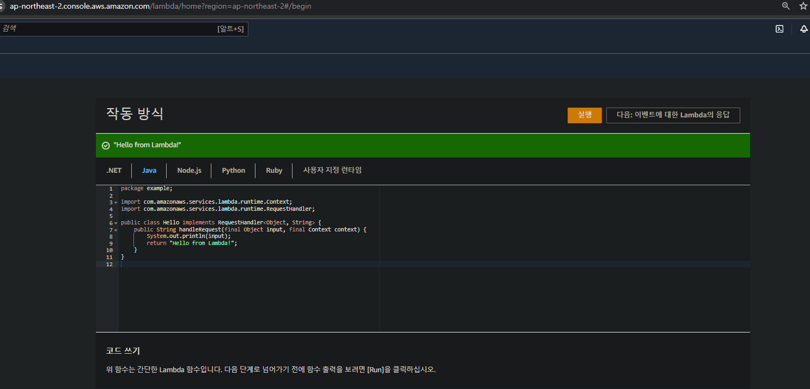

# 📒 [학습 노트] 챕터 21 : AWS의 컴퓨팅 서비스에 대해 알아보기

## 목록
1. [EC2 시작하기 - AWS의 가상 서버](#1단계---ec2-시작하기---aws의-가상-서버)
2. [2단계 - 데모 - Amazon EC2를 사용해 가상 머신 생성하기](#2단계---데모---amazon-ec2를-사용해-가상-머신-생성하기),
   [2z단계 - 데모 - Amazon EC2 인스턴스에 웹 서버 구성하기](#2z단계---데모---amazon-ec2-인스턴스에-웹-서버-구성하기)
3. [주요 EC2 개념 복습하기](#3단계---주요-ec2-개념-복습하기)
4. [IaaS vs PaaS - AWS 클라우드 컴퓨팅](#4단계---iaas-vs-paas---aws-클라우드-컴퓨팅)
5. [AWS Elastic Beanstalk 시작하기](#5단계---aws-elastic-beanstalk-시작하기)
6. [데모 - AWS Elastic Beanstalk로 웹 애플리케이션 구성하기](#6단계---데모---aws-elastic-beanstalk로-웹-애플리케이션-구성하기)
7. [데모 - AWS Elastic Beanstalk 사용하기](#7단계---데모---aws-elastic-beanstalk-사용하기)
8. [Docker와 컨테이너가 필요한 이유 알아보기](#8단계---docker와-컨테이너가-필요한-이유-알아보기)
9. [AWS의 컨테이너 오케스트레이션](#9단계---aws의-컨테이너-오케스트레이션)
10. [데모 - AWS Fargate로 ECS 클러스터 구성하기](#10단계---데모---aws-fargate로-ecs-클러스터-구성하기)
11. [데모 - Amazon ECS 사용하기](#11단계---데모---amazon-ecs-사용하기)
12. [AWS의 서버리스에 대해 알아보기 - AWS Lambda](#12단계---aws의-서버리스에-대해-알아보기---aws-lambda)
13. [데모 - 첫 Lambda 함수 생성하기](#13단계---데모---첫-lambda-함수-생성하기)
14. [데모 - Lambda 함수 자세히 알아보기](#14단계---데모---lambda-함수-자세히-알아보기)
15. [AWS 클라우드 컴퓨팅 - 컴퓨팅 서비스 복습하기](#15단계---aws-클라우드-컴퓨팅---컴퓨팅-서비스-복습하기)

---

## 1단계 - EC2 시작하기 - AWS의 가상 서버

#### EC2 (Elastic Compute Cloud)
AWS에서 제공하는 핵심적인 클라우드 컴퓨팅 서비스
- 애플리케이션을 배포하고 구동하기 위한 가상 머신의 인스턴스를 생성하고 생명주기를 관리.
- 다양한 인스턴스 유형, 운영 체제, 스토리지 옵션 등을 선택하여 자신의 요구에 맞는 가상 서버를 구성 가능.
- 자체 방화벽 규칙을 설정하거나 기본 VPC 보안 그룹을 선택하여 인스턴스의 보안을 관리 가능.

#### EBS (Elastic Block Store)
EC2 인스턴스에 연결하여 사용할 수 있는 가상 하드 드라이브
- 필요에 따라 스토리지 용량을 동적으로 조정 가능
- 특정 시점의 데이터 백업을 생성하고 복원 가능
- EC2 인스턴스가 종료되어도 EBS 볼륨의 데이터는 유지됨

#### ELB (Elastic Load Balancer)
애플리케이션 트래픽을 여러 EC2 인스턴스에 자동으로 분산시키는 서비스
- 여러 EC2 인스턴스에 걸쳐 트래픽을 균등하게 분배하여 단일 인스턴스의 부하 감소
- Auto Scaling과 함께 사용하여 트래픽 증가에 따라 자동으로 인스턴스를 추가하거나 제거 가능

---

## 2단계 - 데모 - Amazon EC2를 사용해 가상 머신 생성하기

#### EC2 가상 머신 생성
가상 머신 생성에 필요한 내용만 노트
- OS Images (Amazon Machine Image) : 인스턴스(가상 머신)의 OS(소프트웨어)를 선택한다. 
  - 'Free tier'는 1년간 무료 사용이 가능한 사양이다.  
- Instance type (인스턴스 타입) : 인스턴스를 구동 할 하드웨어를 선택한다.
  - 'Free tier'는 1년간 무료 사용이 가능한 사양이다.
- Key pair (키페어) : 터미널, SSH 등을 통해 인스턴스에 접근할 때 사용되는 키, 파일로 제공된다. (인스턴스의 열쇠이다.)
  - 키페어를 생성한 후 생성된 키페어를 인스턴스에 연결하는 방식으로 설정한다. (생성된 키페어 파일은 보관하고 있어야 한다.)
- Network setting (네트워크 설정) : 인스턴스로 들어오고 나갈 수 있는 트래픽을 제어한다.
  - 보안 그룹(방화벽)을 설정할 수 있다. (보안 그룹에서 특정 IP의 요청만 허용하거나 제한할 수 있다.)

#### 인스턴스 관리 페이지
인스턴스가 실행되면 리스트에서 확인할 수 있다.
- 인스턴스 ID를 클릭해서 상세 페이지로 접근할 수 있다.
  - 인스턴스의 공개 IP 확인
  - 인스턴스의 개인 IP 확인
  - 타입 등의 사양 확인
  - 인스턴스의 AMI 확인
  - 키페어 확인 
  - 보안 그룹 확인 (Security 탭)
  - 인스턴스 중지, 재부팅 등의 작업
- 관리페이지에서 중단, 삭제, 수정 등의 작업이 가능하다.
- 인스턴스를 선택 후 'Connect'(연결)을 클릭해서 인스턴스에 접근할 수 있다.
  - 연결하면 가상 머신의 터미널이 열린다.

---

## 2z단계 - 데모 - Amazon EC2 인스턴스에 웹 서버 구성하기

#### EC2 인스턴스에 Apache 웹 애플리케이션 설치
1. 인스턴스에 연결
2. `sudo su` 명령어 입력 (루트 사용자 권한을 가지는 명령어)
3. `yum update -y` 명령어를 입력해서 yum 업데이트
   - yum : 패키지 매니저, Amazon Linux에서 자주 사용됨.
4. `yum install httpd` 명령어를 입력해서 Apache 설치
   - 설치 진행에 대해 묻는데 'y'를 눌러 수락해주면 된다.

#### 인스턴스에서 Apache 서버 시작
```
systemctl start httpd
```

#### 보안 그룹
인스턴스의 퍼블릭 IP를 브라우저 주소 입력란에 입력 후 Apache 서버에 접근하면 응답이 없다.
- 보안 그룹 규칙에서 Http 포트를 허용하지 않고 있기 때문이다.

#### 보안 그룹 변경
- 인스턴스의 보안 그룹 설정에 들어가서 보안 그룹에 새로운 rule(규칙)을 추가한다.
  - Type(타입)을 'HTTP'로 설정하면 TCP 프로토콜에 80번 포트가 고정으로 선택된다.
  - Source에 특정 IP 규칙을 입력하거나 0.0.0.0/0 을 입력해서 전체 IP로의 접근을 허용한다.

---

## 3단계 - 주요 EC2 개념 복습하기

#### 주요 개념
- AMI : EC2에 사용할 운영체제(OS)와 소프트웨어
  - AWS에서 사전에 빌드된 이미지를 제공하며, 원한다면 커스터마이징 할 수도 있다.
- 인스턴스 패밀리(Instance Families) : 인스턴스의 하드웨어를 목적 및 성능 특성에 따라 그룹화 한 것
  - AWS가 제공하는 패밀리 중에서 선택하여 인스턴스의 하드웨어를 결정할 수 있다.
  - 인스턴스 패밀리를 선택한 후 각 인스턴스 크기를 선택한다. (패밀리마다 선택할 수 있는 크기 차이가 있다.)
  - 즉, 인스턴스 패밀리 + 크기 = 인스턴스의 하드웨어 성능
- EBS (Elastic Block Store) : EC2 인스턴스에 부착할 수 있는 가상 디스크
- 보안 그룹 : 모든 리소스로 들어오는 트래픽을 제어하는 방화벽
  - 규칙을 통해 특정 IP만 허용하거나 제한하는 방식으로 보안 이점을 챙길 수 있다.
- 키페어(Key pair) : 인스턴스에 SSH로 연결할 때 사용하는 비밀 키 파일 (열쇠의 개념이다)

---

## 4단계 - IaaS vs PaaS - AWS 클라우드 컴퓨팅

#### IaaS (Infrastructure as a Service)
클라우드 제공자가 제공한 기반(Infrastructure)만을 사용하는 것
- IaaS를 사용할 때는 클라우드 제공자가 하드웨어, 네트워킹, 가상화를 처리해주지만 내부 환경은 사용자가 구성해야 한다.
- ex) Spring REST API 백엔드를 IaaS를 사용해서 구동하기 위해서는 제공자가 제공한 기반에 JDK, 데이터 베이스 등의 구성을 직접 해야 한다.
- 로드밸런싱, 오토 스케일링 등의 인프라를 위한 관리도 직접 해야 한다.

#### PaaS (Platform as a Service)
IaaS의 대안으로 기반뿐 아니라 애플리케이션 개발 및 실행에 필요한 도구, 라이브러리, 프레임워크 등의 플랫폼을 제공하는 것
- 클라우드 제공자가 OS를 담당해 적절한 OS를 설치하고 업그레이드하며 패치해준다.
- 애플리케이션 런타임을 설치해준다.
- 오토 스케일링, 가용성, 로드 밸런싱 등의 인프라 관리를 자동 처리해준다.
- 사용자는 서비스를 설정하고, 애플리케이션 구동에 필요한 파일이나 코드만 제공하면 된다.
- 그 외에 데이터 베이스 제공, 머신 러닝, 분석 등의 다양한 서비스를 제공한다.
- 대표적인 PaaS 서비스
  - AWS : Elastic Beanstalk
  - Azure : Azure App Service
  - Google Cloud : Google App Engine

---

## 5단계 - AWS Elastic Beanstalk 시작하기

#### AWS Elastic Beanstalk
AWS에서 제공하는 PaaS 서비스
- 애플리케이션 구동 환경 조성 대부분을 위탁할 수 있다.
- Elastic Beanstalk 사용 자체에는 비용이 발생하지 않으나, 구성되는 리소스(EC2, ELB)에 대한 비용은 지불해야 한다.

#### Elastic Beanstalk 의 주요 기능
- 자동 로드밸런싱 : 트래픽을 적절하게 분배시켜 인스턴스가 부담을 나눠 가지도록 하는 기술
- 오토 스케일링 : 트래픽이 과다하게 발생하면 유동적으로 서버 사양을 늘리는 기술
- CI/CD : 무중단 배포

---

## 6단계 - 데모 - AWS Elastic Beanstalk로 웹 애플리케이션 구성하기

#### Elastic Beanstalk 구성
Elastic Beanstalk는 관리할 웹 앱을 기반으로 설정을 구성하는 방식이다.
- Platform : 다양한 애플리케이션 구동 환경이 버전 별 플랫폼으로 제공된다 ex) Java, Node.js, Python
- Application code : 배포할 애플리케이션 파일이나 코드를 업로드할 수 있다.
  - 샘플 애플리케이션을 제공한다.
- 다양한 추가 옵션 : 
  - 필요에 따라 X-Ray, 로그 스트리밍 등을 활성화 할 수 있다.
  - 인스턴스 사양 및 환경 : 인스턴스 사양 및 갯수를 선택할 수 있다.
  - 로드밸런싱 : 단일 인스턴스에선 사용할 수 없다.
    - 최소 유지 갯수, 최대 갯수 등을 선택할 수 있다.
  - 오토 스케일링 : 스케일링 기준을 설정할 수 있다.
  - 데이터 베이스 연결 : RDS를 연결할 수 있다.
  - 보안, 모니터링, 플랫폼 자동 업데이트, Elastic Beanstalk에서 발생하는 이벤트에 따른 알림 등을 설정할 수 있다.

---

## 7단계 - 데모 - AWS Elastic Beanstalk 사용하기

#### Elastic Beanstalk 사용
구성된 환경에 애플리케이션을 업로드해서 배포할 수 있다.
- 자동으로 EC2 인스턴스가 생성된다.
  - 오토스케일링 그룹에 의해 생성된 것이다.
- 로드밸런서도 설정된 것을 볼 수 있다. (설정을 했다면)
- 상세 페이지에서 환경의 상태, 사용 중인 플랫폼 등의 정보를 확인할 수 있다.
- 로그 탭에서 서버 로그를 다운로드 할 수 있다. (자동 로깅)
- 트래픽 등의 모니터링을 지원한다.
- 콘솔을 통해 EC2에 접근 가능하다.
- ...

---

## 8단계 - Docker와 컨테이너가 필요한 이유 알아보기

#### MSA(Microservice Architecture)
하나의 대형 애플리케이션을 만드는 대신 아주 작고 독립적으로 배포할 수 있는 마이크로서비스의 집합으로 애플리케이션을 구성하는 개발 방법론
- 유연하고 확장성 있다.
  - ex) 고객 서비스만 변경하고 싶으면 해당 부분만 변경 후 독립적으로 배포할 수 있다.
- 다양한 프로그래밍 언어 및 기술을 사용해 애플리케이션을 개발할 수 있다.
  - AI 서비스 영역은 파이썬을 선택하고 고객 서비스 영역은 Spring을 선택하는 등 도메인 별로 유연하게 선택이 가능하다.

#### MSA의 단점
- 배포 과정의 복잡함 : 기반 언어 및 기술 마다 배포 환경이 다를 수 있다.

#### Docker 컨테이너
도커를 사용해서 애플리케이션 구동 환경을 이미지화 시키고, 이를 통해 배포의 효율성을 개선할 수 있다.
- 도커는 클라우드 중립적이다. 
  - AWS, Google 어떤 것을 사용하든 도커를 사용할 수 있다
- 도커는 표준화를 제공한다. 
  - 항상 동일하게 배포, 모니터링, 로깅 할 수 있다.
- 도커 컨테이너는 가상 머신에 비해 가볍다
  - 가상 머신이 애플리케이션 실행에 필요한 모든 구성 파일을 머신 마다 설치하는 것과 달리 도커는 컨테이너간 중복된 요구 파일을 공유한다.

---

## 9단계 - AWS의 컨테이너 오케스트레이션

#### 컨테이너 오케스트레이션의 필요성
여러 컨테이너의 배포, 관리, 확장, 네트워킹을 자동화하는 프로세스 (k8s가 대표적인 컨테이너 오케스트레이션이다.)
- 오토 스케일링 : 마이크로 서비스 간의 필요한 사양이 다르다. 예를 들어 리뷰 서비스는 부하가 많은 반면, 신고 서비스는 부하가 적을 수 있다.
- 서비스 디스커버리 : 서비스 간의 관계가 있을 수 있다. 리뷰 서비스가 영화 서비스 또는 고객 서비스를 필요로 할 수 있다. 
  - 이를 위해 리뷰 서비스에 영화 서비스와 고객 서비스의 URL을 하드 코딩하는 것은 좋지않으며, 동적으로 필요한 서비스를 찾을 수 있어야 한다.
- 로드 밸런싱 : 특정 마이크로서비스의 여러 인스턴스에 부하를 분산하는 것이 좋으며, 자체 복구되는 환경을 조성해야 한다.
- 상태 모니터링 : 특정 컨테이너의 상태가 좋지 않다는 것을 식별하고 상태가 좋은 인스턴스 대체할 수 있어야 한다.

위의 작업 말고도 MSA의 대규모 배포 환경 및 특히 실시간으로 사용자 트래픽이 발생하는 서비스는 많은 것을 실시간으로 처리할 수 있어야 한다.

컨테이너 오케스트레이션이 이러한 작업을 자동으로 처리해준다.


#### AWS에서 컨테이너 오케스트레이션 사용하기
- Amazon EKS (Elastic Kubernetes Service): AWS에서 제공하는 관리형 Kubernetes 서비스
- Amazon ECS(Elastic Container Service) : AWS용 컨테이너 오케스트레이터 솔루션
- Fargate : 서버리스 ECS/EKS, 클러스터 관리를 직접하지 않아도 된다. 
  - 클러스터 : 여러 컨테이너 호스트를 하나의 논리적 단위로 관리하는 것
  - EKS와 ECS는 클러스터를 직접 관리해야 한다. (EC2 인스턴스의 크기, 수량, 스케일링 등을 직접 결정하고 관리해야 한다.)

---

## 10단계 - 데모 - AWS Fargate로 ECS 클러스터 구성하기

#### ECS 클러스터
- 클러스터 : 사용자 관점에서는 MSA 애플리케이션이 동작할 '가상의 컴퓨터'라고 생각할 수 있다.
  - 내부적으로 여러 개의 가상 컨테이너를 구성하고, 이들의 리소스 할당을 결정한다.
  - CPU, 메모리, 스토리지를 어떻게 분배하고 관리할지 결정하는 것이다.
- 컨테이너
  - 일반 컨테이너: 지속적으로 실행되는 서비스나 애플리케이션을 위해 사용
    - 지속적인 서비스 : CRUD, API 요청 처리 등
  - 작업 컨테이너: 특정 작업을 수행하고 완료되면 종료되도록 설계
    - 시간이 오래 걸리는 연산의 경우 작업 컨테이너가 해결사 처럼 나타나선 작업을 완료시키고 종료된다. 컨테이너 계의 히어로 같은 개념
    - 마이크로 서비스마다 특화된 작업 컨테이너를 구성할 수도 있고, 하나의 슈퍼맨 같은 작업 컨테이너를 구성할 수도 있다. 이 둘을 섞어서 사용하는 것도 가능하다.
      - 중요한 점은 대규모 작업의 경우 항상 일어나는 일이 아닌 만큼, 서비스를 유지할 정도의 리소스만 할당하고, 대규모 작업을 처리하는 히어로를 채용하는 방법론이다.
  - 작업(워크로드) 정의 : 각 컨테이너(마이크로 서비스)에 필요한 CPU, 메모리 등의 리소스를 지정한다.
    - 회사에서 팀별로 채용인원이 다르고, 팀별 사무 공간 역시 크기가 다른 경우를 생각할 수 있다.

#### AWS Fargate
- 서버 리스 : 사용자는 EC2 인스턴스나 클러스터를 직접 관리할 필요가 없다.
  - 사용자가 설정한 클러스터를 기준으로 AWS Fargate가 효율적인 운영을 자동화 한다.

#### AWS Fargate 생성시 고려할 사항
- 컨테이너 정의 : 도커 이미지를 선택 & 메모리 및 CPU 할당
- 작업 정의 : 각 마이크로서비스가 동작할 하나 이상의 컨테이너 그룹화
- 서비스 설정 : 인스턴스 수 지정 (로드밸런스 옵션)
- 보안 그룹, 네트워킹, IAM, 모니터링 및 로깅 등 설정

---

## 11단계 - 데모 - Amazon ECS 사용하기

#### Amazon ECS 사용하기
- 클러스터 및 서비스 확인
  - ECS 콘솔에서 클러스터 상세 정보 확인 가능
  - 실행 중인 Fargate 작업 수와 활성화된 서비스 수 확인 가능
- 서비스 상세 정보
  - 서비스 이름, 상태, 연결된 작업 정의 확인 가능
  - 설정된 작업 수와 실제 실행 중인 작업 수 비교 가능
  - 실행 타입 확인 가능 ex)Fargate
- 로드 밸런서 연동
  - ECS 서비스 생성 시 자동으로 로드 밸런서 생성 가능
  - EC2 콘솔에서 생성된 로드 밸런서 확인 가능
  - 로드 밸런서 DNS를 통해 애플리케이션 접근 가능
- 서비스 모니터링
  - 서비스 이벤트 탭에서 배포 및 상태 변경 이력 확인 가능
  - CPU 및 메모리 사용률 등의 메트릭 확인 가능
  - 실행 중인 작업의 로그를 ECS 콘솔에서 직접 확인 가능
- 자동 복구 기능
  - 작업이 중지되면 서비스가 자동으로 새 작업을 시작하여 지정된 작업 수 유지
  - 이벤트 탭에서 작업 중지 및 새 작업 시작 과정 확인 가능
- 마이크로서비스 배포
  - 새로운 마이크로서비스 추가 시 새 서비스 생성으로 간단히 배포 가능
  - 작업 정의 생성, 원하는 작업 수 지정, 서비스 생성으로 배포 완료
- 서버리스 운영
  - Fargate를 사용하여 서버 관리 없이 컨테이너 실행 가능
  - 인프라 관리 부담 감소, 애플리케이션 개발에 집중 가능

---

## 12단계 - AWS의 서버리스에 대해 알아보기 - AWS Lambda

#### 애플리케이션을 배포할 때 고려할 것
1. 어떤 하드웨어 사양을 선택할지
2. 어떤 운영체제를 선택할지
3. 스케일링을 어떻게 처리할지
4. 가용성, 로드밸런싱은 어떻게 할지

#### 서버리스
서버가 없다는 뜻이 아닌 '서버를 신경 쓸 필요가 없다'는 뜻.
- AWS Fargate를 사용하면 MSA 애플리케이션은 '도커'로 실행한다. 그렇기에 OS를 명시하지 않아도 도커를 통해 좀 더 안정적인 환경 구성이 가능하다.
- 클라우드 플랫폼이 알아서 처리하기에 사용자는 인프라스트럭처에 대해서는 전혀 알지 못한다., 애플리케이션이 어디에서 실행되는지 알 수 없다. (알 필요가 없음)
- 탄력적인 스케일링과 자동화된 높은 가용성을 제공한다. (과부하에 의한 사용자의 실시간 대응이 줄어든다.)
- 비용은 서버가 아닌 요청에 따라 발생한다. (서버 요청이 적을 경우 비용 발생이 적기 때문에 초기 자본 부담이 덜하다)
- 개발자는 서버 운영이 아닌 비즈니스 소스코드 로직에 더 집중할 수 있다.

#### AWS Lambda
AWS에서 가장 유명한 서버리스 서비스
- Java의 람다 함수와는 전혀 다른 개념이다.
- 서버를 직접 관리하지 않고도 코드를 실행할 수 있게 해주는 서버리스 컴퓨팅 서비스이다.
- 특정 이벤트가 발생했을 때 코드를 실행하는 이벤트 기반 작동 방식이다.
  - ex) 스케줄링, S3에 이미지 업로드 시 이미지 리사이징 등
  - Java, Node.js, Python 등 다양한 언어를 지원한다.
  - 최대 15분까지의 실행 시간 제한이 있다.
    - 짧고 일시적인 작업에 적합하다.
- Lambda 함수는 다양한 AWS 서비스의 이벤트에 반응할 수 있다.
  - ex) S3 버킷에 파일 업로드, DynamoDB 테이블 업데이트, API Gateway를 통한 HTTP 요청 등
- 사용한 컴퓨팅 시간에 대해서만 비용이 청구된다.

AWS 서비스들 사이에서 동작하는 이벤트 핸들러 역할이다. 내가 JAVA로 작성해서 AWS 서비스에서 일어나는 이벤트를 캐치해 특정 로직을 수행하게 만들 수 있다.

즉, AWS에 파견을 보내는 Java 파견 요원에 비유할 수 있다.

---

## 13단계 - 데모 - 첫 Lambda 함수 생성하기


[AWS Lambda](https://ap-northeast-2.console.aws.amazon.com/lambda)에서 언어별 AWS Lambda 예시를 실행해볼 수 있다. (AWS 로그인 필수)

#### Lambda 함수 생성
- 템플릿 선택 : 처음부터 작성하거나, AWS에서 사전 구성한 블루프린트(템플릿)을 사용하거나, 도커 이미지를 업로드할 수 있다.
- 런타임 : 람다 함수를 실행할 언어 및 버전을 선택할 수 있다.
- 아키텍쳐 : 람다 함수 실행을 담당할 컴퓨터의 사양이다. 인텔과 AMD 중에서 선택할 수 있다.
- 역할(IAM) : 람다 함수를 담당하는 새로운 역할을 생성하거나 기존 역할에 책임을 담당시킬 수 있다.

#### Lambda 함수 테스트
- 함수 실행을 위해서는 이벤트를 발생시켜야 한다.
- 테스트 이벤트를 생성해서 테스트할 수 있다.

---

## 14단계 - 데모 - Lambda 함수 자세히 알아보기

#### Lambda 함수 관리
- 함수 모니터링
  - 함수와 관련된 모든 메트릭을 볼 수 있다.
  - 호출간 발생한 오류의 횟수, 로그 등을 볼 수 있다.
  - 메트릭 및 로그는 CloudWatch에서 가져온다.
- X-Ray 트레이싱 : X-Ray를 활성화 해서 최적화를 고려 할 수 있다.
  - Lambda 함수가 실행되는 시간을 분석하고 이를 최적화 한다.
  - Lambda 함수와 연결된 IAM 권한이 필요하다.
- 설정 
  - 메모리 할당 편집 (CPU도 자동으로 함께 늘어난다.)
  - 임시 스토리지 할당 
  - 함수 타임아웃 설정 (기본 값 3초, 900초까지 늘릴 수 있다.)
  - 권한 부여 : AWS의 다른 서비스와 함께 사용하기 위해 권한을 부여할 수도 있다. ex) S3 액세스 권한 등
  - 함수 URL : 함수에 URL을 부여해서 HTTP 엔드포인트를 할당할 수 있다.
  - 환경 변수 : 환경 변수를 추가 & 편집할 수 있다.
- 스케일링 : 스케일링을 위한 동시성 제한 등을 조정해 람다 함수의 성능을 조절 할 수 있다.

---

## 15단계 - AWS 클라우드 컴퓨팅 - 컴퓨팅 서비스 복습하기

#### 복습
- EC2 : AWS에서 애플리케이션을 실행하는 가장 기본적인 방법
- ELB : 로드 밸런싱 서비스 
- PaaS : 기반 뿐 아니라 애플리케이션 실행 환경을 모두 AWS에게 맡기고 싶을 때 고려
- Elastic Beanstalk : AWS가 제공하는 대표적인 PaaS 서비스
- 컨테이너 오케스트레이션 : MSA 애플리케이션 등의 런타임 환경을 구성할 때 다수의 컨테이너를 관리해주는 서비스
  - Kubernetes가 대표적이며 AWS에서는 EKS, ECS, Fargate(서버리스) 등을 제공한다.
- 서버리스 : 서버가 없는 것이 아닌 서버를 신경쓰지 않아도 되는 서비스 (알아서 관리해준다.)
- AWS Lambda : 이벤트 기반 서버리스 소스코드 실행 컴퓨팅 서비스

---